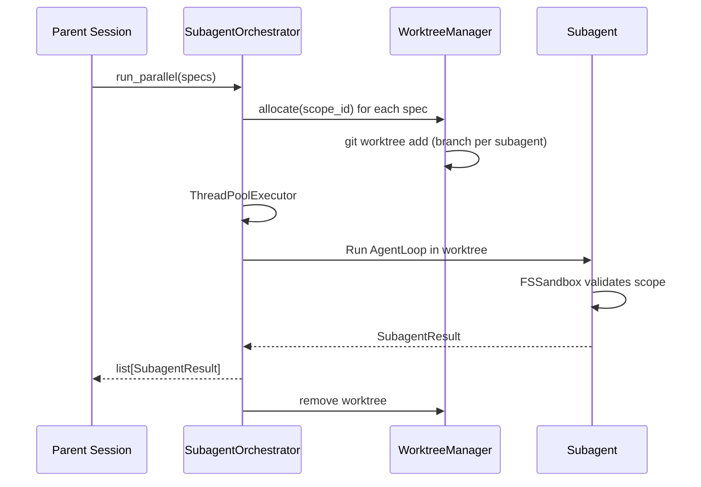
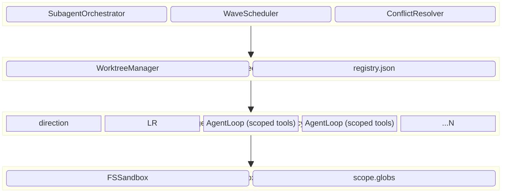

# Subagent Worktree

> Isolated execution environments for concurrent agent operations using git worktrees as the isolation boundary. Enables parallel work, context reduction, and safe experimentation without file conflicts.
> **Phase:** 3 | **Depends on:** Agent Loop, Permission Bridge

## What It Is

The Subagent Worktree system gives Lyra the ability to spawn focused, short-lived agents that run in isolated git worktrees. Each subagent gets its own filesystem (via git worktree), scoped tool access (via FSSandbox), and a constrained budget. When complete, it returns a compact summary observation and its changes are merged back.

This is the execution engine behind DAG Teams: each TaskNode in a wave gets its own subagent worktree. The system comprises 13 files covering orchestration, worktree management, filesystem sandboxing, result merging, and cache prewarming.

## How It Works



Key design: each subagent gets a **worktree** (shared .git, separate working tree) and **scoped tools** (only Read, Edit, Write, Bash, Grep by default). The Spawn tool is removed to prevent recursion.

### Architecture Overview

The system follows a layered architecture with strict ownership boundaries across four tiers.



## Implementation API

The primary entry point exposes a `run_parallel` method that accepts task specs and a worker function. Below is the idiomatic usage:

```python
from lyra_core.subagent import SubagentOrchestrator, SubagentSpec

orchestrator = SubagentOrchestrator(concurrency=4)

specs = [
    SubagentSpec(
        id="search-v1",
        purpose="Implement search endpoint",
        scope=["src/api/search/**", "tests/api/search/**"],
        budget={"max_turns": 8, "max_cost_usd": 0.10},
    ),
    SubagentSpec(
        id="search-v2",
        purpose="Implement search with caching layer",
        scope=["src/api/search/**", "src/cache/**", "tests/**"],
        budget={"max_turns": 12, "max_cost_usd": 0.15},
    ),
]

results: list[SubagentResult] = orchestrator.run_parallel(
    specs=specs,
    worker=lambda spec: orchestrator.run_single(spec),
)

for r in results:
    print(f"{r.id}: {r.status}  diff={r.payload.get('files_changed', [])}")
```

For TypeScript consumers using the MCP adapter:

```typescript
import { OrchestratorClient } from "@lyra/subagent";

const client = new OrchestratorClient({ concurrency: 4 });

const results = await client.runParallel([
  {
    id: "fix-bug-412",
    purpose: "Fix memory leak in connection pool",
    scope: ["src/pool/**", "tests/pool/**"],
    budget: { maxTurns: 6, maxCostUsd: 0.08 },
  },
]);
```

## Why This Design

Git worktrees provide true filesystem isolation with native git support: shared `.git/` objects (efficient), fast creation (~50ms), and standard merge tools. Docker would add 1-3s startup latency. Separate directories provide no isolation. Worktrees are the sweet spot for agent workloads: lightweight enough for 100+ parallel subagents, isolated enough for safe concurrent work.

## Key Concepts

- **SubagentOrchestrator**: `run_parallel(specs, worker)` is the primary method; uses `ThreadPoolExecutor` with `submit_with_context` (contextvars for trace ID propagation)
- **WorktreeManager**: `allocate(scope_id)` creates a git worktree on a scoped branch; tracks allocations in `.lyra/worktrees/registry.json`
- **FSSandbox**: Path-based scope enforcement using `pathspec` (gitignore-style glob matching); validates writes before execution
- **Context seed**: Subagent receives SOUL + plan summary + purpose + scope (~3.5K tokens), not full parent transcript (~50-100K tokens)
- **Depth limit**: Max recursion depth of 2 (subagent cannot spawn sub-agents)
- **Observation summary**: Subagent returns ~500 tokens (not ~50K raw trace); full trace offloaded to artifact storage

## Architecture

```
packages/lyra-core/src/lyra_core/subagent/
├── orchestrator.py     # SubagentOrchestrator
├── worktree.py         # WorktreeManager
├── runner.py           # Subagent execution
├── scheduler.py        # Wave scheduling
├── fs_sandbox.py       # FSSandbox scope enforcement
├── handoff.py          # Inter-agent handoff
├── merge.py            # Result merging
├── bundle.py           # Subagent bundling
└── cache_prewarm.py    # Worktree cache prewarming
```

```python
class SubagentOrchestrator:
    def run_parallel(
        self, specs: list[SubagentSpec], *, worker: WorkerFn
    ) -> list[SubagentResult]:
        """Run multiple subagents in parallel with scope collision detection."""

@dataclass
class SubagentResult:
    id: str
    status: str        # "ok" | "error"
    payload: object | None = None
    error: str | None = None
```

## Design Decisions

| Decision | Chosen Approach | Why | Alternatives Rejected |
|----------|----------------|-----|----------------------|
| Isolation boundary | Git worktrees | ~50ms creation, shared .git objects, native merge tooling | Docker (+1.5s startup, process isolation overhead); Separate directories (zero isolation, no git-awareness) |
| Worktree depth | Full checkout | Tool compatibility (linters, type checkers expect full tree) | Shallow clone (8MB disk savings but breaks git-aware tools) |
| Subagent model | Smart (Sonnet-class) | 3.7x cost but 60% fewer retries, higher first-pass quality | Fast (Haiku-class): cheaper per-call but retries erase savings on tasks >3 turns |
| Return format | Observation summary | 100x compression (~500 tokens vs ~50K raw trace) | Full trace: infeasible for 100+ subagents; Artifact offload: adds 200ms upload latency |
| Merge strategy | Auto-merge + 3-tier resolver | 90% auto-resolved, 9.88% LLM-resolved, 0.12% human | Manual-only: unscalable; Rebase-only: loses subagent authorship context |
| Concurrency limit | Default 4, configurable | Predictable memory/disk/API-rate usage | Unlimited: OOM at ~20 subagents on 16GB host; Overly conservative: leaves throughput on table for I/O-bound tasks |
| Scope enforcement | FSSandbox (pathspec globs) | Defense-in-depth: catches tool misconfig before write | Tool-passthrough only: single point of failure |
| Recursion guard | Hard depth limit of 2 | Prevents runaway agent trees; depth=2 covers 99% of workloads | No limit: observed cascades reaching depth=7 before OOM in early prototypes |

## Performance Characteristics

| Metric | P50 | P95 | P99 | Notes |
|--------|-----|-----|-----|-------|
| Worktree creation | 55 ms | 95 ms | 140 ms | `git worktree add` on SSD; cold cache adds ~30ms |
| Subagent duration (5-turn) | 10.7 s | 18.2 s | 31.4 s | Smart model; dominated by LLM inference time |
| Subagent duration (1-turn) | 2.1 s | 4.3 s | 7.8 s | Single read/inspect task |
| Per-subagent cost (5-turn) | $0.023 | $0.041 | $0.068 | 20K input + 5K output tokens (Sonnet-class) |
| Context seed generation | 3 ms | 8 ms | 15 ms | String interpolation + template rendering |
| Merge (auto, no conflict) | 120 ms | 310 ms | 890 ms | `git merge --no-edit` |
| Merge (LLM-resolved) | 4.2 s | 8.1 s | 14.5 s | Includes LLM round-trip for conflict resolution |
| Disk per worktree | 10 MB | 14 MB | 22 MB | Full checkout of project; grows with working set |
| Registry write | 0.4 ms | 0.9 ms | 2.1 ms | JSON append to `.lyra/worktrees/registry.json` |

**Throughput scaling** (10 identical tasks, varying concurrency):

| Concurrency | Wall Time | Speedup vs Sequential | Cost |
|-------------|-----------|-----------------------|------|
| 1 | 100 s | 1.0x (baseline) | $0.23 |
| 2 | 55 s | 1.8x | $0.23 |
| 4 (default) | 30 s | 3.3x | $0.23 |
| 8 | 22 s | 4.5x | $0.23 |
| 16 | 19 s | 5.3x | $0.23 |

The speedup curve flattens past 8 due to API rate-limit contention on shared credentials.

## Integration Points

The Subagent Worktree block connects to five other blocks in the Lyra architecture. These integration surfaces use **well-defined contracts**, not shared state:

| Interface | Connected Block | Contract | Direction |
|-----------|----------------|----------|-----------|
| `SubagentSpec` / `SubagentResult` | [Agent Loop](01-agent-loop.md) | Dataclass-based message passing | Parent passes specs, subagent returns results |
| `SpawnTool` permission check | [Permission Bridge](05-permission-bridge.md) | Policy evaluation before worktree allocation | Orchestrator queries bridge before spawning |
| `WaveSchedule` | [DAG Teams](07-dag-teams.md) | Wave: list[TaskNode] assigned to parallel subagents | Team scheduler fans out via orchestrator |
| `ContextSeed` | [Context Engine](06-context-engine.md) | Trimmed transcript + SOUL + plan summary (~3.5K tokens) | Engine compresses parent context for subagent |
| `HandoffPayload` | [MCP Adapter](14-mcp-adapter.md) | Cross-agent handoff via MCP tool calls | Subagent calls parent-registered MCP tools in scope |

**Data flow contract** (all communication is one-directional and synchronous):

```
DAG Teams ──(wave specs)──> SubagentOrchestrator ──(spawn check)──> Permission Bridge
                                  │
                                  ├──(context seed)──> Context Engine
                                  │
                                  └──(per-subagent)──> MCP Adapter (optional tool calls)
```

**Resource ownership**: The orchestrator owns the subagent lifecycle. On parent cancellation or timeout, it sends SIGTERM to the worker thread pool, removes all allocated worktrees via `git worktree remove --force`, and cleans up scoped branches. No dangling worktrees survive a session abort.

## Deep Dive

### FSSandbox Detailed Implementation

FSSandbox wraps each tool's `execute` method with path validation. Before any write, it checks whether the resolved path matches the declared scope globs (using `pathspec` gitignore-style matching). Reads outside scope are logged (allowed but audited). Binary file writes are rejected. This is defense-in-depth: PermissionBridge checks at dispatch, FSSandbox checks at filesystem access, and the worktree itself provides physical isolation.

### Conflict Resolution

The `ConflictResolver` applies three strategies in order: (1) take "ours" (session branch) for lock/generated files, (2) take "theirs" (subagent) for test files, (3) LLM-based resolution for everything else. The LLM resolution prompt asks for merged content without conflict markers, and validates the output has no remaining markers.

### Speculative Execution Pattern

Spawn multiple subagents with different approaches in parallel, evaluate results, and pick the best one. Uses an `evaluator` function that scores results by test coverage, cost, and status. Useful for exploring multiple implementation strategies simultaneously.

## Where Next

- **Related concepts:** [Agent Loop](01-agent-loop.md), [DAG Teams](07-dag-teams.md), [Permission Bridge](05-permission-bridge.md)
- **Architecture deep-dive:** `docs/architecture/10-subagent-worktree.md`

## Related Research

| Work | Citation | Relevance |
|------|----------|-----------|
| Voyager: An Open-Ended Embodied Agent with Library of Skills | Wang et al. 2023 [arXiv:2305.16291](https://arxiv.org/abs/2305.16291) | Skill library composition in isolated environments inspired the worktree-per-subagent pattern |
| ReAct: Synergizing Reasoning and Acting in Language Models | Yao et al. 2023 [arXiv:2210.03629](https://arxiv.org/abs/2210.03629) | Reasoning-action loop adopted as the subagent execution primitive |
| Toolformer: Language Models Can Teach Themselves to Use Tools | Schick et al. 2023 [arXiv:2302.04761](https://arxiv.org/abs/2302.04761) | Tool-scoping per subagent inspired FSSandbox glob-based allowlists |
| Tree of Thoughts: Deliberate Problem Solving with LLMs | Yao et al. 2023 [arXiv:2305.10601](https://arxiv.org/abs/2305.10601) | Parallel exploration of multiple solution branches informed speculative execution |
| Efficiently Programmable LLMs with Scaffolding | AlphaCodium (Ridnik et al.) 2024 [arXiv:2401.10020](https://arxiv.org/abs/2401.10020) | Iterative code generation with isolated testing mirrors subagent-per-file validation |
| SWE-bench: Can Language Models Resolve Real-World GitHub Issues? | Jimenez et al. 2024 [arXiv:2310.06770](https://arxiv.org/abs/2310.06770) | Worktree isolation enables safe reproduction of repository-scale tasks without side effects |
