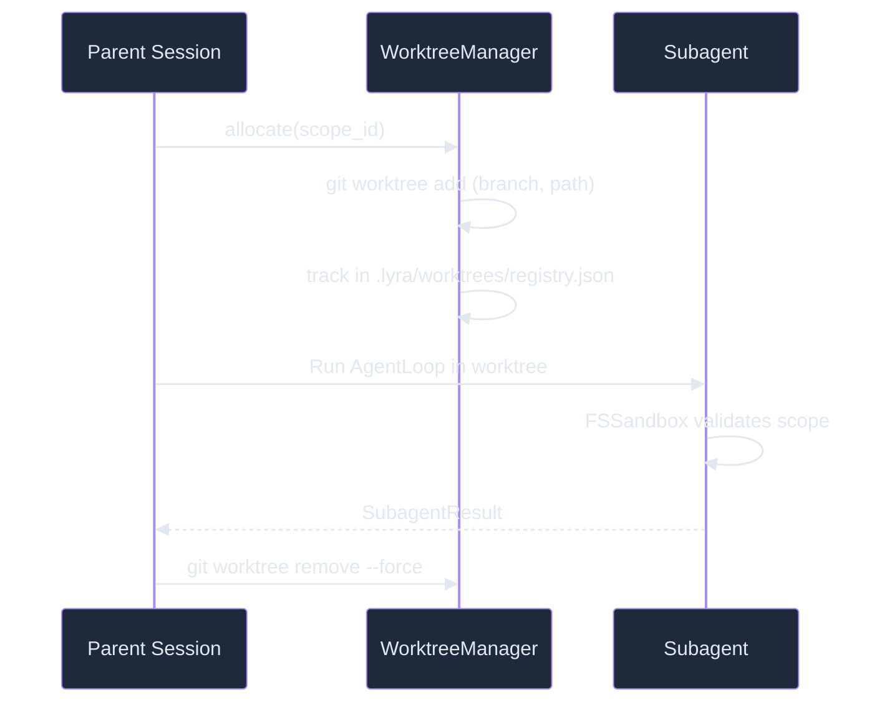

# Subagent Worktree -- How It Works

> Isolated parallel execution via git worktrees with `EnterWorktree` tool, `.lyraworktreeinclude` scope control, auto-stash cleanup, and a non-git copy-on-write overlay fallback for environments without git.
> **Block:** 08 | **Phase:** 3 (Multi-Agent & Memory) | **Depends on:** Agent Loop, Permission Bridge

## Worktree Isolation via EnterWorktree

Each subagent runs in an isolated git worktree -- a separate working directory backed by the same `.git/` object store. The `EnterWorktree` tool handles lifecycle:



**Worktree creation** (~50ms): `git worktree add` creates a new working directory on a scoped branch. The subagent sees only the files in its scope. All git operations (commit, diff, merge) work normally.

**Worktree tracking**: Allocations are tracked in `.lyra/worktrees/registry.json`:

```json
{
  "worktrees": {
    "sess_abc_node_1": {
      "path": "/tmp/lyra-wt/sess_abc_node_1",
      "branch": "_lyra/sess_abc_node_1",
      "created_at": "2026-06-01T10:00:00Z",
      "status": "active"
    }
  }
}
```

## .lyraworktreeinclude (Scope Control)

Each subagent declares its scope via a `.lyraworktreeinclude` file using gitignore-style glob patterns:

```
src/api/search/**
tests/api/search/**
!src/api/search/secrets.json
```

The `FSSandbox` enforces these globs at runtime:
- **Writes**: Rejected if path does not match scope globs
- **Reads**: Allowed but logged if outside scope (audit trail)
- **Binary writes**: Always rejected (security)

Scope validation uses the `pathspec` library for gitignore-compatible pattern matching. This is defense-in-depth: the Permission Bridge checks at dispatch, FSSandbox checks at filesystem access, and the worktree provides physical isolation.

## Auto-Stash Cleanup

When a subagent completes (or is interrupted), the WorktreeManager performs auto-stash:

1. Stash any uncommitted changes
2. Run `git worktree remove --force`
3. Delete the scoped branch
4. Remove the entry from `registry.json`
5. Emit cleanup HIR event

On parent session cancellation, all worktrees created by that session are force-removed. No dangling worktrees survive a session abort.

```python
class WorktreeManager:
    def cleanup(self, session_id: str) -> None:
        for entry in self._registry.for_session(session_id):
            sh.run(f"cd {entry.path} && git stash")
            sh.run(f"git worktree remove --force {entry.path}")
            sh.run(f"git branch -D {entry.branch}")
            entry.status = "cleaned"
```

## Non-Git CoW Overlay Fallback

When the working directory is not a git repository (or git is unavailable), the system falls back to a copy-on-write overlay using `os.link()` (hard links) or `shutil.copy2()`:

```
Source Tree              Overlay
├── src/                 ├── src/  (hard link to source, immutably)
│   └── auth.py          │   └── auth.py  (CoW: copy on first write)
├── config/              ├── config/  (hard link)
└── tests/               └── tests/  (hard link)
```

On the first write to a file, the overlay creates a private copy (O(1) per file, O(n) worst case). On cleanup, the overlay directory is deleted; the source tree is untouched. This provides isolation without git overhead at the cost of higher first-write latency (~2ms per file vs ~50us with git).

The fallback is detected automatically: if `git rev-parse --is-inside-work-tree` fails, the CoW overlay is used.

## Context Seed

Subagents do not receive the full parent transcript (~50-100K tokens). They receive a compact seed:

```
~3.5K tokens = SOUL + plan summary + purpose + scope
```

This reduces context cost by ~95% compared to forwarding the full parent context. The subagent's entire execution returns a compressed observation summary (~500 tokens), not the raw trace (~50K tokens).

## Depth Limit

Max recursion depth: 2. A subagent cannot spawn sub-agents. The `SpawnTool` is removed from the subagent's available tools.

## Performance

| Metric | P50 | P95 |
|--------|-----|-----|
| Worktree creation | 55ms | 95ms |
| Subagent duration (5-turn) | 10.7s | 18.2s |
| Per-subagent cost (5-turn) | $0.023 | $0.041 |
| Context seed generation | 3ms | 8ms |
| Merge (auto, no conflict) | 120ms | 310ms |
| Disk per worktree | 10MB | 14MB |

## Related Documents

- **Concepts:** [Subagents](../concepts/04-subagents.md), [Agent Loop](../concepts/01-agent-loop.md)
- **Architecture:** [Worktree Isolation](../architecture/10-worktree-isolation.md), [Workflow Engine](../architecture/05-workflow-engine.md), [Implementation Roadmap](../architecture/14-implementation-roadmap.md)
- **Related blocks:** [Agent Loop](01-agent-loop.md), [DAG Teams](07-dag-teams.md), [Permission Bridge](05-permission-bridge.md), [MCP Adapter](09-mcp-adapter.md)

---

*References: Voyager (arXiv:2305.16291), SWE-bench (arXiv:2310.06770), Tree of Thoughts (arXiv:2305.10601)*
