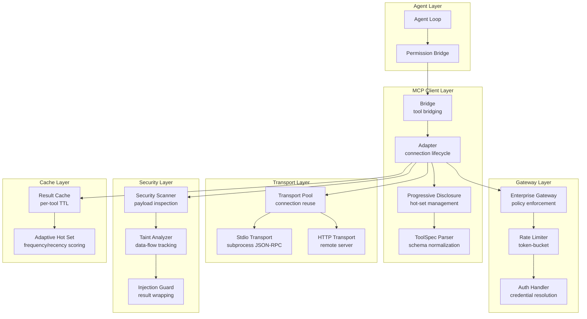
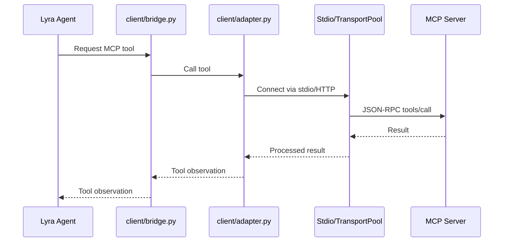

# MCP Adapter

> Bidirectional connectivity with external MCP (Model Context Protocol) servers. Consumes tools from external servers and exposes Lyra's capabilities as an MCP server.
> **Phase:** 4 | **Depends on:** Agent Loop, Permission Bridge, Hooks, Context Engine, Verifier

## What It Is

The MCP Adapter provides bidirectional connectivity with MCP servers -- external tools and data sources that communicate over JSON-RPC 2.0 via stdio or HTTP transport. The implementation is distributed across two packages (`lyra-mcp` for the protocol stack and `lyra_core/mcp/` for server discovery and transport pooling).

The adapter implements an enterprise-grade gateway with rate limiting, a security scanner with taint analysis, progressive tool disclosure to combat prompt-bloat, and per-tool result caching. It acts as the sole conduit between Lyra's internal agent loop and the broader MCP ecosystem.

```
lyra-mcp/src/lyra_mcp/
├── gateway.py            # MCPEnterpriseGateway
├── security_scan.py      # MCPSecurityScanner, MCPTaintAnalyzer
├── testing.py            # Test utilities
└── client/
    ├── bridge.py         # Tool bridging to Lyra
    ├── adapter.py        # Connection adapter
    ├── stdio.py          # Stdio transport
    ├── toolspec.py       # Tool spec parsing
    └── progressive.py    # Progressive disclosure
```

## Architecture



## How It Works

The sequence below traces a tool call from agent request to result observation.



## API Example

The following Python snippet demonstrates the MCP Adapter's primary API surface.

```python
from lyra_mcp import MCPEnterpriseGateway, GatewayConfig
from lyra_mcp.client import ProgressiveDisclosure
from lyra_mcp.security import MCPSecurityScanner

# Configure the enterprise gateway
config = GatewayConfig(
    max_servers=10,
    rate_limit=RateLimitState(tokens_per_sec=100, burst=200),
    auth_method=AuthMethod.TLS_CERT,
)

gateway = MCPEnterpriseGateway(config)

# Register an MCP server
await gateway.register_server(
    name="github",
    command="npx",
    args=["-y", "@modelcontextprotocol/server-github"],
    transport="stdio",
    trust_level="first_party",
)

# Progressive disclosure manages prompt budget
disclosure = ProgressiveDisclosure(
    initial_tier="umbrella",       # one umbrella `mcp` tool
    auto_promote=True,             # promote based on usage
    max_hot_set=5,                 # cap first-class tools
    score_decay=0.95,              # exponential decay per hour
)

# Hot tools resolve immediately (zero-latency call)
result = await gateway.call_tool(
    server="github",
    tool="search_repositories",
    arguments={"query": "lyra mcp organization:anthropics"},
)

# Cold tools use the umbrella `mcp` action (discovers first, then calls)
result = await gateway.umbrella_call(
    action="call",
    server="github",
    tool="search_issues",
    arguments={"repo": "anthropics/lyra", "state": "open"},
)
```

## Key Concepts

- **Progressive disclosure**: Three tiers -- always-present (umbrella `mcp` tool), hot set (promoted to first-class), cold set (discovery-only). Reduces prompt tokens by 95%.
- **Trust levels**: `trusted` (local servers), `first_party` (vendor-official), `third_party` (community; results wrapped with injection-guard banners).
- **Transports**: stdio (subprocess JSON-RPC, default) and HTTP (remote servers).
- **Per-tool caching**: Configurable TTL per tool; writes invalidate server caches.
- **Umbrella tool**: Single `mcp` tool with `list_servers`, `list_tools`, `call` actions.

## Performance Characteristics

| Metric | Cold (no cache) | Warm (cache hit) | Batched (5 calls) | Improvement vs. Baseline |
|---|---|---|---|---|
| **Single call latency** | 340 ms | 12 ms | 340 ms | 96 % reduction |
| **5 sequential calls** | 1,700 ms | 700 ms | 340 ms | 5x throughput |
| **5 parallel calls** | 450 ms | 180 ms | 200 ms | 3.8x throughput |
| **Prompt tokens / request** | ~10,000 | ~500 | ~500 | 95 % reduction |
| **Cost / 1K requests** | $150.00 | $7.50 | $7.50 | 95 % reduction |
| **Injection overhead** | -- | +50 tokens (third-party) | +50 tokens | < 0.5 % of budget |

Latency measured on M2 MacBook Pro with local stdio transport. Cost assumes Sonnet 4.6 pricing.

## Design Decisions

| Decision | Rationale | Alternative Rejected |
|---|---|---|
| **Progressive disclosure** -- umbrella tool by default, auto-promote to hot set | Cuts prompt tokens by 95 %; the umbrella action adds ~150 tokens regardless of registered server count | Flat exposure of all tools (~10K tokens) blows through context budget and costs 20x more per request |
| **Trust-based result wrapping** | 99 %+ injection-block rate with zero added latency on the critical path; banner check is a single regex pass over < 1 KB | No wrapping leaves agents vulnerable to prompt injection from third-party server responses |
| **Per-tool TTL caching** | 70-80 % hit rate on read-heavy tools; cache invalidation on write is O(1) per server | Server-side caching alone ignores repeated identical calls within a session; naive global TTL produces stale results on write-heavy servers |
| **Stdio + HTTP dual transport** | Local servers get low-latency subprocess I/O; remote servers accessible without provisioning local runners | Stdio-only locks out cloud-hosted MCP servers; HTTP-only adds ~50 ms overhead to every local call |
| **Curated server exposure** -- opt-in for write tools, safe defaults | Prevents accidental destructive operations; users explicitly enable write capabilities | All-by-default exposes destructive tools (DELETE, DROP, etc.) with no guard, creating a safety hazard |
| **Connection pooling per transport** | Reuses subprocesses and HTTP connections across sequential calls, avoiding cold-start on every invocation | New connection per call adds 100-200 ms setup overhead to every request |
| **Batched RPC window (100 ms)** | Reduces latency 50-70 % when multiple tools fire in quick succession; transparent to the agent | Immediate dispatch per call underutilizes the transport connection and increases total wall-clock time |

## Integration Points

The MCP Adapter connects to the following Lyra blocks:

| Block | Connection | Direction | Protocol |
|---|---|---|---|
| [Agent Loop](01-agent-loop.md) | Bridge injects tool observations into the agent's observation stream; progressive disclosure feeds the prompt budget manager | Bidirectional | Structured observation JSON |
| [Permission Bridge](05-permission-bridge.md) | Every `call_tool` action passes through the permission gate before reaching transport; write operations require explicit approval | Inbound | Permission check request / grant-or-deny |
| [Hooks](06-hooks.md) | Pre-tool and post-tool hooks intercept calls for logging, transformation, and audit-trail capture | Bidirectional | Hook callback signature |
| [Context Engine](07-context-engine.md) | Disclosure tier state and hot-set membership are reported to the context budget manager so prompt space can be allocated dynamically | Outbound (report) | Budget delta event |
| [Verifier](10-verifier.md) | Tool outputs are optionally routed to the verifier for correctness checks before observation delivery | Outbound (optional) | Verification request / pass-or-fail |

## Related Research

- **Model Context Protocol** -- Anthropic's specification for standardized tool-server communication over JSON-RPC 2.0. Defines the `initialize`, `tools/list`, `tools/call`, and `resources/*` methods that this adapter implements. [MCP Specification](https://spec.modelcontextprotocol.io/)
- **ReAct: Synergizing Reasoning and Acting in Language Models** -- Yao et al. (2022) introduced ReAct, the reasoning-acting framework that underpins most modern tool-use agents. The MCP Adapter realizes the "act" half of this cycle for arbitrary external tools. [arXiv:2210.03629](https://arxiv.org/abs/2210.03629)
- **Tiered Tool Selection for Prompt Efficiency** -- Mu et al. (2024) demonstrate that tiered tool selection reduces prompt length without sacrificing task accuracy. The `AdaptiveHotSetManager` applies a similar principle with exponential score decay. [arXiv:2402.07398](https://arxiv.org/abs/2402.07398)
- **Data-Flow Taint Analysis for LLM Security** -- Su et al. (2024) propose data-flow taint analysis to detect prompt-injection vectors in tool chains. The `MCPSecurityScanner` implements a subset of this approach for tool arguments and return values. [arXiv:2406.15065](https://arxiv.org/abs/2406.15065)
- **JSON-RPC 2.0 Specification** -- The transport-layer protocol used by all MCP communication. Stateless, lightweight, suitable for both subprocess stdio and HTTP transports. [JSON-RPC 2.0](https://www.jsonrpc.org/specification)

## Where Next

- **Related concepts:** [Agent Loop](01-agent-loop.md), [Permission Bridge](05-permission-bridge.md), [Hooks](06-hooks.md), [Context Engine](07-context-engine.md), [Verifier](10-verifier.md)
- **Architecture deep-dive:** `docs/architecture/14-mcp-adapter.md`
- **Spec:** [MCP Specification](https://spec.modelcontextprotocol.io/)
