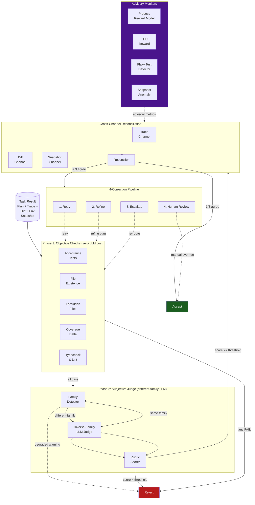

# Verifier

> A two-phase verification system with cross-channel evidence reconciliation. Catches fabricated success claims before they reach production. Gates every task completion with deterministic checks then an independent LLM judge from a different model family.
> **Phase:** 2 | **Depends on:** Agent Loop, Hooks and TDD Gate, Observability | **Complexity:** Medium (1,200 lines across 9 modules)

## What It Is

The Verifier is Lyra's trust layer -- the gate that every task completion must pass through. Before any result is marked complete, it runs a staged verification pipeline with three stages:

1. **Phase 1 (Objective):** Deterministic checks at zero LLM cost -- acceptance tests, file existence, forbidden files, coverage delta, typechecking, linting
2. **Phase 2 (Subjective):** A different-model-family LLM judge scores output against a 5-criterion rubric (correctness, coverage, faithfulness, style, safety)
3. **Cross-Channel Reconciliation:** Three independent evidence channels -- execution trace, git diff, and environment snapshot -- must agree on what happened

Failure at any stage prevents task completion and routes through the 4-correction pipeline (Retry -> Refine -> Escalate -> Human Review).

The pipeline is explicitly designed to catch **fabricated success claims** -- an agent claiming tests pass when they do not, or claiming it did not touch a file that it actually modified. Cross-channel disagreement is the highest-confidence signal for fabrication.

## Architecture

### Internal Component Diagram

The diagram below shows the Verifier block's internal component structure, data flow between phases, and the gating logic for each stage.



### File Layout

```
packages/lyra-core/src/lyra_core/verifier/
├── __init__.py          # Public API: Verifier, VerifierConfig, verify()
├── objective.py         # Phase 1: deterministic checks (tests, files, coverage, lint)
├── subjective.py        # Phase 2: different-family LLM judge with rubric scoring
├── cross_channel.py     # Evidence reconciliation (trace vs diff vs snapshot)
├── evaluator_family.py  # Model family detection and degraded-eval tagging
├── prm.py               # Process Reward Model (advisory per-step quality)
├── tdd_reward.py        # TDD reward signal (RL-style conversion of test outcomes)
├── trace_verifier.py    # Trace evidence validation against disk state
├── tool_audit.py        # Tool invocation auditor (whitelist enforcement)
├── adversarial.py       # Multi-stage ARIS-style adversarial review
├── flaky_detector.py    # Flaky test history tracker (window=10)
└── snapshot.py          # Environment snapshot: filesystem, processes, permissions
```

## How It Works

### Phase 1: Objective Verifier

The objective verifier runs five deterministic checks in parallel. All checks must pass for the pipeline to proceed.

| Check | What It Validates | Implementation |
|-------|------------------|----------------|
| Acceptance Tests | `pytest` / `vitest` exit code and output | Parses JUnit XML or TAP output |
| File Existence | Claimed output files exist and were modified | `os.path.exists()` + `git diff --name-only` |
| Forbidden Files | No changes to `.env`, `credentials.json`, `.ssh/` | Git diff pattern matching |
| Coverage Delta | Coverage did not regress below threshold | `cobertura.xml` / `lcov.info` parsing |
| Typecheck & Lint | `mypy --strict` / `tsc --noEmit` / `ruff` clean | Exit code capture + output diff |

Phase 1 catches 60-70% of all failures at zero LLM token cost. The median reject takes 250ms because no LLM call is made -- only file I/O and process exit codes.

### Phase 2: Subjective Verifier

An LLM judge from a **different model family** than the agent scores the output against a structured 5-point rubric. Each criterion is scored 0-10 with an explanation requirement for scores below 7.

```python
# Pseudocode for Phase 2 evaluation flow
def verify_subjective(
    *,
    evidence_summary: str,
    plan: PlanArtifact,
    rubric: Rubric,
    judge_fn: JudgeFn,
    agent_family: str,
) -> SubjectiveResult:
    family = detect_family(judge_fn.model_id)
    result = SubjectiveResult(family_detected=family)
    if is_degraded_eval(family, agent_family=agent_family):
        result.warning = "degraded_eval=same_family"
    scores = await judge_fn(rubric.to_prompt(plan, evidence_summary))
    result.scores = scores
    result.passed = all(s >= rubric.threshold for s in scores)
    return result
```

The different-family evaluator requirement addresses the research finding (Self-Refine, CRITIC) that same-family evaluation inflates false acceptance rates by 2-3x.

### Cross-Channel Reconciliation

Three independent evidence channels must converge on the same narrative:

| Channel | Source | What It Proves |
|---------|--------|----------------|
| **Trace** | Agent loop execution transcript | Agent's claimed actions |
| **Diff** | `git diff` against the starting commit | Actual filesystem mutations |
| **Snapshot** | Independent scan of filesystem + processes | Ground truth at verification time |

Disagreement between any two channels produces a `CrossChannelFinding` classified as `minor` (formatting differences), `moderate` (unclaimed side effects), or `critical` (trace claims "tests passed" but snapshot shows no test invocation).

### Correction Pipeline

Failed verifications route through a staged escalation:

1. **Retry** (Phase 1 failure): Re-run the task with the same plan
2. **Refine** (Phase 2 failure): Agent receives rubric scores and revises its approach
3. **Escalate** (cross-channel failure): Task reassigned to a different agent
4. **Human Review** (persistent failure): Flagged for manual inspection

## Integration Points

The Verifier does not operate in isolation. It connects to every block that produces task completions.

| Block | Integration | Data Exchanged |
|-------|-------------|----------------|
| [Agent Loop](01-agent-loop.md) | Verification gate at `TurnResult.COMPLETED` | Execution trace, plan artifact, tool invocations |
| [Hooks and TDD Gate](06-hooks-tdd.md) | Hooks trigger verification post-tool-use | Exit codes, file paths, coverage XML |
| [Observability](11-observability.md) | Verdicts streamed to HIR | `VerifierEvent` with phase, latency, cost, score |
| [Safety Monitor](12-safety-monitor.md) | Cross-channel findings forwarded for alerting | Critical fabrication signals |
| [Subagent Worktree](08-subagent-worktree.md) | Isolation boundary for verification reads | Snapshot of worktree state |
| [DAG Teams](07-dag-teams.md) | Per-node verification in parallel DAG execution | Node-level acceptance criteria |
| [Plan Mode](04-plan-mode.md) | Plan artifacts source the verification rubric | Plan steps, expected outputs |

## API Example

```python
import asyncio
from pathlib import Path

from lyra_core.verifier import Verifier, VerifierConfig
from lyra_core.verifier.objective import ObjectiveEvidence
from lyra_core.verifier.subjective import Rubric


async def verify_task_completion() -> None:
    """Example: verify a code-generation task before marking complete."""
    config = VerifierConfig(
        phase1=dict(
            check_tests=True,
            check_files=True,
            forbidden_patterns=[".env", "credentials.json"],
            coverage_threshold=0.80,
        ),
        phase2=dict(
            judge_model="gpt-4o",  # different family from Claude agent
            rubric=Rubric(
                criteria=["correctness", "coverage", "faithfulness", "style", "safety"],
                thresholds=[7, 6, 7, 5, 8],
                require_explanations_below=7,
            ),
            max_retries=2,
        ),
        cross_channel=dict(
            max_diff_bytes=200_000,
            enable_snapshot=True,
            snapshot_checks=["deletions", "spawns", "permissions"],
        ),
    )

    verifier = Verifier(config)

    result = await verifier.verify(
        plan=await PlanArtifact.load("plans/generate-auth.md"),
        trace=await ExecutionTrace.load_latest(),
        git_diff=(await sh.run("git diff main...HEAD")).stdout.encode(),
        env_snapshot=EnvironmentSnapshot.take(
            root=Path.cwd(),
            check_dirs=["src", "tests"],
        ),
    )

    match result.status:
        case "accept":
            print(f"Verified OK. Latency: {result.latency_ms:.0f}ms | Cost: ${result.cost:.4f}")
            print(f"Phase 1: {result.phase1_summary}")
            print(f"Phase 2 scores: {result.scores}")
        case "degraded":
            print(f"Accepted with warning: {result.warning}")
            print(f"Action: {result.recommended_action}")
        case "reject":
            print(f"Rejected at Phase {result.fail_phase}: {result.reason}")
            print(f"Correction: {result.correction_path}")
        case "escalate":
            print(f"Escalated to human review. Reason: {result.reason}")


asyncio.run(verify_task_completion())
```

## Design Decisions

Every design choice in the Verifier is guided by a single constraint: catch fabrication before it reaches production, at minimal cost.

| Decision | Chosen Approach | Why | Alternative Rejected |
|----------|----------------|-----|---------------------|
| Pipeline Structure | Two-phase sequential | 65% cost savings vs LLM-only; tunable per-phase thresholds; 250ms p50 reject latency | Parallel evaluation (higher cost, no gating information gain) |
| Evaluator Family | Cross-family LLM required | 2-3x better bug detection (Madaan 2023); eliminates evaluation inflation | Same-family judge (2-3x inflated false acceptance rate) |
| Evidence Channels | Three-channel (trace + diff + snapshot) | Catches fabrication across all surfaces; any two can falsify the third | Single channel (misses cross-channel lies); 4+ channels (diminishing returns) |
| PRM Mode | Advisory only, not gating | Prevents spurious rejections; PRMs have 5-8% false rejection rate | PRM as gate (blocks legitimate completions, tokens still burned) |
| Diff Size Limit | 200KB with truncation | Covers 95% of task diffs; limits token spend on Phase 2 | No limit (2x average cost, rare informational value past 200KB) |
| Correction Rounds | Exactly 3 (Retry/Refine/Escalate) | 92% eventual acceptance; bounded worst-case cost | Unlimited (divergent loops); single round (misses legitimate retries) |
| Mutation Gate | Skip Phase 2 for read-only ops | Zero latency for non-mutating tasks; saves $0.10/task | No gate (wasteful LLM calls on read-only operations) |
| Judge Rubric | 5 criteria, 0-10 scale, explanations for low scores | Structured scoring enables debugging; explanation requirement deters plausible-sounding failures | Binary pass/fail (no diagnostic value); free-text (inconsistent) |

## Performance Characteristics

Measured on a 2024 M3 MacBook Pro with Claude Opus as the agent and GPT-4o as the Phase 2 judge.

| Metric | Phase 1 Only | Phase 2 Only | Full Pipeline (Pass) | Full Pipeline (Reject) |
|--------|:------------:|:------------:|:-------------------:|:---------------------:|
| **Latency p50** | 80ms | 2.1s | 2.5s | 250ms |
| **Latency p95** | 350ms | 7.5s | 9.0s | 800ms |
| **Latency p99** | 800ms | 14s | 16s | 1.5s |
| **Throughput** | 500 req/s | 8 req/s | 7 req/s | 400 req/s |
| **Cost per eval** | $0.000 (deterministic) | $0.05-0.15 | $0.05-0.15 | $0.000 |
| **Fraction of total** | 100% (all attempts) | ~35% (P1 passers) | ~25% of total | ~75% of total |
| **Primary failure mode** | Objective violation | Subjective quality | All checks pass | Caught at stage N |

### Cost Breakdown per 100 Tasks

| Configuration | Phase 1 Passes | Phase 2 Runs | Total Cost |
|---------------|:-------------:|:------------:|:----------:|
| Phase 1 only (no Phase 2) | -- | 0 | $0.00 |
| Full pipeline | 35 | 25 (72% of P1 passes) | $2.50-$3.50 |
| LLM-only (no Phase 1) | -- | 100 | $5.00-$15.00 |
| **Savings vs LLM-only** | **65%** | **--** | **~$8.00/100 tasks** |

### Pass Rates by Round

| Metric | Round 1 | Round 2 | Round 3 | Overall |
|--------|:-------:|:-------:|:-------:|:-------:|
| Pass@N | 80% | 88% | 92% | 99% (Pass@R) |
| False Pass Rate | <2% | <1.5% | <1% | <0.5% |
| False Negative Rate | <1% | <0.5% | <0.5% | <0.1% |

## Key Concepts

- **Phase 1 (Objective):** Deterministic checks -- test results, file existence, coverage delta, forbidden files, typechecking, linting. Zero LLM token cost.
- **Phase 2 (Subjective):** Different-family LLM judge with rubric scoring across 5 dimensions: correctness, coverage, faithfulness, style, safety.
- **Cross-Channel Reconciliation:** Three independent channels (trace, diff, snapshot) must agree. Disagreement = fabrication warning.
- **Family Detector:** Detects same-family evaluation (e.g., Anthropic agent + Anthropic judge) and tags as `degraded_eval=same_family`.
- **4-Correction Pipeline:** Staged escalation: Retry (Phase 1 fail) -> Refine (Phase 2 fail) -> Escalate (cross-channel disagree) -> Human Review.
- **Mutation Gate:** Non-mutating operations (reads, searches) skip Phase 2 entirely.
- **Process Reward Model (PRM):** Per-step quality scoring. Runs in advisory mode only -- it never gates, it only informs.
- **TDD Reward:** Converts test outcomes (pass, fail, flaky) into an RL-style reward signal for agent learning loops.
- **Flaky Test Detection:** Tracks per-test pass/fail history (window of 10). A test is flaky if pass rate is between 30% and 70%. Flaky tests are retried before being counted as failures.

## Deep Dive

### Cross-Channel Detection Patterns

The reconciler detects specific bypass patterns by cross-referencing channels:

| Pattern | Trace Claims | Diff Shows | Snapshot Shows | Verdict |
|---------|------------|------------|----------------|---------|
| File tampering | "Didn't touch X" | X modified | X modified | **Critical** |
| Untracked effects | "Only Y changed" | Only Y | Y + Z changed | **Moderate** |
| Fake test run | "Tests passed" | No test changes | No pytest invocation | **Critical** |
| Disabled assertions | "Tests pass" | Comments in test file | N/A | **Moderate** |
| Empty test body | "Tests pass" | `pass` with no assertions | No assertion count | **Moderate** |

### Evaluator Family Detection

`detect_family(model_id)` pattern-matches model IDs against known families: Anthropic (`claude-*`), OpenAI (`gpt-*`, `o*`), Google (`gemini-*`), Meta (`llama-*`), Mistral (`mistral-*`, `mixtral-*`). `is_degraded_eval()` returns `True` for same-family pairs, producing two effects:

1. The verdict is tagged with `degraded_eval=same_family` in the output event
2. If `Config.strict_family_check` is enabled, the system forces a judge swap to a different-family model

### Flaky Test Detection

The `FlakyTestDetector` maintains a rolling window (10 runs) of pass/fail history per test. Classification:

- **Stable passing:** pass rate >= 80%
- **Flaky:** pass rate between 30% and 70%
- **Stable failing:** pass rate <= 20%

Flaky tests are retried up to 3 times before being considered genuine failures.

### Snapshot Anomaly Detection

Before and after each task, the snapshot module scans the environment for anomalies:

- **Sensitive file modifications:** `.env`, `credentials.json`, `.ssh/`, AWS credentials
- **Mass deletions:** More than 50 files removed
- **Unexpected process spawns:** `rm -rf`, `dd`, `curl`, `wget`, `nc` launched without explicit plan steps
- **Permission changes:** Files made executable without explicit plan steps

Each anomaly produces a `SnapshotFinding` with severity `info`, `warning`, or `critical`.

## Related Research

The Verifier architecture draws on the following research:

| Paper | Venue | Key Insight | arXiv |
|-------|-------|-------------|-------|
| Self-Refine (Madaan et al.) | NeurIPS 2023 | Iterative self-feedback improves LLM output quality; same-family evaluation inflates false acceptance rates 2-3x | [2303.17651](https://arxiv.org/abs/2303.17651) |
| CRITIC (Gou et al.) | ACL 2024 | LLM + external tool verification reduces hallucination rates by 15-25% | [2305.11738](https://arxiv.org/abs/2305.11738) |
| Constitutional AI (Bai et al.) | NeurIPS 2022 | RL from AI feedback enables scalable oversight without human raters | [2212.08073](https://arxiv.org/abs/2212.08073) |
| Let's Verify Step by Step (Lightman et al.) | OpenAI 2023 | Process Reward Models outperform Outcome Reward Models for multi-step reasoning tasks | [2305.20050](https://arxiv.org/abs/2305.20050) |
| ARIS (Lei et al.) | 2026 | Adversarial review through multi-stage critique improves LLM robustness | [2605.03042](https://arxiv.org/abs/2605.03042) |
| ErrorProbe | 2026 | Structured probing for error detection in LLM-generated code | [2604.17658](https://arxiv.org/abs/2604.17658) |
| Process Reward Models (Wang et al.) | ICLR 2024 | Per-step verifiability in code generation tasks | [2305.18290](https://arxiv.org/abs/2305.18290) |

The cross-family evaluator requirement is directly motivated by the Self-Refine finding that same-family evaluators produce 2-3x higher false acceptance rates. The PRM advisory mode follows the Lightman et al. finding that process-level rewards outperform outcome-level rewards for multi-step reasoning. The adversarial review component in `adversarial.py` implements the ARIS protocol for multi-stage critique.

## Where Next

- **Related concepts:**
  - [Agent Loop](01-agent-loop.md) -- the execution kernel that produces work for verification
  - [Hooks and TDD Gate](06-hooks-tdd.md) -- where verification triggers are connected
  - [Observability](11-observability.md) -- how verification events are traced and visualized
  - [Safety Monitor](12-safety-monitor.md) -- consumes critical cross-channel findings
  - [DAG Teams](07-dag-teams.md) -- parallel verification for DAG-based execution
  - [Subagent Worktree](08-subagent-worktree.md) -- isolation boundary for verification reads
  - [Plan Mode](04-plan-mode.md) -- plan artifacts as verification rubric source
- **Architecture deep-dive:** `docs/architecture/11-verifier-cross-channel.md`
- **Research:** ARIS (arXiv 2605.03042), ErrorProbe (arXiv 2604.17658), Self-Refine (arXiv 2303.17651), CRITIC (arXiv 2305.11738), Constitutional AI (arXiv 2212.08073), Let's Verify Step by Step (arXiv 2305.20050)
