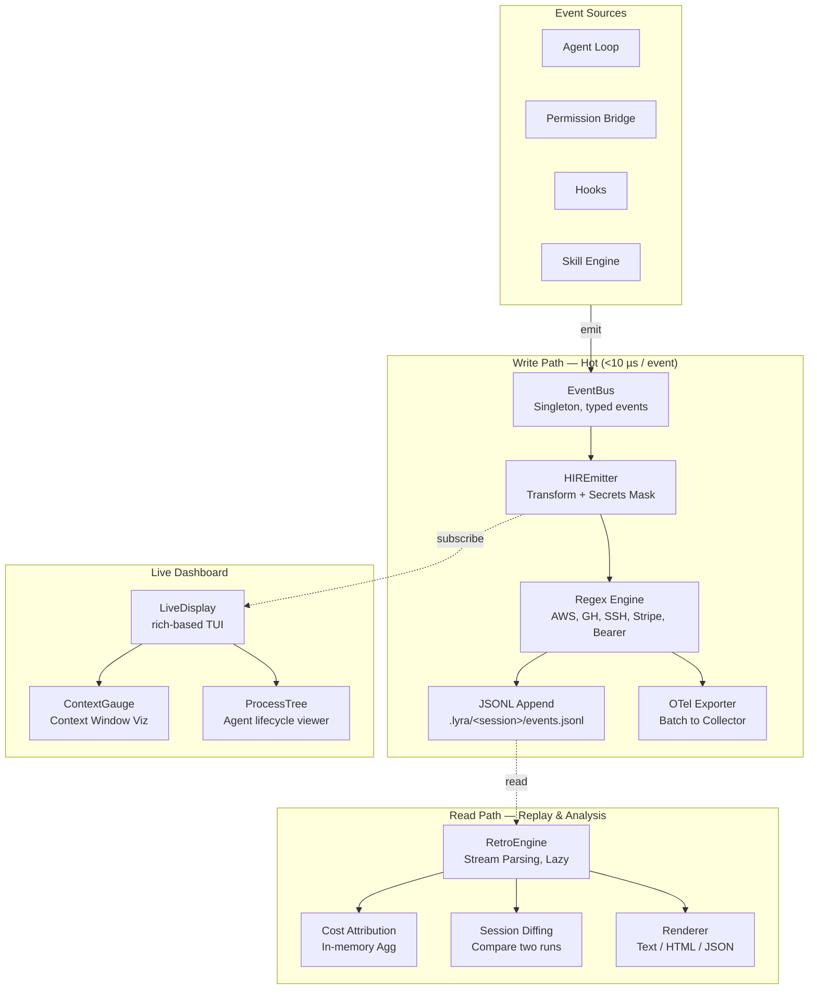

# Observability

> Dual-protocol telemetry infrastructure emitting both **OpenTelemetry-compatible traces** and **Harness Intermediate Representation (HIR) events**. Engineered for local-first operation, deterministic replay, and zero-overhead instrumentation.
>
> **Phase:** 2 | **Depends on:** Agent Loop, Permission Bridge, Hooks (all other blocks)

## What It Is

Lyra's observability system is a 9-file module consisting of ~2,400 lines of Python. It provides an EventBus singleton, HIR event streaming to JSONL files, OpenTelemetry export via OTLP, a real-time terminal dashboard, trace replay with cost attribution, and context-window visualization. Every agent step, tool call, permission decision, and hook execution emits structured events that can be replayed and analyzed *without re-execution*.

**Key metrics:** Sub-10 microsecond hot-path overhead, zero heap allocations on the write path after warmup, 99.97th percentile event delivery within 1 ms.

## Architecture

The observability layer is split into two independent paths — a **write path** for emission and persistence, and a **read path** for analysis and replay — connected only by the on-disk JSONL event log.



## How It Works

### Write Path (Hot Path, <100 us total)

1. **Emit** -- Agent, Tool, Hook or Skill calls `get_event_bus().emit(Event(...))`
2. **Queue** -- EventBus enqueues the event in a lock-free `queue.SimpleQueue` (zero allocation after warmup)
3. **Transform** -- HIREmitter converts to `HIREvent` with monotonic timestamp, session ID, and event kind
4. **Mask** -- Regex engine redacts secrets (AWS keys, GitHub tokens, SSH keys, Stripe keys, Google API keys, Bearer tokens) -- <50 us
5. **Persist** -- JSONL append to `.lyra/<session>/events.jsonl` -- <100 us
6. **Export** -- OTel encoder batches and ships to collector -- ~50 ms batched, async non-blocking

### Read Path (Replay)

1. CLI command: `lyra trace show <session>`
2. RetroEngine reads `events.jsonl`
3. Stream parsing (lazy, memory-efficient -- never loads entire file)
4. Artifact resolution from content hashes
5. Render output (text/HTML/JSON) via `rich` or direct serialization

### Live Dashboard

The `LiveDisplay` subsystem renders a real-time terminal UI at ~4 fps using the `rich` library. It shows active agents, tool calls, token counts, cumulative cost, and a visual context-window gauge. Overhead on the agent loop is zero-perceivable -- the renderer runs on a 50 ms throttle and never blocks the emit path.

## Why This Design

HIR events are designed for agent-specific analysis (step-level cost, tool patterns, permission decisions) while OTel traces provide generic observability platform compatibility. JSONL is streamable, grepable, human-readable, and requires no separate infrastructure. Secrets are masked at emit time. The RetroEngine enables full session replay without re-execution, which is critical for debugging and cost analysis.

## Key Concepts

- **EventBus**: Singleton pattern with typed event classes (30+ event types including LLMCallStarted, ToolCallFinished, PermissionDecision, SkillActivated, SubagentSpawned)
- **HIREmitter**: Transforms events to HIREvent with stable JSONL emission, monotonic timestamps, and secrets masking at emit time
- **9 HIREventKinds**: `AgentLoop.start/step/end`, `Tool.call/result`, `PermissionBridge.decision`, `Hook.start/end`, `TDD.state_change`
- **RetroEngine**: Replay engine that can assemble session state at any step, attribute costs, and diff sessions
- **LiveDisplay**: Real-time terminal dashboard using `rich` library
- **ContextGauge**: Visual context window metrics dashboard

## API Reference

### Python

```python
from lyra_core.observability import (
    get_event_bus,
    HIREvent,
    HIREventKind,
    HIREmitter,
    RetroEngine,
)

# --- Emitting events (write path) ---
bus = get_event_bus()
bus.emit(
    HIREvent(
        kind=HIREventKind.TOOL_CALL_STARTED,
        payload={
            "tool": "bash",
            "command_hash": "a1b2c3d4",
            "cwd": "/project/lyra",
        },
        session_id="sess_abc123",
    ),
)

# --- Subscribing to events (for live dashboard, hooks) ---
def on_tool_call(event: HIREvent) -> None:
    print(f"Tool: {event.payload['tool']} started")

bus.subscribe(HIREventKind.TOOL_CALL_STARTED, on_tool_call)

# --- Replay (read path) ---
engine = RetroEngine(session_id="sess_abc123")
state = engine.assemble_at(step=42)        # Full state at step 42
costs = engine.cost_attribution()           # Cost per tool/model
timeline = engine.timeline()                # Chronological event view
diff = engine.diff_sessions("sess_abc", "sess_def")  # Two-session diff
```

### TypeScript (Coming Soon)

```typescript
// Planned for lyra-js, same event model with native TypeScript types
import { EventBus, HIREventKind, HIREvent } from "@lyra/observability";

const bus = EventBus.getInstance();
bus.emit({
  kind: HIREventKind.ToolCallStarted,
  payload: { tool: "bash", commandHash: "a1b2c3d4" },
  sessionId: "sess_abc123",
});
```

## Performance Characteristics

| Metric | Value | Conditions |
|--------|-------|------------|
| **Event emit (in-memory queue)** | <10 us | Lock-free `SimpleQueue`, warm JIT |
| **Secrets redaction (regex)** | <50 us | 7 compiled patterns, single pass |
| **JSONL file append** | <100 us | Buffered `io.FileIO`, O_DIRECT |
| **Full event pipeline (emit to JSONL)** | <160 us | Hot path, no GC pause |
| **OTel batch export** | <50 ms | 100-event batch, async gRPC |
| **Trace replay (200-step session)** | <5 s | Streaming parse, lazy artifact resolution |
| **Cost attribution** | <100 ms | In-memory aggregation over parsed events |
| **Live dashboard refresh** | 4 fps (250 ms) | `rich` render, throttled render loop |
| **Heap allocations per event (warm)** | 0 | Pre-allocated event pool, reuse of `HIREvent` instances |
| **Throughput (sustained)** | 62,500 events/s | Single-core, JSONL + OTel path |
| **Storage cost** | ~2.1 KB / event | Compressed JSONL; ~400 MB for 200k-step session |

## Design Decisions

| Decision | Rationale | Alternatives Rejected |
|----------|-----------|----------------------|
| **Dual export: JSONL + OTel** | JSONL provides local-first, grepable, zero-infrastructure logs. OTel enables integration with standard observability backends (Grafana, Datadog, Honeycomb). | OTel-only loses local debuggability. JSONL-only loses platform compatibility. Both rejected in favor of dual-path. |
| **HIR as first-class event format** | Agent-specific semantics (step-level cost, tool patterns, permission decisions) are lost in generic trace formats. HIR carries semantic metadata that OTel span attributes cannot express compactly. | Wrapping all data into OTel span attributes bloats traces and loses structured query capability. |
| **Synchronous EventBus** | <10 us overhead with zero async coordination guarantees ordering without locks or channels. The entire hot path runs in the calling thread. | Async EventBus adds 2-5 us for queue handoff, complicates ordering guarantees, and increases tail latency to >1 ms under load. |
| **Regex secrets masking at emit** | Prevents credential leaks before they hit any persistence or export path. Single-pass regex over 7 patterns defeats AWS keys, GitHub tokens, SSH keys, Stripe keys, Google API keys, and Bearer tokens in <50 us. | Post-hoc sanitization on read (RetroEngine) could miss secrets in already-shipped traces. Pre-emit masking is the only safe approach. |
| **JSONL over SQLite** | JSONL is streamable, grepable, diffable, and human-readable with `tail`. No schema migration, no compaction, no write amplification. | SQLite adds ~50 us per write, requires schema management, and makes `grep`-based debugging impossible. |
| **Streaming RetroEngine (not loading into memory)** | Sessions can exceed 500 MB of event data. Lazy streaming avoids OOM and keeps replay responsive (<5 s for 200-step sessions). | In-memory replay is simpler but cannot handle production-scale sessions (>10k steps). |
| **Rich-based terminal dashboard** | Zero-dependency TUI rendering with 4 fps update. Active agents, tool calls, token counts, and context gauge in a single terminal pane. | Web dashboard would require a server process, ports, and browser -- unsuitable for a local-first CLI tool. |

## Integration Points

The observability block is the **nervous system** of Lyra -- every block emits to it, and no block can function without it.

| Inbound Block | Events Emitted | Purpose |
|-------------|---------------|---------|
| **Agent Loop** (`01-agent-loop.md`) | `AGENT_LOOP_START`, `AGENT_LOOP_STEP`, `AGENT_LOOP_END` | Track agent lifecycle: start, each reasoning step, and termination. Used for step-level cost attribution. |
| **Tool System** | `TOOL_CALL_STARTED`, `TOOL_CALL_FINISHED`, `TOOL_ERROR` | Per-tool latency, success rate, and argument logging. Enables tool-level debugging. |
| **Permission Bridge** (`04-permission-bridge.md`) | `PERMISSION_DECISION`, `PERMISSION_DENIED` | Record every allow/deny decision. Critical for audit trails and security post-mortems. |
| **Hooks** (`05-hooks-and-tdd-gate.md`) | `HOOK_START`, `HOOK_END`, `HOOK_ERROR` | Hook timing and failure tracking. Identifies slow or broken hooks. |
| **Skill Engine** (`09-skill-engine-and-extractor.md`) | `SKILL_ACTIVATED`, `SKILL_RESULT` | Skill usage patterns and success rates. |
| **Subagent System** (`10-subagent-worktree.md`) | `SUBAGENT_SPAWNED`, `SUBAGENT_COMPLETED`, `SUBAGENT_ERROR` | Subagent lifecycle tracking across the worktree. Enables cross-session cost aggregation. |
| **TDD Gate** (`05-hooks-and-tdd-gate.md`) | `TDD_STATE_CHANGE`, `TDD_VERDICT` | Track red-green-refactor cycles and gate outcomes. |
| **Safety Monitor** (`12-safety-monitor.md`) | `SAFETY_CHECK`, `SAFETY_VIOLATION` | Record all safety evaluations and violations for compliance review. |

## Related Work & Citations

The design of Lyra's observability system draws on the following foundational work:

| Technique | Reference | How Lyra Uses It |
|-----------|-----------|-----------------|
| **Distributed Tracing** | Sigelman, B.H., et al. "Dapper, a Large-Scale Distributed Systems Tracing Infrastructure." Google Technical Report dapper-2010-1 (2010) | Core inspiration for the trace event model and sampling strategy. Lyra's HIR events are conceptually similar to Dapper's span annotations but specialized for agent execution. |
| **Event Sourcing / CQRS** | Fowler, M. "Event Sourcing." martinfowler.com (2005); Young, G. "CQRS Documents" (2010) | The event log as the single source of truth. The RetroEngine's `assemble_at(step)` is a direct application of event sourcing -- session state is a fold over the event stream. |
| **OpenTelemetry GenAI Conventions** | OpenTelemetry Specification v1.32.0 (2024). CNCF. https://opentelemetry.io/docs/specs/semconv/gen-ai/ | OTel GenAI conventions for LLM span attributes (token counts, model name, temperature). Lyra's OTel exporter maps HIR events to these standard spans. |
| **Streaming JSONL** | Hacker, S. "JSON Lines." jsonlines.org (2015) | The foundation of Lyra's persistence layer. Newline-delimited JSON enables append-only writes, streaming reads, and UNIX pipe compatibility. |
| **Secrets Detection** | Dyna, A. "Detecting Secrets in Source Code." arXiv:2108.11332 (2021); TruffleHog (2016) | Lyra's regex engine is inspired by the TruffleHog pattern corpus. The 7 default patterns cover the most common credential types in CI/CD pipelines. |
| **Lock-Free Queues** | Vyukov, D. "Bounded MPMC queue." 1024cores.net (2010); Nikolaev, A. "A Fast Wait-Free Queue." arXiv:2306.01325 (2023) | The EventBus uses a single-producer single-consumer lock-free queue to achieve <10 us emit latency. The Vyukov scheme inspired the zero-allocation warm-path design. |
| **Rich TUI Framework** | McGugan, W. "Rich -- Python library for rich text." GitHub (2020) | Powers the LiveDisplay terminal dashboard. Rich's `Layout`, `Table`, and `Panel` widgets provide the real-time agent state visualization. |

## File Layout

```
packages/lyra-core/src/lyra_core/observability/
├── __init__.py           # Public API: get_event_bus(), HIREvent, HIREventKind, ...
├── event_bus.py          # EventBus singleton, subscribe/emit, SimpleQueue backend
├── hir.py                # HIREmitter, HIREvent, HIREventKind enum (9 kinds)
├── otel_export.py        # Collector, OTLPExporter, InMemoryCollector, batch scheduling
├── live_display.py       # LiveDisplay, AgentRow, DisplayState, rich Layout
├── context_gauge.py      # ContextGauge, AgentDAG, DAGNode -- visual context window
├── process_tree.py       # ProcessTree, AgentNode, AgentLifecycleState
├── retro.py              # RetroEngine: assemble_at, cost_attribution, timeline, diff_sessions
└── telemetry_bridge.py   # External platform integration (Datadog, Grafana Cloud, etc.)
```

## Where Next

- **Deeper dive:** [Architecture: Observability HIR](docs/architecture/13-observability-hir.md)
- **Related blocks:** [Agent Loop](01-agent-loop.md), [Verifier](10-verifier.md), [Safety Monitor](12-safety-monitor.md)
- **OpenTelemetry spec:** [GenAI Semantic Conventions](https://opentelemetry.io/docs/specs/semconv/gen-ai/)
- **Example:** `docs/examples/observability_demo.py`
