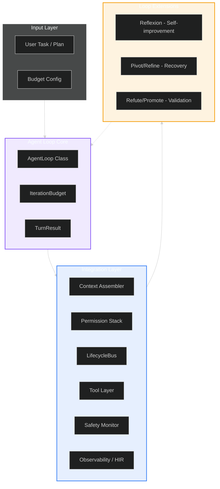
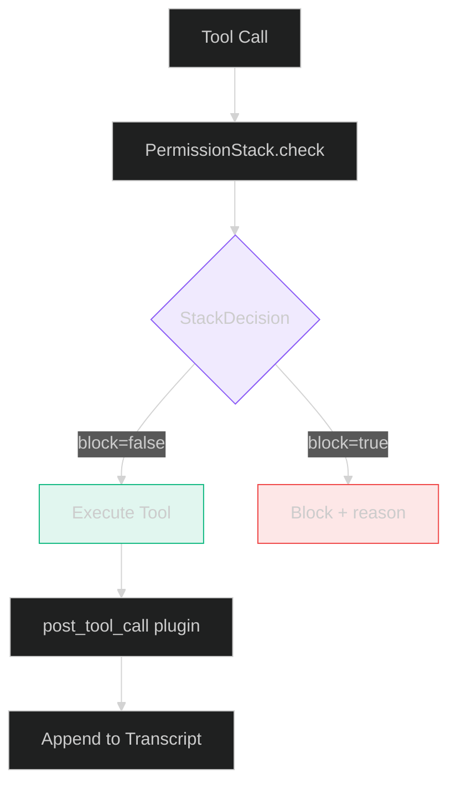
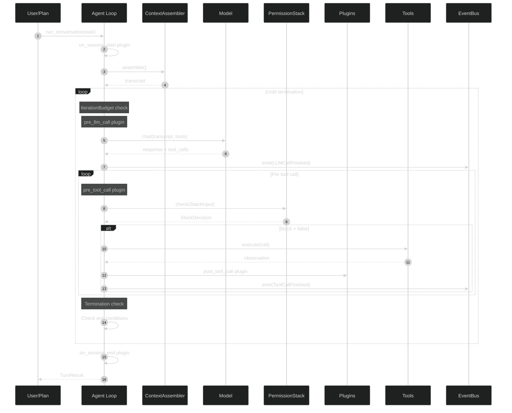

# Agent Loop Architecture

**Block:** 01 — Agent Loop  
**Status:** Production  
**Version:** 7.2.1

---

## Overview

The agent loop is Lyra's **kernel** -- the core execution primitive that orchestrates the think-act-observe cycle. It is a driver that owns the LLM/tool/store interaction shape, not the semantics of any specific model, tool, or persistence layer. Plugins observe deterministic seams and may short-circuit the loop via `KeyboardInterrupt`. The implementation is inspired by NousResearch/hermes-agent's `run_conversation` and opencode's tool-dispatch shape.

The agent loop supports four operational modes that define an **autonomy escalation ladder**:

| Mode | Description | Human Oversight | Use Case |
|------|-------------|----------------|----------|
| **Interactive** | Traditional turn-by-turn with user approval | Full (every action confirmed) | Development, debugging |
| **Semi-autonomous** | Auto-continue within budget, ask on uncertainty | Partial (uncertainty gates) | Standards-compliant changes |
| **Unattended** | Background session with no active human loop | Minimal (audit-only) | Batch refactoring, CI |
| **Full autonomy** | IdleSpec-driven speculative planning + execution | None (post-hoc review) | "Deep research" mode |

Unattended operation (§4.14) enables sessions that run without an active human loop -- the agent loop completes its budget of turns, reports results, and terminates. This is the foundation for the background session model used by `FleetSupervisor`: each session is an independent AgentLoop instance with its own context, budget, and stop conditions.

The **autonomy escalation ladder** is progressive: a session starts in Interactive mode and climbs to higher autonomy levels based on trust (historical success rate), task type (refactoring is higher autonomy than security-critical edits), and user preference. The ladder is implemented as a mode enum on `AgentLoop` and is checked at each pre-tool-call plugin hook to determine whether user approval is required.

**Workflow engine integration (§4.13)**: The agent loop integrates with Lyra's dynamic workflow engine (`lyra_workflow`) which provides code-driven orchestration for complex multi-agent tasks. When a task's complexity exceeds the single-agent capacity (determined by the model router's effort level at "ultracode" or above), the agent loop delegates to the workflow engine. The workflow engine:
1. Writes a Python orchestration script that contains the plan as code (not context).
2. Spawns subagents (up to 16 concurrent, 1,000 total per run) to execute parallel tasks.
3. Tracks intermediate results in script variables -- NOT in the LLM's context window.
4. Supports resumability: completed agents return cached results on resume.
5. Returns a consolidated result to the agent loop on completion.

This separation means the agent loop focuses on single-turn reasoning while the workflow engine handles multi-agent orchestration. The two systems communicate through a defined `WorkflowDelegate` interface: the agent loop calls `workflow.delegate(task)` when it detects a multi-agent-suitable task, and the workflow engine returns results as if they were a single tool call.

**IdleSpec speculative planning**: During idle periods (between user turns, or when a session is waiting for external input), the agent loop can enter a speculative planning mode driven by `IdleSpec`. In this mode:
1. The agent loop pre-computes response strategies for likely next inputs.
2. Results are cached and tagged with confidence scores.
3. When the next input arrives, the agent loop checks the speculative cache first.
4. If the cache confidence exceeds a threshold (default 0.85), the cached response is used directly -- no LLM call needed.
5. If confidence is below threshold, the standard loop runs as normal.

IdleSpec is implemented as a plugin hook (`on_idle(ctx)`) that fires when the loop detects no pending user input. The plugin has a time budget (configurable, default 5 seconds) and is cancelled immediately when new input arrives. The speculative planning cache is scoped to the session and cleared on session end.

**Source**: `packages/lyra-core/src/lyra_core/agent/loop.py` (545 lines)

## System Architecture

### High-Level Components



### Component Breakdown

#### 1. Core Loop (`lyra_core/agent/loop.py`)

| Component | Responsibility | Key Classes |
|-----------|---------------|-------------|
| **AgentLoop** | Main execution kernel | `AgentLoop`, `TurnResult`, `IterationBudget` |

The AgentLoop class is constructed with:
```python
AgentLoop(llm=..., tools=..., store=..., plugins=[...], budget=IterationBudget(max=N))
```
And exposes `run_conversation(user_text, *, session_id) -> TurnResult`.

The loop is deliberately minimal -- it is a *driver* that owns the LLM/tool/store interaction shape, not the semantics of any specific model.

#### 2. Loop Extensions (`lyra_core/loop/`)

| Component | File | Lines | Key Classes |
|-----------|------|-------|-------------|
| **Reflexion** | `reflexion.py` | ~250 | `Reflection`, `ReflectionMemory`, `LessonGenerator` |
| **Pivot/Refine** | `pivot_refine.py` | ~500 | `PivotRefineExecutor`, `ErrorDatabase`, `RecoveryResult` |
| **Refute/Promote** | `refute_or_promote.py` | ~150 | `RefuteOrPromoteResult`, `RefutePromoteStage` |

### Plugin Hook Seams

The AgentLoop defines five duck-typed plugin hooks (all optional):

| Hook | When Fired | May Raise |
|------|-----------|-----------|
| `on_session_start(ctx)` | Once, before first LLM call | -- |
| `pre_llm_call(ctx)` | Before each LLM call | -- |
| `pre_tool_call(ctx)` | Before each tool dispatch | `KeyboardInterrupt` to terminate turn |
| `post_tool_call(ctx)` | After each tool dispatch (including errors) | -- |
| `on_session_end(ctx)` | Always, once, at session end | -- |

### Stop Reasons

Stop reasons surfaced on `TurnResult`:
- `end_turn` -- LLM returned without further tool calls
- `budget` -- `IterationBudget` exhausted
- `interrupt` -- plugin raised KeyboardInterrupt (or user pressed ^C)

## Context Engine Integration

```mermaid
%%{init: {'theme': 'dark'}}%%
sequenceDiagram
    participant Loop as Agent Loop
    participant CA as ContextAssembler
    participant Model as LLM Provider
    
    Loop->>CA: assemble(turns, tool_schemas, messages)
    CA->>CA: Layer SOUL (never compacted)
    CA->>CA: Layer STATIC_CACHED (system prompts/rules)
    CA->>CA: Layer DYNAMIC (user turns, tool results)
    CA-->>Loop: Assembled transcript
    
    Loop->>Model: chat(transcript, tools)
    Model-->>Loop: Response + tool_calls
    
    Note over Loop,CA: Compaction triggered when needed
    Loop->>CA: compact() via compact() function
    CA->>CA: Summarize old turns
    CA->>CA: Preserve SOUL + static layers
    CA-->>Loop: Compacted transcript
```

**Key Operations:**
- **Assembly:** `ContextAssembler.add(item)` / `ContextAssembler.assemble(max_tokens)` -- Builds 5-layer context
- **Compaction:** `compact()` / `compact_messages()` functions in `compactor.py` -- Summarize old turns
- **Reduction:** `tool_output_policy.py` -- Truncate large tool outputs

## Permission Stack Integration



**Decision Flow:**
```python
# PermissionStack.check() returns StackDecision:
StackDecision(block=False)             # Execute
StackDecision(block=True, guard="...", reason="...")  # Block with reason
```

Permission modes are `"normal"`, `"strict"`, or `"yolo"`. The stack collapses destructive-pattern, secrets-scan, and prompt-injection guards into a single check.

## Data Flow

### Turn Lifecycle



## Observability Integration

The AgentLoop emits events to the `EventBus` from `lyra_core.observability`:

```python
from lyra_core.observability import (
    LLMCallFinished,
    LLMCallStarted,
    ToolCallFinished,
    ToolCallStarted,
    get_event_bus,
)
```

HIR event kinds (in `hir.py`):
- `AgentLoop.start` -- Session begins
- `AgentLoop.step` -- Each LLM invocation
- `AgentLoop.end` -- Session completes
- `Tool.call` -- Tool invocation
- `Tool.result` -- Tool result
- `PermissionBridge.decision` -- Permission decision
- `Hook.start` / `Hook.end` -- Hook lifecycle

## Tech Stack

### Core Dependencies

```yaml
Language: Python 3.11+

Core Libraries:
  - dataclasses: Core data structures (frozen, slots)
  - typing: Type hints with Protocol, Callable, Mapping, MutableMapping
  - collections: deque, defaultdict for internal state
  - concurrent.futures: Executor abstraction
  - pathlib: Filesystem operations

Internal Dependencies:
  - lyra_core.observability: EventBus, HIREmitter, LLM/Tool events
  - lyra_core.context.pipeline: ContextAssembler
  - lyra_core.permissions.stack: PermissionStack
  - lyra_core.hooks.lifecycle: LifecycleBus
  - lyra_core.safety.monitor: SafetyMonitor
  - lyra_core.agent.loop: AgentLoop (self)
```

### Module Structure

```
packages/lyra-core/src/lyra_core/
├── agent/
│   ├── __init__.py
│   └── loop.py               # AgentLoop class (545 lines)
├── loop/                     # Loop extensions (NOT the main loop)
│   ├── __init__.py           # Public API exports
│   ├── reflexion.py          # Reflexion self-improvement
│   ├── pivot_refine.py       # Failure recovery loop
│   └── refute_or_promote.py  # Multi-stage validation
```

## Integration Points

### 1. Context Assembler

**Interface:** `ContextAssembler` in `lyra_core/context/pipeline.py`

```python
assembler = ContextAssembler(soul_text=...)
assembler.add(ContextItem(layer=ContextLayer.DYNAMIC, content=...))
items = assembler.assemble(max_tokens=200000)
```

### 2. Permission Stack

**Interface:** `PermissionStack` in `lyra_core/permissions/stack.py`

```python
stack = PermissionStack(mode="normal")
decision = stack.check(StackInput(tool_name="Bash", args={...}))
# Returns StackDecision(block=bool, guard=str|None, reason=str|None)
```

### 3. LifecycleBus

**Interface:** `LifecycleBus` in `lyra_core/hooks/lifecycle.py`

```python
bus = LifecycleBus()
bus.subscribe(LifecycleEvent.TURN_START, my_handler)
bus.emit(LifecycleEvent.TURN_START, {"session_id": "..."})
```

### 4. Safety Monitor

**Interface:** `SafetyMonitor` in `lyra_core/safety/monitor.py`

```python
monitor = SafetyMonitor(window=5)
monitor.observe(text)
flags = monitor.flags()  # list[SafetyFlag]
```

### 5. EventBus

**Interface:** `EventBus` in `lyra_core/observability/event_bus.py`

```python
bus = get_event_bus()  # singleton
bus.emit(LLMCallStarted(session_id=..., ...))
```

## Model Routing

The AgentLoop uses provider-agnostic model routing. Model selection is handled at a higher layer (the provider abstraction). The loop itself receives an LLM function or client as a constructor dependency and does not hardcode specific models.

## Metrics & Observability

### Emitted Events

```yaml
Events:
  - LLMCallStarted / LLMCallFinished: Per-invocation lifecycle
  - ToolCallStarted / ToolCallFinished: Per-tool lifecycle
  - PermissionDecision: Per tool authorization
  - SubagentSpawned / SubagentFinished: Subagent lifecycle
  - SkillActivated: Skill activation
  - StopHookFired: Session end hooks
```

## Related Documentation

- [Block 02: Plan Mode](../plan-mode/architecture.md)
- [Block 03: DAG Teams](../dag-teams/architecture.md)
- [Block 04: Permission Bridge](../permission-bridge/architecture.md)
- [Block 05: Hooks and TDD Gate](../hooks-tdd/architecture.md)
- [Block 06: Context Engine](../context-engine/architecture.md)
- [Block 12: Safety Monitor](../safety-monitor/architecture.md)
- [Block 13: Observability](../observability/architecture.md)

---

**Next:** [Architecture Tradeoffs](./architecture-tradeoffs.md)
