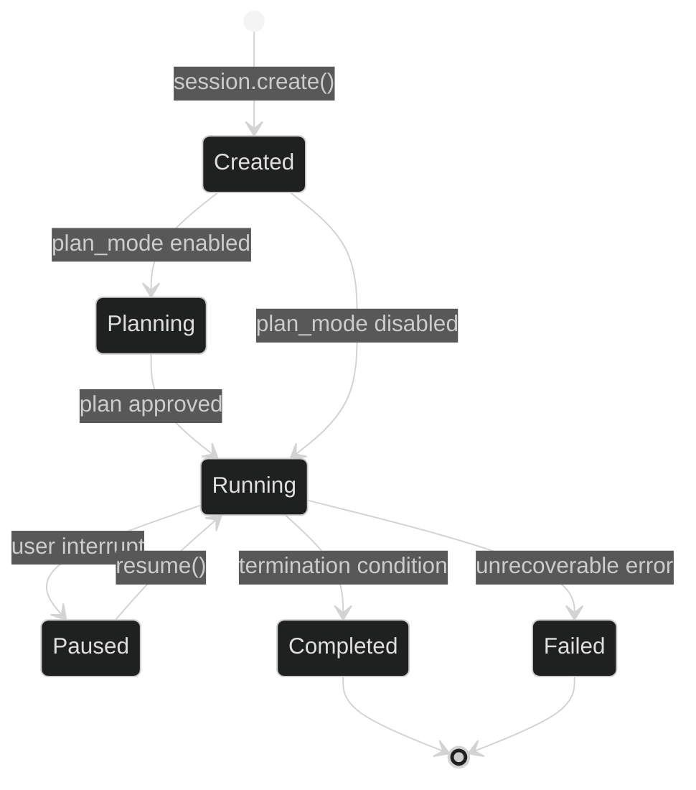
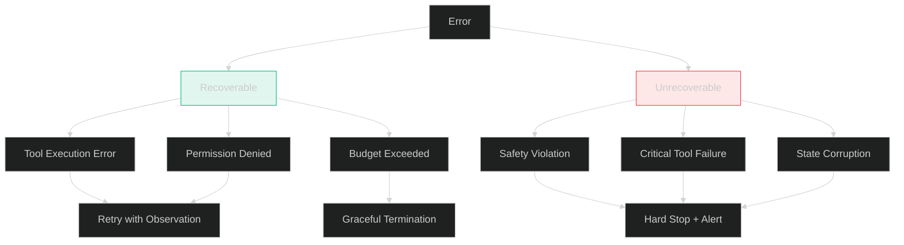
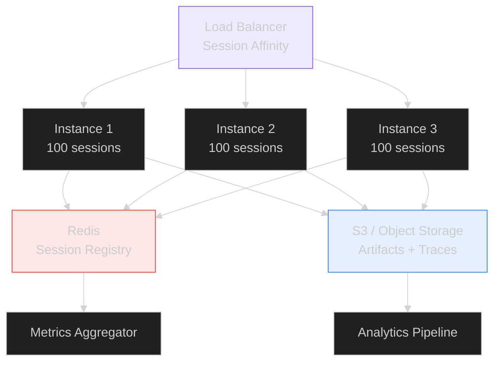

# Agent Loop System Design

**Block:** 01 — Agent Loop  
**Status:** Production  
**Version:** 2.7.1

---

## Overview

This document describes the high-level system design of the agent loop: core abstractions, API contracts, state management, error handling, and scalability patterns.

## Core Abstractions

### 1. Session

The session is the primary unit of execution — one conversation with memory, budget, and state.

```python
@dataclass
class Session:
    """A single agent execution session."""
    
    id: str                          # Unique session identifier
    task: str                        # Original task description
    model_selection: ModelSelection  # fast/smart slot configuration
    permission_mode: PermissionMode  # plan/auto-edit/bypass
    budgets: Budgets                 # Token, cost, step limits
    config: SessionConfig            # TDD, safety, hooks configuration
    
    # Runtime state
    cost_usd: float = 0.0           # Running cost counter
    interrupted: bool = False        # User interrupt flag
    parked_calls: list[ToolCall] = []  # Calls awaiting approval
    
    def persist_recent(self, turns: list[Turn]) -> None:
        """Persist recent turns to disk."""
        
    def checkpoint(self) -> Path:
        """Create recoverable snapshot."""
```

**Lifecycle:**



### 2. Transcript

The transcript is the conversation history — system prompt, user messages, assistant responses, tool calls, and observations.

```python
@dataclass
class Transcript:
    """Ordered sequence of messages and tool interactions."""
    
    messages: list[Message]          # Chronological message list
    tokens: int                      # Total token count
    cache_breakpoints: list[int]     # Cache boundary indices
    
    def append(self, message: Message) -> None:
        """Add message and update token count."""
        
    def tail(self, n: int) -> list[Message]:
        """Get last N messages."""
        
    def compact(self, keep_window: int = 5) -> "Transcript":
        """Summarize old messages, preserve recent."""
```

**Structure:**

```yaml
Transcript Layout:
  - System Message (L1 cache boundary)
    - Role instructions
    - Tool schemas
  
  - SOUL.md + Plan (L2 cache boundary)
    - Project persona
    - Plan summary
    - Permission mode notes
  
  - Historical Turns (compactable)
    - User message
    - Assistant response
    - Tool calls + observations
  
  - Recent Window (L3, preserved)
    - Last 3-5 turns
    - Full fidelity
```

### 3. ToolCall & ToolResult

Tool execution primitives.

```python
@dataclass(frozen=True)
class ToolCall:
    """A request to execute a tool."""
    
    id: str                    # Unique call identifier
    name: str                  # Tool name (e.g., "read", "bash")
    arguments: dict[str, Any]  # Tool-specific arguments
    
    def normalized_signature(self) -> str:
        """Hash for repeat detection."""
```

```python
@dataclass
class ToolResult:
    """The outcome of tool execution."""
    
    call_id: str               # Links back to ToolCall
    content: str               # Tool output
    is_error: bool             # Success/failure flag
    metadata: dict[str, Any]   # Cost, latency, artifacts
    
    def with_annotation(self, note: str) -> "ToolResult":
        """Add hook annotation."""
```

### 4. LoopResult

Termination outcomes.

```python
@dataclass
class LoopResult:
    """The final outcome of a loop execution."""
    
    status: TerminationStatus    # Why the loop ended
    session: Session             # Final session state
    transcript: Transcript       # Final transcript
    step: int                    # Steps executed
    
    @classmethod
    def complete(cls, session, transcript, step) -> "LoopResult":
        """Normal completion."""
    
    @classmethod
    def cost_exhausted(cls, session, transcript, step) -> "LoopResult":
        """Budget exceeded."""
    
    @classmethod
    def user_interrupt(cls, session, transcript, step) -> "LoopResult":
        """User pressed Ctrl-C."""
```

**Termination Status:**

```python
class TerminationStatus(Enum):
    COMPLETED = "completed"                # Model emitted end-of-turn
    COST_EXHAUSTED = "cost_exhausted"      # Budget exceeded
    STEPS_EXHAUSTED = "steps_exhausted"    # Step limit reached
    USER_INTERRUPT = "user_interrupt"      # Ctrl-C / pause button
    STALEMATE = "stalemate"                # Repeat detector triggered
    SAFETY_VIOLATION = "safety_violation"  # Safety monitor flagged
    TOOL_FAILURE = "tool_failure"          # Critical tool error
```

---

## API Contracts

### Primary Entry Point

```python
def agent_loop(
    session: Session,
    task: str,
    *,
    plan: Plan | None = None,
) -> LoopResult:
    """
    Execute the agent loop for a single task.
    
    Args:
        session: Execution context with budget, config, state
        task: User's task description
        plan: Optional approved plan from plan_mode
        
    Returns:
        LoopResult indicating termination reason and final state
        
    Raises:
        SafetyViolation: Safety monitor flagged dangerous behavior
        PermissionDenied: Tool execution blocked by permission bridge
        ToolExecutionError: Critical tool failure (non-recoverable)
    """
```

### Context Engine Interface

```python
class ContextEngine(Protocol):
    """Contract for context assembly, compaction, and reduction."""
    
    def assemble(
        self,
        session: Session,
        task: str,
        plan: Plan | None
    ) -> Transcript:
        """Build initial transcript with all context."""
        
    def compact(
        self,
        transcript: Transcript,
        session: Session
    ) -> Transcript:
        """Summarize old turns, preserve recent window."""
        
    def reduce(
        self,
        result: ToolResult,
        session: Session
    ) -> Observation:
        """Truncate large outputs, offload to artifacts."""
```

### Permission Bridge Interface

```python
class PermissionBridge(Protocol):
    """Contract for tool authorization."""
    
    def decide(
        self,
        call: ToolCall,
        session: Session
    ) -> Decision:
        """
        Authorize tool execution.
        
        Returns:
            Decision.allow(): Execute immediately
            Decision.ask(): Prompt user approval
            Decision.deny(reason): Block with explanation
            Decision.park(): Queue for later review
        """
```

### Hook System Interface

```python
class HookSystem(Protocol):
    """Contract for hook execution."""
    
    def run(
        self,
        event: HookEvent,
        *args,
        session: Session
    ) -> HookResult:
        """
        Execute registered hooks for event.
        
        Returns:
            HookResult with allow/block flag and optional annotation
        """

class HookResult:
    """Outcome of hook execution."""
    
    block: bool                    # Should execution be blocked?
    reason: str | None             # Explanation if blocked
    annotation: str | None         # Note to append to observation
    
    def to_critique(self) -> str:
        """Format as LLM-readable critique."""
```

---

## State Management

### Session State Files

```yaml
.lyra/sessions/<session-id>/
  recent.jsonl:           # Last 8 turns, JSONL format
    - {"role": "user", "content": "..."}
    - {"role": "assistant", "content": "..."}
    - {"role": "tool", "call_id": "...", "result": "..."}
  
  STATE.md:               # Human-readable session metadata
    # Session <session-id>
    **Status:** running
    **Phase:** GREEN
    **Cost:** $0.42 USD
    **Step:** 23/1000
    **Model:** fast=deepseek-v4-flash, smart=deepseek-v4-pro
  
  trace.jsonl:            # HIR event stream
    {"event": "agent.step", "step": 1, "tokens_in": 1234, ...}
    {"event": "tool.read", "file": "src/main.py", ...}
    {"event": "permission.decide", "decision": "allow", ...}
  
  artifacts/<hash>:       # Large tool outputs
    abc123.txt            # Full file content
    def456.json           # Full API response
```

### State Persistence Strategy

```python
class StateStore:
    """Manages session state persistence."""
    
    def persist_recent(self, session: Session, turns: list[Turn]) -> None:
        """Append recent turns to recent.jsonl."""
        with open(session.recent_path, "a") as f:
            for turn in turns:
                json.dump(turn.to_dict(), f)
                f.write("\n")
    
    def update_state_md(self, session: Session, transcript: Transcript) -> None:
        """Rewrite STATE.md with current session metadata."""
        state_md = STATE_MD_TEMPLATE.format(
            session_id=session.id,
            status=session.status,
            phase=session.tdd_phase,
            cost=session.cost_usd,
            step=session.step,
            model_fast=session.model_selection.fast,
            model_smart=session.model_selection.smart,
        )
        session.state_md_path.write_text(state_md)
    
    def flush_trace(self, session: Session, events: list[Event]) -> None:
        """Append HIR events to trace.jsonl."""
        with open(session.trace_path, "a") as f:
            for event in events:
                json.dump(event.to_dict(), f)
                f.write("\n")
```

### Crash Recovery

```python
def resume_session(session_id: str) -> Session:
    """Rebuild session state from disk."""
    
    # 1. Load STATE.md for metadata
    state_md = Path(f".lyra/sessions/{session_id}/STATE.md").read_text()
    metadata = parse_state_md(state_md)
    
    # 2. Reconstruct transcript from recent.jsonl
    turns = []
    with open(f".lyra/sessions/{session_id}/recent.jsonl") as f:
        for line in f:
            turns.append(Turn.from_dict(json.loads(line)))
    
    # 3. Rebuild session
    session = Session(
        id=session_id,
        cost_usd=metadata["cost"],
        step=metadata["step"],
        ...
    )
    
    # 4. Resume from last persisted step
    return session
```

---

## Error Handling

### Error Taxonomy



### Error Handling Strategy

```python
def agent_loop_with_error_handling(
    session: Session,
    task: str,
    *,
    plan: Plan | None = None,
) -> LoopResult:
    """Agent loop with comprehensive error handling."""
    
    try:
        return agent_loop(session, task, plan=plan)
        
    except ToolExecutionError as e:
        # Recoverable: Tool failed but loop can continue
        observation = f"Tool execution failed: {e}. Try a different approach."
        session.transcript.append_observation(e.call_id, observation)
        return agent_loop(session, task, plan=plan)  # Retry
        
    except PermissionDenied as e:
        # Recoverable: Tool blocked by permission bridge
        observation = f"Permission denied: {e.reason}. Request approval or try alternative."
        session.transcript.append_observation(e.call_id, observation)
        return agent_loop(session, task, plan=plan)  # Retry
        
    except BudgetExceeded as e:
        # Recoverable: Graceful termination
        return LoopResult.cost_exhausted(session, session.transcript, session.step)
        
    except SafetyViolation as e:
        # Unrecoverable: Hard stop
        persist_state_for_review(session, e.verdict)
        raise  # Propagate to caller
        
    except StateCorruption as e:
        # Unrecoverable: Critical failure
        logger.critical(f"Session {session.id} state corrupted: {e}")
        raise
```

### Tool Error Recovery

```python
def execute_tool_with_recovery(
    call: ToolCall,
    session: Session
) -> ToolResult:
    """Execute tool with automatic retry on transient failures."""
    
    for attempt in range(3):
        try:
            result = tool_layer.execute(call, session)
            
            if result.is_error and is_transient(result):
                # Retry transient errors (network, timeout)
                backoff = 2 ** attempt * 100  # 100ms, 200ms, 400ms
                time.sleep(backoff / 1000)
                continue
            
            return result
            
        except ToolExecutionError as e:
            if attempt == 2:  # Last attempt
                # Return error as observation (recoverable)
                return ToolResult(
                    call_id=call.id,
                    content=f"Tool execution failed after 3 attempts: {e}",
                    is_error=True,
                )
```

---

## Scalability Patterns

### Horizontal Scaling



**Scaling Strategy:**

```python
# Session affinity routing
def route_to_instance(session_id: str) -> str:
    """Route session to consistent instance."""
    instance_hash = hash(session_id) % NUM_INSTANCES
    return INSTANCES[instance_hash]

# Shared state in Redis
class SharedSessionRegistry:
    def __init__(self, redis: Redis):
        self.redis = redis
    
    def register(self, session: Session) -> None:
        """Register session in shared registry."""
        self.redis.hset(f"session:{session.id}", mapping={
            "instance": INSTANCE_ID,
            "status": session.status,
            "last_heartbeat": time.time(),
        })
    
    def get_instance(self, session_id: str) -> str | None:
        """Find which instance owns session."""
        return self.redis.hget(f"session:{session_id}", "instance")
```

### Vertical Scaling

```yaml
Resource Limits per Instance:
  Memory: 32 GB (400 sessions @ 80 MB each)
  CPU: 16 cores (modest, LLM-bound)
  Disk: 500 GB SSD (traces + artifacts)
  
Tuning Parameters:
  MAX_SESSIONS: 400
  MAX_TRANSCRIPT_TOKENS: 1_000_000
  COMPACTION_THRESHOLD: 0.85
  STATE_FLUSH_INTERVAL: 1  # Every step
```

### Performance Optimization

```python
# Connection pooling for LLM providers
class ModelProvider:
    def __init__(self, config: ProviderConfig):
        self.pool = httpx.AsyncClient(
            limits=httpx.Limits(
                max_connections=100,
                max_keepalive_connections=20,
            ),
            timeout=httpx.Timeout(60.0),
        )
    
    async def chat(self, transcript: Transcript) -> Response:
        """Reuse connections for efficiency."""
        return await self.pool.post(
            self.endpoint,
            json=self.format_request(transcript),
        )

# Batch state persistence
class BatchStateStore:
    def __init__(self, flush_interval: float = 1.0):
        self.buffer: list[StateUpdate] = []
        self.flush_interval = flush_interval
        self.last_flush = time.time()
    
    def enqueue(self, update: StateUpdate) -> None:
        """Buffer state update."""
        self.buffer.append(update)
        
        if time.time() - self.last_flush > self.flush_interval:
            self.flush()
    
    def flush(self) -> None:
        """Flush buffered updates to disk."""
        for update in self.buffer:
            update.persist()
        self.buffer.clear()
        self.last_flush = time.time()
```

---

## Security Considerations

### Input Validation

```python
def validate_tool_call(call: ToolCall) -> None:
    """Validate tool call before execution."""
    
    # Check tool exists
    if call.name not in REGISTERED_TOOLS:
        raise ToolNotFoundError(f"Unknown tool: {call.name}")
    
    # Validate arguments match schema
    schema = REGISTERED_TOOLS[call.name].schema
    try:
        jsonschema.validate(call.arguments, schema)
    except jsonschema.ValidationError as e:
        raise InvalidArgumentsError(f"Invalid arguments: {e}")
    
    # Check for path traversal
    if "path" in call.arguments:
        path = Path(call.arguments["path"]).resolve()
        if not path.is_relative_to(WORKSPACE_ROOT):
            raise SecurityError(f"Path outside workspace: {path}")
```

### Sandboxing

```python
# Tool execution in restricted environment
def execute_in_sandbox(call: ToolCall) -> ToolResult:
    """Execute tool in sandboxed environment."""
    
    # Filesystem restrictions
    os.chroot(WORKSPACE_ROOT)  # Restrict filesystem access
    
    # Network restrictions
    if call.name not in NETWORK_ALLOWED_TOOLS:
        disable_network()
    
    # Resource limits
    resource.setrlimit(resource.RLIMIT_CPU, (60, 60))  # 60s CPU
    resource.setrlimit(resource.RLIMIT_AS, (1_000_000_000, 1_000_000_000))  # 1GB memory
    
    # Execute
    return tool_layer.execute(call)
```

---

## Monitoring & Observability

### Health Checks

```python
class LoopHealthCheck:
    """Monitor loop health."""
    
    def check(self) -> HealthStatus:
        """Perform health check."""
        checks = [
            self.check_memory_usage(),
            self.check_disk_space(),
            self.check_llm_provider(),
            self.check_state_store(),
        ]
        
        if all(c.healthy for c in checks):
            return HealthStatus.HEALTHY
        elif any(c.critical for c in checks):
            return HealthStatus.CRITICAL
        else:
            return HealthStatus.DEGRADED
```

### Metrics

```python
# Prometheus metrics
METRICS = {
    "agent_step_duration_ms": Histogram("agent_step_duration_ms"),
    "agent_cost_usd": Counter("agent_cost_usd", ["model", "feature"]),
    "agent_tool_calls": Counter("agent_tool_calls", ["tool_name", "status"]),
    "agent_sessions_active": Gauge("agent_sessions_active"),
    "agent_transcript_tokens": Histogram("agent_transcript_tokens"),
}

def instrument_step(step: int, duration_ms: float) -> None:
    """Record step metrics."""
    METRICS["agent_step_duration_ms"].observe(duration_ms)
```

---

## Related Documentation

- [Architecture](./architecture.md)
- [Architecture Tradeoffs](./architecture-tradeoffs.md)
- [Implementation Guide](./implementation-guide.md)
- [Deep Dive](./deep-dive.md)

---

**Next:** [Implementation Guide](./implementation-guide.md)
