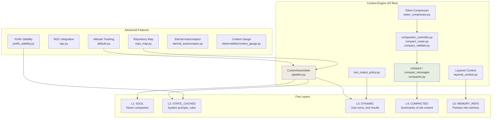

# Context Engine Architecture

## Overview

The Context Engine is the core subsystem responsible for assembling, managing, and optimizing what the LLM sees on each turn. It implements a five-layer architecture (SOUL, STATIC_CACHED, DYNAMIC, COMPACTED, MEMORY_REFS) using `ContextLayer` enum and `ContextAssembler` class. The module has 25 files covering assembly, compaction, token compression, repository mapping, altitude tracking, prefix stability, provenance, and more.

**Source**: `packages/lyra-core/src/lyra_core/context/` (25 files)

## System Architecture



## Module Structure

```
packages/lyra-core/src/lyra_core/context/
├── __init__.py                  # Public API
├── pipeline.py                  # ContextAssembler, ContextLayer, ContextItem
├── compactor.py                 # compact(), compact_messages() functions
├── compaction_controller.py     # Compaction lifecycle management
├── compact_router.py            # Model-aware compaction routing
├── compact_validate.py          # Compaction result validation
├── token_compressor.py          # Token-aware compression
├── layered_context.py           # Multi-layer context coordination
├── tool_output_policy.py        # Tool output truncation/processing
├── working_context.py           # Working context management
├── altitude.py                  # Context altitude tracking
├── ngc.py                       # Native Git Context integration
├── repo_map.py                  # Repository file/dependency map
├── prefix_stability.py          # Prefix cache stability optimization
├── eternal_autocompact.py       # Auto-compacting long sessions
├── provider_layouts.py          # Provider-specific context layout
├── cache_telemetry.py           # Cache hit/miss telemetry
├── context_evaluator.py         # Context quality evaluation
├── profile.py                   # User/session profiles for context
├── provenance.py                # Context item provenance tracking
├── relevance.py                 # Relevance scoring for context items
├── suggest.py                   # Context suggestion engine
├── isolation.py                 # Context isolation boundaries
├── grid.py                      # Context grid/spatial organization
└── clear.py                     # Context clearing/management
```

## Core Components

### 1. ContextAssembler (`pipeline.py`)

The central assembly class that builds context from five named layers.

```python
from lyra_core.context.pipeline import ContextAssembler, ContextLayer, ContextItem

class ContextLayer(str, enum.Enum):
    SOUL = "soul"
    STATIC_CACHED = "static_cached"
    DYNAMIC = "dynamic"
    COMPACTED = "compacted"
    MEMORY_REFS = "memory_refs"

assembler = ContextAssembler(soul_text=soul_content)
assembler.add(ContextItem(layer=ContextLayer.DYNAMIC, content="...", pin=False))
items = assembler.assemble(max_tokens=200000)
```

**Layer semantics:**
- **SOUL**: Repo persona; *never compacted*, always present
- **STATIC_CACHED**: Shipped system prompts and rules; stable across turns
- **DYNAMIC**: User turns, tool results; compactable
- **COMPACTED**: Summaries of older dynamic content
- **MEMORY_REFS**: Pointers into procedural/episodic memory

Token estimation uses a rough char-based heuristic (1 token per 4 chars) so the module stays zero-dep.

### 2. Compaction (`compactor.py`)

Compaction is provided as standalone functions, not a class:

```python
from lyra_core.context.compactor import compact, compact_messages

# Compacts context items
result = compact(items, max_tokens=100000)

# Compacts message lists directly
messages = compact_messages(messages, max_tokens=100000)
```

Supported by `compaction_controller.py` (lifecycle), `compact_router.py` (model-aware routing), and `compact_validate.py` (result validation).

### 3. Tool Output Handling (`tool_output_policy.py`)

Manages how large tool outputs are truncated or processed before being added to context. No separate `ObservationReducer` class exists -- tool output policy is handled through functions here.

### 4. Advanced Subsystems

| File | Purpose |
|------|---------|
| `altitude.py` | Tracks how "high-level" vs "low-level" the current context is |
| `ngc.py` | Native Git Context -- repository-level context integration |
| `repo_map.py` | Builds and maintains a structured map of the repository |
| `prefix_stability.py` | Optimizes static content placement for prompt cache hits |
| `eternal_autocompact.py` | Auto-compacts context during very long sessions |
| `provider_layouts.py` | Provider-optimized context layout strategies |

## Data Flow

```mermaid
%%{init: {'theme': 'dark', 'themeVariables': { 'primaryColor': '#8b5cf6', 'primaryTextColor': '#e2e8f0', 'primaryBorderColor': '#a78bfa', 'lineColor': '#94a3b8', 'secondaryColor': '#1e293b', 'tertiaryColor': '#0d1117', 'background': '#0d1117', 'mainBkg': '#1e293b', 'nodeBorder': '#a78bfa', 'clusterBkg': '#1e293b', 'clusterBorder': '#8b5cf6', 'titleColor': '#c084fc', 'edgeLabelBackground': '#1e293b' }}%%
sequenceDiagram
    participant Loop as Agent Loop
    participant CA as ContextAssembler
    participant Comp as Compactor
    participant Policy as ToolOutputPolicy
    participant LLM as LLM Provider

    Loop->>CA: assemble(turns, tools, messages)
    CA-->>Loop: Assembled items (5 layers)

    Loop->>LLM: Send context

    loop For each tool result
        Loop->>Policy: Process tool output
        Policy-->>Loop: Truncated/processed output
    end

    alt Context too large
        Loop->>Comp: compact(items)
        Comp->>Comp: Summarize old turns
        Comp->>Comp: Preserve SOUL + static layers
        Comp-->>Loop: Compacted items
    end

    Loop->>LLM: Send updated context
```

## Tech Stack

| Component | Technology | Purpose |
|-----------|-----------|---------|
| Core Engine | Python 3.11+ | Fast, type-safe |
| Token Estimation | Character heuristic (~1/4 char) | Zero-dep; swappable for tiktoken |
| Caching | Provider-specific APIs | Anthropic explicit, OpenAI implicit |
| File Operations | `pathlib`, `git` | Repository mapping, NGC |
| Compaction | LLM-driven summarization | Multi-provider compatible |

## Performance Characteristics

| Operation | Latency | Notes |
|-----------|---------|-------|
| Assembly (cold) | 5-15ms | First turn |
| Assembly (warm) | 2-5ms | Cached layers |
| Compaction | 500-2000ms | LLM-bound summarization |
| Tool output processing | 1-10ms | Per observation |
| Repository map build | 100-500ms | In-memory |

## Advanced Context Management

### Anthropic 3-Strategy Framework

Lyra's context engine aligns with the Anthropic 3-strategy framework for managing long conversations (Anthropic Context Engineering, Mar 2026):

1. **Compaction**: For long dialogue, the compactor summarizes older turns while preserving SOUL and static layers. The `compact()` function in `compactor.py` uses LLM-driven summarization with model-aware routing (`compact_router.py`). Multi-provider compatible -- compacts for any LLM backend.

2. **Notes (Tool-Result Clearing)**: For bulky tool results, `tool_output_policy.py` truncates or clears tool outputs that consume excessive context. Used instead of compaction when the problem is verbosity, not conversation length.

3. **Sub-Agents (Multi-Session Memory)**: For cross-session knowledge, the MEMORY_REFS layer provides pointers into procedural/episodic memory without loading full content into context. The three-layer search system (search -> context -> full fetch) retrieves only what is needed.

The decision framework for which strategy to use is embedded in the compaction controller:

```python
if long_dialogue:
    use("compaction")          # Summarize old turns
elif bulky_tool_results:
    use("clearing")             # Truncate/clear tool outputs
elif cross_session_knowledge:
    use("memory_refs")          # Pointers into memory
```

### Lean-Ctx Output Compression

The Context Engine integrates with `lean-ctx` output compression patterns to achieve 89-99% token reduction on certain content types. The `token_compressor.py` module applies:

- **Structured truncation**: Remove verbose metadata, deduplicate repetitive content.
- **Semantic compression**: Replace redundant explanations with concise summaries.
- **Token budget enforcement**: Per-layer token limits prevent any single layer from dominating the context.
- **Cache-aware encoding**: Static content is placed for optimal prompt cache hit rates (prefix stability).

The compression is model-aware via `compact_router.py`, which selects compression strategies based on the target provider's capabilities and context window size.

### COMPASS Hierarchical Context

Lyra's context layering aligns with the COMPASS hierarchical context management framework (arXiv 2510.08790):

- **L1 SOUL**: Core identity and behavior (never compacted)
- **L2 STATIC_CACHED**: Global system prompts and rules
- **L3 DYNAMIC**: Per-turn conversation history
- **L4 COMPACTED**: Summarized historical context
- **L5 MEMORY_REFS**: External knowledge pointers

This hierarchy ensures that (a) critical safety instructions are never lost to compaction, (b) static content benefits from prompt caching across turns, (c) dynamic content is pruned oldest-first to maintain a working window, and (d) external knowledge is referenced via stable pointers rather than re-loaded.

### "Less is More" Principle

The Anthropic Context Cookbook (Mar 2026) demonstrated that simplifying prompts from 400 lines to 15 lines, and reducing tool sets from 12 tools to 3 primitives, increased pass rate from 83% to 92%. Lyra applies this principle in the Context Engine through:

- **Tool clearing**: Removing unused skill tools from context after N turns.
- **Skill compaction**: Summarizing skill content when near the context limit.
- **Relevance scoring** (`relevance.py`): Filtering context items by relevance before assembly.
- **Auto-compaction** (`eternal_autocompact.py`): Automatically compacting context during very long sessions to maintain the "less is more" working set.

## Integration Points

```python
# Agent loop integration
from lyra_core.context.pipeline import ContextAssembler, ContextLayer, ContextItem
from lyra_core.context.compactor import compact

assembler = ContextAssembler(soul_text=...)

while not done:
    assembler.add(ContextItem(layer=ContextLayer.DYNAMIC, content=turn_text))
    items = assembler.assemble(max_tokens=200000)

    response = llm.generate(items)

    for tool_result in response.tool_results:
        assembler.add(ContextItem(layer=ContextLayer.DYNAMIC, content=tool_result))

    if needs_compaction:
        items = compact(items, max_tokens=200000)
```

## References

- [Block 06: Context Engine Spec](../context-engine/system-design.md)
- [Block 07: Memory System](../memory/architecture.md)
- [Architecture Tradeoffs](./architecture-tradeoffs.md)
- [System Design](./system-design.md)
- [Implementation Guide](./implementation-guide.md)
- [Deep Dive](./deep-dive.md)
- [Anthropic Prompt Caching](https://docs.anthropic.com/claude/docs/prompt-caching)
