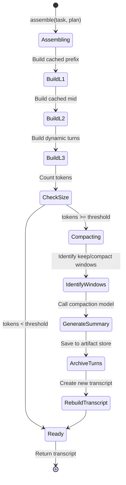

# Context Engine System Design

## High-Level Design

The Context Engine is designed as a **stateless transformation pipeline** that converts session state into LLM-consumable transcripts. It follows these core principles:

1. **Immutability**: Every operation produces a new transcript; never mutates existing state
2. **Composability**: Layers are independent; can be swapped or extended without affecting others
3. **Observability**: Every transformation emits traces for debugging and cost tracking
4. **Graceful degradation**: Failures fall back to safe defaults rather than crashing

## Core Abstractions

### Transcript

The central data structure representing the complete conversation state.

```python
@dataclass(frozen=True)
class Transcript:
    """Immutable conversation transcript with layer boundaries."""
    
    messages: Tuple[Message, ...]
    cache_breakpoints: Tuple[int, ...]  # Indices after which to cache
    metadata: TranscriptMetadata
    
    def count_tokens(self, model: str) -> int:
        """Count tokens using model-specific tokenizer."""
        return sum(msg.count_tokens(model) for msg in self.messages)
    
    def with_message(self, message: Message) -> 'Transcript':
        """Return new transcript with message appended."""
        return Transcript(
            messages=self.messages + (message,),
            cache_breakpoints=self.cache_breakpoints,
            metadata=self.metadata.increment_turn(),
        )
    
    def slice_layer(self, layer: Layer) -> Tuple[Message, ...]:
        """Extract messages belonging to a specific layer."""
        return self.messages[layer.start_idx:layer.end_idx]
    
    @property
    def l1(self) -> Layer:
        """L1: Cached prefix layer."""
        return Layer(0, self.cache_breakpoints[0] + 1, "L1_prefix")
    
    @property
    def l2(self) -> Layer:
        """L2: Cached mid layer."""
        return Layer(
            self.cache_breakpoints[0] + 1,
            self.cache_breakpoints[1] + 1,
            "L2_mid"
        )
    
    @property
    def l3(self) -> Layer:
        """L3: Dynamic turns layer."""
        return Layer(
            self.cache_breakpoints[1] + 1,
            len(self.messages),
            "L3_dynamic"
        )
```

### Message

Individual conversation turns with role and content.

```python
@dataclass(frozen=True)
class Message:
    """Single message in a conversation."""
    
    role: Literal["system", "user", "assistant"]
    content: str | List[ContentBlock]
    metadata: MessageMetadata = field(default_factory=MessageMetadata)
    cache_control: Optional[Dict[str, str]] = None
    
    @staticmethod
    def system(content: str, **metadata) -> 'Message':
        """Create system message."""
        return Message(
            role="system",
            content=content,
            metadata=MessageMetadata(**metadata),
        )
    
    @staticmethod
    def user(content: str) -> 'Message':
        """Create user message."""
        return Message(role="user", content=content)
    
    @staticmethod
    def assistant(content: str, tool_calls: List[ToolCall] = None) -> 'Message':
        """Create assistant message with optional tool calls."""
        blocks = [TextBlock(content)]
        if tool_calls:
            blocks.extend(ToolCallBlock(tc) for tc in tool_calls)
        return Message(role="assistant", content=blocks)
    
    def count_tokens(self, model: str) -> int:
        """Count tokens in this message."""
        encoder = get_encoder(model)
        return len(encoder.encode(self.render_for_model()))
```

### Layer

Represents a contiguous section of the transcript with defined boundaries.

```python
@dataclass(frozen=True)
class Layer:
    """A contiguous layer of messages in the transcript."""
    
    start_idx: int
    end_idx: int
    name: str
    
    @property
    def size(self) -> int:
        """Number of messages in this layer."""
        return self.end_idx - self.start_idx
    
    def overlaps(self, other: 'Layer') -> bool:
        """Check if this layer overlaps with another."""
        return not (self.end_idx <= other.start_idx or 
                   self.start_idx >= other.end_idx)
```

## API Contracts

### ContextEngine Interface

Main entry point for context operations.

```python
class ContextEngine(Protocol):
    """Protocol defining the context engine interface."""
    
    def assemble(self, task: str, plan: Optional[Plan]) -> Transcript:
        """Assemble a complete transcript from session state.
        
        Args:
            task: The current user task
            plan: Optional plan for this session
            
        Returns:
            Complete transcript with all layers assembled
            
        Raises:
            AssemblyError: If assembly fails
        """
        ...
    
    def should_compact(self, transcript: Transcript) -> bool:
        """Check if transcript needs compaction.
        
        Args:
            transcript: Current transcript
            
        Returns:
            True if compaction is recommended
        """
        ...
    
    def compact(self, transcript: Transcript) -> Transcript:
        """Compact transcript to reduce token count.
        
        Args:
            transcript: Transcript to compact
            
        Returns:
            New transcript with older turns summarized
            
        Raises:
            CompactionError: If compaction fails
        """
        ...
    
    def reduce(self, tool_result: ToolResult) -> Observation:
        """Reduce tool result to observation suitable for transcript.
        
        Args:
            tool_result: Raw tool execution result
            
        Returns:
            Reduced observation with artifact references
        """
        ...
```

### Compactor Interface

Handles context compaction logic.

```python
class Compactor(Protocol):
    """Protocol for compaction strategies."""
    
    def compact(
        self,
        transcript: Transcript,
        config: CompactionConfig,
    ) -> CompactionResult:
        """Compact a transcript according to config.
        
        Args:
            transcript: Transcript to compact
            config: Compaction configuration
            
        Returns:
            CompactionResult with new transcript and metadata
        """
        ...
    
    def identify_windows(
        self,
        transcript: Transcript,
        config: CompactionConfig,
    ) -> Tuple[Window, Window]:
        """Identify keep and compact windows.
        
        Args:
            transcript: Transcript to analyze
            config: Compaction configuration
            
        Returns:
            (keep_window, compact_window) tuple
        """
        ...

@dataclass
class CompactionResult:
    """Result of a compaction operation."""
    
    transcript: Transcript
    tokens_before: int
    tokens_after: int
    summary_artifact_hash: str
    duration_ms: float
    
    @property
    def compression_ratio(self) -> float:
        """Ratio of tokens saved."""
        return 1.0 - (self.tokens_after / self.tokens_before)
```

### Reducer Interface

Handles observation reduction for different tools.

```python
class ObservationReducer(Protocol):
    """Protocol for tool-specific observation reduction."""
    
    def reduce(self, result: ToolResult) -> Observation:
        """Reduce tool result to observation.
        
        Args:
            result: Raw tool result
            
        Returns:
            Reduced observation
        """
        ...
    
    def should_reduce(self, result: ToolResult) -> bool:
        """Check if result needs reduction.
        
        Args:
            result: Tool result to check
            
        Returns:
            True if reduction is needed
        """
        ...

@dataclass
class Observation:
    """Reduced form of a tool result suitable for transcripts."""
    
    text: str
    artifact_ref: Optional[str] = None
    metadata: Dict[str, Any] = field(default_factory=dict)
    
    def render(self) -> str:
        """Render observation for transcript."""
        parts = [self.text]
        if self.artifact_ref:
            parts.append(f"\n[Full content: view {self.artifact_ref}]")
        return "".join(parts)
```

## State Management

The Context Engine is **stateless** - all state lives in the Session object.

```python
@dataclass
class Session:
    """Session state container."""
    
    id: str
    user_id: str
    project_root: Path
    provider: Provider
    model: str
    
    # Persistent state
    soul: SOUL
    plan: Optional[Plan]
    history: ConversationHistory
    artifacts: ArtifactStore
    memory: MemoryInterface
    
    # Ephemeral state
    current_critique: Optional[Critique] = None
    active_skills: Set[str] = field(default_factory=set)
    
    def system_prompt(self) -> str:
        """Build system prompt from configuration."""
        return render_template(
            "system_prompt.j2",
            agent_name=self.config.agent_name,
            version=lyra.__version__,
            permission_mode=self.config.permission_mode,
        )
    
    def recent_turns(self, limit: int = 50) -> List[Message]:
        """Retrieve recent turns from history."""
        return self.history.tail(limit)
```

### State Transitions



## Error Handling

### Error Hierarchy

```python
class ContextEngineError(Exception):
    """Base exception for context engine errors."""
    pass

class AssemblyError(ContextEngineError):
    """Raised when transcript assembly fails."""
    pass

class CompactionError(ContextEngineError):
    """Raised when compaction fails."""
    
    def __init__(self, message: str, transcript: Transcript):
        super().__init__(message)
        self.transcript = transcript  # Preserve state

class ReductionError(ContextEngineError):
    """Raised when observation reduction fails."""
    pass

class CacheMissError(ContextEngineError):
    """Raised when expected cache hit doesn't occur."""
    pass
```

### Error Handling Strategy

```python
def assemble_with_fallback(
    session: Session,
    task: str,
    plan: Optional[Plan],
) -> Transcript:
    """Assemble transcript with graceful degradation."""
    
    try:
        # Normal path
        return ContextEngine(session).assemble(task, plan)
        
    except AssemblyError as e:
        # Log error and try minimal assembly
        logger.error(f"Assembly failed: {e}", exc_info=True)
        span.record_exception(e)
        
        # Minimal assembly: L1 + L3 only
        return assemble_minimal(session, task)

def compact_with_fallback(
    transcript: Transcript,
    compactor: Compactor,
) -> Transcript:
    """Compact with fallback to truncation."""
    
    try:
        # Normal path
        result = compactor.compact(transcript, config)
        return result.transcript
        
    except CompactionError as e:
        # Log and fall back to truncation
        logger.warning(f"Compaction failed, truncating: {e}")
        span.record_exception(e)
        
        # Drop middle third
        return truncate_middle(transcript)

def truncate_middle(transcript: Transcript) -> Transcript:
    """Emergency fallback: drop middle third of L3."""
    l3_messages = transcript.slice_layer(transcript.l3)
    keep_count = len(l3_messages) // 3
    
    # Keep first and last third
    truncated = l3_messages[:keep_count] + l3_messages[-keep_count:]
    
    # Add annotation
    annotation = Message.system(
        "[compaction-truncated: middle third removed due to compaction failure]"
    )
    
    return Transcript(
        messages=transcript.l1.messages + transcript.l2.messages + 
                (annotation,) + truncated,
        cache_breakpoints=transcript.cache_breakpoints,
        metadata=transcript.metadata.mark_truncated(),
    )
```

## Scalability Considerations

### Horizontal Scaling

Context Engine operations are stateless and can be parallelized:

```python
# Parallel reduction of multiple tool results
async def reduce_parallel(
    results: List[ToolResult],
    reducer: ObservationReducer,
) -> List[Observation]:
    """Reduce multiple results in parallel."""
    tasks = [
        asyncio.create_task(reducer.reduce_async(result))
        for result in results
    ]
    return await asyncio.gather(*tasks)
```

### Vertical Scaling

Memory usage scales linearly with transcript size:

```python
# Memory profile for typical session

# L1 (system prompt + tools): ~12 KB
# L2 (SOUL + plan + skills): ~8 KB  
# L3 (50 turns × 1 KB avg): ~50 KB
# Total in-memory: ~70 KB per session

# After compaction:
# L1 + L2: ~20 KB (unchanged)
# L4 (summary): ~10 KB
# L3 (10 recent turns): ~10 KB
# Total: ~40 KB per session (43% reduction)
```

### Token Budget Management

```python
@dataclass
class TokenBudget:
    """Manages token allocation across layers."""
    
    max_tokens: int
    
    # Fixed allocations
    l1_reserved: int = 12_000
    l2_reserved: int = 8_000
    
    @property
    def l3_available(self) -> int:
        """Tokens available for L3 dynamic content."""
        return self.max_tokens - self.l1_reserved - self.l2_reserved
    
    @property
    def compaction_threshold(self) -> int:
        """Token count at which to trigger compaction."""
        return int(self.max_tokens * 0.85)
    
    def check_budget(self, transcript: Transcript) -> BudgetStatus:
        """Check transcript against budget."""
        current = transcript.count_tokens(self.model)
        
        if current < self.compaction_threshold:
            return BudgetStatus.OK
        elif current < self.max_tokens:
            return BudgetStatus.COMPACT_RECOMMENDED
        else:
            return BudgetStatus.OVER_BUDGET
```

### Artifact Storage Scaling

```python
class ArtifactStore:
    """Hash-addressed content store with automatic cleanup."""
    
    def __init__(self, session: Session):
        self.base_path = session.project_root / ".lyra" / "artifacts"
        self.max_size = 1_000_000_000  # 1 GB per session
        self.max_age = timedelta(days=7)
    
    def save(self, content: str | bytes) -> str:
        """Save content and return hash reference."""
        content_hash = self._hash(content)
        path = self.base_path / content_hash[:2] / content_hash
        
        # Write atomically
        path.parent.mkdir(parents=True, exist_ok=True)
        with atomic_write(path) as f:
            f.write(content)
        
        # Schedule cleanup if over quota
        if self._total_size() > self.max_size:
            asyncio.create_task(self._cleanup_old_artifacts())
        
        return content_hash
    
    async def _cleanup_old_artifacts(self):
        """Remove artifacts older than max_age."""
        cutoff = datetime.now() - self.max_age
        
        for artifact_path in self.base_path.rglob("*"):
            if artifact_path.stat().st_mtime < cutoff.timestamp():
                artifact_path.unlink()
```

## Concurrency Model

Context Engine operations are designed for concurrent access:

```python
class ThreadSafeContextEngine:
    """Context engine with thread-safe operations."""
    
    def __init__(self, session: Session):
        self._session = session
        self._lock = threading.RLock()
        self._assembler = ContextAssembler(session)
        self._compactor = Compactor(session)
    
    def assemble(self, task: str, plan: Optional[Plan]) -> Transcript:
        """Thread-safe assembly."""
        with self._lock:
            return self._assembler.assemble(task, plan)
    
    def compact(self, transcript: Transcript) -> Transcript:
        """Thread-safe compaction."""
        with self._lock:
            return self._compactor.compact(transcript)
```

## Performance Budgets

| Operation | Target Latency | P95 Latency | P99 Latency |
|-----------|---------------|-------------|-------------|
| Assembly (cold) | 10ms | 20ms | 40ms |
| Assembly (warm) | 3ms | 8ms | 15ms |
| Compaction | 800ms | 1500ms | 3000ms |
| Reduction | 5ms | 15ms | 30ms |
| Token counting | 2ms | 5ms | 10ms |

## Testing Strategy

### Unit Tests

```python
def test_transcript_immutability():
    """Verify transcript operations are immutable."""
    t1 = Transcript(messages=(msg1, msg2))
    t2 = t1.with_message(msg3)
    
    assert len(t1.messages) == 2
    assert len(t2.messages) == 3
    assert t1 is not t2

def test_compaction_preserves_invariants():
    """Verify compaction preserves critical information."""
    transcript = build_test_transcript_with_denial()
    compacted = compactor.compact(transcript)
    
    # Permission denial must be preserved
    assert "permission denied" in compacted.render()
    
    # File anchors must be preserved
    assert "src/auth.py:42" in compacted.render()
```

### Integration Tests

```python
async def test_long_session_stays_under_budget():
    """Verify long sessions respect token budget."""
    engine = ContextEngine(session)
    transcript = engine.assemble("Initial task", plan)
    
    # Simulate 100 turns
    for i in range(100):
        transcript = transcript.with_message(
            Message.assistant(f"Response {i}")
        )
        
        if engine.should_compact(transcript):
            transcript = engine.compact(transcript)
        
        # Must never exceed max_tokens
        assert transcript.count_tokens() < session.max_tokens
```

## References

- [Architecture Overview](./architecture.md)
- [Architecture Tradeoffs](./architecture-tradeoffs.md)
- [Block 06: Context Engine Spec](../06-context-engine.md)
