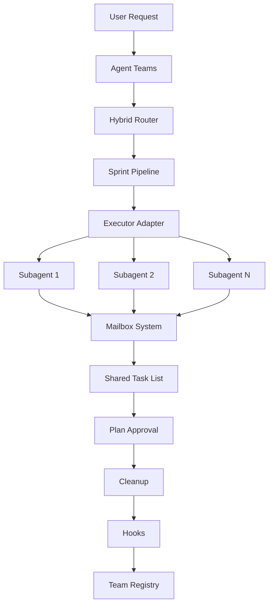
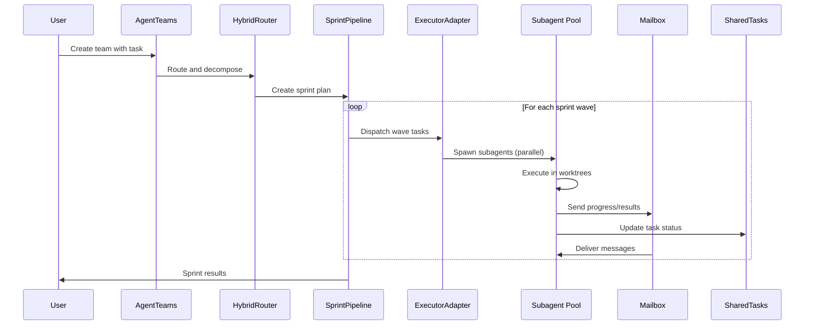

# DAG Teams Architecture

## Overview

DAG Teams is Lyra's team orchestration subsystem that coordinates multi-agent workflows. It implements agent team management, hybrid routing, sprint pipelines, shared task coordination, and mailbox-based inter-agent communication. The actual implementation uses `sprint_pipeline`, `hybrid_router`, `agent_teams`, and related files -- not the fictional DAG planner architecture described in earlier documentation versions.

**Source**: `packages/lyra-core/src/lyra_core/teams/` (11 files)

## System Components



## Module Structure

```
packages/lyra-core/src/lyra_core/teams/
├── __init__.py              # Public API exports
├── agent_teams.py           # Core agent team management
├── registry.py              # Team/agent registry
├── hooks.py                 # Team lifecycle hooks
├── mailbox.py               # Inter-agent message passing
├── shared_tasks.py          # Shared/coordinated task list
├── sprint_pipeline.py       # Sprint-based execution pipeline
├── hybrid_router.py         # Hybrid routing (LLM + deterministic)
├── plan_approval.py         # Plan approval workflow
├── cleanup.py               # Team cleanup and teardown
└── executor_adapter.py      # Subagent executor adapter
```

## Core Components

### 1. Agent Teams (`agent_teams.py`)

Core team management:
- Team creation and lifecycle
- Agent spawning within teams
- Team-scoped state management
- Inter-agent coordination

### 2. Hybrid Router (`hybrid_router.py`)

Hybrid routing combines LLM-based planning with deterministic scheduling:
- Task decomposition and assignment
- Workload distribution across agents
- Fallback routing strategies
- Load balancing

### 3. Sprint Pipeline (`sprint_pipeline.py`)

Sprint-based execution model:
- Sprint planning and scoping
- Parallel wave execution
- Per-sprint verification gates
- Retrospective analysis

### 4. Mailbox (`mailbox.py`)

Inter-agent communication:
- Message passing between agents
- Priority queue for messages
- Delivery confirmation
- Thread-based message grouping

### 5. Shared Tasks (`shared_tasks.py`)

Coordinated task management:
- Shared task board across team
- Task claiming and assignment
- Dependency tracking
- Completion status tracking

### 6. Plan Approval (`plan_approval.py`)

Plan review and approval:
- Plan submission and review
- Multi-stage approval flow
- Feedback and iteration
- Auto-approval with confidence thresholds

### 7. Registry (`registry.py`)

Agent and team registration:
- Team type registration
- Agent capability declaration
- Team/agent discovery
- Runtime lifecycle tracking

### 8. Hooks (`hooks.py`)

Team lifecycle event hooks:
- Team creation/teardown events
- Agent spawn/completion events
- LifecycleBus integration via `LifecycleEvent.TEAM_CREATE`, `TEAM_SPAWN`, etc.

### 9. Executor Adapter (`executor_adapter.py`)

Adapter between team orchestration and subagent execution:
- Converts team task assignments to subagent specs
- Manages worktree allocation delegation
- Handles result collection and aggregation

### 10. Cleanup (`cleanup.py`)

Team teardown and resource cleanup:
- Worktree removal
- Branch cleanup
- State reconciliation
- Metric finalization

## Data Flow

### Team Execution Flow



## LifecycleBus Integration

Team events are emitted via the `LifecycleBus` from `lyra_core/hooks/lifecycle.py`:

| Event | When |
|-------|------|
| `TEAM_CREATE` | Team initialized |
| `TEAM_SPAWN` | Agent spawned in team |
| `TEAM_TASK_CREATED` | Task assigned |
| `TEAM_TASK_COMPLETED` | Task finished |
| `TEAM_TASK_FAILED` | Task failed |
| `TEAM_TEAMMATE_IDLE` | Agent available for work |
| `TEAM_SHUTDOWN` | Team torn down |

## Technology Stack

| Component | Technology | Rationale |
|-----------|-----------|-----------|
| Core logic | Python 3.11+ | Type safety, dataclasses |
| Agent routing | Hybrid (LLM + deterministic) | Flexible, cost-aware |
| Communication | Mailbox pattern | Decoupled, async |
| Task tracking | Shared task list | Coordinated, visible |
| Lifecycle | LifecycleBus events | Observable, hookable |
| Isolation | Subagent worktree | Scoped execution |

## Related Documentation

- [Block 01: Agent Loop](../agent-loop/architecture.md)
- [Block 10: Subagent Worktree](../subagent-worktree/architecture.md)
- [Block 11: Verifier](../verifier/architecture.md)
- [Architecture Tradeoffs](./architecture-tradeoffs.md)
- [System Design](./system-design.md)
- [Implementation Guide](./implementation-guide.md)
- [Deep Dive](./deep-dive.md)
