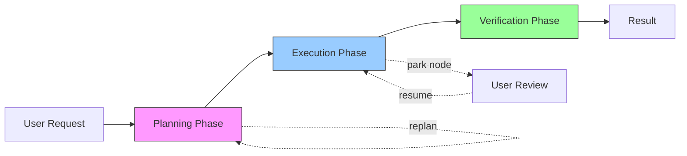
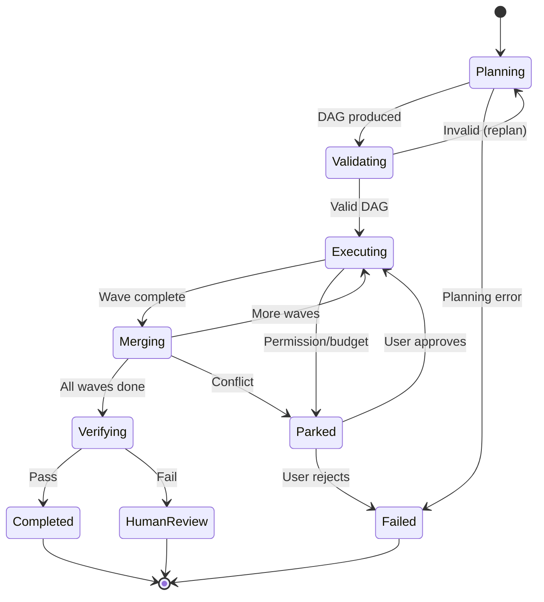

# DAG Teams System Design

## High-Level Design

DAG Teams implements a **producer-consumer pipeline** with three major phases:

1. **Planning Phase** (LLM Producer): Decomposes task → DAG
2. **Execution Phase** (Deterministic Consumer): Schedules waves → dispatches subagents
3. **Verification Phase** (Validator): Tests merged results → reports status



## Core Abstractions

### TaskDAG

**Purpose**: Immutable representation of decomposed work.

```python
@dataclass(frozen=True)
class TaskNode:
    id: str                          # Unique node identifier
    kind: NodeKind                    # localize|edit|test_gen|review|refactor|migrate
    description: str                  # Human-readable purpose
    scope_files: List[str]           # Glob patterns for file access
    depends_on: List[str]            # Node IDs this depends on
    estimated_cost_usd: float        # Planner's budget estimate
    metadata: Dict[str, Any]         # Extensible properties
    
@dataclass(frozen=True)
class TaskDAG:
    nodes: List[TaskNode]
    session_id: str
    created_at: datetime
    planner_version: str
    
    @property
    def node_map(self) -> Dict[str, TaskNode]:
        return {node.id: node for node in self.nodes}
    
    def topological_sort(self) -> List[TaskNode]:
        """Kahn's algorithm for dependency ordering."""
        in_degree = {n.id: 0 for n in self.nodes}
        for node in self.nodes:
            for dep in node.depends_on:
                in_degree[dep] += 1
        
        queue = [n for n in self.nodes if in_degree[n.id] == 0]
        result = []
        
        while queue:
            node = queue.pop(0)
            result.append(node)
            
            for other in self.nodes:
                if node.id in other.depends_on:
                    in_degree[other.id] -= 1
                    if in_degree[other.id] == 0:
                        queue.append(other)
        
        if len(result) != len(self.nodes):
            raise CyclicDAGError("DAG contains cycle")
        
        return result
```

**Invariants**:
- `id` is unique across all nodes
- All `depends_on` references resolve to existing nodes
- No cycles exist
- `scope_files` are disjoint for nodes in same wave

---

### Wave

**Purpose**: Group of nodes that can execute in parallel.

```python
@dataclass
class Wave:
    id: int                          # Wave number (0-indexed)
    nodes: List[TaskNode]           # Nodes in this wave
    status: WaveStatus              # pending|running|completed|failed
    started_at: Optional[datetime]
    completed_at: Optional[datetime]
    
    def can_start(self, completed_nodes: Set[str]) -> bool:
        """Check if all dependencies satisfied."""
        for node in self.nodes:
            if not all(dep in completed_nodes for dep in node.depends_on):
                return False
        return True
    
    def max_parallelism(self) -> int:
        """Number of nodes that can run concurrently."""
        return min(len(self.nodes), MAX_PARALLEL_WIDTH)

@dataclass
class ExecutionPlan:
    dag: TaskDAG
    waves: List[Wave]
    total_estimated_cost: float
    expected_duration_seconds: float
    
    @classmethod
    def from_dag(cls, dag: TaskDAG) -> 'ExecutionPlan':
        """Partition DAG into waves using topological sort."""
        sorted_nodes = dag.topological_sort()
        waves = []
        completed = set()
        
        while sorted_nodes:
            # Find nodes with all deps in completed
            ready = [n for n in sorted_nodes 
                     if all(d in completed for d in n.depends_on)]
            
            waves.append(Wave(
                id=len(waves),
                nodes=ready,
                status=WaveStatus.PENDING
            ))
            
            completed.update(n.id for n in ready)
            sorted_nodes = [n for n in sorted_nodes if n not in ready]
        
        return cls(
            dag=dag,
            waves=waves,
            total_estimated_cost=sum(n.estimated_cost_usd for n in dag.nodes),
            expected_duration_seconds=estimate_duration(waves)
        )
```

---

### SubagentContext

**Purpose**: Encapsulate isolated execution environment for a node.

```python
@dataclass
class SubagentContext:
    node: TaskNode
    worktree_path: Path
    branch_name: str
    budgets: Budgets
    allowed_tools: List[str]
    parent_session: Session
    
    def __enter__(self):
        """Create worktree, checkout branch."""
        subprocess.run([
            "git", "worktree", "add",
            str(self.worktree_path), "-b", self.branch_name
        ], check=True)
        return self
    
    def __exit__(self, exc_type, exc_val, exc_tb):
        """Cleanup worktree on exit."""
        subprocess.run([
            "git", "worktree", "remove", str(self.worktree_path), "--force"
        ])

@dataclass
class SubagentResult:
    node_id: str
    status: NodeStatus              # success|failure|parked
    commit_hash: Optional[str]
    files_touched: List[str]
    cost_usd: float
    duration_seconds: float
    summary: str
    error: Optional[str]
    
    # Test results
    tests_added: int
    tests_passing: int
    tests_failing: int
    
    # Observability
    trace_id: str
    log_path: Path
```

---

## API Contracts

### Planner Interface

```python
class Planner(Protocol):
    def decompose(
        self,
        request: str,
        repo_context: RepoContext,
        session: Session
    ) -> TaskDAG:
        """
        Decompose user request into a task DAG.
        
        Args:
            request: Natural language task description
            repo_context: File tree, CLAUDE.md, recent changes
            session: Session constraints (budget, tools)
        
        Returns:
            TaskDAG with explicit dependencies
        
        Raises:
            PlanningError: If request is too vague
            BudgetExceededError: If estimated cost > session budget
        """
        ...
```

**Planner Prompt Template**:
```
You are a task decomposition expert. Given a coding request, produce a JSON task DAG.

Request: {request}

Repository context:
- Files: {file_tree}
- Tech stack: {detected_languages}
- Recent changes: {git_log}

Requirements:
1. Break into 3-12 nodes (prefer fewer if possible)
2. Each node: id, kind, description, scope_files, depends_on, estimated_cost_usd
3. Node kinds: localize, edit, test_gen, review, refactor, migrate
4. Maximize parallelism: only declare dependencies that are NECESSARY
5. Scope files: specific as possible (e.g., src/auth/*.ts not src/**)
6. Estimate cost conservatively (better to over-estimate)

Output format: {JSON_SCHEMA}
```

---

### Scheduler Interface

```python
class Scheduler(Protocol):
    def partition(self, dag: TaskDAG) -> ExecutionPlan:
        """
        Partition DAG into waves for parallel execution.
        
        Pure function: same DAG → same ExecutionPlan.
        """
        ...
    
    def should_park(self, node: TaskNode, error: Exception) -> bool:
        """
        Decide if failed node should be parked for user review.
        
        Park triggers:
        - PermissionError (write to forbidden file)
        - BudgetExceededError (node over budget)
        - UserInteractionRequired (ambiguous instruction)
        """
        ...
```

---

### Dispatcher Interface

```python
class Dispatcher(Protocol):
    async def dispatch_wave(
        self,
        wave: Wave,
        session: Session
    ) -> List[SubagentResult]:
        """
        Spawn subagents for all nodes in wave, run in parallel.
        
        Returns when all subagents complete (success or failure).
        """
        ...
    
    async def dispatch_node(
        self,
        node: TaskNode,
        session: Session
    ) -> SubagentResult:
        """
        Execute single node in isolated worktree.
        
        Steps:
        1. Create SubagentContext (worktree, branch)
        2. Initialize Subagent with scoped tools
        3. Run agent loop
        4. Collect result (commit, tests, cost)
        5. Cleanup worktree
        """
        ...
```

**Dispatch Implementation**:
```python
async def dispatch_wave(self, wave: Wave, session: Session):
    tasks = []
    for node in wave.nodes:
        task = asyncio.create_task(self.dispatch_node(node, session))
        tasks.append(task)
    
    # Wait for all nodes in wave
    results = await asyncio.gather(*tasks, return_exceptions=True)
    
    # Handle failures
    for result in results:
        if isinstance(result, Exception):
            self.handle_node_failure(result)
    
    return [r for r in results if isinstance(r, SubagentResult)]
```

---

### Merger Interface

```python
class MergeCoordinator(Protocol):
    def merge_wave(
        self,
        wave: Wave,
        results: List[SubagentResult],
        session: Session
    ) -> MergeResult:
        """
        Merge all successful node results onto session branch.
        
        Strategy:
        1. Sort results by node declaration order
        2. Attempt fast-forward merge for each
        3. On conflict, try 3-way auto-merge
        4. If still conflicts, park and surface to user
        
        Returns:
            MergeResult with status and conflict details
        """
        ...
    
    def resolve_conflict(
        self,
        base: str,
        ours: str,
        theirs: str
    ) -> Optional[str]:
        """
        Attempt automatic 3-way merge.
        
        Returns merged content or None if unresolvable.
        """
        ...
```

**Merge Result**:
```python
@dataclass
class MergeResult:
    status: MergeStatus              # clean|conflicts|failed
    merged_nodes: List[str]         # Node IDs successfully merged
    conflicts: List[ConflictDetail]
    
@dataclass
class ConflictDetail:
    file_path: str
    node_a: str                      # Node ID
    node_b: str
    conflict_markers: str            # Git conflict markers
    auto_resolvable: bool
```

---

## State Management

### Session State Machine



**State Persistence**:
```python
@dataclass
class DAGTeamsState:
    session_id: str
    status: SessionStatus
    dag: TaskDAG
    plan: ExecutionPlan
    completed_waves: List[int]
    parked_nodes: List[str]
    current_wave: Optional[int]
    
    def save(self, path: Path):
        """Persist state to disk (JSON)."""
        with open(path, 'w') as f:
            json.dump(asdict(self), f, indent=2)
    
    @classmethod
    def load(cls, path: Path) -> 'DAGTeamsState':
        """Restore state from disk."""
        with open(path) as f:
            return cls(**json.load(f))
```

**State Directory**:
```
.lyra/state/dag-teams/
├── {session_id}/
│   ├── state.json              # Current state
│   ├── dag.json                # Original DAG
│   ├── plan.json               # Execution plan
│   ├── waves/
│   │   ├── 0.json              # Wave 0 results
│   │   ├── 1.json
│   │   └── 2.json
│   └── conflicts/
│       ├── conflict-1.diff     # Parked conflicts
│       └── conflict-2.diff
```

---

## Error Handling

### Error Taxonomy

```python
class DAGTeamsError(Exception):
    """Base exception for DAG Teams."""
    pass

class PlanningError(DAGTeamsError):
    """Planner failed to produce valid DAG."""
    pass

class ValidationError(DAGTeamsError):
    """DAG validation failed."""
    pass

class CyclicDAGError(ValidationError):
    """DAG contains cycle."""
    pass

class ScopeConflictError(ValidationError):
    """Same-wave nodes have overlapping write scopes."""
    pass

class NodeExecutionError(DAGTeamsError):
    """Subagent execution failed."""
    node_id: str
    retry_count: int
    
class MergeConflictError(DAGTeamsError):
    """Automatic merge failed."""
    conflicts: List[ConflictDetail]
```

### Retry Policy

```python
@dataclass
class RetryConfig:
    max_attempts: int = 3
    backoff_multiplier: float = 2.0
    vary_seed: bool = True

async def execute_with_retry(
    node: TaskNode,
    config: RetryConfig
) -> SubagentResult:
    last_error = None
    
    for attempt in range(config.max_attempts):
        try:
            seed = hash(f"{node.id}-{attempt}") if config.vary_seed else None
            result = await execute_node(node, seed=seed)
            
            if result.status == NodeStatus.SUCCESS:
                return result
                
        except Exception as e:
            last_error = e
            if attempt < config.max_attempts - 1:
                await asyncio.sleep(config.backoff_multiplier ** attempt)
    
    raise NodeExecutionError(
        f"Node {node.id} failed after {config.max_attempts} attempts",
        node_id=node.id,
        retry_count=config.max_attempts
    ) from last_error
```

### Cascading Failure Handling

```python
def handle_node_failure(
    failed_node: TaskNode,
    dag: TaskDAG,
    plan: ExecutionPlan
):
    """Mark downstream nodes as blocked."""
    blocked = set()
    
    def mark_downstream(node_id: str):
        for node in dag.nodes:
            if node_id in node.depends_on and node.id not in blocked:
                blocked.add(node.id)
                mark_downstream(node.id)
    
    mark_downstream(failed_node.id)
    
    # Update plan: skip blocked nodes in future waves
    for wave in plan.waves:
        wave.nodes = [n for n in wave.nodes if n.id not in blocked]
```

---

## Scalability Considerations

### Horizontal Scaling

**Current**: Single-machine, multi-process (8 concurrent subagents)

**Future**: Distributed execution
- **Coordinator** (single): Plans, schedules, merges
- **Worker pool** (N): Execute nodes
- **Communication**: gRPC for node dispatch, results
- **State**: Shared Redis for coordination

**Challenges**:
- Git worktree must be on coordinator's filesystem
- Merge requires local git operations
- Network cost for large diffs

---

### Budget Management

```python
@dataclass
class BudgetTracker:
    session_budget: float
    allocated: Dict[str, float]      # node_id → allocated budget
    consumed: Dict[str, float]       # node_id → actual cost
    
    def allocate_node(self, node: TaskNode) -> bool:
        """Reserve budget for node (1.5× estimate)."""
        amount = node.estimated_cost_usd * 1.5
        remaining = self.session_budget - sum(self.allocated.values())
        
        if amount > remaining:
            return False
        
        self.allocated[node.id] = amount
        return True
    
    def record_actual(self, node_id: str, cost: float):
        """Record actual cost after execution."""
        self.consumed[node_id] = cost
        
        # Release unused allocation
        over_allocated = self.allocated[node_id] - cost
        if over_allocated > 0:
            self.allocated[node_id] = cost
    
    @property
    def remaining(self) -> float:
        return self.session_budget - sum(self.consumed.values())
```

---

## References

- [architecture.md](architecture.md) - Component details
- [architecture-tradeoffs.md](architecture-tradeoffs.md) - Design decisions
- [11-verifier-cross-channel.md](../11-verifier-cross-channel.md) - Verification
