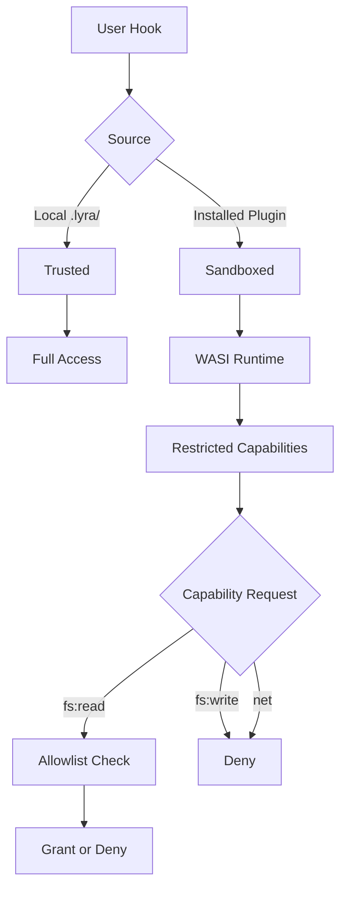

# Hooks and TDD Gate — Architecture Tradeoffs

## Overview

This document explains the key architectural decisions for the Hooks and TDD Gate system, the alternatives considered, and the rationale behind each choice. Every tradeoff involves performance, maintainability, and user experience dimensions.

## Decision 1: Code-Based Hooks vs Prompt-Based Guardrails

### Choice: Code-Based Hooks

**Rationale**: Determinism and reliability trump flexibility. Prompt-based guardrails ("please run tests before editing") are fragile, model-dependent, and invisible in traces.

### Alternatives Considered

| Alternative | Pros | Cons | Why Rejected |
|------------|------|------|--------------|
| **Prompt Engineering** | Easy to implement, no code | Non-deterministic, model-dependent, untraceable | Cannot guarantee enforcement |
| **LLM-as-Judge** | Flexible, adapts to context | Slow (extra inference), expensive, unreliable | TDD gate must be fast and certain |
| **Hybrid (prompts + code)** | Best of both worlds? | Complex, unclear responsibility | Adds confusion, fails gracefully becomes fails silently |

### Implications

- **Performance**: Code hooks add <50ms overhead per tool call
- **Cost**: Zero additional inference cost (vs LLM-as-judge which doubles calls)
- **Maintenance**: Requires Python changes to add hooks, but changes are versioned and testable
- **User Experience**: Users get immediate, actionable feedback with exact file:line errors

**Verdict**: The determinism and observability wins justify the rigidity. User hooks provide escape hatch for custom logic.

---

## Decision 2: Synchronous vs Asynchronous Hook Execution

### Choice: Async by Default, Timeout-Protected

**Rationale**: Hooks may need to run external processes (tests, linters). Blocking the agent loop is unacceptable, but fully async requires complex orchestration.

### Alternatives Considered

| Alternative | Pros | Cons | Why Rejected |
|------------|------|------|--------------|
| **Fully Synchronous** | Simple implementation, predictable | Blocks loop, slow hooks stall agent | Unacceptable UX for 30s test runs |
| **Fully Asynchronous** | Non-blocking, fast response | Complex state management, may miss results | Hard to compose multiple hooks |
| **Fire-and-Forget** | Never blocks | Cannot enforce gates (e.g., TDD) | Defeats the purpose of hooks |

### Implementation

```python
async def _execute_with_timeout(
    self,
    hook_entry: HookEntry,
    context: HookContext,
    timeout: float,
) -> HookDecision:
    """
    Execute hook with timeout.
    
    - If hook completes < timeout: return result
    - If hook exceeds timeout: cancel, return warn decision
    - If hook is sync callable: run in thread pool
    """
    try:
        if asyncio.iscoroutinefunction(hook_entry.callable):
            result = await asyncio.wait_for(
                hook_entry.callable(context),
                timeout=timeout,
            )
        else:
            # Run sync hook in thread pool to avoid blocking event loop
            result = await asyncio.wait_for(
                asyncio.to_thread(hook_entry.callable, context),
                timeout=timeout,
            )
        return result
    except asyncio.TimeoutError:
        return HookDecision.warn(
            hook_entry.name,
            f"Hook exceeded timeout of {timeout}s"
        )
```

### Implications

- **Performance**: Thread pool overhead ~1-5ms per sync hook, acceptable
- **Cost**: No additional cost
- **Maintenance**: Requires careful timeout tuning per hook type
- **User Experience**: Fast feedback, no hangs

**Verdict**: Async with timeout is the sweet spot. Allows expensive operations (tests) without stalling the loop.

---

## Decision 3: Hook Composition Strategy

### Choice: Any Block Wins, Annotations Concatenate

**Rationale**: Safety-first. If any hook says "stop", we stop. But we still want to see all feedback.

### Alternatives Considered

| Alternative | Pros | Cons | Why Rejected |
|------------|------|------|--------------|
| **First Block Wins** | Simple, deterministic | Hides feedback from later hooks | User misses valuable context |
| **Majority Vote** | Democratic, reduces false positives | Complex, non-obvious to user | What if 2 block, 2 allow? |
| **Priority Override** | High-priority hook decides | Clear hierarchy | Single hook can override security checks |
| **All Must Allow** | Safest | Redundant for independent checks | Same as "any block wins" |

### Implementation

```python
def _compose_results(self, results: list[HookDecision]) -> ComposedDecision:
    """
    Compose multiple hook results into single decision.
    
    Rules:
    1. If any result has block=True, composed result blocks
    2. Primary reason comes from first blocking hook
    3. All annotations concatenate in order
    4. Severity is max of all severities
    """
    blocked = any(r.block for r in results)
    primary_reason = next((r.reason for r in results if r.block), "")
    
    annotations = [
        f"[{r.name}] {r.annotation}"
        for r in results
        if r.annotation
    ]
    
    severity = max(
        (r.severity for r in results),
        key=lambda s: {"info": 0, "warn": 1, "error": 2, "block": 3}[s]
    )
    
    return ComposedDecision(
        block=blocked,
        reason=primary_reason,
        annotations="\n".join(annotations),
        severity=severity,
    )
```

### Implications

- **Performance**: Linear composition, O(n) in number of hooks
- **Cost**: No additional cost
- **Maintenance**: Simple to understand and debug
- **User Experience**: User sees all feedback, clear why action blocked

**Verdict**: Any-block-wins is the right safety posture. Concatenated annotations provide full context.

---

## Decision 4: TDD Gate Enforcement Level

### Choice: Block PRE, Annotate POST, Block STOP

**Rationale**: Balance enforcement with flexibility. Don't let agents bypass RED-GREEN, but allow experimentation during GREEN.

### Alternatives Considered

| Alternative | Pros | Cons | Why Rejected |
|------------|------|------|--------------|
| **Block All Phases** | Strongest enforcement | Frustrating when tests flaky | Too rigid, hurts exploration |
| **Warn Only** | Flexible, non-blocking | Agents ignore warnings | Defeats purpose of TDD gate |
| **User-Configurable** | Flexible per project | Complex, inconsistent | TDD is non-negotiable in Lyra |
| **POST Block on Failure** | Prevents bad commits | Blocks legitimate refactors | GREEN phase needs flexibility |

### Enforcement Matrix

| Phase | Hook Event | Enforcement | Rationale |
|-------|-----------|-------------|-----------|
| **RED** | PRE_TOOL_USE | **BLOCK** | Must write failing test first |
| **GREEN** | POST_TOOL_USE | **ANNOTATE** | Show test results, but allow progress |
| **REFACTOR** | POST_TOOL_USE | **ANNOTATE** | Same as GREEN |
| **ACCEPTANCE** | STOP | **BLOCK** | All tests must pass before completion |

### Implications

- **Performance**: PRE check is fast (<10ms), POST runs tests (1-30s), STOP runs full suite (1-5min)
- **Cost**: Test execution is local, zero API cost
- **Maintenance**: Clear contract, easy to explain
- **User Experience**: Firm boundaries (RED, STOP) with flexibility in between (GREEN)

**Verdict**: This three-level enforcement balances discipline with pragmatism.

---

## Decision 5: Test Runner Integration

### Choice: Plugin Architecture, Project-Detected

**Rationale**: Support multiple test frameworks (pytest, jest, go test) without hardcoding. Detect from project structure.

### Alternatives Considered

| Alternative | Pros | Cons | Why Rejected |
|------------|------|------|--------------|
| **Pytest Only** | Simple, most Python projects use it | Excludes Go, JS, Rust | Lyra is polyglot |
| **User Configuration** | Explicit, flexible | Requires setup, error-prone | Friction for new users |
| **Universal Test Protocol** | Framework-agnostic | Requires adapter for each framework | More complex than plugins |

### Implementation

```python
class TestRunner(ABC):
    @abstractmethod
    async def run_tests(
        self,
        test_files: list[Path],
        timeout: float,
    ) -> TestResult:
        """Run specified test files."""
        ...
    
    @abstractmethod
    async def run_all_tests(self, timeout: float) -> TestResult:
        """Run full test suite."""
        ...

class PytestRunner(TestRunner):
    async def run_tests(self, test_files: list[Path], timeout: float) -> TestResult:
        cmd = ["pytest", "-v", *test_files]
        result = await asyncio.wait_for(
            self._run_subprocess(cmd),
            timeout=timeout,
        )
        return self._parse_pytest_output(result.stdout)

# Auto-detection
def detect_test_runner(project_root: Path) -> TestRunner:
    if (project_root / "pytest.ini").exists():
        return PytestRunner(project_root)
    elif (project_root / "jest.config.js").exists():
        return JestRunner(project_root)
    elif (project_root / "go.mod").exists():
        return GoTestRunner(project_root)
    else:
        raise ValueError("No test framework detected")
```

### Implications

- **Performance**: Plugin dispatch adds <1ms overhead
- **Cost**: Zero
- **Maintenance**: New framework = new plugin class, clear interface
- **User Experience**: Zero-config for common frameworks

**Verdict**: Plugin architecture scales to polyglot projects. Auto-detection provides great UX.

---

## Decision 6: Coverage Delta vs Absolute Coverage

### Choice: Delta-Based (Coverage Cannot Regress)

**Rationale**: Absolute coverage targets (e.g., "must be 80%") are arbitrary and context-dependent. Delta-based (no regression) is universal.

### Alternatives Considered

| Alternative | Pros | Cons | Why Rejected |
|------------|------|------|--------------|
| **Absolute Target (80%)** | Clear goal | Arbitrary, penalizes legacy code | Blocks work on low-coverage projects |
| **Per-File Target** | Granular | Complex, hard to configure | Maintenance burden |
| **No Coverage Check** | Simple | Coverage can decay | Defeats TDD purpose |
| **Ratchet (always increase)** | Strongest enforcement | Too strict for refactors | May block valid changes |

### Implementation

```python
async def check_coverage_delta(self, session: Session) -> tuple[float, bool]:
    """
    Check coverage delta against baseline.
    
    Returns:
        (delta_percent, passed)
    
    Rules:
    - Delta >= 0: pass
    - Delta < 0: fail
    - No baseline: establish new baseline, pass
    """
    baseline_path = session.project_root / ".lyra" / "coverage_baseline.json"
    
    if not baseline_path.exists():
        # First run, establish baseline
        current = await self._measure_coverage()
        await self._save_baseline(current)
        return (0.0, True)
    
    baseline = await self._load_baseline()
    current = await self._measure_coverage()
    delta = current.percent - baseline.percent
    
    return (delta, delta >= 0)
```

### Implications

- **Performance**: Coverage measurement adds 10-60s to STOP gate
- **Cost**: Local computation, zero API cost
- **Maintenance**: Simple rule, no configuration needed
- **User Experience**: Fair, encourages incremental improvement

**Verdict**: Delta-based coverage is fair, universal, and incentivizes test-writing without blocking progress.

---

## Decision 7: User Hook Sandboxing

### Choice: V1 Trust, V2 Sandbox

**Rationale**: Ship fast with trusted user hooks, then add sandboxing when adoption grows.

### Alternatives Considered

| Alternative | Pros | Cons | Why Rejected (for v1) |
|------------|------|------|----------------------|
| **Always Sandbox** | Secure | Complex, slows launch | Premature optimization |
| **Never Sandbox** | Simple | Insecure for shared systems | Untenable long-term |
| **Sandbox Based on Source** | Flexible | Complex policy | Hard to explain |

### V2 Sandbox Design (Future)



### Implications

- **Performance**: V1 no overhead, V2 adds ~5-10ms per hook for sandbox setup
- **Cost**: V2 requires WASI runtime dependency (~10MB binary)
- **Maintenance**: V2 adds capability management layer
- **User Experience**: V1 simple, V2 secure

**Verdict**: Ship v1 without sandboxing for speed. V2 sandboxing enables safe plugin marketplace.

---

## Decision 8: Hook Priority Scheme

### Choice: Numeric Priority, Lower Runs First

**Rationale**: Simple, explicit, familiar (like CSS z-index). Built-ins reserve 0-99, user hooks default 100+.

### Alternatives Considered

| Alternative | Pros | Cons | Why Rejected |
|------------|------|------|--------------|
| **Named Priority (high/med/low)** | Readable | Only 3-4 levels, ties frequent | Insufficient granularity |
| **Dependency Graph** | Explicit dependencies | Complex, can have cycles | Overengineered for v1 |
| **Registration Order** | Implicit, simple | Fragile, hard to reason | Non-deterministic across imports |

### Reserved Ranges

| Range | Reserved For | Example |
|-------|-------------|---------|
| 0-9 | Critical safety (destructive patterns) | priority=0 |
| 10-19 | Quality gates (TDD) | priority=10 |
| 20-39 | Security (secrets, injection) | priority=20, 30 |
| 40-59 | Code quality (format, lint, typecheck) | priority=40, 45, 50 |
| 60-99 | Observability, non-blocking | priority=60+ |
| 100+ | User hooks | default=100 |

### Implications

- **Performance**: Sorting by priority is O(n log n) but n is small (<100)
- **Cost**: Zero
- **Maintenance**: Clear, stable contract
- **User Experience**: Explicit control when needed

**Verdict**: Numeric priority is simple and sufficient.

---

## Decision 9: Hook Timeout Strategy

### Choice: Per-Hook Timeout, Warn on Timeout (Don't Block)

**Rationale**: Prevent hangs, but don't let a slow hook become a denial-of-service that blocks all work.

### Alternatives Considered

| Alternative | Pros | Cons | Why Rejected |
|------------|------|------|--------------|
| **Block on Timeout** | Safe | Single slow hook stops work | Too draconian |
| **Retry on Timeout** | Graceful | May hang repeatedly | Wastes time |
| **No Timeout** | Simple | Hooks can hang indefinitely | Unacceptable |

### Timeout Defaults

| Hook Type | Default Timeout | Rationale |
|-----------|----------------|-----------|
| Python (sync) | 10s | Should be fast checks |
| Python (async) | 30s | May call external services |
| Shell | 30s | May run linters, formatters |
| Test Runner | 300s (5min) | Full suite can be slow |

### Implications

- **Performance**: Timeout enforcement adds ~100μs overhead (asyncio.wait_for)
- **Cost**: Zero
- **Maintenance**: Timeouts are tunable per hook
- **User Experience**: No hangs, clear feedback

**Verdict**: Per-hook timeouts with warn-on-timeout is the safest default.

---

## Decision 10: TDD RED Proof Detection

### Choice: Heuristic Analysis of Transcript

**Rationale**: Parse recent transcript for test execution + failure. Fast, local, no LLM call.

### Alternatives Considered

| Alternative | Pros | Cons | Why Rejected |
|------------|------|------|--------------|
| **LLM Analysis** | Flexible, context-aware | Slow, expensive, non-deterministic | Defeats "hooks are code" principle |
| **Explicit Annotation** | Deterministic | Requires agent cooperation | Agents may forget to annotate |
| **File Watcher** | Real-time | Complex, state management | Overengineered |

### Detection Algorithm

```python
def find_failing_test_for_file(
    recent_actions: list[Action],
    file_path: Path,
) -> Optional[FailingTest]:
    """
    Search recent actions for test execution that:
    1. Ran a test related to file_path
    2. Test failed (exit code != 0 or "FAILED" in output)
    3. Occurred within last 50 actions or 5 minutes
    """
    test_file = infer_test_file(file_path)
    
    for action in reversed(recent_actions):
        if action.tool_name == "Bash" and is_test_command(action.args["command"]):
            output = action.result.get("output", "")
            
            # Check if test file was mentioned
            if str(test_file) in action.args["command"]:
                # Check for failure indicators
                if action.result.get("exit_code") != 0:
                    return FailingTest(
                        command=action.args["command"],
                        output=output,
                        timestamp=action.timestamp,
                    )
                if "FAILED" in output or "ERROR" in output:
                    return FailingTest(
                        command=action.args["command"],
                        output=output,
                        timestamp=action.timestamp,
                    )
    
    return None
```

### Implications

- **Performance**: Transcript scan is O(n) where n ≤ 50, typically <5ms
- **Cost**: Zero
- **Maintenance**: Requires test framework detection patterns
- **User Experience**: Transparent, no extra steps

**Verdict**: Heuristic detection is fast and reliable for the RED gate.

---

## Summary Matrix

| Decision | Choice | Key Tradeoff | Performance | Maintenance | UX |
|----------|--------|--------------|-------------|-------------|-----|
| Hook Type | Code-based | Determinism vs Flexibility | ✅ Fast | ⚠️ Requires code changes | ✅ Clear feedback |
| Execution | Async + Timeout | Responsiveness vs Complexity | ✅ Non-blocking | ⚠️ Timeout tuning | ✅ No hangs |
| Composition | Any Block Wins | Safety vs False Positives | ✅ O(n) | ✅ Simple | ✅ Full context |
| TDD Enforcement | Block PRE/STOP | Strictness vs Flexibility | ⚠️ STOP is slow | ✅ Clear rules | ✅ Balanced |
| Test Runner | Plugin | Flexibility vs Complexity | ✅ Fast dispatch | ⚠️ Per-framework plugins | ✅ Zero config |
| Coverage | Delta | Universal vs Absolute | ⚠️ Slow to measure | ✅ No config | ✅ Fair |
| Sandboxing | V1 Trust, V2 Sandbox | Security vs Speed | ✅ V1 zero overhead | ⚠️ V2 complex | ✅ V1 simple |
| Priority | Numeric | Granularity vs Simplicity | ✅ Fast sort | ✅ Stable | ✅ Explicit |
| Timeout | Per-Hook Warn | Safety vs Availability | ✅ Fast | ✅ Tunable | ✅ No DOS |
| RED Detection | Heuristic | Speed vs Accuracy | ✅ <5ms | ⚠️ Framework patterns | ✅ Transparent |

## Future Considerations

### Post-V1 Decisions

1. **Hook Marketplace**: Allow community-contributed hooks as plugins
2. **Cross-Session Hooks**: Rhythmic hooks ("started 5th session today")
3. **ML-Enhanced Detection**: Use small models to improve RED proof detection
4. **Distributed Hooks**: Run expensive hooks on worker nodes
5. **Hook Analytics**: Recommend priority changes based on usage patterns

### Open Research Questions

1. **Optimal timeout values**: Can we learn per-project optimal timeouts?
2. **Hook conflict resolution**: When two hooks block for conflicting reasons, how to surface best?
3. **Incremental test running**: Can we run only changed tests in GREEN phase?
4. **Coverage targets**: Should Lyra learn per-file coverage baselines?
