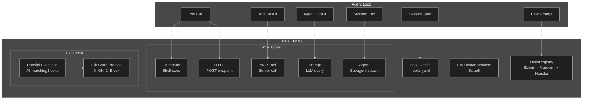
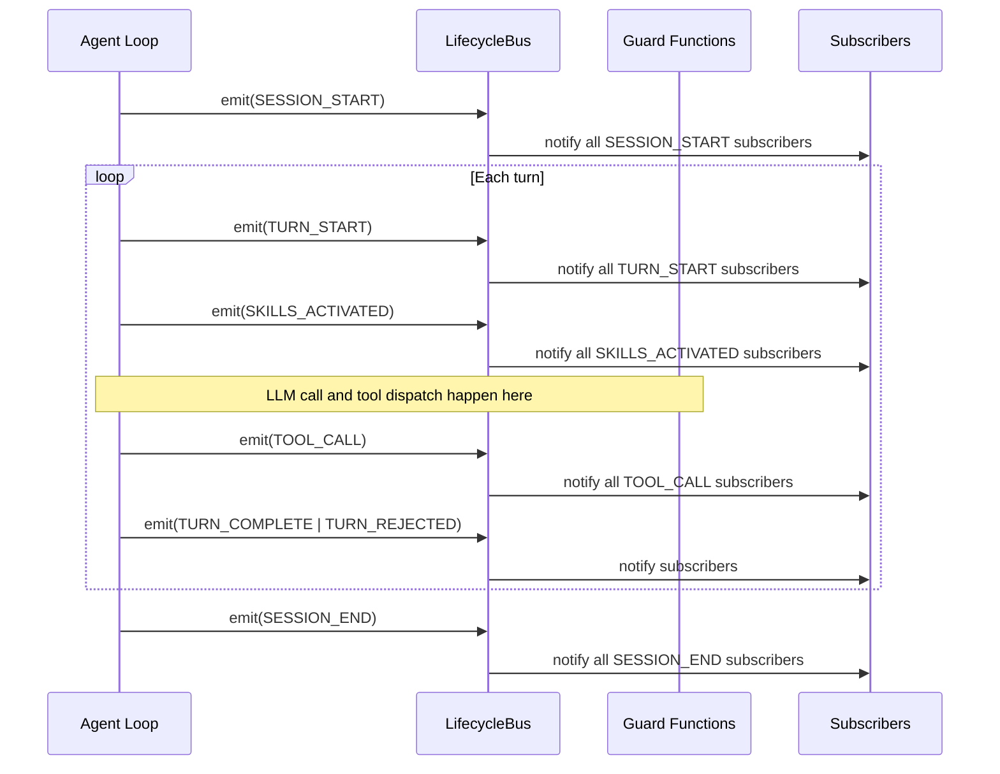

# Hooks and TDD Gate -- Architecture

## Overview

The Hooks system provides lifecycle event hooks and quality gate enforcement in the Lyra agent loop. The actual implementation uses a `LifecycleBus` pub/sub pattern (in `lifecycle.py`) and standalone guard functions (`destructive_pattern.py`, `secrets_scan.py`, `tdd_gate.py`) rather than the fictional HookRegistry/HookDispatcher/decorator-based system described in earlier documentation.

**Source**: `packages/lyra-core/src/lyra_core/hooks/` (6 files; actual module is `lyra-hooks`)

## Module Structure

```
packages/lyra-core/src/lyra_core/hooks/
├── __init__.py              # Public API
├── lifecycle.py             # LifecycleBus, LifecycleEvent enum
├── destructive_pattern.py   # destructive_pattern_hook guard function
├── secrets_scan.py          # secrets_scan_hook guard function
├── tdd_gate.py              # TDD gate (Phase 1 stub)
└── user_hooks.py            # User-defined hook loading
```

**Note**: There are only 6 files in the actual hooks module. The documented 20+ files (registry.py, dispatcher.py, models.py, composition.py, timeout.py, injection.py, format.py, lint.py, typecheck.py, loop_detector.py, stop_verifier.py, user/loader.py, user/sandbox.py) do NOT exist.

## Extended Event Catalog (25+ Lifecycle Events)

The current LifecycleBus supports ~19 events. The proposed extended catalog supports 25+ lifecycle events across three cadences:

```python
class HookEvent(str, Enum):
    # === Session Lifecycle ===
    SESSION_START = "SessionStart"           # Agent session begins
    SESSION_END = "SessionEnd"               # Agent session ends

    # === Turn Lifecycle ===
    USER_PROMPT_SUBMIT = "UserPromptSubmit"  # User submitted a prompt
    STOP = "Stop"                            # Agent produced final output
    STOP_FAILURE = "StopFailure"             # Agent failed to produce output

    # === Tool Call Lifecycle ===
    PRE_TOOL_USE = "PreToolUse"              # Before tool is called
    POST_TOOL_USE = "PostToolUse"            # After tool returns
    POST_TOOL_USE_FAILURE = "PostToolUseFailure"  # Tool call failed

    # === Agent/Subagent Lifecycle ===
    PRE_AGENT = "PreAgent"                   # Before spawning subagent
    POST_AGENT = "PostAgent"                 # After subagent returns
    POST_AGENT_FAILURE = "PostAgentFailure"  # Subagent failed

    # === Permission Lifecycle ===
    PERMISSION_REQUEST = "PermissionRequest" # Before asking user
    PERMISSION_DENIED = "PermissionDenied"   # After permission denied
    PERMISSION_GRANTED = "PermissionGranted" # After permission granted

    # === Streaming Lifecycle ===
    STREAM_START = "StreamStart"             # Model response stream begins
    STREAM_CHUNK = "StreamChunk"             # Each chunk from stream
    STREAM_END = "StreamEnd"                 # Stream completed

    # === Memory Lifecycle ===
    MEMORY_WRITE = "MemoryWrite"             # Before memory store write
    MEMORY_READ = "MemoryRead"               # After memory retrieval
    MEMORY_CONSOLIDATION = "MemoryConsolidation"  # Consolidation phase

    # === Error/Exception ===
    AGENT_ERROR = "AgentError"               # Unhandled agent exception
    PROVIDER_ERROR = "ProviderError"         # Provider API error (rate limit, auth)
    TOOL_ERROR = "ToolError"                 # Tool execution error

    # === Workflow Lifecycle ===
    WORKFLOW_START = "WorkflowStart"         # Workflow engine begins
    WORKFLOW_STEP = "WorkflowStep"           # Each step in workflow
    WORKFLOW_END = "WorkflowEnd"             # Workflow completes

    # === System ===
    SETTINGS_CHANGE = "SettingsChange"       # Hot-reload trigger
    HOOKS_CHANGE = "HooksChange"             # Hook config reloaded
```

**Design rationale:** The current 19 events cover sessions, turns, and teams but miss critical lifecycle points: user prompt submission, tool failures, permission decisions, streaming chunks, memory operations, errors, and workflow events. The extended catalog adds 8+ new events that are required for production observability and safety.

### Hook Configuration Format (Proposed)

Declarative hook configuration via `.lyra/hooks.yaml` with hot-reload support:

```yaml
hooks:
  # Security hook: scan Bash for dangerous patterns
  - event: PreToolUse
    matcher:
      pattern: "Bash"
    handler:
      type: command
      command: 'python3 .lyra/scripts/check_dangerous.py "$TOOL_NAME" "$ARGUMENTS"'
    timeout: 5s
    if: "tool.name == 'Bash' && args.command.contains('rm')"

  # Observability hook: trace to OTel
  - event: PostToolUse
    matcher:
      pattern: "Bash|Write|Edit"
    handler:
      type: http
      url: http://localhost:4318/v1/traces
      method: POST
      headers:
        Content-Type: application/json
    timeout: 1s

  # Safety: scan subagent task before spawn
  - event: PreAgent
    handler:
      type: prompt
      prompt: "Check if this subagent task is safe: {task_description}"
    timeout: 30s

  # Log session start via MCP
  - event: SessionStart
    handler:
      type: mcp_tool
      server: logging-server
      tool: log_session_start
      arguments:
        session_id: "${CLAUDE_SESSION_ID}"
    timeout: 10s

  # Verification: fact-check search results
  - event: PostToolUse
    matcher:
      pattern: "WebSearch"
    handler:
      type: agent
      agent_name: fact-checker
      task: "Verify these search results: {result}"
    timeout: 60s
```

**Five handler types:**

| Handler Type | Use Case | Timeout |
|-------------|----------|---------|
| `command` | Shell exec for security scanning | 600s |
| `http` | POST to OTel collector or webhook | 600s |
| `mcp_tool` | MCP server tool call | 600s |
| `prompt` | LLM-based verification | 30s |
| `agent` | Subagent spawn for complex tasks | 60s |

### Exit Code Protocol

Hooks communicate results via exit codes, modeled on Claude Code's protocol:

```
Exit Code Protocol:
0  = Success: stdout parsed for JSON output fields. Hook passed.
2  = Blocking: tool call is blocked, permission is denied, agent execution stops.
     The first hook returning exit code 2 wins (other hooks' output is discarded).
     Context: PreToolUse -> tool blocked; PermissionRequest -> permission denied.
Any other = Non-blocking error: hook failed but execution continues.
            Error is logged and execution proceeds.
```

### JSON Output Schema

Hooks can output structured JSON for fine-grained control:

```json
{
  "continue": true,
  "stopReason": "",
  "suppressOutput": false,
  "systemMessage": "Remember to check X before proceeding",
  "decision": "allow" | "deny" | "ask" | "defer",
  "permissionDecision": "allow" | "deny" | "ask" | "defer",
  "additionalContext": "...",
  "terminalSequence": "..."
}
```

### Extended Hook Engine

```python
class ExtendedHookEngine:
    """Extended hook engine supporting 25+ events, parallel execution, exit code protocol."""

    def __init__(self, config_path: str | None = None):
        self._hooks: dict[HookEvent, list[HookDef]] = defaultdict(list)
        self._config_path = config_path
        self._config_mtime: float = 0
        self._running: set[str] = set()

    async def load_config(self, path: str):
        """Load hook configuration from YAML file."""
        self._config_path = path

    async def watch_config(self):
        """Hot-reload: poll config file for changes every 5s."""
        while self._running:
            mtime = os.path.getmtime(self._config_path)
            if mtime > self._config_mtime:
                await self.load_config(self._config_path)
            await asyncio.sleep(5)

    async def fire(self, event: HookEvent, context: HookContext) -> HookResult:
        """Fire all hooks matching this event + matcher."""
        matching = self._get_matching_hooks(event, context)
        results = await asyncio.gather(
            *[self._execute(hook, context) for hook in matching],
            return_exceptions=True,
        )
        aggregated = HookResult(continue_=True)
        for hook, result in zip(matching, results):
            if isinstance(result, Exception):
                logger.error(f"Hook {hook.id} failed: {result}")
                if hook.critical:
                    aggregated.continue_ = False
                    aggregated.stop_reason = f"HookError: {result}"
                continue
            if result.exit_code == 2:
                aggregated.continue_ = False
                aggregated.blocking = True
                aggregated.stop_reason = result.output
                break
        return aggregated
```

### Path Placeholders

Hook configuration supports path and context placeholders:

```python
PLACEHOLDER_MAP = {
    "${CLAUDE_PROJECT_DIR}":    lambda ctx: ctx.project_dir,
    "${CLAUDE_SESSION_ID}":     lambda ctx: ctx.session_id,
    "${TOOL_NAME}":             lambda ctx: ctx.tool_call.name,
    "${TOOL_ARGUMENTS}":        lambda ctx: json.dumps(ctx.tool_call.arguments),
    "${AGENT_NAME}":            lambda ctx: ctx.agent_name,
    "${PROVIDER_ID}":           lambda ctx: ctx.provider_id,
    "${RESULT_TRUNCATED}":      lambda ctx: str(ctx.result.truncated),
    "${EXIT_CODE}":             lambda ctx: str(ctx.result.exit_code),
}
```

### Architecture Diagram



## Core Components

#### destructive_pattern_hook (`destructive_pattern.py`)

Blocks dangerous shell patterns (rm -rf /, git push --force to main, fork bombs, dd to /dev, DROP TABLE, etc.)

#### secrets_scan_hook (`secrets_scan.py`)

Detects and blocks hardcoded secrets (AWS keys, GitHub tokens, private keys, etc.)

### 3. TDD Gate (`tdd_gate.py`)

**Status: Phase 1 stub only.**

The TDD gate is implemented as a Phase 1 mechanism that blocks writes/edits to `src/**` when no RED proof is present. Phase 4 features (full RED-GREEN-REFACTOR enforcement, test runner integration, coverage analysis, STOP gate) are documented as future work.

```python
# Phase 1: Blocks src/** edits without RED proof
# Phase 4 (future): Full test runner integration and coverage enforcement
```

There is NO:
- Test runner integration in the TDD gate
- Coverage analysis in the TDD gate
- STOP gate for final acceptance
- Automated pytest execution from hooks

## Lifecycle Flow



## Guard Integration with PermissionStack

The guard functions (`destructive_pattern_hook`, `secrets_scan_hook`, `injection_guard`) are NOT registered via a decorator-based HookRegistry. Instead, they are composed into the `PermissionStack` as a tuple of (name, callable) pairs:

```python
_GUARDS_PRE: tuple[tuple[str, Any], ...] = (
    ("destructive", destructive_pattern_hook),
    ("secrets", secrets_scan_hook),
)
```

The injection guard is called separately, not as part of the tuple.

## Tech Stack

| Component | Technology | Rationale |
|-----------|-----------|-----------|
| Event system | `LifecycleBus` + typed Enum | Type-safe, tab-completable events |
| Guard functions | Standalone Python callables | Composable, testable, no registration needed |
| Pattern matching | `re` module (regex) | Fast, zero-dependency |
| Pub/sub | `defaultdict(list)` | Simple, no external deps |

## Key Differences from Earlier Documentation

| Claimed (Outdated) | Actual |
|-------------------|--------|
| HookRegistry class with decorator-based registration | LifecycleBus pub/sub with subscribe() |
| HookDispatcher class | No dispatcher class exists |
| HookDecision, HookEvent, HookContext models | LifecycleEvent enum, StackDecision |
| PRE_TOOL_USE, POST_TOOL_USE, STOP events | SESSION_START, TURN_START, SKILLS_ACTIVATED, TURN_COMPLETE, TOOL_CALL, SESSION_END, etc. |
| 20+ files in hooks directory | 6 files |
| WASI sandbox for user hooks | Not implemented |
| Full RED-GREEN-REFACTOR TDD enforcement | Phase 1 stub only |

## Related Documentation

- [Block 01: Agent Loop](../agent-loop/architecture.md)
- [Block 04: Permission Bridge](../permission-bridge/architecture.md)
- [Block 11: Verifier](../verifier/architecture.md)
- [Block 13: Observability](../observability/architecture.md)
- [Architecture Tradeoffs](./architecture-tradeoffs.md)
- [System Design](./system-design.md)
- [Implementation Guide](./implementation-guide.md)
