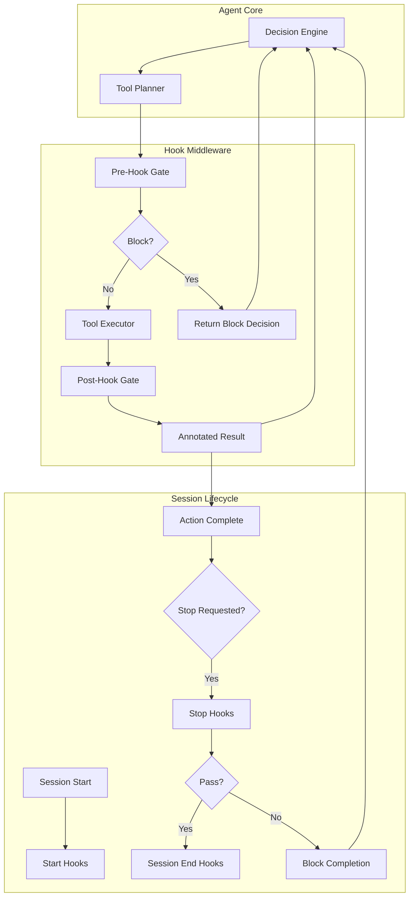

# Hooks and TDD Gate — System Design

## High-Level Design

The Hooks and TDD Gate system is a middleware layer between the agent loop and tool execution. It provides declarative, composable quality gates that enforce development discipline without prompt engineering.



## Core Abstractions

### 1. HookEvent (Lifecycle Enum)

Represents discrete points in the agent lifecycle where hooks can intervene.

```python
class HookEvent(StrEnum):
    """
    Lifecycle events where hooks can execute.
    
    Naming convention:
    - PRE_* events can block actions (return HookDecision.block)
    - POST_* events annotate results (blocking still allowed)
    - Lifecycle events (START, END, STOP) are observational or gates
    """
    
    # Session lifecycle
    SESSION_START = "session.start"      # Observe session init
    SESSION_END = "session.end"          # Observe session termination
    STOP = "stop"                        # Gate before completion
    
    # User interaction
    USER_PROMPT_SUBMIT = "user.prompt.submit"  # Observe/modify user input
    
    # Model interaction
    PRE_MODEL_CALL = "pre.model.call"    # Observe before LLM call
    POST_MODEL_CALL = "post.model.call"  # Observe after LLM call
    
    # Tool execution (most common)
    PRE_TOOL_USE = "pre.tool.use"        # Block unsafe tool calls
    POST_TOOL_USE = "post.tool.use"      # Annotate tool results
    
    # Permission system
    PRE_PERMISSION = "pre.permission"    # Advisory before permission check
    
    # Multi-agent
    SUBAGENT_START = "subagent.start"    # Observe subagent spawn
    SUBAGENT_END = "subagent.end"        # Observe subagent completion
    
    # System events
    NOTIFICATION = "notification"        # Trigger user notifications
    COMPACTION = "compaction"            # Observe/intervene in context compaction
```

**Design principle**: Events are **stable identifiers**. Adding new events is backward-compatible; removing events breaks hooks.

### 2. HookContext (Execution Context)

Immutable context passed to every hook, containing all information needed to make decisions.

```python
@dataclass(frozen=True)
class HookContext:
    """
    Immutable execution context for hooks.
    
    Contains everything a hook needs to make a decision:
    - What happened (event, tool call)
    - Where we are (session, file paths)
    - History (recent transcript)
    - Project info (test framework, languages)
    """
    
    # Core identity
    event: HookEvent
    session_id: str
    timestamp: datetime
    
    # Tool call (for PRE/POST_TOOL_USE)
    tool_call: Optional[ToolCall] = None
    tool_result: Optional[ToolResult] = None
    
    # Session state
    session: Session
    project_root: Path
    
    # History window (last N actions)
    recent_actions: list[Action] = field(default_factory=list)
    
    # Project metadata (cached)
    detected_languages: set[str] = field(default_factory=set)
    test_framework: Optional[str] = None
    
    def get_tool_arg(self, key: str, default: Any = None) -> Any:
        """Safe accessor for tool call arguments."""
        if not self.tool_call:
            return default
        return self.tool_call.args.get(key, default)
    
    def is_editing_source(self) -> bool:
        """Check if current tool call edits source code."""
        if self.tool_call and self.tool_call.name in {"Edit", "Write"}:
            path = self.get_tool_arg("file_path") or self.get_tool_arg("path")
            return path and is_source_file(Path(path))
        return False
```

**Design principle**: Context is **frozen** (immutable). Hooks cannot modify the context, only read it and return a decision.

### 3. HookDecision (Result Contract)

Structured result returned by hooks, composable across multiple hooks.

```python
@dataclass
class HookDecision:
    """
    Decision returned by a hook.
    
    Composition rules:
    - Any block=True causes composed result to block
    - Annotations concatenate in priority order
    - Severity is max across all hooks
    """
    
    # Core decision
    block: bool                          # If True on PRE events, prevents action
    name: str                            # Hook name (stable identifier)
    reason: str                          # Human-readable explanation
    
    # Feedback
    annotation: Optional[str] = None     # Appended to tool result
    suggestion: Optional[str] = None     # Advice for LLM
    
    # Metadata
    severity: Literal["info", "warn", "error", "block"] = "info"
    extra: dict[str, Any] = field(default_factory=dict)
    
    # Factory methods
    @classmethod
    def allow(cls, name: str, reason: str = "No issues") -> "HookDecision":
        return cls(block=False, name=name, reason=reason, severity="info")
    
    @classmethod
    def block_(
        cls,
        name: str,
        reason: str,
        suggestion: Optional[str] = None,
        **kwargs
    ) -> "HookDecision":
        return cls(
            block=True,
            name=name,
            reason=reason,
            suggestion=suggestion,
            severity="block",
            **kwargs
        )
    
    @classmethod
    def warn(
        cls,
        name: str,
        reason: str,
        annotation: Optional[str] = None,
    ) -> "HookDecision":
        return cls(
            block=False,
            name=name,
            reason=reason,
            annotation=annotation,
            severity="warn",
        )
```

**Design principle**: Decisions are **structured data**, not exceptions. This enables composition, tracing, and user feedback.

### 4. Hook (Callable Protocol)

The signature for all hook functions.

```python
class Hook(Protocol):
    """
    Protocol for hook callables.
    
    Hooks can be sync or async functions.
    They receive context and return a decision.
    """
    
    def __call__(self, context: HookContext) -> HookDecision:
        """Sync hook signature."""
        ...

class AsyncHook(Protocol):
    """Protocol for async hooks."""
    
    async def __call__(self, context: HookContext) -> HookDecision:
        """Async hook signature."""
        ...
```

**Design principle**: Hooks are **pure functions** of context. No side effects in decision logic (effects in `POST_TOOL_USE` are acceptable, e.g., formatting).

## API Contracts

### Registration API

```python
from lyra import Hook, HookEvent

@Hook.register(
    event: HookEvent,
    name: str,
    priority: int = 100,
    timeout_s: float = 10.0,
    side_effects: list[str] | None = None,
)
def my_hook(context: HookContext) -> HookDecision:
    """
    Register a hook for an event.
    
    Args:
        event: Lifecycle event to hook
        name: Stable identifier (kebab-case)
        priority: Execution order (lower runs first)
        timeout_s: Max execution time
        side_effects: Declared effects (e.g., ["fs", "network"])
    
    Returns:
        Decorator that registers the hook
    """
    ...
```

### Query API

```python
class HookRegistry:
    @classmethod
    def get_hooks(cls, event: HookEvent) -> list[HookEntry]:
        """Get all hooks for an event, sorted by priority."""
        ...
    
    @classmethod
    def list_all_hooks(cls) -> dict[HookEvent, list[HookEntry]]:
        """Get all registered hooks."""
        ...
    
    @classmethod
    def get_hook_by_name(cls, name: str) -> Optional[HookEntry]:
        """Lookup hook by name."""
        ...
```

### Execution API

```python
class HookDispatcher:
    async def dispatch(
        self,
        event: HookEvent,
        context: HookContext,
    ) -> ComposedDecision:
        """
        Execute all hooks for an event.
        
        Args:
            event: Lifecycle event
            context: Execution context
        
        Returns:
            Composed decision from all hooks
        
        Guarantees:
        - Hooks run in priority order
        - Timeouts enforced per hook
        - Errors caught and converted to warnings
        - All executions traced to HIR
        """
        ...
```

## State Management

### Session State

Hooks are **stateless** — they receive fresh context on every invocation. State lives in the `Session` object, accessible via `context.session`.

```python
class Session:
    """
    Session state accessible to hooks.
    
    Hooks read state but should not mutate it directly.
    Use session methods for state changes.
    """
    
    # Identity
    session_id: str
    project_root: Path
    
    # Transcript
    def get_recent_actions(self, n: int = 50) -> list[Action]:
        """Get last N actions from transcript."""
        ...
    
    # Test running
    def get_test_runner(self) -> TestRunner:
        """Get test runner for this project."""
        ...
    
    # Coverage
    def get_coverage_analyzer(self) -> CoverageAnalyzer:
        """Get coverage analyzer."""
        ...
    
    # Persistence
    async def load_baseline_coverage(self) -> Optional[Coverage]:
        """Load baseline coverage from .lyra/coverage_baseline.json."""
        ...
    
    async def save_baseline_coverage(self, coverage: Coverage) -> None:
        """Save baseline coverage."""
        ...
```

### Persistent State (TDD)

TDD gate maintains minimal persistent state:

```python
# .lyra/coverage_baseline.json
{
  "project_root": "/path/to/project",
  "timestamp": "2026-06-02T12:00:00Z",
  "coverage": {
    "total_statements": 1000,
    "covered_statements": 850,
    "percent": 85.0
  },
  "by_file": {
    "src/api/users.py": {
      "statements": 100,
      "covered": 90,
      "percent": 90.0
    }
  }
}
```

**Design principle**: Persistent state is **append-only** where possible. Coverage baselines never decrease, only update upward.

## Error Handling

### Hook Execution Errors

```python
async def _execute_with_timeout(
    self,
    hook_entry: HookEntry,
    context: HookContext,
    timeout: float,
) -> HookDecision:
    """
    Execute hook with comprehensive error handling.
    
    Error handling hierarchy:
    1. TimeoutError → warn decision
    2. HookError (raised by hook) → warn decision with hook's message
    3. Exception (unexpected) → error span, warn decision
    4. Success → return hook's decision
    """
    try:
        result = await asyncio.wait_for(
            self._call_hook(hook_entry, context),
            timeout=timeout,
        )
        return result
        
    except asyncio.TimeoutError:
        self.tracer.warn(
            "hook.timeout",
            hook=hook_entry.name,
            timeout=timeout,
        )
        return HookDecision.warn(
            hook_entry.name,
            f"Hook exceeded timeout of {timeout}s",
        )
        
    except HookError as e:
        # Hook explicitly raised an error
        self.tracer.warn(
            "hook.error",
            hook=hook_entry.name,
            error=str(e),
        )
        return HookDecision.warn(
            hook_entry.name,
            f"Hook error: {e}",
        )
        
    except Exception as e:
        # Unexpected error
        self.tracer.error(
            "hook.exception",
            hook=hook_entry.name,
            error=str(e),
            traceback=traceback.format_exc(),
        )
        return HookDecision.warn(
            hook_entry.name,
            f"Hook failed unexpectedly: {e}",
        )
```

**Design principle**: **No hook can crash the agent**. All errors convert to warnings, preserving system availability.

### Test Runner Errors

```python
class TestRunner:
    async def run_tests(
        self,
        test_files: list[Path],
        timeout: float,
    ) -> TestResult:
        """
        Run tests with error handling.
        
        Error scenarios:
        1. Test command not found → TestResult(error="pytest not found")
        2. Tests timeout → TestResult(error="timeout", timed_out=True)
        3. Tests crash → TestResult(error="crash", exit_code=-1)
        4. Tests pass/fail normally → TestResult with pass/fail counts
        """
        try:
            proc = await asyncio.create_subprocess_exec(
                *self.build_command(test_files),
                stdout=asyncio.subprocess.PIPE,
                stderr=asyncio.subprocess.PIPE,
                cwd=self.project_root,
            )
            
            stdout, stderr = await asyncio.wait_for(
                proc.communicate(),
                timeout=timeout,
            )
            
            return self.parse_output(stdout, stderr, proc.returncode)
            
        except FileNotFoundError:
            return TestResult(error="Test runner not found")
            
        except asyncio.TimeoutError:
            proc.kill()
            return TestResult(error="Tests timed out", timed_out=True)
            
        except Exception as e:
            return TestResult(error=f"Test execution failed: {e}")
```

**Design principle**: Test failures are **data**, not exceptions. Return structured results for hook analysis.

## Scalability

### Performance Targets

| Operation | Target Latency | Max Throughput |
|-----------|---------------|----------------|
| Hook dispatch (empty) | <1ms | 10,000 hooks/sec |
| Simple hook (secrets scan) | <10ms | 1,000 hooks/sec |
| Test runner (focused) | <30s | 2 tests/min/core |
| Test runner (full suite) | <5min | N/A (one-time) |
| Coverage analysis | <60s | N/A (one-time) |

### Concurrency Model

```python
class HookDispatcher:
    async def dispatch_concurrent(
        self,
        event: HookEvent,
        context: HookContext,
    ) -> ComposedDecision:
        """
        Execute hooks with concurrency optimization.
        
        Strategy:
        1. Group hooks by priority
        2. Within priority group, run independent hooks concurrently
        3. Wait for priority group to complete before next
        4. Early exit if any hook blocks (for PRE events)
        """
        hooks = self.registry.get_hooks(event)
        priority_groups = self._group_by_priority(hooks)
        
        results = []
        for priority, group in priority_groups:
            # Run hooks at same priority concurrently
            group_results = await asyncio.gather(
                *[
                    self._execute_with_timeout(hook, context, hook.timeout_s)
                    for hook in group
                ],
                return_exceptions=True,
            )
            
            results.extend(group_results)
            
            # Early exit on block for PRE events
            if event.is_pre_event() and any(r.block for r in results):
                break
        
        return self._compose_results(results)
```

**Design principle**: **Maximize parallelism** within priority boundaries. Hooks at the same priority can run concurrently if independent.

### Caching Strategy

```python
class TestResultCache:
    """
    Cache test results by file content hash.
    
    Invalidation:
    - Source file changes → invalidate tests for that file
    - Test file changes → invalidate all tests in that file
    - Dependency changes → invalidate all (conservative)
    """
    
    def __init__(self, cache_dir: Path):
        self.cache_dir = cache_dir
        self._cache: dict[str, TestResult] = 
    
    def cache_key(self, test_files: list[Path], source_files: list[Path]) -> str:
        """
        Generate cache key from file hashes.
        
        Key = hash(test_files_content + source_files_content)
        """
        hasher = hashlib.sha256()
        
        for f in sorted(test_files + source_files):
            if f.exists():
                hasher.update(f.read_bytes())
        
        return hasher.hexdigest()
    
    async def get(
        self,
        test_files: list[Path],
        source_files: list[Path],
    ) -> Optional[TestResult]:
        """Get cached test result if valid."""
        key = self.cache_key(test_files, source_files)
        return self._cache.get(key)
    
    async def set(
        self,
        test_files: list[Path],
        source_files: list[Path],
        result: TestResult,
    ) -> None:
        """Cache test result."""
        key = self.cache_key(test_files, source_files)
        self._cache[key] = result
```

**Design principle**: **Cache aggressively**, invalidate conservatively. False cache hits are unacceptable (stale tests passing).

## Integration Points

### 1. Agent Loop Integration

```python
class AgentLoop:
    def __init__(self, hook_dispatcher: HookDispatcher):
        self.hooks = hook_dispatcher
    
    async def execute_tool(self, tool_call: ToolCall) -> ToolResult:
        """
        Execute tool with pre/post hooks.
        """
        # PRE hook gate
        pre_context = HookContext(
            event=HookEvent.PRE_TOOL_USE,
            tool_call=tool_call,
            session=self.session,
            # ... other fields
        )
        
        pre_decision = await self.hooks.dispatch(
            HookEvent.PRE_TOOL_USE,
            pre_context,
        )
        
        if pre_decision.block:
            return ToolResult(
                success=False,
                error=pre_decision.reason,
                suggestion=pre_decision.suggestion,
            )
        
        # Execute tool
        result = await self.tool_executor.execute(tool_call)
        
        # POST hook gate
        post_context = HookContext(
            event=HookEvent.POST_TOOL_USE,
            tool_call=tool_call,
            tool_result=result,
            session=self.session,
            # ... other fields
        )
        
        post_decision = await self.hooks.dispatch(
            HookEvent.POST_TOOL_USE,
            post_context,
        )
        
        # Merge annotations into result
        if post_decision.annotation:
            result.annotation = (result.annotation or "") + "\n" + post_decision.annotation
        
        return result
```

### 2. Verifier Integration

```python
@Hook.register(HookEvent.STOP, name="stop-verifier", priority=5)
async def stop_verifier_hook(context: HookContext) -> HookDecision:
    """
    Coordinate with verifier for final gate.
    
    Ensures:
    1. Verifier Phase 1 passed (all tools succeeded)
    2. Verifier Phase 2 produced accept verdict
    3. Cross-channel agreement (main + verifier agree)
    """
    session = context.session
    verifier = session.get_verifier()
    
    # Check Phase 1
    phase1_passed = await verifier.check_phase1()
    if not phase1_passed:
        return HookDecision.block_(
            "stop-verifier",
            reason="Verifier Phase 1 failed (tool execution errors)",
            suggestion="Fix tool execution errors before completing",
        )
    
    # Check Phase 2
    phase2_verdict = await verifier.check_phase2()
    if phase2_verdict != "accept":
        return HookDecision.block_(
            "stop-verifier",
            reason=f"Verifier Phase 2 verdict: {phase2_verdict}",
            suggestion="Address verifier concerns before completing",
        )
    
    # Check cross-channel agreement
    agreement = await verifier.check_agreement()
    if not agreement:
        return HookDecision.block_(
            "stop-verifier",
            reason="Cross-channel disagreement detected",
            suggestion="Resolve discrepancy between main and verifier channels",
        )
    
    return HookDecision.allow("stop-verifier")
```

### 3. Observability Integration

Every hook execution emits structured traces:

```python
# HIR span emitted by dispatcher
{
    "span_type": "hook",
    "span_id": "01HQ...",
    "parent_span_id": "01HP...",
    "name": "tdd-gate-pre",
    "event": "pre.tool.use",
    "timestamp": "2026-06-02T12:00:00.123Z",
    "duration_ms": 8,
    "decision": {
        "block": true,
        "reason": "No failing test found",
        "severity": "block"
    },
    "tool_name": "Edit",
    "file_path": "src/api/users.py",
    "session_id": "session-123"
}
```

## Quality Attributes

### Reliability
- **No hook can crash the agent**: All errors caught and converted to warnings
- **Timeout enforcement**: No hook can hang indefinitely
- **Deterministic composition**: Same inputs produce same outputs

### Performance
- **Low latency**: <50ms overhead for typical hook execution
- **Scalability**: Supports 100+ hooks per event without degradation
- **Caching**: Test results cached by file hash

### Maintainability
- **Clear abstractions**: HookContext, HookDecision, Hook protocol
- **Stable contracts**: Adding events is backward-compatible
- **Type safety**: Full type annotations, checked with mypy

### Observability
- **Full tracing**: Every hook execution traced to HIR
- **Metrics**: Prometheus metrics for invocations, latency, errors
- **Debuggability**: Clear error messages with suggestions

### Security
- **Sandboxing (v2)**: Untrusted hooks run in WASI sandbox
- **Capability restriction**: Hooks declare side effects upfront
- **Audit trail**: All hook executions logged

## Extension Points

### Custom Hooks

Users can add custom hooks via:

1. **Python hooks** in `.lyra/user_hooks/`:

```python
# .lyra/user_hooks/my_check.py
from lyra import Hook, HookEvent, HookContext, HookDecision

@Hook.register(HookEvent.PRE_TOOL_USE, name="my-check", priority=150)
def my_custom_check(context: HookContext) -> HookDecision:
    # Custom logic
    return HookDecision.allow("my-check")
```

2. **Shell hooks** in `.lyra/hooks.yaml`:

```yaml
- name: custom-formatter
  event: post.tool.use
  run: scripts/format.sh
  match:
    tool: [Edit, Write]
    path_glob: "src/**/*.py"
  timeout_s: 10
  non_blocking: true
```

### Hook Plugins

v2 will support installable hook plugins:

```bash
lyra plugin install github:user/repo/hooks/security-pack
```

Plugin structure:
```
hooks/security-pack/
├── plugin.yaml          # Metadata
├── hooks/
│   ├── sql_injection.py
│   ├── xss_check.py
│   └── secrets.py
└── README.md
```

## Related Documents

- **[Architecture](architecture.md)**: Component structure
- **[Architecture Tradeoffs](architecture-tradeoffs.md)**: Design decisions
- **[Implementation Guide](implementation-guide.md)**: How to implement hooks
- **[Deep Dive](deep-dive.md)**: Advanced patterns and optimization
