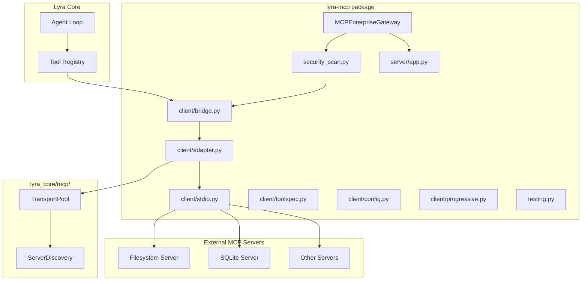
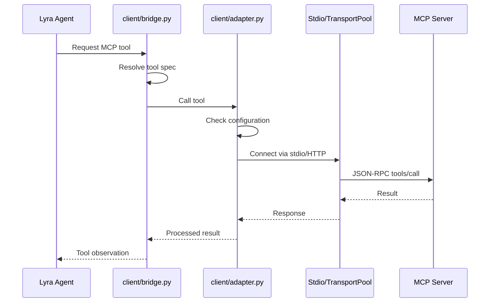

# MCP Adapter Architecture

## Overview

The MCP (Model Context Protocol) integration in Lyra provides bidirectional connectivity with external MCP servers. The actual implementation is distributed across two packages (`lyra-mcp` and `lyra-core/src/lyra_core/mcp/`), with transports, a gateway, security scanning, client bridging, and testing support.

**Source packages:**
- `packages/lyra-mcp/` -- Core MCP protocol stack (13 source files)
- `packages/lyra-core/src/lyra_core/mcp/` -- Server discovery and transport pool

## System Architecture



## Package Structure

### lyra-mcp (`packages/lyra-mcp/`)

```
lyra-mcp/
├── src/lyra_mcp/
│   ├── __init__.py           # Exports: MCPEnterpriseGateway, MCPSecurityScanner
│   ├── gateway.py            # Enterprise gateway (rate limiting, auth, policies)
│   ├── security_scan.py      # Security scanner, taint analyzer, vulnerability detector
│   ├── testing.py            # Test utilities for MCP servers
│   ├── client/
│   │   ├── __init__.py
│   │   ├── adapter.py        # Client adapter for MCP connection
│   │   ├── bridge.py         # Tool bridging between MCP and Lyra
│   │   ├── config.py         # MCP configuration management
│   │   ├── progressive.py    # Progressive disclosure support
│   │   ├── stdio.py          # Stdio transport client
│   │   └── toolspec.py       # Tool specification parsing
│   └── server/
│       ├── __init__.py
│       └── app.py            # MCP server app
└── tests/
    ├── test_mcp_adapter.py
    ├── test_mcp_config.py
    ├── test_mcp_progressive.py
    ├── test_mcp_server_exposed.py
    ├── test_mcp_stdio.py
    ├── test_mcp_toolspec.py
    └── test_mcp_trust_and_guard.py
```

### lyra_core MCP (`packages/lyra-core/src/lyra_core/mcp/`)

```
lyra_core/mcp/
├── __init__.py
├── server_discovery.py      # ServerDiscovery class
└── transport_pool.py        # TransportPool, TransportConfig, ConnectionInfo
```

## Core Components

### 1. MCPEnterpriseGateway (`gateway.py`)

The central gateway managing MCP server registrations, rate limiting, and policies:

```python
from lyra_mcp import MCPEnterpriseGateway, GatewayConfig, GatewayPolicy

@dataclass
class GatewayConfig:
    max_servers: int
    rate_limit: RateLimitState
    auth_method: AuthMethod

@dataclass
class ServerRegistration:
    name: str
    command: list[str]
    transport: str  # "stdio" | "http"
    trust_level: str

class MCPEnterpriseGateway:
    """Enterprise-grade MCP gateway with rate limiting and policy enforcement."""
```

### 2. Client Bridge (`client/bridge.py`)

Bridges MCP tools into Lyra's native tool registry:

```python
# Bridges external MCP tool definitions into
# Lyra-compatible tool specifications
```

### 3. Client Adapter (`client/adapter.py`)

Adapts MCP client connections for use with Lyra:
- Connection lifecycle management
- Transport abstraction
- Error handling and retry

### 4. Stdio Transport (`client/stdio.py`)

Stdio-based MCP transport using subprocess communication:

```python
# Manages MCP servers spawned as subprocesses
# communicating over stdin/stdout JSON-RPC
```

### 5. Progressive Disclosure (`client/progressive.py`)

Progressive tool exposure to minimize context bloat:
- Tier-based tool visibility
- On-demand tool discovery
- Hot/cold tool sets

### 6. Security Scanner (`security_scan.py`)

Security analysis for MCP servers:

```python
from lyra_mcp import MCPSecurityScanner, MCPTaintAnalyzer, MCPVulnerability

class MCPSecurityScanner:
    """Scans MCP servers for security vulnerabilities."""

class MCPTaintAnalyzer:
    """Analyzes MCP tool outputs for taint/trust issues."""

@dataclass
class MCPVulnerability:
    """Represents a discovered MCP security vulnerability."""
```

### 7. Server Discovery (`lyra_core/mcp/server_discovery.py`)

Discovers and registers available MCP servers:

```python
class ServerDiscovery:
    """Discovers MCP servers from configuration and runtime environment."""
```

### 8. Transport Pool (`lyra_core/mcp/transport_pool.py`)

Manages transport connections to MCP servers:

```python
@dataclass
class TransportConfig:
    command: list[str]
    env: dict[str, str]

@dataclass
class ConnectionInfo:
    server_name: str
    transport_type: str
    status: str

class TransportPool:
    """Pool of active MCP transport connections."""
```

### 9. Trust Management

Trust levels are managed via `MCPRegistry.trust()` / `MCPRegistry.untrust()` and the `trust_banner_for()` function -- NOT via a separate TrustManager class with elaborate trust levels.

### 10. Testing Support (`testing.py`)

Utilities for testing MCP server implementations.

## Data Flow



## Key Differences from Earlier Documentation

| Claimed (Outdated) | Actual |
|-------------------|--------|
| MCPAdapter class with list_tools/call_tool/list_resources | MCPEnterpriseGateway (gateway.py) -- different API surface |
| MCPServerConnection class with stdio/HTTP transport | TransportPool + Stdio transport -- distributed across packages |
| ToolBridge.bridge_mcp_tool() function | client/bridge.py -- different functions |
| TrustManager with 3 trust levels | MCPRegistry.trust()/untrust() + trust_banner_for() |
| ProgressiveDisclosureManager class | client/progressive.py -- different API |
| CacheManager with LRU cache | Not present in this module |
| 3 core files documented | 13+ source files across 2 packages |
| ~/.lyra/mcp.yaml config | client/config.py based configuration |

## Technology Stack

| Component | Technology | Rationale |
|-----------|-----------|-----------|
| Language | Python 3.11+ | Type safety |
| Transport | JSON-RPC 2.0 over stdio/HTTP | MCP standard |
| Process mgmt | `subprocess` with signal handling | Stdio servers |
| Security | Taint analysis, vulnerability scanning | Trust management |
| Testing | pytest | Full test suite (7 test files) |

## Related Documentation

- [Block 04: Permission Bridge](../permission-bridge/architecture.md)
- [Block 05: Hooks and TDD Gate](../hooks-tdd/architecture.md)
- [Block 13: Observability](../observability/architecture.md)
- [Architecture Tradeoffs](./architecture-tradeoffs.md)
- [System Design](./system-design.md)
- [Implementation Guide](./implementation-guide.md)
