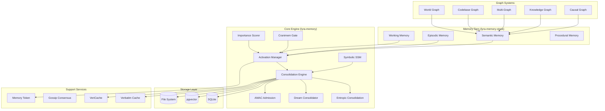
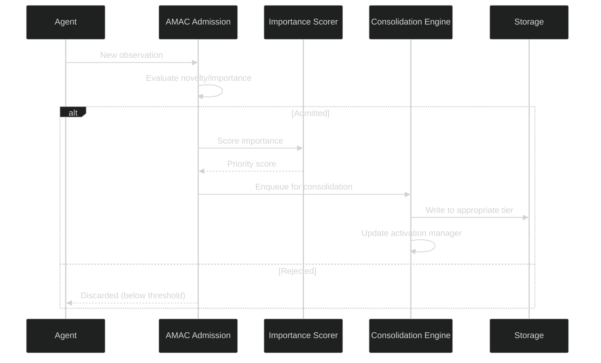
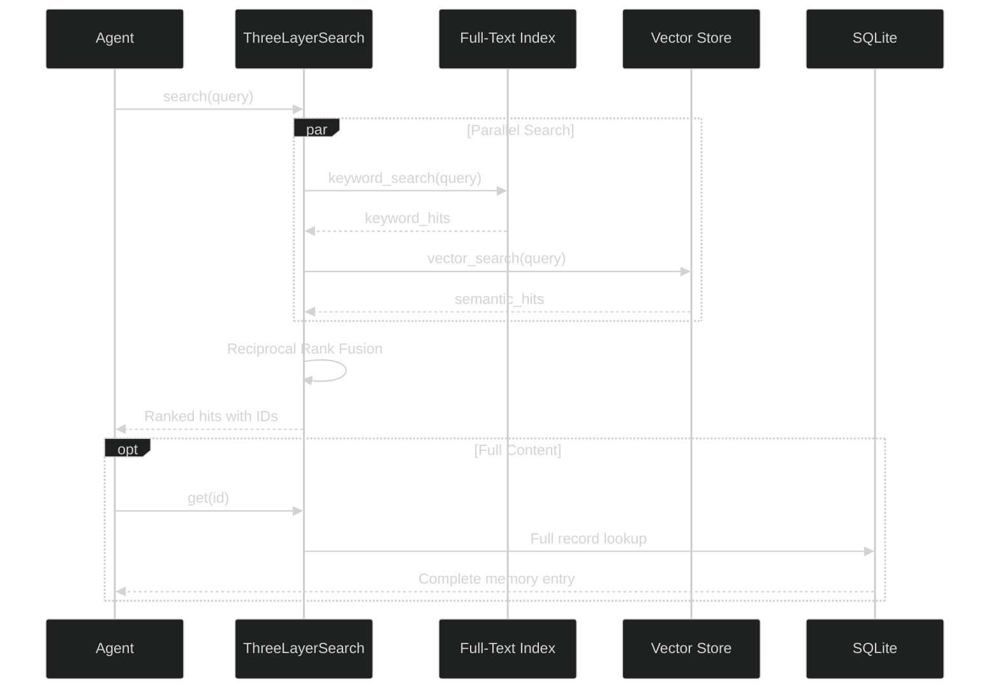

# Memory System Architecture

## Overview

The Lyra memory system is a **distributed multi-package memory fabric** spanning 6+ independent packages. It combines multiple storage backends (SQLite, pgvector, file system, graph databases), advanced consolidation mechanisms (entropic consolidation, dream consolidation, AMAC admission), symbolic state-space models, knowledge graphs, causal graphs, and multi-graph retrieval systems.

## Package Structure

| Package | Purpose | Key Components |
|---------|---------|----------------|
| **lyra-memory** | Core memory engine | activation_manager, importance_scorer, consolidation_engine, symbolic_ssm, cranimem_gate, entropic_consolidation, dream_consolidator, world_graph, codebase_graph, multi_graph, field_memory, verbatim_cache |
| **lyra-gossip-memory** | Fleet memory consensus | consensus_protocol, fleet_merge, memory_vector_clock |
| **lyra-knowledge-graph** | Knowledge graph system | entity_extractor, relation_labeler, graph_builder, graph_querier, community_detector, kg_consolidator, dream_cycle, inverse_search, rrf_fusion |
| **lyra-memory-stack** | Tiered memory architecture | working_memory, episodic_memory, semantic_memory, procedural_memory, dual_trace, decay_manager, dream_cycle, retrieval, privacy_tiers |
| **lyra-memory-vericache** | Verifiable cache | Cryptographic integrity for memory cache |
| **lyra-memory-token** | Memory token economics | Token-based memory access management |
| **lyra-causal-graph** | Causal reasoning | causal_graph, counterfactual, intervention, scm, root_cause |

## System Components

## Core Subsystems

### 1. Activation Manager (`activation_manager.py`)

Manages memory activation state, controlling which memories are "hot" and available for retrieval. Works with the importance scorer to prioritize high-value memories.

### 2. Importance Scorer (`importance_scorer.py`)

Scores memory items based on relevance, recency, frequency, and task alignment. Higher-scoring items get priority in context assembly.

### 3. Consolidation Engine (`consolidation_engine.py`)

Orchestrates the consolidation process that moves memories between tiers, summarizes episodic memories into semantic knowledge, and prunes low-value items.

### 4. Entropic Consolidation (`entropic_consolidation.py`)

Uses entropy-based metrics to decide when and how to consolidate memory. High-entropy memories (novel, unexpected) are preserved more aggressively than low-entropy ones.

### 5. Dream Consolidator (`dream_consolidator.py`)

Background consolidation process that runs during idle periods (analogous to biological sleep consolidation). Replays, reinforces, and reorganizes memories.

### 6. AMAC Admission (`amac_admission.py`)

Adaptive Memory Admission Control -- gates which observations enter the memory system based on novelty, importance, and budget constraints.

### 7. Cranimem Gate (`cranimem_gate.py`)

CRANiMEM-inspired gating mechanism that controls which memories from the LLM's context window are persisted vs. discarded.

### 8. Symbolic SSM (`symbolic_ssm.py`)

Symbolic State-Space Model -- provides structured, interpretable memory state tracking using symbolic representations rather than dense vector embeddings.

### 9. Search System (`search/three_layer.py`)

Three-layer progressive disclosure search:
1. **Search** -- Returns index with IDs and snippets
2. **Context** -- Expands results with temporal context
3. **Full fetch** -- Retrieves complete memory entries

### 10. Graph Systems

- **World Graph** (`world_graph.py`): Models real-world entities and relationships
- **Codebase Graph** (`codebase_graph.py`): Tracks code structure, dependencies, and evolution
- **Multi-Graph** (`multi_graph.py`): Combines multiple graph backends for richer queries
- **Knowledge Graph** (`lyra-knowledge-graph`): Entity extraction, relation labeling, community detection
- **Causal Graph** (`lyra-causal-graph`): Causal reasoning with interventions, counterfactuals, and root cause analysis

## Storage Backends

### SQLite
- Primary source of truth for structured memory records
- FTS5 for full-text search
- ACID transactions with WAL mode

### pgvector
- Vector similarity search (384-dim embeddings)
- Cosine similarity metric
- Used alongside/instead of Chroma for production deployments

### File System
- `.lyra/memory/` -- Local memory files
- Markdown-based notes (`MEMORY.md`, wiki entries)
- Version-controlled alongside code

## Data Flow

### Write Path

### Read Path (Three-Layer Search)

## Gossip Memory (`lyra-gossip-memory`)

Fleet memory consensus for multi-agent deployments:
- **Consensus Protocol** (`consensus_protocol.py`): Distributed agreement on memory state
- **Fleet Merge** (`fleet_merge.py`): Merging memories from multiple agent sessions
- **Vector Clock** (`memory_vector_clock.py`): Causality tracking for distributed memory

## Tech Stack

| Component | Technology | Purpose |
|-----------|-----------|---------|
| Relational DB | SQLite | Structured records, FTS5 search |
| Vector DB | pgvector (primary), Chroma (optional) | Semantic similarity search |
| Embedding | BGE-small-en-v1.5 (384-dim) or configurable | Vector encoding |
| File System | `.lyra/memory/`, `.md` files | Human-readable storage |
| Consolidation | Entropic + Dream + AMAC | Automated memory lifecycle |
| Graphs | Custom in-memory + knowledge graph | Relationship modeling |
| Consensus | Vector clocks + gossip protocol | Fleet coordination |

## Scalability Considerations

- **SQLite**: Single-writer, ~1TB practical limit
- **pgvector**: Production-scale vector operations
- **File System**: Thousands of wiki/memory entries
- **Write latency**: <10ms (SQLite), 50-200ms (vector)
- **Search latency**: 20-100ms (hybrid search)
- **Consolidation**: Background process, non-blocking

## Advanced Memory Mechanisms

### Zettelkasten Graph Memory

The World Graph and Codebase Graph systems together implement a form of **Zettelkasten graph memory**, where each memory item is a note with typed edges to other notes. The `multi_graph.py` module combines multiple graph backends (knowledge graph, causal graph, world graph) for richer queries, implementing the Zettelkasten principle that knowledge emerges from the connections between notes, not the notes themselves.

The knowledge graph (`lyra-knowledge-graph`) automatically discovers relationships:
- `similar_to`: Embedding-based similarity between memory items.
- `compose_with`: Items that are frequently accessed together.
- `depend_on`: Causal dependencies (an item that references another).
- `belong_to`: Hierarchical parent-child relationships.

Graph-based retrieval via `rrf_fusion.py` combines keyword search (FTS5), vector search (pgvector), and graph traversal (inverse_search) using Reciprocal Rank Fusion to produce a unified ranked result set.

### Cost-Sensitive Memory Routing

Memory access is routed through a cost-sensitive decision layer that decides which backend to query based on task requirements and budget:

| Memory Type | Primary Backend | Cost | Latency | Use Case |
|-------------|----------------|------|---------|----------|
| Episodic (recent turns) | SQLite FTS5 | $0 | 5-20ms | "What did we just do?" |
| Semantic (knowledge) | pgvector | $0.0001/query | 20-100ms | "Explain this concept" |
| Graph (relationships) | In-memory graph | $0 | 1-5ms | "What depends on X?" |
| Procedural (skills) | File system | $0 | 1-10ms | "How do we run tests?" |
| Verifiable (sensitive) | VeriCache | $0 | 10-50ms | Cryptographic integrity checks |

The router selects the cheapest backend that can satisfy the query, escalating to more expensive backends only when needed. This is implemented in the three-layer search system: keyword search (cheapest) first, then vector search, then graph traversal.

### A-MAC Admission Control

Adaptive Memory Admission Control (`amac_admission.py`) gates which observations enter the memory system. It evaluates each candidate observation on three axes:

1. **Novelty**: How different is this from existing memories? Uses embedding cosine distance to the nearest neighbor (threshold: < 0.8 for "new").
2. **Importance**: Task relevance score from the Importance Scorer (range: 0.0-1.0, threshold: >= 0.3 for admission).
3. **Budget**: Current memory usage vs. configured cap. When the cap is reached, AMAC evicts the lowest-scoring memory to admit the new one.

The admission decision is: `admit = (novelty > 0.2 or importance > 0.3) and has_budget`. This prevents memory bloat (admitting every observation) while ensuring genuinely useful observations are never dropped.

### Field-Theoretic Dreaming

The Dream Consolidator (`dream_consolidator.py`) implements a field-theoretic approach to memory consolidation, inspired by Mitra's Field-Theoretic Memory model. During idle periods (no active agent turns), the dream cycle:

1. **Replays** recent high-importance memories to reinforce them.
2. **Reorganizes** related memories into compressed summaries.
3. **Prunes** low-importance, high-entropy memories that have not been accessed.
4. **Discovers** latent patterns across seemingly unrelated memories.

The consolidation is driven by entropic metrics (`entropic_consolidation.py`): high-entropy memories (novel, unexpected) are preserved more aggressively than low-entropy ones (familiar, predictable). This mimics biological sleep consolidation where novel experiences are preferentially consolidated over routine ones.

The dream cycle is non-blocking (background process) and runs with a configurable interval (default: every 100 turns or 1 hour of idle time). Metrics track consolidation tasks, entropy scores, and admission rates.

## Monitoring

### Metrics
- `memory.writes.total` (labeled by tier)
- `memory.reads.total` (labeled by operation)
- `memory.search.latency_ms` (histogram)
- `memory.consolidation.tasks` (gauge)
- `memory.amac.admission_rate` (gauge)
- `memory.entropy.score` (gauge)

### Health Checks
- SQLite integrity check on startup
- pgvector connection availability
- Consolidation engine heartbeat
- Gossip consensus liveness

## Related Documentation

- [Block 06: Context Engine](../context-engine/architecture.md)
- [Architecture Tradeoffs](./architecture-tradeoffs.md)
- [System Design](./system-design.md)
- [Implementation Guide](./implementation-guide.md)
