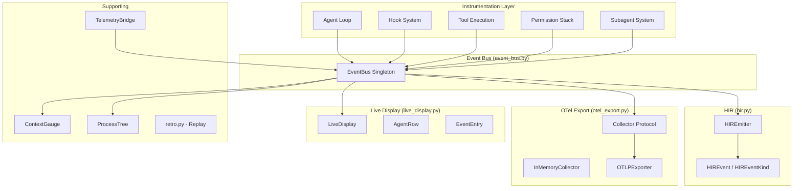

# Observability Architecture

## Overview

Lyra's observability system is a **dual-protocol telemetry infrastructure** that emits both OpenTelemetry-compatible traces (for generic observability platforms) and Harness Intermediate Representation (HIR) events (for agent-specific analysis). The architecture prioritizes local-first operation, replay capability, and zero-overhead instrumentation.

**Source**: `packages/lyra-core/src/lyra_core/observability/` (9 files)

## System Architecture



## Module Structure

```
packages/lyra-core/src/lyra_core/observability/
├── __init__.py              # Public API (all exports)
├── event_bus.py             # EventBus, get_event_bus(), reset_event_bus()
├── hir.py                   # HIREmitter, HIREvent, HIREventKind
├── otel_export.py           # Collector, OTLPExporter, InMemoryCollector
├── live_display.py          # LiveDisplay, AgentRow, EventEntry, DisplayState
├── context_gauge.py         # ContextGauge, AgentDAG, DAGNode, SkillPanel
├── process_tree.py          # ProcessTree, AgentNode, AgentLifecycleState
├── retro.py                 # Trace replay and analysis engine
└── telemetry_bridge.py      # Telemetry bridge integration
```

There is NO `hir/` subdirectory -- `hir.py` is a single file at the top level of the observability module.

## Core Components

### 1. EventBus (`event_bus.py`)

Central event distribution hub with a singleton pattern:

```python
from lyra_core.observability import get_event_bus, reset_event_bus

bus = get_event_bus()  # Returns global singleton
```

**Event types emitted by the bus:**

| Event | Purpose |
|-------|---------|
| `LLMCallStarted` / `LLMCallFinished` | Per-invocation lifecycle |
| `LLMTokenChunk` | Streaming token tracking |
| `ToolCallStarted` / `ToolCallFinished` | Per-tool lifecycle |
| `ToolCallBlocked` | Blocked tool call |
| `PermissionDecision` | Permission authorization |
| `SkillActivated` | Skill activation |
| `SubagentSpawned` / `SubagentFinished` | Subagent lifecycle |
| `StopHookFired` | Session end hooks |
| `CronJobFired` | Scheduled task execution |
| `DaemonIteration` | Daemon lifecycle |
| `CostThreshold` | Cost budget alerts |
| `ProcessStateWriter` | Process state persistence |

### 2. HIREmitter and HIREvent (`hir.py`)

Harness Intermediate Representation (HIR) event system:

```python
from lyra_core.observability import HIREmitter, HIREvent, HIREventKind

class HIREventKind(str, enum.Enum):
    # Agent lifecycle
    AGENT_LOOP_START = "AgentLoop.start"
    AGENT_LOOP_STEP = "AgentLoop.step"
    AGENT_LOOP_END = "AgentLoop.end"
    # Tool lifecycle
    TOOL_CALL = "Tool.call"
    TOOL_RESULT = "Tool.result"
    # Permission + hook
    PERMISSION_DECISION = "PermissionBridge.decision"
    HOOK_START = "Hook.start"
    HOOK_END = "Hook.end"
    # TDD
    TDD_STATE_CHANGE = "TDD.state_change"

@dataclass
class HIREvent:
    kind: HIREventKind | str | None
    session_id: str
    trace_id: str
    ts: float
    payload: dict[str, Any]
```

Key features:
- **Stable JSONL emission** to `.lyra/<session>/events.jsonl`
- **Monotonic `ts`** per emitter instance
- **Secrets masking** at emit time via shared regex patterns (AWS keys, GitHub tokens, SSH keys, Stripe keys, Google API keys, Bearer tokens)
- **Parent dir auto-creation**

### 3. OTel Export (`otel_export.py`)

OpenTelemetry-compatible export:

```python
from lyra_core.observability import Collector, InMemoryCollector, OTLPExporter

# Collector protocol for open-closed principle
class Collector:
    """Protocol: emits events to a telemetry backend."""

# In-memory collector (for testing)
class InMemoryCollector(Collector):
    """Buffers events in memory."""

# OTLP exporter
class OTLPExporter(Collector):
    """Exports to OpenTelemetry Protocol collectors."""
```

### 4. Live Display (`live_display.py`)

Real-time terminal dashboard for agent observability:

```python
from lyra_core.observability import LiveDisplay, AgentRow, EventEntry, DisplayState

class LiveDisplay:
    """Real-time terminal display of agent state."""
```

### 5. Context Gauge (`context_gauge.py`)

Tracks context window metrics:

```python
from lyra_core.observability import ContextGauge, AgentDAG, DAGNode, DAGEdge, SkillPanel
```

### 6. Process Tree (`process_tree.py`)

Agent lifecycle and hierarchy tracking:

```python
from lyra_core.observability import ProcessTree, AgentNode, AgentLifecycleState
```

### 7. Retro Engine (`retro.py`)

Trace replay and analysis without re-execution:

```python
class RetroEngine:
    def assemble_at(self, session_id: str, step: int) -> SessionSnapshot: ...
    def cost_attribution(self, session_id: str) -> Dict[str, Decimal]: ...
    def timeline(self, session_id: str) -> List[TimelineEvent]: ...
    def diff_sessions(self, session1: str, session2: str) -> SessionDiff: ...
```

### 8. TelemetryBridge (`telemetry_bridge.py`)

Bridge between Lyra core telemetry and external observability platforms.

## HIR Event Kinds (Complete)

From `hir.py`:

| HIREventKind | Value | Description |
|-------------|-------|-------------|
| `AGENT_LOOP_START` | `AgentLoop.start` | Session begins |
| `AGENT_LOOP_STEP` | `AgentLoop.step` | Each LLM invocation |
| `AGENT_LOOP_END` | `AgentLoop.end` | Session completes |
| `TOOL_CALL` | `Tool.call` | Tool invocation |
| `TOOL_RESULT` | `Tool.result` | Tool result |
| `PERMISSION_DECISION` | `PermissionBridge.decision` | Permission check |
| `HOOK_START` | `Hook.start` | Hook lifecycle begin |
| `HOOK_END` | `Hook.end` | Hook lifecycle end |
| `TDD_STATE_CHANGE` | `TDD.state_change` | TDD gate transition |

**Note**: There is NO `HIR.md` or `hir/` subdirectory. All HIR functionality is in `hir.py`.

## Data Flow

### Write Path (Hot Path)

```
1. Agent/Tool/Hook emits event
   v (< 10 us overhead)
2. EventBus receives + queues
   v (async, non-blocking)
3. HIREmitter transforms to HIR
   v (parallel)
4. JSONL append to .lyra/<session>/events.jsonl
   OTel encoder sends to collector
   v (< 100 us total)
5. Done (agent continues)
```

### Read Path (Replay/Analysis)

```
1. CLI command: lyra trace show <session>
   v
2. RetroEngine reads events.jsonl
   v
3. Stream parsing (lazy, memory-efficient)
   v
4. Artifact resolution from content hashes
   v
5. Render output (text/HTML/JSON)
```

## Tech Stack

| Component | Technology | Rationale |
|-----------|-----------|-----------|
| EventBus | Python singleton + event classes | Low overhead, type-safe |
| HIR | JSONL (newline-delimited JSON) | Streamable, grepable, human-readable |
| Secret Masking | Regex patterns + `re` module | Fast, configurable |
| OTLP Export | OpenTelemetry SDK | Standard OTel protocol |
| Live Display | `rich` terminal library | Real-time agent state |
| Replay Engine | Streaming JSON parser | Memory-efficient |
| Thread Safety | `threading.Lock` | File write safety |

## Performance Characteristics

| Operation | Latency | Notes |
|-----------|---------|-------|
| Event emit | <10us | In-memory queue |
| HIR JSONL write | <100us | File append |
| Secret redaction | <50us | Regex-based |
| OTLP export | <50ms batched | Async batching |
| Trace replay | <5s (200 steps) | Streaming parse |
| Cost attribution | <100ms | In-memory aggregation |

## References

- [Block 01: Agent Loop](../agent-loop/architecture.md)
- [Block 11: Verifier](../verifier/architecture.md)
- [OpenTelemetry GenAI Conventions](https://opentelemetry.io/docs/specs/semconv/gen-ai/)
- [Architecture tradeoffs](./architecture-tradeoffs.md)
- [System design](./system-design.md)
