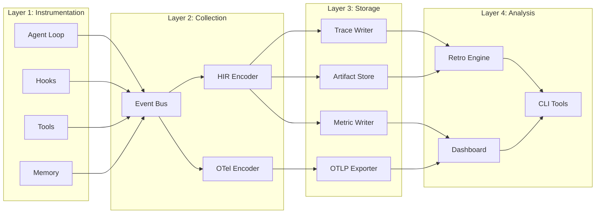

# Observability System Design

## High-Level Design

Lyra's observability system follows a **layered producer-consumer architecture** with clear separation between instrumentation, collection, storage, and analysis.



## Core Abstractions

### 1. HIREvent (Base Event Type)

**Purpose**: Unified base class for all observability events

**Interface**:
```python
from dataclasses import dataclass
from typing import Optional
from datetime import datetime

@dataclass
class HIREvent:
    """Base class for all Harness IR events"""
    
    # Tracing context (W3C Trace Context compatible)
    trace_id: str          # 32-char hex (128-bit trace ID)
    span_id: str           # 16-char hex (64-bit span ID)
    parent_span_id: Optional[str]  # Parent span, None for root
    
    # Timing
    ts: int                # Microseconds since epoch (monotonic)
    
    # Session context
    session_id: str        # Unique session identifier
    actor: str             # generator/evaluator/monitor/scheduler
    
    # Event type (polymorphic dispatch)
    event_type: str        # "AgentLoop.step", "Tool.call", etc.
    
    # Metadata
    metadata: dict = None  # Extensibility for custom fields
```

**Key Design Choices**:
- **Immutable**: Dataclasses frozen=True prevents accidental mutation
- **W3C Compatible**: Trace/span IDs follow W3C Trace Context spec for OTel interop
- **Microsecond Precision**: Sufficient for sub-millisecond event ordering
- **Polymorphic**: `event_type` enables type-safe dispatch in consumers

### 2. EventBus (Pub/Sub Hub)

**Purpose**: Decouple producers (instrumentation) from consumers (encoders/writers)

**Interface**:
```python
from typing import Callable, List
from asyncio import Queue

class EventBus:
    """Asynchronous event distribution hub"""
    
    async def publish(self, event: HIREvent) -> None:
        """Publish event to all subscribers (non-blocking)"""
        
    def subscribe(self, consumer: EventConsumer) -> None:
        """Register a consumer for event notifications"""
        
    def unsubscribe(self, consumer: EventConsumer) -> None:
        """Unregister a consumer"""
        
    async def flush(self) -> None:
        """Block until all queued events are consumed"""
```

**Key Design Choices**:
- **Async-First**: Uses `asyncio.Queue` for zero-copy event passing
- **Buffered**: Ring buffer (10K events) prevents memory exhaustion
- **Non-Blocking**: Publish returns immediately; consumers process async
- **Fan-Out**: Single publish notifies all subscribers in parallel

### 3. EventConsumer (Subscriber Interface)

**Purpose**: Pluggable consumers for different export targets

**Interface**:
```python
from abc import ABC, abstractmethod

class EventConsumer(ABC):
    """Base class for event consumers"""
    
    @abstractmethod
    async def on_event(self, event: HIREvent) -> None:
        """Process a single event (called by EventBus)"""
        
    @abstractmethod
    async def on_flush(self) -> None:
        """Flush any buffered state (called before shutdown)"""
        
    @abstractmethod
    async def on_error(self, event: HIREvent, error: Exception) -> None:
        """Handle processing errors"""
```

**Concrete Implementations**:
- `TraceWriter` - Writes HIR events to JSONL
- `MetricWriter` - Aggregates metrics, writes Prometheus format
- `OTLPExporter` - Converts HIR→OTel, exports via gRPC
- `LiveDisplay` - Updates terminal UI in real-time

### 4. ArtifactStore (Content-Addressed Storage)

**Purpose**: Store large payloads separately from event stream

**Interface**:
```python
from typing import Optional

class ArtifactStore:
    """Content-addressed artifact storage"""
    
    def store(self, content: bytes, session_id: str) -> str:
        """Store content, return SHA-256 hash as reference"""
        
    def retrieve(self, content_hash: str, session_id: str) -> Optional[bytes]:
        """Retrieve content by hash, None if not found"""
        
    def exists(self, content_hash: str, session_id: str) -> bool:
        """Check if artifact exists"""
        
    def gc(self, session_id: str, referenced_hashes: set[str]) -> int:
        """Garbage collect unreferenced artifacts, return count deleted"""
```

**Storage Strategy**:
```python
# Path: .lyra/sessions/{session_id}/artifacts/{sha256_hash}
def _artifact_path(self, session_id: str, content_hash: str) -> str:
    return f".lyra/sessions/{session_id}/artifacts/{content_hash}"

def store(self, content: bytes, session_id: str) -> str:
    content_hash = hashlib.sha256(content).hexdigest()
    path = self._artifact_path(session_id, content_hash)
    
    # Deduplicate: only write if not exists
    if not os.path.exists(path):
        os.makedirs(os.path.dirname(path), exist_ok=True)
        with open(path, 'wb') as f:
            f.write(content)
    
    return content_hash
```

### 5. SessionContext (Per-Session State)

**Purpose**: Maintain session-level telemetry state

**Interface**:
```python
from dataclasses import dataclass, field
from decimal import Decimal

@dataclass
class SessionContext:
    """Per-session observability state"""
    
    session_id: str
    trace_id: str                # Root trace ID
    start_ts: int                # Session start time (µs)
    
    # Cost tracking
    cost_usd: Decimal = Decimal('0')
    cost_by_actor: dict[str, Decimal] = field(default_factory=dict)
    cost_by_model: dict[str, Decimal] = field(default_factory=dict)
    
    # Token tracking
    tokens_prompt: int = 0
    tokens_completion: int = 0
    
    # Event counts
    event_count: int = 0
    error_count: int = 0
    
    # Writers
    trace_writer: Optional['TraceWriter'] = None
    metric_writer: Optional['MetricWriter'] = None
    artifact_store: Optional['ArtifactStore'] = None
    
    def record_cost(self, actor: str, model: str, cost: Decimal) -> None:
        """Accumulate cost for attribution"""
        
    def record_tokens(self, prompt: int, completion: int) -> None:
        """Accumulate token usage"""
```

**Lifecycle**:
```python
# Created on session start
context = SessionContext.create(session_id)

# Passed to all instrumentation points
emit_event(context, AgentLoop.start(...))

# Closed on session end (flushes all writers)
await context.close()
```

## API Contracts

### Instrumentation API (Producer)

**Used by**: Agent loop, hooks, tools, memory system

```python
# Example: Tool execution instrumentation
async def execute_tool(tool_name: str, args: dict, context: SessionContext) -> dict:
    span_id = generate_span_id()
    
    # Emit start event
    await context.emit(Tool.call(
        trace_id=context.trace_id,
        span_id=span_id,
        parent_span_id=context.current_span_id,
        ts=now_micros(),
        session_id=context.session_id,
        actor="generator",
        tool=tool_name,
        args_ref=context.artifact_store.store(json.dumps(args).encode(), context.session_id)
    ))
    
    start = time.monotonic()
    try:
        result = await _actual_tool_execution(tool_name, args)
        exit_code = 0
    except Exception as e:
        result = {"error": str(e)}
        exit_code = 1
    finally:
        duration_ms = (time.monotonic() - start) * 1000
    
    # Emit end event
    await context.emit(Tool.result(
        trace_id=context.trace_id,
        span_id=span_id,
        parent_span_id=context.current_span_id,
        ts=now_micros(),
        session_id=context.session_id,
        actor="generator",
        result_ref=context.artifact_store.store(json.dumps(result).encode(), context.session_id),
        exit_code=exit_code,
        duration_ms=duration_ms
    ))
    
    return result
```

### Consumer API (Subscriber)

**Used by**: Trace writers, metric aggregators, exporters

```python
class TraceWriter(EventConsumer):
    """Writes HIR events to JSONL file"""
    
    def __init__(self, session_id: str):
        self.session_id = session_id
        self.buffer = []
        self.file = open(f".lyra/sessions/{session_id}/trace.jsonl", 'a')
    
    async def on_event(self, event: HIREvent) -> None:
        # Serialize to JSON
        event_json = json.dumps(asdict(event), default=str)
        
        # Buffer for batch write
        self.buffer.append(event_json + '\n')
        
        # Flush if buffer full
        if len(self.buffer) >= 50:
            await self.flush()
    
    async def on_flush(self) -> None:
        if self.buffer:
            self.file.writelines(self.buffer)
            self.file.flush()
            os.fsync(self.file.fileno())
            self.buffer.clear()
    
    async def on_error(self, event: HIREvent, error: Exception) -> None:
        logger.error(f"Failed to write event {event.event_type}: {error}")
```

## State Management

### Session State Directory Structure

```
.lyra/sessions/{session_id}/
├── trace.jsonl              # HIR events (append-only)
├── metrics.jsonl            # Prometheus metrics
├── session.json             # Session metadata
├── artifacts/
│   └── {sha256_hash}        # Content-addressed files
└── meta/
    ├── index.json           # Event index (optional, for fast lookup)
    └── checkpoints/         # Periodic state snapshots
        ├── step_050.json
        └── step_100.json
```

### In-Memory State

```python
# Global registry of active sessions
active_sessions: dict[str, SessionContext] = {}

# Thread-safe access
session_lock = threading.Lock()

def get_session(session_id: str) -> Optional[SessionContext]:
    with session_lock:
        return active_sessions.get(session_id)

def register_session(context: SessionContext) -> None:
    with session_lock:
        active_sessions[context.session_id] = context

def unregister_session(session_id: str) -> None:
    with session_lock:
        active_sessions.pop(session_id, None)
```

### Event Bus Buffer Management

```python
class EventBus:
    def __init__(self, buffer_size: int = 10_000):
        # Ring buffer: oldest events evicted when full
        self._buffer = deque(maxlen=buffer_size)
        self._overflows = 0  # Track buffer overflow count
    
    async def publish(self, event: HIREvent) -> None:
        if len(self._buffer) == self._buffer.maxlen:
            self._overflows += 1
            if self._overflows % 100 == 0:
                logger.warning(f"Event bus overflow: {self._overflows} events dropped")
        
        self._buffer.append(event)
        await self._notify_subscribers(event)
```

## Error Handling

### Producer Error Handling

**Principle**: Observability failures must not crash the agent

```python
async def emit_event(context: SessionContext, event: HIREvent) -> None:
    try:
        await context.event_bus.publish(event)
    except Exception as e:
        # Log but never propagate
        logger.error(f"Failed to emit {event.event_type}: {e}", exc_info=True)
        context.error_count += 1
```

### Consumer Error Handling

**Principle**: Failed consumers should not block other consumers

```python
class EventBus:
    async def _notify_subscribers(self, event: HIREvent) -> None:
        tasks = [self._safe_notify(sub, event) for sub in self._subscribers]
        await asyncio.gather(*tasks, return_exceptions=True)
    
    async def _safe_notify(self, subscriber: EventConsumer, event: HIREvent) -> None:
        try:
            await subscriber.on_event(event)
        except Exception as e:
            await subscriber.on_error(event, e)
```

### OTLP Export Error Handling

**Strategy**: Circuit breaker pattern with exponential backoff

```python
class OTLPExporter(EventConsumer):
    def __init__(self):
        self.failure_count = 0
        self.circuit_open = False
        self.retry_after = None
    
    async def on_event(self, event: HIREvent) -> None:
        if self.circuit_open:
            if time.time() < self.retry_after:
                return  # Skip export while circuit is open
            else:
                self.circuit_open = False  # Attempt to close circuit
        
        try:
            await self._export(event)
            self.failure_count = 0  # Reset on success
        except Exception as e:
            self.failure_count += 1
            if self.failure_count >= 5:
                self.circuit_open = True
                self.retry_after = time.time() + (2 ** min(self.failure_count, 10))
                logger.warning(f"OTLP circuit opened, retry in {self.retry_after - time.time():.1f}s")
```

## Scalability Considerations

### Vertical Scaling (Single Machine)

| Bottleneck | Mitigation | Scaling Limit |
|------------|------------|---------------|
| Event bus throughput | Async publish, no synchronous I/O | > 100K events/sec |
| Trace file writes | Buffered writes, fsync on flush | > 10K events/sec |
| Artifact storage | Content deduplication, no indexing | > 500 artifacts/sec |
| Memory (event buffer) | Ring buffer with eviction | ~100 MB (10K events) |

### Horizontal Scaling (Future)

**Not yet implemented**, but designed for future extension:

```python
# Multi-machine trace aggregation (future)
class TraceAggregator:
    """Collects traces from multiple agents via gRPC"""
    
    async def receive_trace(self, session_id: str, events: List[HIREvent]) -> None:
        """Merge events from remote agent into local storage"""
        
    async def query_traces(self, filter: TraceFilter) -> List[HIREvent]:
        """Query across all collected traces"""
```

## References

- [Event Bus Implementation](../../packages/lyra-core/src/lyra_core/observability/event_bus.py)
- [HIR Event Schema](../../packages/lyra-core/src/lyra_core/hir/events.py)
- [Session Context](../../packages/lyra-core/src/lyra_core/observability/telemetry_bridge.py)
- [W3C Trace Context](https://www.w3.org/TR/trace-context/)
