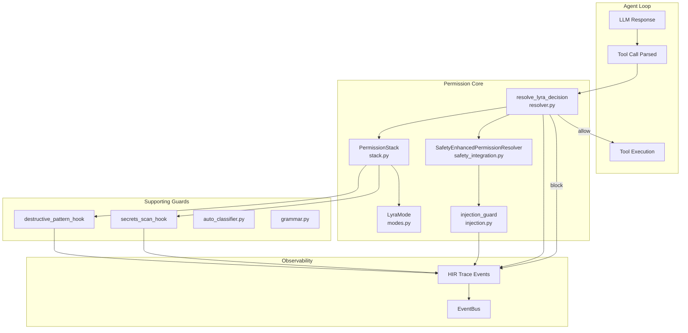

# PermissionBridge Architecture

## Overview

The Permission system is Lyra's runtime authorization primitive that intercepts every tool call before execution. Unlike prompt-based safety measures, the permission system operates as a **code-enforced gatekeeper** that the LLM cannot bypass, manipulate, or reason around.

The actual implementation uses `resolve_lyra_decision()` (resolver.py), `PermissionStack` (stack.py), `LyraMode` (modes.py), and `SafetyEnhancedPermissionResolver` (safety_integration.py) -- not the fictional PermissionBridge, PolicyEngine, RiskClassifier, ParkingLot, and MODE_TOOL_TABLE classes described in earlier documentation versions.

**Source**: `packages/lyra-core/src/lyra_core/permissions/` (8 files)

## System Architecture



## Module Structure

```
packages/lyra-core/src/lyra_core/permissions/
├── __init__.py              # Public API
├── resolver.py              # resolve_lyra_decision() entry point
├── stack.py                 # PermissionStack, StackInput, StackDecision
├── modes.py                 # LyraMode enum (9 modes)
├── injection.py             # injection_guard function
├── safety_integration.py    # SafetyEnhancedPermissionResolver
├── auto_classifier.py       # Auto-classification logic
└── grammar.py               # Permission grammar/dsl
```

## Core Components

### 1. resolve_lyra_decision() (`resolver.py`)

The main entry point for permission decisions. Every tool call flows through this function:

```python
def resolve_lyra_decision(
    tool_name: str,
    args: dict[str, Any],
    mode: LyraMode,
    ...
) -> StackDecision:
    """Resolve whether a tool call is allowed, denied, or needs user input."""
```

### 2. PermissionStack (`stack.py`)

A layered stack that collapses destructive-pattern, secrets-scan, and prompt-injection guards into a single check:

```python
@dataclass
class StackInput:
    tool_name: str
    args: dict[str, Any]
    output: str | None = None  # for post-tool checks

@dataclass
class StackDecision:
    block: bool
    guard: str | None = None
    reason: str | None = None

class PermissionStack:
    def __init__(self, mode: PermissionMode = "normal"):
        ...
    def check(self, inp: StackInput) -> StackDecision:
        """Run all guards; return first blocking decision."""

PermissionMode = Literal["normal", "strict", "yolo"]
```

**Guard pipeline (pre-tool):**
1. `destructive` -- `destructive_pattern_hook` (from hooks/destructive_pattern.py)
2. `secrets` -- `secrets_scan_hook` (from hooks/secrets_scan.py)
3. `injection` -- `injection_guard` (from permissions/injection.py)

**Mode behavior:**
- `yolo` -- Short-circuit to allow
- `normal` -- Run all guards, block on first failure
- `strict` -- Same as normal; reserved for future stricter rules

### 3. LyraMode (`modes.py`)

```python
class LyraMode(str, enum.Enum):
    PLAN = "plan"            # Read-only planning
    RED = "red"              # Failing-test writing (tests/**)
    GREEN = "green"          # Implementation (src/** and tests/**)
    REFACTOR = "refactor"    # Free writes; destructive still ASK
    RESEARCH = "research"    # Scratchpad (notes/**)
    DEFAULT = "default"      # lyra_harness_core defaults
    ACCEPT_EDITS = "acceptEdits"  # Edits auto, others ASK
    BYPASS = "bypass"        # Anything goes (after hard-deny rules)
    RESUME = "resume"        # Inherits caller's last mode
```

### 4. injection_guard (`injection.py`)

Prompt injection detection as a guard function:

```python
def injection_guard(tool_name: str, args: dict[str, Any]) -> StackDecision:
    """Detect prompt injection patterns in tool call arguments."""
```

### 5. SafetyEnhancedPermissionResolver (`safety_integration.py`)

Integrates safety checks with permission resolution for defense-in-depth:

```python
class SafetyEnhancedPermissionResolver:
    """Wraps permission resolution with safety-monitor integration."""
```

## Data Flow

### Tool Call Authorization Flow

```mermaid
%%{init: {'theme': 'dark'}}%%
sequenceDiagram
    participant Loop as Agent Loop
    participant Resolver as resolve_lyra_decision
    participant Stack as PermissionStack
    participant Guard as Guards (destructive/secrets/injection)
    participant Exec as Tool Executor
    participant Trace as Tracer

    Loop->>Resolver: resolve_lyra_decision(tool, args, mode)
    Resolver->>Stack: check(StackInput)
    
    alt mode == "yolo"
        Stack-->>Resolver: StackDecision(block=False)
    else mode == "normal" or "strict"
        Stack->>Guard: destructive_pattern_hook
        alt Destructive pattern found
            Guard-->>Stack: block
            Stack-->>Resolver: StackDecision(block=True, guard="destructive")
        else OK
            Stack->>Guard: secrets_scan_hook
            alt Secret found
                Guard-->>Stack: block
                Stack-->>Resolver: StackDecision(block=True, guard="secrets")
            else OK
                Stack->>Guard: injection_guard
                alt Injection detected
                    Guard-->>Stack: block
                    Stack-->>Resolver: StackDecision(block=True, guard="injection")
                else OK
                    Stack-->>Resolver: StackDecision(block=False)
                end
            end
        end
    end
    
    alt block = False
        Resolver->>Trace: emit(PermissionDecision, allow)
        Loop->>Exec: execute(call)
    else block = True
        Resolver->>Trace: emit(PermissionDecision, block, guard, reason)
        Resolver-->>Loop: BLOCK
    end
```

## Technology Stack

| Component | Technology | Rationale |
|-----------|-----------|-----------|
| Core logic | Python 3.11+ | Type safety, dataclasses |
| Mode system | `LyraMode` enum | Compile-time validation |
| Guard functions | Standalone callables | Composable, testable |
| Stack resolution | `StackDecision` dataclass | Immutable, traceable |
| Metrics | EventBus + HIR | Observable decisions |

## Performance Characteristics

| Operation | Latency | Notes |
|-----------|---------|-------|
| Stack check (no block) | <1ms | Three guard functions |
| Stack check (destructive block) | <500us | Early exit on first guard |
| injection_guard | <500us | Regex-based pattern matching |
| Total decision (normal path) | <2ms | No user interaction |
| User approval prompt | User-dependent | Blocking on human input |

## Security Properties

1. **Unprivileged LLM**: The model never sees approval logic, cannot reason about bypass
2. **Fail-closed**: Unknown guards or parsing errors result in block
3. **Defense in depth**: Three independent guard layers (destructive + secrets + injection)
4. **Monotonic security**: Each guard can only increase restriction, never decrease
5. **Audit trail**: Every decision traced with HIR events, queryable for security review
6. **No TOCTOU**: Decision and execution are atomic within the same call stack
7. **Singleton stack**: One PermissionStack instance processes all tool calls

## References

- [Block 05: Hooks and TDD Gate](../hooks-tdd/architecture.md)
- [Block 12: Safety Monitor](../safety-monitor/architecture.md)
- [Decision pipeline deep-dive](./deep-dive.md)
- [Implementation guide](./implementation-guide.md)
- [Architecture tradeoffs](./architecture-tradeoffs.md)
