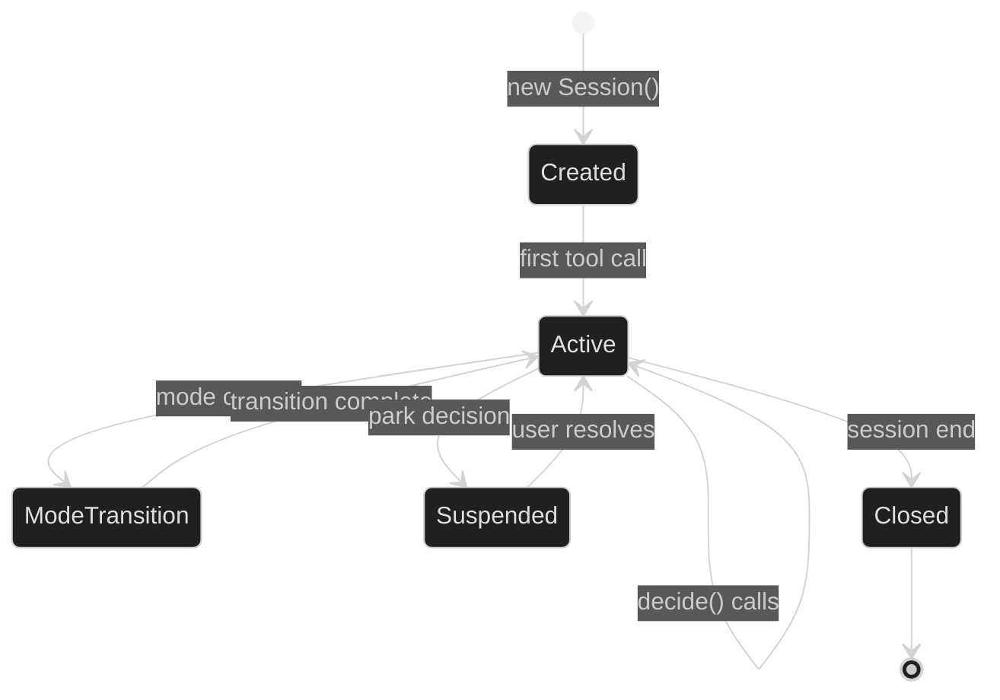

# PermissionBridge System Design

## Overview

This document describes the high-level design of PermissionBridge: the abstractions, API contracts, state management, error handling strategies, and scalability considerations. It bridges the gap between architecture (what components exist) and implementation (how to build them).

## Core Abstractions

### 1. ToolCall

The unit of work that requires authorization.

```python
@dataclass(frozen=True)
class ToolCall:
    """
    Immutable representation of a tool invocation request.
    Frozen to ensure decision caching works correctly.
    """
    name: str                           # e.g., "Edit", "Bash", "WebFetch"
    args: Dict[str, Any]                # Tool-specific arguments
    call_id: str                        # Unique identifier for this call
    timestamp: float                    # Unix timestamp
    context: CallContext                # Session, agent, parent call
    
    def __hash__(self) -> int:
        # Enables caching: same call → same decision (within session)
        return hash((self.name, frozenset(self.args.items()), self.context.session_id))
```

**Design rationale**:
- **Immutable**: Once created, cannot be modified. Prevents TOCTOU attacks where args change between decision and execution.
- **Hashable**: Enables decision caching (same call in same session → reuse decision).
- **Self-contained**: Carries all context needed for authorization (no hidden dependencies).

### 2. PermissionDecision

The authorization verdict returned by the bridge.

```python
@dataclass
class PermissionDecision:
    """
    Outcome of authorization check.
    Immutable after creation.
    """
    decision: Decision                          # ALLOW | ASK | DENY | PARK
    reason: str                                 # Stable identifier for logs/traces
    suggestion: Optional[str] = None            # Alternative action agent could take
    elevate_to: Optional[PermissionMode] = None # Mode user could switch to
    cost_of_approval: CostLevel = CostLevel.REVERSIBLE
    metadata: Dict[str, Any] = field(default_factory=dict)
    
    def is_blocking(self) -> bool:
        """Does this decision halt execution?"""
        return self.decision in (Decision.ASK, Decision.DENY)
    
    def requires_user_input(self) -> bool:
        """Does this decision need human intervention?"""
        return self.decision == Decision.ASK

@enum.unique
class Decision(StrEnum):
    ALLOW = "allow"   # Proceed without user input
    ASK   = "ask"     # Block until user approves/denies
    DENY  = "deny"    # Refuse; do not execute
    PARK  = "park"    # Defer (DAG Teams only)

@enum.unique
class CostLevel(StrEnum):
    """How expensive is it to undo this action?"""
    NOOP = "noop"                # No side effects
    REVERSIBLE = "reversible"    # Can undo (e.g., edit file)
    IRREVERSIBLE = "irreversible" # Cannot undo (e.g., deploy, delete)
```

### 3. Session

The authorization context for a conversation.

```python
@dataclass
class Session:
    """
    Mutable session state that persists across tool calls.
    Not thread-safe; agent loop is single-threaded.
    """
    session_id: str
    mode: PermissionMode
    config: SessionConfig
    harness: HarnessType  # "single", "dag-teams", etc.
    
    # Mutable state
    policy_overrides: List[PolicyOverride]  # User's "always allow" decisions
    history: CallHistory                    # Recent tool calls for risk classifier
    metrics: MetricsCollector
    
    def record_call(self, call: ToolCall, decision: PermissionDecision) -> None:
        """Update session state after each decision."""
        self.history.append(call, decision)
        self.metrics.record_decision(decision)
```

## API Contracts

### Primary Interface: PermissionBridge.decide()

```python
class PermissionBridge:
    """
    Authoritative authorization gateway.
    Singleton per session (created by AgentLoop).
    """
    
    def decide(
        self,
        call: ToolCall,
        session: Session
    ) -> PermissionDecision:
        """
        Main entry point: authorize a tool call.
        
        Returns:
            PermissionDecision with verdict and reasoning.
            
        Guarantees:
            - Never raises exceptions (fails closed with DENY)
            - Deterministic for same (call, session) within 1 second
            - Emits HIR trace event before returning
            - Total function: always returns a decision
        """
        try:
            return self._decide_impl(call, session)
        except Exception as e:
            logger.error(f"PermissionBridge internal error: {e}", exc_info=True)
            return PermissionDecision(
                decision=Decision.DENY,
                reason="internal_error",
                metadata={"error": str(e)}
            )
```

## Design Rationale: Key Decisions

### Decision 1: Deny-First Evaluation Order

**Why deny-first?** Because the safety contract requires that deny rules always win. The evaluation order is: deny -> ask -> allow (first match wins). If no rule matches, default = ask (user prompt).

```python
class PermissionEngine:
    """Deny-first permission evaluation."""

    def __init__(self):
        self._rules: list[PermissionRule] = []
        self._session_overrides: dict[str, PermissionMode] = {}

    def evaluate(self, tool: str, args: dict, context: PermissionContext) -> PermissionDecision:
        matching = self._get_matching_rules(tool, args, context)
        session_mode = self._session_overrides.get(context.session_id)

        # Plan mode: read-only
        if session_mode == "plan":
            if tool in ("Read", "Glob", "Grep", "WebFetch"):
                return PermissionDecision.ALLOW
            return PermissionDecision.DENY

        # Deny -> Ask -> Allow order
        for rule in sorted(matching, key=self._action_priority):
            if rule.action == "deny":
                return PermissionDecision.DENY
            if rule.action == "allow":
                return PermissionDecision.ALLOW

        # Default: ask (unless session mode overrides)
        if session_mode == "auto":
            return PermissionDecision.AUTO_ALLOW
        if session_mode in ("acceptEdits",):
            if tool in ("Edit", "Write", "Read", "Glob", "Grep"):
                return PermissionDecision.AUTO_ALLOW
        if session_mode == "bypass":
            return PermissionDecision.BYPASS
        return PermissionDecision.ASK

    @staticmethod
    def _action_priority(rule) -> int:
        return {"deny": 0, "ask": 1, "allow": 2}[rule.action]
```

**Alternatives considered:**
- **Allow-first (default allow):** Dangerous — any unlisted operation is permitted. Rejected for safety.
- **Ask-first (default ask):** Claude Code's approach for `default` mode. Our fallback is ask (same), but deny rules preempt ask rules, not vice versa.
- **Priority-number-based:** Harder to reason about than ordered categories. Deny > Ask > Allow is intuitive.

### Decision 2: Compound Command Parsing

Shell compound commands (`&&`, `||`, `;`, `|`, `&`) must be parsed into individual subcommands for per-subcommand permission evaluation.

```python
class CompoundCommandParser:
    """Parse compound shell commands, evaluate each subcommand independently."""

    SPLIT_PATTERNS = [r"\|\|", r"&&", r";", r"\|", r"&"]
    PROCESS_WRAPPERS = ["timeout", "time", "nice", "nohup", "stdbuf", "xargs"]

    @classmethod
    def parse(cls, command: str) -> list[str]:
        """Split compound command into individual subcommands."""
        result = [command]
        for pattern in cls.SPLIT_PATTERNS:
            expanded = []
            for cmd in result:
                expanded.extend(re.split(pattern, cmd))
            result = expanded
        return [cls.strip_wrappers(c.strip()) for c in result if c.strip()]

    @classmethod
    def strip_wrappers(cls, command: str) -> str:
        """Remove process wrappers before matching."""
        parts = shlex.split(command)
        while parts and parts[0] in cls.PROCESS_WRAPPERS:
            parts = parts[1:]
            if parts and parts[0].isdigit():
                parts = parts[1:]
        return " ".join(parts)
```

**Rationale:** Without parsing, `rm -rf / && echo "done"` would be evaluated as a single Bash command. With parsing, `rm -rf /` is individually denied while `echo "done"` is allowed.

### Decision 3: Permission Modes (Six Modes)

```python
class PermissionMode(str, Enum):
    DEFAULT = "default"           # Prompt on first use of each tool
    ACCEPT_EDITS = "acceptEdits"  # Auto-approve file edits + common commands
    PLAN = "plan"                 # Read-only: no edits, no writes, no Bash
    AUTO = "auto"                 # Auto-approve with background safety checks
    DONT_ASK = "dontAsk"          # Auto-deny unless pre-approved
    BYPASS = "bypassPermissions"  # Skip all prompts (with circuit breaker)
```

Mode behavior matrix:

| Mode | File Reads | File Edits | Bash | Web | Subagent |
|------|-----------|------------|------|-----|----------|
| default | ask 1st | ask 1st | ask 1st | ask 1st | ask 1st |
| acceptEdits | auto | auto | auto | ask 1st | ask 1st |
| plan | auto | deny | deny | deny | deny |
| auto | auto | auto | auto | auto | auto |
| dontAsk | deny | deny | deny | deny | deny |
| bypass | auto | auto | auto | auto | auto |

**Alternatives considered:**
- **Two-mode (restricted/unrestricted):** Too coarse — forced most users into ask-everything or no-safety modes. Six modes map to real user workflows: plan (exploration), acceptEdits (standard dev), auto (CI/CD).
- **Per-tool granularity only (no modes):** Too complex for configuration. Modes provide sensible defaults; per-tool rules override.

### Decision 4: Path Traversal Prevention with Symlink Awareness

```python
class PathSafety:
    """Path traversal prevention with symlink awareness."""

    def __init__(self, allowed_bases: list[str]):
        self.allowed_bases = [os.path.abspath(p) for p in allowed_bases]

    def is_path_allowed(self, path: str) -> bool:
        """Check if path is within allowed bases, considering symlinks.
        Allow rules check BOTH symlink path AND resolved target.
        """
        resolved = os.path.abspath(os.path.realpath(path))
        unresolved = os.path.abspath(path)
        for base in self.allowed_bases:
            if resolved.startswith(base) and unresolved.startswith(base):
                return True
        return False
```

**Rationale:** Without symlink checking, an attacker could create a symlink in `/project` pointing to `/etc/passwd` and write through it. Checking both the unresolved path (the symlink) and the resolved target catches this.

### Decision 5: Per-Session Permission Overrides

Different sessions can have different permission profiles. A research agent does not need production write access.

```python
class SessionPermissionStore:
    """Per-session permission overrides scoped to session lifetime."""

    def __init__(self):
        self._overrides: dict[str, PermissionMode] = {}
        self._credential_scopes: dict[str, list[str]] = {}

    def set_mode(self, session_id: str, mode: PermissionMode) -> None:
        self._overrides[session_id] = mode

    def scope_credentials(self, session_id: str, allowed_creds: list[str]) -> None:
        """Grant only specific credential keys to a session."""
        self._credential_scopes[session_id] = allowed_creds

    def get_credentials(self, session_id: str) -> list[str]:
        """Return only credentials scoped to this session."""
        allowed = self._credential_scopes.get(session_id)
        if allowed is None:
            return list(ALL_CREDENTIALS.keys())  # No scoping: all creds
        return [ALL_CREDENTIALS[k] for k in allowed if k in ALL_CREDENTIALS]
```

**Rationale:** Credential scoping is essential for multi-agent safety. A research subagent should never have access to production deployment keys.

## State Management

### Session State Lifecycle



## Error Handling Strategy

### Error Hierarchy

```python
class PermissionError(Exception):
    """Base class for all permission-related errors."""
    pass

class PolicyError(PermissionError):
    """Policy loading or evaluation error."""
    pass

class RiskClassifierError(PermissionError):
    """Risk scoring error."""
    pass

class ParkingError(PermissionError):
    """Parking lot operation error."""
    pass
```

### Fail-Safe Guarantees

```python
def decide(self, call: ToolCall, session: Session) -> PermissionDecision:
    """
    Fail-safe contract:
    - Never raises exceptions to caller
    - Always returns a decision
    - Errors → DENY (fail-closed)
    - All errors traced
    """
    try:
        return self._decide_impl(call, session)
    except Exception as e:
        logger.critical(f"Unexpected error: {e}", exc_info=True)
        return PermissionDecision(Decision.DENY, reason="internal_error")
```

### Read-Only Command Bypass

Built-in set of commands that run without prompt in every mode:

```python
READ_ONLY_COMMANDS = {
    "ls", "cat", "echo", "pwd", "head", "tail", "wc",
    "which", "type", "command", "file", "stat", "du", "df",
    "env", "printenv", "date", "cal",
    "find", "grep", "rg", "ag", "ack",
    "diff", "cmp", "comm",
    "python3 --version", "node --version", "npm --version",
    "type", "where", "man", "help",
}
```

**Rationale:** Read-only commands are pure information retrieval. Requiring approval for `ls` or `grep` would create excessive noise with zero safety benefit. In plan mode, these are the only tools permitted.

## Scalability Considerations

### Vertical Scaling (Single Agent)

**Current performance** (single-threaded agent loop):

| Operation | Throughput | Bottleneck |
|-----------|------------|------------|
| Mode lookup | 100,000 decisions/sec | None (dict lookup) |
| Policy evaluation | 10,000 decisions/sec | Regex matching |
| Risk classification | 2,000 decisions/sec | ML inference |
| **Combined (p50)** | **1,000 decisions/sec** | ML model |

## References

- [PermissionBridge architecture](./architecture.md)
- [Architecture tradeoffs](./architecture-tradeoffs.md)
- [Implementation guide](./implementation-guide.md)
- [Deep dive](./deep-dive.md)
- [Safety Monitor System Design](../safety-monitor/system-design.md)
