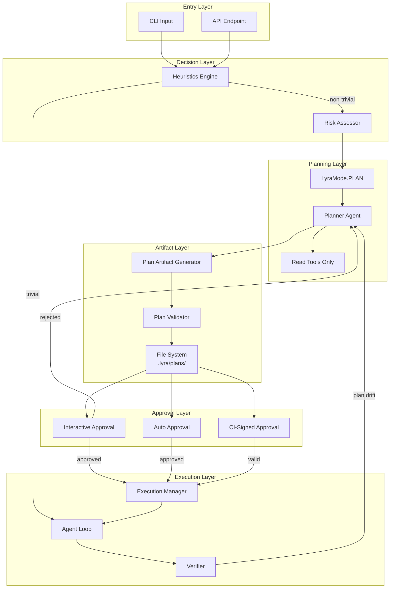

# Plan Mode Architecture

## Overview

Plan Mode is Lyra's intelligent task planning system that converts user tasks into structured, approvable execution plans before any code changes occur. This architecture document details the system components, data flow, and technical implementation.

**Permission mode**: `LyraMode.PLAN` in `lyra_core/permissions/modes.py`

## System Architecture



## Core Components

### 1. LyraMode Enum

**Location:** `lyra_core/permissions/modes.py`

```python
class LyraMode(str, enum.Enum):
    PLAN = "plan"            # Read-only planning
    RED = "red"              # Failing-test writing (tests/**)
    GREEN = "green"          # Implementation (src/** and tests/**)
    REFACTOR = "refactor"    # Free writes; destructive still ASK
    RESEARCH = "research"    # Scratchpad (notes/**)
    DEFAULT = "default"      # lyra_harness_core defaults (writes ASK)
    ACCEPT_EDITS = "acceptEdits"  # Edits auto, others ASK
    BYPASS = "bypass"        # Anything goes (after hard-deny rules)
    RESUME = "resume"        # Inherits caller's last mode
```

### 2. Heuristics Engine

**Responsibility:** Determines whether a task requires plan-mode or can proceed directly to execution.

**Algorithm:**
```python
def is_trivial(task: str, repo: Repo, session: Session) -> bool:
    """
    Evaluates task complexity using weighted signals.
    Returns True if task can skip plan mode.
    """
    signals = []
    weights = {
        "short_task": 1,
        "low_stakes_keywords": 2,
        "single_file": 1,
        "already_in_flow": 1,
    }
    
    # Task length analysis
    if len(task) < 80:
        signals.append("short_task")
    
    # Keyword detection
    low_stakes_patterns = [
        r"\b(typo|fix comment|rename variable|add log)\b",
        r"\b(update doc|fix formatting)\b"
    ]
    if any(re.search(p, task, re.I) for p in low_stakes_patterns):
        signals.append("low_stakes_keywords")
    
    # Explicit plan request
    if re.search(r"\b(plan|design|architecture)\b", task, re.I):
        return False  # Never skip explicit plan requests
    
    # Weighted decision
    total_weight = sum(weights.get(s, 1) for s in signals)
    return total_weight >= 3
```

### 3. Permission Stack in Plan Mode

During planning, the `PermissionStack` (in `lyra_core/permissions/stack.py`) enforces read-only mode. The stack uses three guard layers:

- **destructive**: Blocks destructive bash patterns
- **secrets**: Scans for secret leaks
- **injection**: Detects prompt injection attempts

Tool permissions during PLAN are enforced at the stack level, not through a flat mode-tool table.

### 4. Planner Agent

**Responsibility:** Generate structured plans using a capable model.

**Model Resolution:** Provider-agnostic model routing. The planning role maps to higher-capability models through Lyra's provider abstraction layer.

**System Prompt Contract:** The planner is given read-only tools and produces structured plan artifacts with acceptance tests, expected files, forbidden files, feature items, and open questions.

### 5. Plan Artifact

**Schema:**
```python
@dataclass
class PlanArtifact:
    session_id: str
    created_at: datetime
    planner_model: str
    estimated_cost_usd: float
    goal_hash: str
    
    title: str
    acceptance_tests: list[str]
    expected_files: list[dict]
    forbidden_files: list[dict]
    feature_items: list[dict]
    open_questions: list[dict]
    notes: str | None
```

## Data Flow

### Planning Flow

```
1. User submits task
   v
2. Heuristics evaluate complexity
   v
3. If non-trivial:
   a. Set LyraMode.PLAN
   b. Spawn Planner agent
   c. Planner reads repo (read-only tools)
   d. Planner generates plan artifact
   e. Plan validator checks schema
   f. Write to .lyra/plans/<session-id>.md
   v
4. If trivial:
   a. Skip to execution
```

### Approval Flow

```
1. Plan artifact exists
   v
2. Route based on approval mode (interactive | auto | ci-signed)
   v
3. Exit plan mode
   v
4. Set execution permission mode based on plan phase
   v
5. Start agent loop
```

## Tech Stack

| Layer | Technology |
|-------|-----------|
| Language | Python 3.11+ |
| Model orchestration | lyra_core agent loop |
| File system | `pathlib` |
| Parsing | `PyYAML`, `markdown-it-py` |
| Validation | `pydantic` v2 |
| Hashing | `hashlib` (SHA-256) |
| Permissions | `LyraMode` enum + `PermissionStack` |
| CLI rendering | `rich` (syntax highlighting, tables) |

## Storage & Persistence

```
.lyra/
  plans/
    <session-id>.md              # Initial plan
    <session-id>.rev-1.md        # First revision
    index.json                   # Fast lookup index
```

## Related Documentation

- [Architecture Tradeoffs](./architecture-tradeoffs.md)
- [System Design](./system-design.md)
- [Implementation Guide](./implementation-guide.md)
- [Block 01: Agent Loop](../agent-loop/architecture.md)
- [Block 04: Permission Bridge](../permission-bridge/architecture.md)
