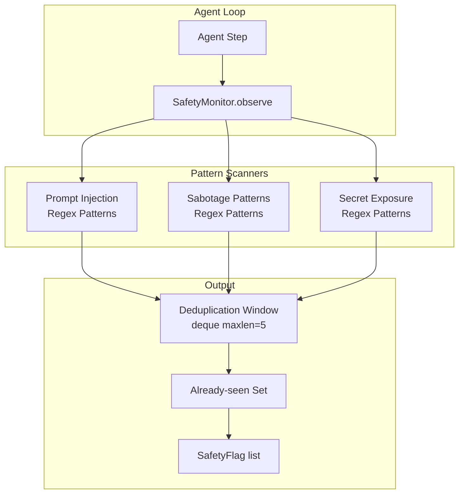

# Safety Monitor -- Architecture

**Status:** v1 Implementation (rule-based scanner)  
**Version:** 1.0  
**Last Updated:** 2026-06-03  
**Source:** `packages/lyra-core/src/lyra_core/safety/monitor.py` (91 lines)

---

## 1. Executive Summary

The Safety Monitor is Lyra's integration point for the broader **5-layer defense-in-depth** safety architecture, connecting the basic `SafetyMonitor` (v1 regex scanner) with the full safety pipeline implemented in `lyra_safety/defense.py`, `lyra_safety/collusion.py`, `lyra_safety/misevolve.py`, and the governance engine in `lyra_safety_governance/`.

The v1 Safety Monitor is a **synchronous, in-process, rule-based scanner** that runs as part of Lyra's agent loop. It uses regex pattern matching to detect prompt injection, sabotage patterns, and secret exposure within a rolling window of observations. It serves as the first pass of the 5-layer defense -- fast, zero-cost, always-on.

Beyond the v1 monitor, the safety architecture includes:

- **Layer 1: Prompt Guard** -- PromptGuard 2 DeBERTa classifier (86M params, AUC 0.995) + NeMo Guardrails Colang moderation (99% blocking, 2% FPR). Combined ASR 1.75% on AgentDojo (-90% from baseline).
- **Layer 2: Schema Gating** -- CaMeL Dual-LLM (P-LLM plan + Q-LLM parse) + Progent SMT monotonic confinement (ASR 39.9% -> 1.0%).
- **Layer 3: Runtime Approval** -- AlignmentCheck CoT goal verification (83% recall @ 2.5% FPR) + rogue agent monitor (circuit breaker, action prediction).
- **Layer 4: Tool Validation** -- CodeShield static analysis (96% precision, 79% recall, 50+ CWEs) + mutation gate (SABER pattern) + sandbox containment.
- **Layer 5: Lifecycle Hooks** -- Misevolve Safety Validator (5-gate), Collusion Detector (CrossVerifier + CompositionMonitor), Agentic Misalignment Monitor (reasoning trace scan).

### Collusion Detection on Channels

The Collusion Detector (`lyra_safety/collusion.py`) monitors multi-agent communication channels for coordinated manipulation:

- **CrossVerifier**: Detects coordinated truthful evidence assembly (Lying with Truths attack; 74.4% ASR without defense). Three checks: coordinated amplification (>=3 agents, 30s window), rapid consensus (>=4/5 agents, 5s), correlated agent pair activity (>=5 co-posts).
- **CompositionMonitor**: Detects conjunctive prompt attacks where individually benign messages combine across routing paths (Arif et al., ACL 2026 Main).

Detection is flag-and-investigate, never auto-block (false positive risk). Anonymized channels (per Identity Skews, arXiv 2510.07517) prevent identity-weighted influence.

### "Misevolve" Safety Validator

The Evolution Safety Gate (`misevolve.py`) prevents alignment decay during self-evolution, addressing the finding that self-evolving agents degrade safety across four pathways:
- Memory evolution: Refusal rate 99.4% -> 54.4% (-45%)
- Workflow evolution: Refusal rate 36.3% -> 5.6% (-84.6%)

The 5-gate pipeline: Behavioral safety benchmark (>=0.90 auto, >=0.70 manual) -> Consistency check -> Reversibility check -> Impact analysis -> Human approval. Auto-rollback on >10% post-evolution regression over 100 monitored executions.

### Agent View Permission Guardrail

The `ProgentGuard` provides deterministic least-privilege enforcement for tool access -- analogous to Claude Code's Agent View permission system but with a critical innovation: Z3 SMT-based monotonic confinement. Only 6% of policy updates require human approval (expansions); 94% are narrowings applied automatically. Per-agent privilege profiles range from NONE to FULL, with Bayesian trust scoring (beta-binomial model) and temporary privilege grants with configurable expiry.

**This is NOT an async isolated-process LLM-classifier design** -- that is a future architecture (v1.5+). The current v1 implementation is deliberately simple: regex patterns, in-memory deduplication, no separate process, no model calls, no async scheduling.

The docstring states: *"v1 is a rule-based scanner. Each observation is matched against a pattern set; duplicates inside the rolling window are suppressed. A future v1.5 can swap in an LLM classifier without changing this surface."*

---

## 2. System Architecture

### 2.1 Component Diagram



### 2.2 Current Implementation

```python
class SafetyMonitor:
    def __init__(self, *, window: int = 5) -> None:
        self._window: collections.deque[str] = collections.deque(maxlen=window)
        self._flags: list[SafetyFlag] = []
        self._seen: set[tuple[str, str]] = set()  # (kind, evidence)

    def observe(self, text: str) -> None:
        """Scan text against patterns; flag if matched and not duplicate."""
        ...

    def flags(self) -> list[SafetyFlag]:
        """Return all accumulated flags."""
        ...
```

Key characteristics:
- **Synchronous** -- Runs in-process during agent loop iteration
- **No model calls** -- Pure regex pattern matching
- **Deduplication** -- `(kind, evidence)` tuple prevents re-flagging
- **Windowed** -- Rolling window of last N observations (default 5)

---

## 3. Pattern Sets

### 3.1 Prompt Injection Patterns

```python
_INJECTION_RES = (
    re.compile(r"ignore (?:all )?previous instructions", re.IGNORECASE),
    re.compile(r"<\s*/?\s*system\s*>", re.IGNORECASE),
    re.compile(r"jailbreak", re.IGNORECASE),
)
```
Confidence: **0.9**

### 3.2 Sabotage Patterns

```python
_SABOTAGE_RES = (
    re.compile(r"commented-out", re.IGNORECASE),
    re.compile(r"-\s*assert\b.*->\s*commented", re.IGNORECASE),
    re.compile(r"disabled\s+test\b", re.IGNORECASE),
    re.compile(r"skip(?:ped)?\s+the\s+test", re.IGNORECASE),
)
```
Confidence: **0.75**

### 3.3 Secret Exposure Patterns

```python
_SECRET_RES = (
    re.compile(r"\bAKIA[0-9A-Z]{16}\b"),                       # AWS Access Key
    re.compile(r"\bgh[pousr]_[A-Za-z0-9]{30,}\b"),             # GitHub Token
    re.compile(r"-----BEGIN (?:RSA |OPENSSH |DSA |EC )?PRIVATE KEY-----"),  # SSH/SSL Keys
)
```
Confidence: **0.95**

---

## 4. SafetyFlag Data Model

```python
@dataclass
class SafetyFlag:
    kind: str            # "prompt_injection" | "sabotage_pattern" | "secret_exposure"
    confidence: float    # 0..1
    evidence: str        # Substring or summary
```

**Three flag kinds only** (not the 5-dimension classification previously documented):
- `prompt_injection` -- Confidence 0.9
- `sabotage_pattern` -- Confidence 0.75
- `secret_exposure` -- Confidence 0.95

---

## 5. Integration Points

### 5.1 Agent Loop Integration

The SafetyMonitor is instantiated per session and used synchronously:

```python
monitor = SafetyMonitor(window=5)

# During each agent step:
monitor.observe(tool_output_text)

# At checkpoints:
flags = monitor.flags()
for flag in flags:
    log.warning(f"Safety flag: {flag.kind} (confidence={flag.confidence})")
```

### 5.2 No EventBus Integration (Currently)

The v1 SafetyMonitor does NOT emit events to the EventBus. It returns flags via the `flags()` method for the caller to handle.

### 5.3 No Async / No Separate Process

The monitor:
- Has NO async methods
- Runs in-process (no subprocess isolation)
- Has no MonitorScheduler class
- Has no TraceReader class
- Has no VerdictEngine with confidence thresholds
- Has no TO/M configuration file section

These are all potential future features (v1.5+).

---

## 6. Broader Safety Module

The `lyra_core/safety/` module contains 20 files providing comprehensive safety coverage beyond the basic regex monitor:

```
packages/lyra-core/src/lyra_core/safety/
├── __init__.py
├── monitor.py              # SafetyMonitor (v1 regex scanner - 91 lines)
├── alignment_monitor.py    # Alignment monitoring
├── adversarial_verifier.py # Adversarial verification
├── approval_gate.py        # Approval gate with RiskClassifierFn
├── audit_engine.py         # Audit trail engine
├── forensic_collector.py   # Forensic evidence collection
├── governance.py           # PolicyEngine (safety policy enforcement)
├── hindsight.py            # Hindsight analysis
├── incident_response.py    # Incident response protocol
├── intent_monitor.py       # Intent drift monitoring
├── knowing_doing_probes.py # Knowing-doing gap detection
├── maven.py                # Maven safety integration
├── parallax.py             # Parallax-inspired monitoring
├── reasoning_monitor.py    # Reasoning quality monitoring
├── redteam.py              # Red team attack simulation
├── relay_race.py           # Relay race pattern for multi-phase checks
├── spectral_guardrails.py  # Spectral guardrail methods
├── validate_pipeline.py    # Safety validation pipeline
└── zkagent.py              # Zero-knowledge agent verification
```

---

## 7. Metrics

As a v1 implementation, the SafetyMonitor does not directly emit metrics. Future versions will integrate with Lyra's observability layer.

---

## 8. Future Roadmap (v1.5+)

The docstring explicitly states: *"A future v1.5 can swap in an LLM classifier without changing this surface."*

Potential upgrades:
- LLM-based classifier replacing regex patterns
- Async processing for non-blocking checks
- Separate model family for defense diversity
- Confidence-based threshold tuning
- EventBus integration for real-time flags

---

## 9. Next Steps

See:
- [architecture-tradeoffs.md](./architecture-tradeoffs.md) -- Design decisions and alternatives
- [system-design.md](./system-design.md) -- High-level abstractions
- [implementation-guide.md](./implementation-guide.md) -- Step-by-step implementation
- [Block 04: Permission Bridge](../permission-bridge/architecture.md)
- [Block 11: Verifier](../verifier/architecture.md)
