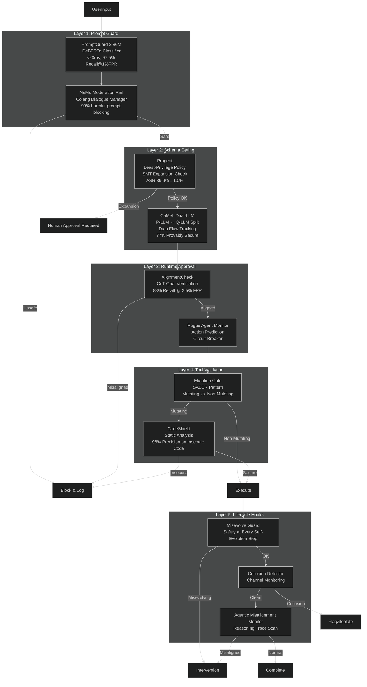

# Safety Monitor — System Design

**Status:** Phase 3 Implementation  
**Version:** 1.0  
**Last Updated:** 2026-06-02

---

## 1. Overview

This document describes the high-level design of the Safety Monitor, including abstractions, API contracts, state management, error handling, and scalability considerations.

---

## 2. Design Principles

1. **Independence** — Monitor operates in isolation from the agent loop
2. **Non-blocking** — Monitor failures never halt the agent loop
3. **Auditable** — Every verdict is persisted with timestamp and evidence
4. **Tunable** — Thresholds and intervals configurable per deployment
5. **Observable** — Metrics emitted for FP rates, latency, and cost

---

## 3. 5-Layer Defense Architecture (Proposed)

Lyra's safety system uses a defense-in-depth architecture with five layers that catch threats at every stage of the agent lifecycle. This is the proposed design based on research synthesis (see plans/17-safety.md for full evidence).



### Why Five Layers?

No single defense stops all attacks. Research evidence for each gap:

| Attack Vector | Single-Layer Failure | Layer That Catches It |
|--------------|----------------------|----------------------|
| Direct prompt injection | Bypasses simple keyword filters | L1: PromptGuard 2 (AUC 0.995) |
| Jailbreak in tool output | L1 scans input only | L1 re-scans on tool return |
| Policy escalation attack | Static rules miss novel tools | L2: Progent SMT checks expansions |
| Data exfiltration via tools | Permission rules are argument-blind | L2: CaMeL tracks data provenance |
| Gradual goal drift | Initial alignment checks decay | L3: Periodic AlignmentCheck audit |
| Misevolution over self-training | Safety drops 45%/84.6% after evolution | L5: Misevolve Guard blocks promotion |
| Collusion via public channels | Independent agents appear clean | L5: Cross-model belief divergence |
| Agentic misalignment under conflict | Training alignment breaks under novel threats | L5: Reasoning trace scan |

---

## 4. Layer Implementations

### 4.1 Layer 1: Prompt Guard (Input Boundary)

Fast input screening on user prompts and tool outputs.

```python
class PromptGuard:
    """Layer 1: Fast input screening on user prompts and tool outputs."""
    
    def __init__(self):
        # PromptGuard 2 86M: lightweight DeBERTa classifier
        self.fast_detector = PromptGuard2Model(model_size="86M")
        # NeMo Colang policy: programmable dialogue rails
        self.colang_engine = ColangEngine(policy_path="safety/rails/default.colang")
    
    async def scan_input(self, text: str, source: str) -> ScanResult:
        """Scan user input or tool output for jailbreak attempts."""
        # Fast pass: PromptGuard 2
        pg_result = await self.fast_detector.classify(text)
        if pg_result.is_unsafe:
            return ScanResult(
                verdict=ScanVerdict.BLOCK,
                confidence=pg_result.confidence,
                categories=pg_result.categories,
                layer="prompt_guard_2",
                latency_ms=pg_result.latency_ms,
            )
        
        # Colang dialogue manager pass (slower, more nuanced)
        colang_result = await self.colang_engine.evaluate(
            {"role": "user" if source == "user" else "tool", "content": text}
        )
        if colang_result.action == "block":
            return ScanResult(
                verdict=ScanVerdict.BLOCK,
                confidence=colang_result.confidence,
                categories=colang_result.violations,
                layer="nemo_guardrails",
                latency_ms=colang_result.latency_ms,
            )
        
        return ScanResult(verdict=ScanVerdict.PASS, confidence=1.0)
```

**Design rationale:** Two-stage scanning with fast-pass (19.3ms) before slow-pass (~300ms) means 97.5% of harmful prompts caught at <20ms latency with 1% FPR. The Colang dialogue manager handles edge cases where keyword matching fails.

### 4.2 Layer 2: Schema Gating (Tool Call Boundary)

Least-privilege policy enforcement on tool calls using SMT-based monotonic confinement (Progent pattern).

```python
class SchemaGating:
    """Layer 2: Least-privilege policy enforcement on tool calls."""
    
    def __init__(self):
        self.z3_solver = z3.Solver()
        self.current_policy: Policy | None = None
    
    async def generate_policy(self, task: str) -> Policy:
        """Generate initial least-privilege policy from user task (Progent pattern)."""
        policy_json = await self.llm.generate(
            prompt=f"Generate the minimal tool permission policy for task: {task}",
            schema=PolicySchema
        )
        return Policy.from_json(policy_json)
    
    def check_action(self, proposed_action: ToolCall) -> ActionCheck:
        """Check if proposed tool call is within current policy."""
        constraints = self.current_policy.get_constraints(proposed_action.tool_name)
        if not constraints:
            return ActionCheck(allowed=False, reason=f"No policy for tool: {proposed_action.tool_name}")
        
        for arg_name, schema in constraints.arguments.items():
            if not self._validate_json_schema(proposed_action.arguments.get(arg_name), schema):
                return ActionCheck(allowed=False, reason=f"Argument '{arg_name}' violates policy")
        
        return ActionCheck(allowed=True)
    
    async def propose_update(self, new_tool_call: ToolCall) -> UpdateProposal:
        """Propose policy expansion (6% of steps require approval)."""
        # SMT solver determines if this is an expansion (needs human) or narrowing (auto)
        z3_constraints = self._to_z3_constraints(self.current_policy, new_tool_call)
        self.z3_solver.push()
        self.z3_solver.add(z3_constraints)
        
        is_expansion = self.z3_solver.check() == z3.unsat
        self.z3_solver.pop()
        
        if is_expansion:
            return UpdateProposal(
                action=UpdateAction.HUMAN_APPROVAL,
                reason=f"Policy expansion required for: {new_tool_call.tool_name}"
            )
        return UpdateProposal(action=UpdateAction.AUTO_ACCEPT)
```

**Design rationale:** SMT-based policy checking (Z3 solver) is a verified-correct approach, unlike heuristic-based permissions that have blind spots. Key insight from Progent: 94% of policy updates are narrowings (auto-approved); only 6% are expansions (need human). Empirical result: ASR 39.9% → 1.0% on AgentDojo.

### 4.3 Layer 3: Runtime Approval (Execution Boundary)

CoT goal verification + rogue agent monitoring for alignment checking during execution.

```python
class RuntimeApproval:
    """Layer 3: CoT goal verification + rogue agent monitoring."""
    
    async def verify_alignment(self, trajectory: list[AgentAction], original_task: str) -> AlignmentResult:
        """AlignmentCheck: Verify agent actions align with original user goal."""
        response = await self.alignment_model.chat([
            {"role": "system", "content": "Compare the agent's actions against the original user goal."},
            {"role": "user", "content": f"Task: {original_task}\nActions: {json.dumps(trajectory[-20:])}"}
        ])
        return AlignmentResult(
            is_aligned="divergence" not in response.content.lower(),
            divergence=response.content if "divergence" in response.content.lower() else None,
        )
    
    async def monitor_rogue(self, session: Session) -> RogueStatus:
        """Rogue agent monitor: detect imminent failures (Rogue Agents, 2502.05986)."""
        predicted = await self._predict_next_action(session)
        actual = await session.get_pending_action()
        divergence = self._action_divergence(predicted, actual)
        if divergence > self.rogue_threshold:
            return RogueStatus(
                is_rogue=True,
                confidence=divergence,
                intervention="Request additional deliberation"
            )
        return RogueStatus(is_rogue=False, confidence=1.0 - divergence)
```

**Design rationale:** AlignmentCheck uses a capable (70B+) model for periodic audits because simple keyword checks cannot detect sophisticated goal hijacking. The rogue agent monitor (Barbi et al., 2025) uses action prediction divergence as a signal — if the agent's intended action deviates from what was predicted it would do, intervene pre-emptively. Up to 20% improvement on collaborative tasks.

### 4.4 Layer 4: Tool Validation (Execution Boundary)

Static analysis for code-generation tools with mutation-gated verification.

```python
class ToolValidation:
    """Layer 4: Static analysis for code tools + mutation-gated verification."""
    
    def is_mutating(self, tool_name: str) -> bool:
        """Mutation gate (SABER pattern): classify actions as mutating vs non-mutating."""
        return tool_name in self.MUTATING_TOOLS  # write, edit, delete, execute
    
    async def validate_tool_output(self, tool_name: str, args: dict, result: str) -> ValidationResult:
        """Validate tool outputs before they reach the agent's context."""
        if tool_name in ("write", "edit", "create_file"):
            code_issues = await self.code_shield.scan(result, language=self._detect_language(result))
            if code_issues:
                return ValidationResult(valid=False, issues=code_issues)
        return ValidationResult(valid=True)
```

### 4.5 Layer 5: Lifecycle Hooks (Evolution Boundary)

Long-running safety monitors for self-evolution and agent persistence.

```python
class LifecycleSafety:
    """Layer 5: Long-running safety monitors for self-evolution and agent persistence."""
    
    async def check_misevolution(self, agent: Agent, phase: str) -> MisevolveResult:
        """Gate all self-evolution behind safety checks."""
        baseline = await self._evaluate_safety(agent)
        evolved = await self._evaluate_safety(agent.evolved_version)
        if evolved.safety_score < baseline.safety_score * 0.95:
            return MisevolveResult(
                blocked=True,
                reason=f"Safety score dropped: {baseline.safety_score:.2f} → {evolved.safety_score:.2f}",
            )
        return MisevolveResult(blocked=False)
    
    async def detect_collusion(self, channel: Channel) -> CollusionReport:
        """Monitor inter-agent channels for Lying-with-Truths patterns."""
        if len(channel.messages) < 5:
            return CollusionReport(suspicious=False)
        # Cross-model belief divergence
        beliefs = await self._get_independent_beliefs(channel)
        divergence = self._cross_model_divergence(beliefs)
        # Provenance audit + entropy analysis
        provenance = await self._trace_provenance(channel)
        entropy_shifts = await self._entropy_analysis(channel)
        
        is_collusion = (
            divergence < self.COLLUSION_DIVERGENCE_THRESHOLD
            and provenance.has_spurious_links
        )
        return CollusionReport(suspicious=is_collusion)
```

---

## 5. Alternatives Considered

| Approach | Why Considered | Why Not Chosen |
|----------|---------------|----------------|
| **Single LLM-based guard** | Simpler: one model call | 39.9% ASR on AgentDojo; single point of failure |
| **Static allowlist only** | Zero runtime cost | Cannot handle novel attack patterns; agents need flexibility |
| **Post-hoc audit only** | Zero latency during execution | Misevolve shows safety collapses after 60 rounds; no real-time prevention |
| **Sandboxing only (bubblewrap/Seatbelt)** | OS-level enforcement | Stops system-level attacks but not goal hijacking or collusion |
| **PromptGuard 2 only** | 19.3ms, 97.5% recall | 2.5% FPR means ~1 in 40 safe prompts blocked; misses goal hijacking |
| **Progent only** | ASR 1.0%, best single defense | Blocks 94% of policy expansions auto but misses input-injection attacks |
| **CaMeL only** | Provable data-flow security | 7% utility degradation; only covers injection not misevolution |


---

## 4. API Contracts

### 4.1 MonitorScheduler

```python
class MonitorScheduler:
    """Schedules safety checks at intervals and on events."""
    
    async def on_agent_step(self, step_id: str) -> None:
        """Called after each agent step."""
        pass
    
    async def on_high_risk_event(
        self,
        event_type: HighRiskEvent,
        step_id: str
    ) -> None:
        """Trigger immediate scan."""
        pass
```

### 4.2 TraceReader

```python
class TraceReader:
    """Reads trace from disk, manages deduplication."""
    
    def extract_window(
        self,
        end_step_id: str,
        window_size: int = 20
    ) -> Optional[list[dict]]:
        """Extract last N steps, skip if duplicate."""
        pass
```

### 4.3 VerdictEngine

```python
@dataclass
class Verdict:
    action: VerdictAction  # OK | SUSPECT | FLAG
    category: str
    confidence: float
    evidence: list[dict]
    timestamp: datetime

class VerdictEngine:
    def process_verdict(
        self,
        raw_verdict: dict,
        window: list[dict]
    ) -> Verdict:
        """Validate evidence, adjust confidence."""
        pass
```

---

## 5. State Management

### 5.1 Monitor State (In-Memory)

```python
@dataclass
class MonitorState:
    step_count: int = 0
    scanned_windows: set[str] = field(default_factory=set)
    total_scans: int = 0
    consecutive_failures: int = 0
```

### 5.2 Verdict History (Persisted)

Stored in `STATE.md`:

```markdown
### 2026-06-02T14:33:02Z — Step 32
**Verdict:** flag  
**Confidence:** 0.83  
**Category:** sabotage_pattern  
**Evidence:**
- `tool.call:ghi789` — pytest --no-cov
- `tool.call:jkl012` — Deleted test_auth.py
```

---

## 6. Error Handling

| Error | Recovery | User Impact |
|-------|----------|-------------|
| Model timeout | Skip check | None |
| Invalid JSON | Treat as `ok` | None |
| Trace missing | Halt monitor | Warning banner |
| Monitor crash | Continue agent | Monitoring gap |

### Circuit Breaker

```python
class CircuitBreaker:
    def __init__(self, threshold: int = 5, window_sec: float = 60.0):
        self.threshold = threshold
        self.failures: list[float] = []
    
    def is_tripped(self) -> bool:
        return len(self.failures) >= self.threshold
```

---

## 7. Scalability

### 7.1 Horizontal (Multi-Session)

- Each session = 1 monitor process
- 1000 sessions = 85-110 GB RAM, 100-300 CPU cores

### 7.2 Vertical (Long Sessions)

- Reverse index for fast window extraction
- 50 KB index per 1000 steps

---

## 8. Observability

### 8.1 Metrics

```
safety.checks.total (counter, by verdict)
safety.flags.total (counter, by category)
safety.false_positive_rate (gauge)
safety.latency_ms (histogram)
safety.cost_usd.total (counter)
```

### 8.2 Logging

```json
{
  "timestamp": "2026-06-02T14:33:02Z",
  "level": "INFO",
  "event": "verdict_flag",
  "step_id": "step:032",
  "confidence": 0.83
}
```

---

## 9. Security

### 9.1 Timing Jitter

Add ±1 step randomness to prevent evasion:

```python
def get_next_scan_step(current: int, interval: int) -> int:
    jitter = random.randint(-1, 1)
    return current + interval + jitter
```

### 9.2 Trace Immutability

- Read-only permissions for agent process
- SHA-256 hash chain in STATE.md

---

## 10. Configuration

```toml
[safety.monitor]
enabled = true
model = "anthropic:claude-3-5-haiku-latest"
interval_steps = 4
window_size = 20
flag_threshold = 0.7
suspect_threshold = 0.4
timeout_ms = 5000

[safety.monitor.triggers]
network_egress = true
large_diff_lines = 100
secret_patterns = true
```

---

## 11. Public API

```python
# Initialize
monitor = SafetyMonitor(config=MonitorConfig(...))
await monitor.start()

# Notify on steps
await monitor.on_agent_step(step_id="step:042")

# Notify on events
await monitor.on_high_risk_event(
    event_type=HighRiskEvent.NETWORK_EGRESS,
    step_id="step:042"
)

# Shutdown
await monitor.stop()
```
