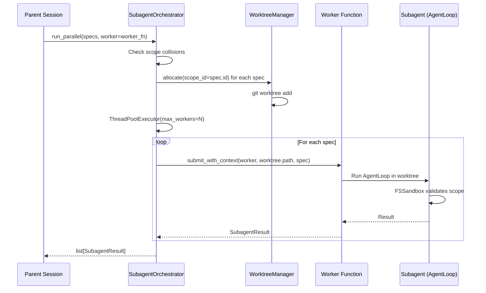

# Subagent Worktree Architecture

## Overview

The Subagent Worktree system provides isolated execution environments for concurrent agent operations using git worktrees as the isolation boundary. This architecture enables parallel work, context reduction, and safe experimentation without context pollution or file conflicts.

**Source**: `packages/lyra-core/src/lyra_core/subagent/` (13 files)

## Module Structure

```
packages/lyra-core/src/lyra_core/subagent/
├── __init__.py              # Public API
├── orchestrator.py          # SubagentOrchestrator
├── worktree.py              # WorktreeManager
├── runner.py                # Subagent runner/execution
├── scheduler.py             # Subagent scheduling
├── fs_sandbox.py            # Filesystem scope sandbox
├── handoff.py               # Inter-agent handoff
├── merge.py                 # Result merging
├── bundle.py                # Subagent bundling
├── cache_prewarm.py         # Worktree cache prewarming
├── registry.py              # Subagent registry
├── presets.py               # Subagent presets/templates
└── variants.py              # Subagent variant configurations
```

## Core Components

### 1. SubagentOrchestrator (`orchestrator.py`)

Lifecycle management of subagent instances:

```python
from lyra_core.subagent.orchestrator import (
    SubagentOrchestrator,
    SubagentSpec,
    SubagentResult,
)

@dataclass
class SubagentSpec:
    id: str
    scope_globs: list[str] = field(default_factory=list)

@dataclass
class SubagentResult:
    id: str
    status: str  # "ok" | "error"
    payload: object | None = None
    error: str | None = None

WorkerFn = Callable[[Path, SubagentSpec], object]

class SubagentOrchestrator:
    def __init__(self, repo_root: Path, max_depth: int = 2): ...

    def check_spawn_depth(self, *, current_depth: int) -> None:
        """Check if spawn depth would exceed max_depth."""

    def run_parallel(
        self, specs: list[SubagentSpec], *, worker: WorkerFn
    ) -> list[SubagentResult]:
        """Run multiple subagents in parallel with scope collision detection."""
```

**Key differences from older documentation:**
- **`run_parallel()`** (not `spawn()`) is the primary execution method
- Uses `ThreadPoolExecutor` with context-aware submission (`submit_with_context`)
- Blocks until all subagents complete (no `spawn()` with async semantics)

### 2. WorktreeManager (`worktree.py`)

Git worktree allocation, lifecycle, and cleanup:

```python
class WorktreeManager:
    def __init__(self, repo_root: Path): ...

    def allocate(self, *, scope_id: str) -> WorktreeAllocation:
        """
        Create a new git worktree on a scoped branch.

        Note: allocate() takes a single scope_id parameter,
        NOT (session_id, subagent_id) as previously documented.
        """
```

**Key differences:** `allocate(scope_id)` replaces the previously documented `allocate(session_id, subagent_id)`.

### 3. Runner (`runner.py`)

Subagent execution engine:
- Builds context from parent session (SOUL, plan summary, purpose, scope)
- Instantiates AgentLoop with narrowed tools
- Enforces scope via FSSandbox
- Manages tool allowlist filtering

### 4. FSSandbox (`fs_sandbox.py`)

Filesystem scope enforcement:

```python
class FSSandbox:
    def __init__(self, root: Path, scope_globs: list[str]): ...
    def is_in_scope(self, path: Path) -> bool: ...
    def validate_write(self, path: Path) -> None: ...
    def validate_read(self, path: Path) -> None: ...
```

Validates that all write operations stay within declared scope patterns.

### 5. Scheduler (`scheduler.py`)

Manages subagent execution scheduling:
- Wave-based parallel execution
- Dependency resolution between subagents
- Resource allocation

### 6. Handoff (`handoff.py`)

Inter-subagent communication and state handoff:
- State transfer between subagents
- Result sharing
- Context inheritance

### 7. Merge (`merge.py`)

Result merging across subagent worktrees:
- Commit collection from worktrees
- Merge conflict resolution
- Fast-forward merge attempts

### 8. Bundle (`bundle.py`)

Subagent bundling for software distribution:
- Package subagent configurations
- Lifecycle events via `LifecycleEvent.BUNDLE_*`

### 9. Cache Prewarm (`cache_prewarm.py`)

Worktree cache prewarming for faster subagent startup.

### 10. Registry / Presets / Variants

Supporting files for subagent management:
- **registry.py**: Subagent type registration
- **presets.py**: Predefined subagent configurations
- **variants.py**: Model/prompt variant selection

## Data Flow

### Parallel Subagent Execution



## Concurrency Model

```python
from concurrent.futures import ThreadPoolExecutor

# Submit with context-aware submission
from lyra_core.concurrency import submit_with_context

with ThreadPoolExecutor(max_workers=max(1, len(allocations))) as pool:
    fut_map = {
        submit_with_context(pool, worker, wt.path, spec): spec
        for spec, wt in allocations
    }
```

- Uses `ThreadPoolExecutor` (not custom ConcurrencyLimiter)
- `submit_with_context` snapshots contextvars for proper trace ID propagation in workers
- Recursion depth limit: 2 (configurable)

## Technology Stack

| Component | Technology | Rationale |
|-----------|-----------|-----------|
| Isolation | Git worktrees | Native git, zero file system overlap |
| Concurrency | ThreadPoolExecutor + contextvars | Pythonic, trace-safe |
| Scope enforcement | FSSandbox glob matching | Path-based security |
| Model routing | Provider-agnostic | Through parent session config |
| Artifacts | ArtifactStore with content hashing | Traceable results |

## Key Differences from Earlier Documentation

| Claimed (Outdated) | Actual |
|-------------------|--------|
| SubagentOrchestrator.spawn() | SubagentOrchestrator.run_parallel() |
| WorktreeManager.allocate(session_id, subagent_id) | WorktreeManager.allocate(scope_id=...) |
| Subagent class with run(), _build_llm_smart() | Runner in runner.py (different structure) |
| ConcurrencyLimiter with Semaphore + disk/cost | ThreadPoolExecutor with submit_with_context |
| ConcurrencyLimiter.can_spawn() | Simpler max_workers approach |
| Specific model names (deepseek-v4-pro) | Provider-agnostic model selection |
| 12 files (some incorrect names) | 13 files (actual, correct names) |
| subagent/isolation.py | No such file; scope via FSSandbox |
| Explicit dependency versions | Not hardcoded in subagent module |

## Security Boundaries

1. **Filesystem Isolation**: FSSandbox enforces scope at write time
2. **Tool Restriction**: Only allowed tools available to subagent
3. **Recursion Limit**: Depth-2 cap prevents runaway spawning
4. **Scope Collision Detection**: Overlapping scopes raise ScopeCollisionError
5. **Permission Inheritance**: Subagent cannot escalate beyond parent's permissions

## Related Documentation

- [Block 01: Agent Loop](../agent-loop/architecture.md)
- [Block 03: DAG Teams](../dag-teams/architecture.md)
- [Block 04: Permission Bridge](../permission-bridge/architecture.md)
- [Architecture Tradeoffs](./architecture-tradeoffs.md)
- [System Design](./system-design.md)
- [Implementation Guide](./implementation-guide.md)
- [Deep Dive](./deep-dive.md)
