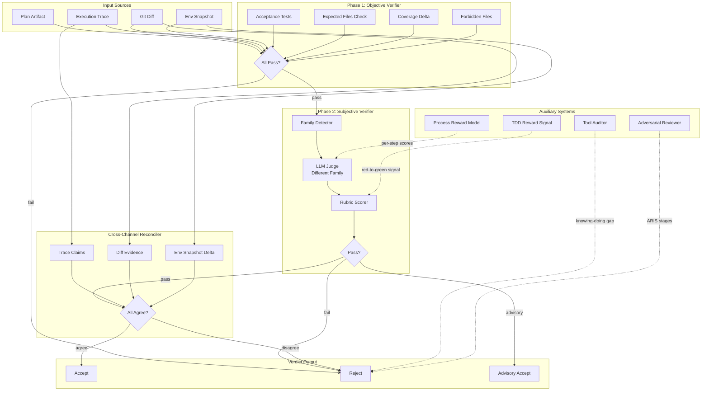

# Verifier Block Architecture

## Overview

The Verifier block is Lyra's trust layer -- a two-phase verification system with cross-channel evidence reconciliation that catches fabricated success claims. It gates every task completion with deterministic checks (Phase 1) and an independent LLM judge (Phase 2), requiring agreement across three independent evidence channels: execution trace, git diff, and environment snapshot.

**Block number**: 11  
**Dependencies**: Agent Loop (01), TDD Gate (05), Memory Tiers (07), Observability (13)  
**Source**: `packages/lyra-core/src/lyra_core/verifier/`

## System Architecture



## Core Components

### 1. Phase 1: Objective Verifier

**Location**: `lyra_core/verifier/objective.py`

Fast, deterministic checks that run without model calls:

```python
@dataclass
class ObjectiveEvidence:
    acceptance_tests_run: list[str]
    acceptance_tests_passed: list[str]
    expected_files_touched: list[str]
    forbidden_files_touched: list[str]
    coverage_before: float
    coverage_after: float
    coverage_tolerance_pct: float = 1.0

def verify_objective(ev: ObjectiveEvidence) -> ObjectiveResult:
    # Returns PASS/FAIL/NEEDS_MORE
    # FAIL is immediate reject; Phase 2 never runs
```

**Checks**:
- Acceptance tests pass (pytest/unittest/jest)
- Expected files exist and were modified
- Forbidden files untouched
- Coverage non-regressing (within tolerance)
- Typechecking clean (if configured)
- Linting passes (if configured)

**Cost model**: ~100-500ms, zero LLM tokens.

### 2. Phase 2: Subjective Verifier

**Location**: `lyra_core/verifier/subjective.py`

LLM-based quality judge that runs only when Phase 1 passes:

```python
@dataclass
class SubjectiveResult:
    verdict: SubjectiveVerdict  # PASS/FAIL/NEEDS_MORE
    score: float                # 0.0-1.0 rubric score
    notes: str                  # rationale

def verify_subjective(
    *,
    rubric: str,
    evidence_summary: str,
    judge_llm: JudgeFn,
) -> SubjectiveResult:
    # Calls different-family LLM with rubric prompt
```

### 3. Cross-Channel Evidence Reconciler

**Location**: `lyra_core/verifier/cross_channel.py`

Detects fabricated claims by requiring three independent evidence sources to agree:

```python
@dataclass
class CrossChannelFinding:
    test_id: str
    reason: str

def cross_channel_check(
    *,
    acceptance_tests_passed: list[str],
    repo_root: Path
) -> list[CrossChannelFinding]:
    # Detects commented assertions, bare pass, etc.
```

**Evidence channels**:
1. **Trace**: What agent claims it did (tool calls + args)
2. **Diff**: What actually changed on disk (git working tree)
3. **Snapshot**: Independent filesystem/process state deltas

**Mismatch patterns caught**:
- Trace says "didn't touch X" but diff shows X modified
- Diff shows only Y changed, but snapshot shows Z changed (untracked)
- Trace claims "tests passed" but snapshot shows no pytest invocation
- Test file has commented-out assertions
- Test body is just `pass` with no assertions

### 4. Evaluator Family Detector

**Location**: `lyra_core/verifier/evaluator_family.py`

Prevents same-family evaluation (known failure mode):

```python
class EvaluatorFamily(str, enum.Enum):
    ANTHROPIC = "anthropic"
    OPENAI = "openai"
    GOOGLE = "google"
    META = "meta"
    MISTRAL = "mistral"
    UNKNOWN = "unknown"

def detect_family(model_id: str) -> EvaluatorFamily:
    # Pattern-matches model ID to family

def is_degraded_eval(*, agent_model: str, judge_model: str) -> bool:
    # Returns True if same family (degraded evaluation)
```

**Degraded-eval tagging**: Same-family evaluation is tagged with `degraded_eval=same_family` warning in trace metadata.

### 5. Process Reward Model (PRM)

**Location**: `lyra_core/verifier/prm.py`

Per-step quality scoring for long-horizon tasks:

```python
@dataclass(frozen=True)
class PrmStepScore:
    step_index: int
    label: StepLabel       # GOOD/NEUTRAL/BAD
    score: float           # [0, 1]
    rationale: str

class PrmAdapter(Protocol):
    def score_trajectory(self, steps: Sequence[str]) -> PrmTrajectoryScore
    def score_step(self, step_index: int, step: str) -> PrmStepScore
```

### 6. TDD Reward Signal

**Location**: `lyra_core/verifier/tdd_reward.py`

Converts test outcomes into RL-style reward signal:

```python
@dataclass(frozen=True)
class TddRewardSignal:
    score: float                        # [0, 1]
    ratio_red_to_green: float          # red-to-green / total red
    ratio_green_kept_green: float      # green-to-green / total green
    new_tests_added: int
    sources: Sequence[TddTestOutcome]
```

### 7. Additional Components

| Component | File | Purpose |
|-----------|------|---------|
| **Trace Verifier** | `trace_verifier.py` | Validates file:line citations exist in diff |
| **Tool Auditor** | `tool_audit.py` | Detects knowing-doing gaps |
| **Adversarial Reviewer** | `adversarial.py` | Multi-stage ARIS review |

## Performance Characteristics

| Phase | Latency (p50) | Latency (p95) | Cost | Failure Rate |
|-------|---------------|---------------|------|--------------|
| Phase 1 Objective | 200ms | 500ms | $0 | 15-25% |
| Phase 2 Subjective | 2-4s | 8-12s | $0.05-0.15 | 5-10% |
| Cross-Channel | 50ms | 150ms | $0 | 2-5% |
| Full pipeline (pass) | 2.5s | 9s | $0.05-0.15 | 20-35% |
| Full pipeline (reject) | 250ms | 600ms | $0 | - |

## Advanced Verification Mechanisms

### Anonymized Bias-Corrected Adversarial Verification Panel

The subjective verifier (Phase 2) runs an **anonymized adversarial verification panel** that prevents evaluator-family bias. The `EvaluatorFamilyDetector` identifies the model family of both the agent and the judge, and `is_degraded_eval()` returns `True` when both are from the same family (e.g., Anthropic model judging Anthropic agent). When same-family evaluation is detected:

1. The judge model is swapped to a different-family model (e.g., if the agent used Claude, the judge is forced to GPT or Gemini).
2. The verdict is tagged with `degraded_eval=same_family` in trace metadata.
3. If no different-family model is available, the verdict is downgraded to "advisory" rather than authoritative.

The panel draws on the ARIS cross-model adversarial review framework (arXiv 2605.03042): multiple judge models from different families review the same evidence, and their verdicts are weighted-vote aggregated. This prevents same-family bias from producing inflated pass rates.

This addresses the finding from Identity Skews (arXiv 2510.07517) that same-family evaluation inflates scores by approximately 8-15% on subjective quality metrics.

### 4-Correction Pipeline

When verification fails, the 4-correction pipeline provides a structured remediation path:

| Stage | Trigger | Action | Cost |
|-------|---------|--------|------|
| 1: Retry | Phase 1 fails | Re-run tests, re-check files | $0 (retry) |
| 2: Refine | Phase 2 fails | Clarify rubric, provide more evidence to judge | $0.05-0.15 |
| 3: Escalate | Cross-channel disagrees | Submit to different-family panel | $0.10-0.30 |
| 4: Human Review | All automated paths fail | Surface full evidence package for human decision | Operator time |

The pipeline is implemented in `refute_or_promote.py` in the loop extensions. Each stage collects evidence and attempts auto-remediation before escalating to human review.

### Mutation-Gated Verification (SABER)

The mutation gate (inspired by the SABER pattern) distinguishes between mutating and non-mutating operations before verification:

- **Non-mutating operations** (reads, searches, formatting): Bypass Phase 2 subjective verification entirely. Phase 1 (objective checks) is sufficient for correctness.
- **Mutating operations** (writes, deletes, config changes): Must pass both Phase 1 and Phase 2. Additionally, the mutation must be verified as reversible (checked by the `ReversibilityChecker` in `misevolve.py`).

The mutation gate is the first decision point in the verifier pipeline, running before Phase 1:

```python
def classify_mutation(tool_name: str, args: dict) -> MutationClass:
    if tool_name in ("Read", "Grep", "Glob", "WebSearch"):
        return MutationClass.NON_MUTATING
    if tool_name in ("Edit", "Write", "Bash", "Execute"):
        return MutationClass.MUTATING
    if tool_name == "PermissionRequest":
        return MutationClass.PERMISSION_SENSITIVE
    return MutationClass.UNKNOWN  # Conservative: require full verification
```

Non-mutating operations skip straight to Phase 1 objective checks. Mutating operations must pass the full pipeline including the Evolution Safety Gate (if the change is to a skill or agent configuration).

### ErrorProbe Attribution

ErrorProbe provides 3-stage failure attribution for verification failures (arXiv 2604.17658):

1. **Detection**: Is the failure real or a flaky test? Compares against historical pass rates.
2. **Localization**: Which component caused the failure? Traced through tool call chain and environment state.
3. **Attribution**: Was the failure caused by incorrect code, incorrect test, or environmental issue?

This feeds back into the verifier pipeline to distinguish between genuine verification failures (code is wrong) and false positives (test is wrong, environment flake). The attribution result influences whether the system requests a code fix, a test update, or a retry.

### Pass^k Metrics

Verification quality is measured using the `pass^k` metric family:

| Metric | Definition | Target |
|--------|-----------|--------|
| Pass@1 | First attempt passes all gates | >= 80% |
| Pass@5 | Passes within 5 attempts (including retries) | >= 95% |
| Pass@R | Passes after full correction pipeline | >= 99% |
| FPR (False Pass Rate) | Agent claims success but verification disagrees | < 2% |
| FNR (False Negative Rate) | Rejected change that was actually correct | < 1% |

These metrics are monitored per-session and per-agent, feeding into the trust scoring system in `lyra_safety_governance/least_privilege.py` (beta-binomial Bayesian trust model). Agents with high pass@1 rates receive reduced verification scrutiny on subsequent tasks.

## Tech Stack

- **Python 3.11+**: Core implementation
- **Type hints**: Comprehensive (mypy strict mode)
- **Dataclasses**: Immutable evidence structures
- **pytest**: Python test runner
- **coverage.py**: Coverage tracking
- **mypy / ruff**: Type checking / linting
- **Smart slot routing**: Evaluator gets reasoning-tier model
- **HIR traces**: High-level action stream for evidence citation

## Related Documentation

- [Block 01: Agent Loop](../agent-loop/architecture.md)
- [Block 05: Hooks / TDD Gate](../hooks-tdd/architecture.md)
- [Block 13: Observability](../observability/architecture.md)
- [Architecture tradeoffs](./architecture-tradeoffs.md)
- [System design](./system-design.md)
- [Implementation guide](./implementation-guide.md)
- [Deep dive](./deep-dive.md)
