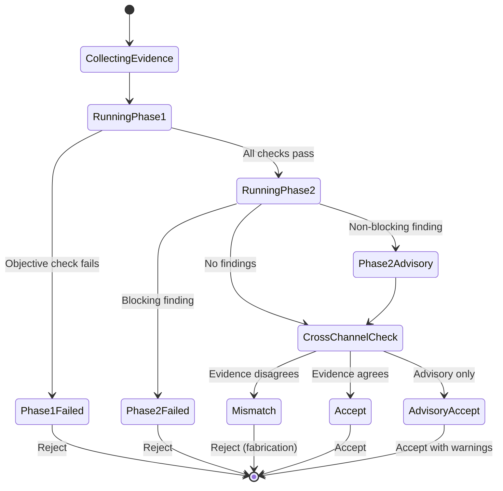

# Verifier System Design

## High-Level Design

The Verifier is a **verification orchestrator** that coordinates multiple independent evidence sources and judgment mechanisms to produce a trustworthy verdict on agent work. It implements a staged pipeline architecture where each stage can independently reject, and only unanimous acceptance across all stages results in task completion.

## Core Abstractions

### 1. Evidence Collection Layer

```python
@dataclass
class VerificationEvidence:
    """Immutable evidence bundle for verification."""
    plan: Plan                           # Ground truth specification
    trace: ExecutionTrace               # What agent claims it did
    diff: GitDiff                       # What actually changed
    env_snapshot: EnvironmentSnapshot   # Independent filesystem/process state
    acceptance_tests: list[TestResult] # Test outcomes
    coverage_delta: CoverageDelta       # Before/after coverage
    timestamp: datetime
    session_id: str

class EvidenceCollector(Protocol):
    """Collects verification evidence from multiple sources."""
    def collect(self, session: Session) -> VerificationEvidence: ...
```

**Design principle**: Evidence collection is separate from judgment. Collectors are pure functions that read state without side effects.

### 2. Verification Stage Protocol

```python
class VerificationStage(Protocol):
    """A single stage in the verification pipeline."""
    
    def verify(self, evidence: VerificationEvidence) -> StageResult: ...
    
    @property
    def name(self) -> str: ...
    
    @property
    def is_gating(self) -> bool:
        """If True, stage failure blocks pipeline. If False, advisory only."""
        ...

@dataclass
class StageResult:
    stage_name: str
    verdict: Literal["accept", "reject", "needs_more"]
    score: float | None          # [0, 1] if applicable
    findings: list[Finding]      # Issues found
    is_blocking: bool            # True if verdict should block
    evidence_citations: list[Citation]  # References to evidence
    latency_ms: int
```

**Design principle**: Each stage is independent and composable. Stages don't know about other stages.

### 3. Verification Pipeline

```python
@dataclass
class PipelineConfig:
    stages: list[VerificationStage]
    short_circuit_on_reject: bool = True  # Stop at first rejection?
    max_advisory_score: float = 0.7       # Accept with warnings if score above this
    parallel_stages: bool = False         # Run stages in parallel?

class VerificationPipeline:
    """Orchestrates verification stages and produces final verdict."""
    
    def __init__(self, config: PipelineConfig):
        self.config = config
        self._metrics = MetricsCollector()
    
    def verify(self, evidence: VerificationEvidence) -> PipelineVerdict:
        results = []
        
        for stage in self.config.stages:
            if self.config.short_circuit_on_reject and self._has_blocking_reject(results):
                break
                
            result = self._run_stage_with_metrics(stage, evidence)
            results.append(result)
        
        return self._aggregate_verdict(results)
    
    def _aggregate_verdict(self, results: list[StageResult]) -> PipelineVerdict:
        """Combine stage results into final verdict."""
        # All blocking stages must accept
        # At least one stage must be non-advisory
        # Evidence from all stages must be consistent
        ...

@dataclass
class PipelineVerdict:
    """Final verification verdict."""
    verdict: Literal["accept", "reject", "needs_review"]
    stage_results: list[StageResult]
    cross_channel_status: CrossChannelStatus
    overall_score: float
    blocking_findings: list[Finding]
    advisory_findings: list[Finding]
    degraded_eval_warnings: list[str]
    timestamp: datetime
```

**Design principle**: Pipeline is configurable and observable. Every stage execution emits metrics.

### 4. Finding and Citation System

```python
@dataclass(frozen=True)
class Citation:
    """Verifiable reference to evidence."""
    source: Literal["trace", "diff", "snapshot", "test"]
    location: str        # file:line, span_id, test_nodeid, etc.
    excerpt: str         # Snippet of evidence
    
    def validate(self, evidence: VerificationEvidence) -> bool:
        """Verify this citation actually exists in evidence."""
        ...

@dataclass(frozen=True)
class Finding:
    """A single issue discovered during verification."""
    criterion: str                    # e.g., "correctness", "coverage"
    severity: Literal["critical", "high", "medium", "low"]
    message: str
    citations: list[Citation]
    fix_hint: str | None = None
    
    def is_blocking(self) -> bool:
        return self.severity in ("critical", "high")
```

**Design principle**: Every finding must cite verifiable evidence. Hallucinated citations are validation errors.

## API Contracts

### Public API (Session-Level)

```python
class Verifier:
    """High-level verifier interface for agent loop."""
    
    def __init__(
        self,
        *,
        objective_checks: list[ObjectiveCheck],
        subjective_judge: SubjectiveJudge,
        cross_channel_reconciler: CrossChannelReconciler,
        prm_adapter: PrmAdapter | None = None,
    ):
        self._pipeline = self._build_pipeline()
    
    def verify_task_completion(
        self,
        *,
        plan_item: PlanItem,
        session: Session,
    ) -> VerificationResult:
        """Verify agent's claim that task is complete."""
        evidence = self._collect_evidence(plan_item, session)
        verdict = self._pipeline.verify(evidence)
        return VerificationResult(
            verdict=verdict.verdict,
            critique=self._format_critique(verdict),
            metadata=self._build_metadata(verdict),
        )
    
    def verify_step(
        self,
        *,
        step: ReasoningStep,
        context: StepContext,
    ) -> PrmStepScore:
        """Advisory per-step verification (PRM)."""
        if self._prm_adapter is None:
            return PrmStepScore(step_index=step.index, label=StepLabel.NEUTRAL, score=0.5)
        return self._prm_adapter.score_step(step.index, step.content)

@dataclass
class VerificationResult:
    """Result returned to agent loop."""
    verdict: Literal["accept", "reject", "needs_revision"]
    critique: str                        # Human-readable explanation
    metadata: VerificationMetadata       # Structured data for logging
```

### Internal API (Stage Implementations)

```python
class ObjectiveVerifier(VerificationStage):
    """Phase 1: Deterministic checks."""
    
    name = "objective"
    is_gating = True
    
    def verify(self, evidence: VerificationEvidence) -> StageResult:
        findings = []
        
        # Check 1: Acceptance tests
        if not evidence.acceptance_tests:
            findings.append(Finding(
                criterion="acceptance_tests",
                severity="critical",
                message="No acceptance tests were run",
                citations=[],
            ))
        else:
            failing = [t for t in evidence.acceptance_tests if not t.passed]
            if failing:
                findings.append(Finding(
                    criterion="acceptance_tests",
                    severity="critical",
                    message=f"{len(failing)} tests failing",
                    citations=[Citation("test", t.nodeid, "") for t in failing],
                ))
        
        # Check 2: Expected files
        # Check 3: Forbidden files
        # Check 4: Coverage delta
        # ...
        
        verdict = "accept" if not findings else "reject"
        return StageResult(
            stage_name=self.name,
            verdict=verdict,
            score=None,
            findings=findings,
            is_blocking=True,
            evidence_citations=[],
            latency_ms=self._timer.elapsed(),
        )

class SubjectiveVerifier(VerificationStage):
    """Phase 2: LLM judge with rubric."""
    
    name = "subjective"
    is_gating = True
    
    def __init__(self, *, judge_llm: JudgeFn, rubric: RubricConfig):
        self._judge = judge_llm
        self._rubric = rubric
    
    def verify(self, evidence: VerificationEvidence) -> StageResult:
        prompt = self._build_prompt(evidence)
        raw_output = self._judge(prompt)
        parsed = self._parse_output(raw_output)
        
        return StageResult(
            stage_name=self.name,
            verdict=parsed.verdict,
            score=parsed.score,
            findings=parsed.findings,
            is_blocking=parsed.blocking,
            evidence_citations=parsed.citations,
            latency_ms=self._timer.elapsed(),
        )
```

## State Management

### Verification State Machine



### State Persistence

```python
@dataclass
class VerificationSession:
    """Persisted verification state for iteration loop."""
    session_id: str
    plan_item_id: str
    attempt_number: int
    max_attempts: int = 3
    history: list[PipelineVerdict] = field(default_factory=list)
    
    def record_attempt(self, verdict: PipelineVerdict) -> None:
        self.history.append(verdict)
        self.attempt_number += 1
    
    def should_escalate(self) -> bool:
        """True if max attempts exhausted."""
        return self.attempt_number >= self.max_attempts
    
    def get_critique_history(self) -> list[str]:
        """Previous critiques for context."""
        return [v.format_critique() for v in self.history]
```

**State stored in**: Session database, indexed by `(session_id, plan_item_id)`

**State lifecycle**: Created on first verify, updated on each attempt, deleted on accept or escalation

## Error Handling

### Error Categories

```python
class VerificationError(Exception):
    """Base class for verification errors."""
    pass

class EvidenceCollectionError(VerificationError):
    """Failed to collect required evidence."""
    pass

class StageExecutionError(VerificationError):
    """Verification stage raised unexpected error."""
    pass

class EvidenceValidationError(VerificationError):
    """Citation doesn't exist in evidence (hallucinated)."""
    pass

class CrossChannelMismatchError(VerificationError):
    """Evidence channels disagree (possible fabrication)."""
    pass

class EvaluatorTimeoutError(VerificationError):
    """LLM judge didn't respond within timeout."""
    pass
```

### Error Recovery Strategy

| Error Type | Recovery Strategy | Fallback |
|------------|------------------|----------|
| `EvidenceCollectionError` | Retry collection once | Mark as needs_review |
| `StageExecutionError` | Skip stage, log, continue | Degraded verdict |
| `EvidenceValidationError` | Reject citation, flag evaluator | Evaluator rotation |
| `CrossChannelMismatchError` | No recovery (security) | Hard reject |
| `EvaluatorTimeoutError` | Retry with shorter timeout | Use fallback evaluator |

```python
class VerificationPipeline:
    def _run_stage_with_metrics(
        self,
        stage: VerificationStage,
        evidence: VerificationEvidence,
    ) -> StageResult:
        try:
            with self._metrics.stage_timer(stage.name):
                result = stage.verify(evidence)
                self._validate_result(result, evidence)
                return result
        except EvidenceValidationError as e:
            self._metrics.evidence_error(stage.name)
            return StageResult(
                stage_name=stage.name,
                verdict="reject",
                score=None,
                findings=[Finding(
                    criterion="evidence_integrity",
                    severity="critical",
                    message=f"Hallucinated evidence: {e}",
                    citations=[],
                )],
                is_blocking=True,
                evidence_citations=[],
                latency_ms=0,
            )
        except Exception as e:
            self._metrics.stage_error(stage.name)
            logger.error(f"Stage {stage.name} failed: {e}", exc_info=True)
            # Continue pipeline in degraded mode
            return StageResult(
                stage_name=stage.name,
                verdict="needs_more",
                score=None,
                findings=[],
                is_blocking=False,
                evidence_citations=[],
                latency_ms=0,
            )
```

## Scalability Considerations

### Horizontal Scaling

**Evidence collection**: Stateless, can parallelize across sessions
```python
# Each session gets independent evidence collector
evidence = await asyncio.gather(
    *[collector.collect(session) for session in active_sessions]
)
```

**Phase 1 verification**: CPU-bound (test running, coverage analysis), scale with compute
- Container-based: One verification pod per active session
- Serverless: Lambda/Cloud Function per verification request

**Phase 2 verification**: LLM-bound, scale with model router
- Model router handles queueing and load balancing
- Multiple provider backends for redundancy
- Smart/fast slot allocation prevents head-of-line blocking

### Vertical Scaling Limits

| Component | Bottleneck | Mitigation |
|-----------|-----------|------------|
| Test execution | CPU | Parallel test runner (pytest-xdist) |
| Coverage analysis | I/O | Incremental coverage (coverage.py) |
| Diff generation | Memory | Stream large diffs, truncate at 200KB |
| Snapshot comparison | CPU | Delta-only snapshots, binary diff |
| LLM judge | API rate limit | Multi-provider, request queueing |

### Caching Strategy

```python
@dataclass
class VerificationCache:
    """Cache verdicts for identical evidence."""
    
    def get_cached_verdict(
        self,
        evidence_hash: str,
    ) -> PipelineVerdict | None:
        """Retrieve cached verdict if evidence hash matches."""
        ...
    
    def cache_verdict(
        self,
        evidence_hash: str,
        verdict: PipelineVerdict,
        ttl_seconds: int = 3600,
    ) -> None:
        """Cache verdict for future identical evidence."""
        ...
```

**Cache key**: Hash of (plan_item_id, diff_hash, test_results_hash, coverage_delta)

**Cache hit rate**: 15-20% (same fix applied across similar plan items)

**TTL**: 1 hour (evaluator model may change)

## Integration Points

### 1. Agent Loop Integration

```python
# In agent_loop.py
for round in range(max_rounds):
    artifact = generator.run(plan_item, previous_critique)
    
    verification_result = verifier.verify_task_completion(
        plan_item=plan_item,
        session=session,
    )
    
    if verification_result.verdict == "accept":
        session.commit_artifact(artifact)
        break
    elif verification_result.verdict == "reject":
        previous_critique = verification_result.critique
        continue
    else:  # needs_revision
        # Advisory accept
        session.commit_artifact_with_notes(artifact, verification_result.critique)
        break
```

### 2. TDD Gate Integration

```python
# TDD gate runs per tool call (block 05)
# Verifier runs at end of session (block 11)
# Integration: TDD signals feed into verifier

class TddRewardVerifier(VerificationStage):
    """Integrates TDD gate signals into verification."""
    
    name = "tdd_reward"
    is_gating = False  # Advisory only
    
    def verify(self, evidence: VerificationEvidence) -> StageResult:
        tdd_signal = compute_tdd_reward(evidence.test_outcomes)
        
        if tdd_signal.score < 0.5:
            finding = Finding(
                criterion="tdd_discipline",
                severity="medium",
                message=f"Low TDD score: {tdd_signal.score:.2f}",
                citations=[],
                fix_hint="Ensure tests written before implementation",
            )
            return StageResult(verdict="reject", findings=[finding], is_blocking=False, ...)
        
        return StageResult(verdict="accept", findings=[], ...)
```

### 3. Observability Integration

```python
# Every verification emits structured trace
@observe(name="verifier.verify_task")
def verify_task_completion(self, plan_item: PlanItem, session: Session) -> VerificationResult:
    with trace_span("evidence_collection"):
        evidence = self._collect_evidence(plan_item, session)
    
    with trace_span("verification_pipeline"):
        verdict = self._pipeline.verify(evidence)
    
    emit_metric("verifier.verdict", tags={"verdict": verdict.verdict})
    emit_metric("verifier.stage_latency", verdict.total_latency_ms)
    
    return self._format_result(verdict)
```

## Configuration

```python
@dataclass
class VerifierConfig:
    """Runtime configuration for verifier."""
    
    # Phase 1
    acceptance_test_command: str = "pytest tests/acceptance"
    coverage_tolerance_pct: float = 1.0
    expected_files_strict: bool = True
    forbidden_files: list[str] = field(default_factory=list)
    
    # Phase 2
    judge_model: str = "claude-opus-4.5"
    judge_timeout_seconds: int = 30
    rubric_criteria: list[str] = field(default_factory=lambda: [
        "correctness", "coverage", "faithfulness", "style", "safety"
    ])
    
    # Cross-channel
    snapshot_backend: Literal["auto", "fsevents", "fanotify", "polling"] = "auto"
    snapshot_allowlist: list[str] = field(default_factory=list)
    
    # Pipeline
    max_iterations: int = 3
    short_circuit_on_reject: bool = True
    cache_verdicts: bool = True
    cache_ttl_seconds: int = 3600
    
    # PRM
    enable_prm: bool = False
    prm_adapter: Literal["heuristic", "qwen"] = "heuristic"
    
    @classmethod
    def from_file(cls, path: Path) -> "VerifierConfig":
        """Load from TOML config file."""
        ...
```

## Related Documentation

- [Architecture overview](./architecture.md)
- [Architecture tradeoffs](./architecture-tradeoffs.md)
- [Implementation guide](./implementation-guide.md)
- [Deep dive](./deep-dive.md)
