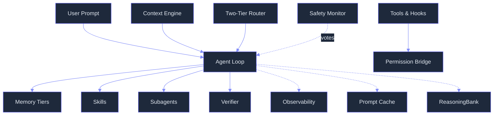

# Concepts Index

> **The mental map of Lyra** — learn what each concept does and where it fits, from beginner to production operator.  
> **Jargon guide:** *nano-model* = small on-device model (e.g., 1B params); *OTel* = [OpenTelemetry](https://opentelemetry.io/), the observability standard; *HIR* = Human-Interpretable Rank, a priority score per span; *prompt cache* = reusable context prefix that avoids recomputing expensive attention on every turn; *fan-out* = one-to-many parallel dispatch to subagents; *worktree* = an isolated git checkout directory whose changes do not pollute sibling worktrees.

##  System Architecture



##  Learning Tracks

###  Beginner — Core Mental Models

*Start here if you are new to Lyra. These explain what Lyra fundamentally is and how it thinks.*

| # | Concept | What You Will Learn |
|---|---|---|
| 1 | [Agent Loop](01-agent-loop.md) | assemble → think → act → persist — the kernel loop |
| 2 | [Tools & Hooks](02-tools-and-hooks.md) | typed actions (tools) + deterministic lifecycle gates (hooks) |
| 3 | [Skills](03-skills.md) | reusable SKILL.md files, loaded by description, auto-curated |
| 4 | [Subagents](04-subagents.md) | scoped agent instances in git worktrees for parallel work |
| 5 | [Plan Mode](05-plan-mode.md) | non-trivial tasks become approvable plan artifacts |

###  Intermediate — System Architecture

*Once you understand the loop, learn how Lyra manages state, memory, permissions, and context.*

| # | Concept | What You Will Learn |
|---|---|---|
| 6 | [Memory Tiers](06-memory-tiers.md) | 4 tiers: working, episodic, semantic, procedural + SOUL persona |
| 7 | [Context Engine](07-context-engine.md) | 5-layer assembly, prompt-cache-aware, SOUL is never compacted |
| 8 | [Sessions & State](08-sessions-and-state.md) | human-readable STATE.md, resumable, filesystem layout |
| 9 | [Permission Bridge](09-permission-bridge.md) | runtime auth — every tool call flows through one function |
| 10 | [Two-Tier Routing](10-two-tier-routing.md) | fast slot (haiku) ↔ smart slot (sonnet) with controlled cascade |

###  Advanced — Production Operations

*For operators extending or deploying Lyra at scale.*

| # | Concept | What You Will Learn |
|---|---|---|
| 11 | [Safety Monitor](11-safety-monitor.md) | continuous nano-model observer voting alongside hooks |
| 12 | [Verifier](12-verifier.md) | 2-phase verification with cross-channel evidence |
| 13 | [Observability](13-observability.md) | every span, cost, decision — OTel-compatible with HIR tags |
| 14 | [Prompt-Cache Coord.](14-prompt-cache-coordination.md) | 1 cache write, N-1 hits per subagent fan-out |
| 15 | [ReasoningBank](15-reasoning-bank.md) | cross-session lessons from success + failure, with test-time scaling |

##  Real Numbers (target estimates)

| Metric | Value | Note |
|---|---|---|
| Fast-turn latency | ~1.2 s | Haiku 4.5, zero-tool turn |
| Smart-turn latency | ~4.5 s | Sonnet 4.6, with planning |
| Prompt cache hit rate | 70-90% | Sustained after turn 2 |

##  Config Example — Concepts in YAML

```yaml
# lyra.yaml — concepts mapped to configuration
agent_loop:
  model: claude-sonnet-4.6
  max_turns: 50
context_engine:
  layers: [soul, project, session, plan, conversation]
  prompt_cache: true
memory:
  working: { ttl: 7d }
  episodic: { ttl: 30d, backend: sqlite }
  semantic: { backend: vector }
permissions:
  mode: require_approval
safety_monitor:
  nano_model: llama-guard-3-1b
routing:
  fast: haiku-4.5
  smart: sonnet-4.6
```

##  Reading Order

Pages are written so each concept assumes the one before it in its learning track. If you only read three, start with [Agent Loop](01-agent-loop.md), [Permission Bridge](09-permission-bridge.md), and [Skills](03-skills.md) — they are the load-bearing concepts everything else rests on. Each concept page links to its implementation block in `docs/blocks/` and its build spec in `docs/lyra-upgrade/plans/`.
