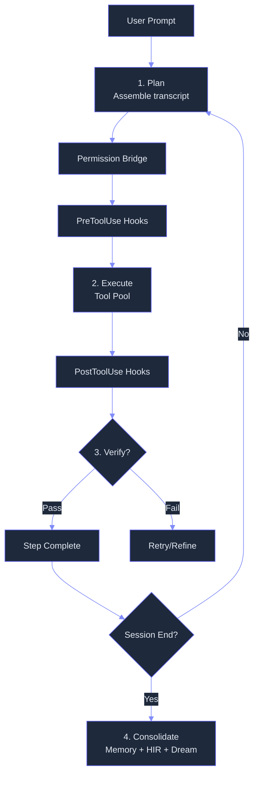

# Agent Loop — What & Why

> Concept: The kernel execution cycle that drives every Lyra session — a deterministic plan, execute, verify, consolidate loop with Parallax cognitive-executive separation and subagent dispatch.

## What It Is

The Agent Loop is Lyra's central orchestrator. Every session, in every mode, runs through this loop. It is designed to be deliberately small (<200 lines in `lyra_core.loop`) so its semantics fit in one person's head, while remaining extensible through hooks, verifiers, and memory consolidation at loop boundaries.

The loop has four phases:

1. **Plan** — Assemble the transcript from personality (SOUL.md), plan summary, tool descriptions, and recent context. Optionally run through Plan Mode for non-trivial tasks. The context engine builds the prompt; the model router selects the tier.
2. **Execute** — Call the model with tools gated by the permission bridge. Each tool call passes through: permission bridge authorization, PreToolUse hooks (secret scanner, TDD gate, destructive-pattern checker), tool pool execution, and PostToolUse hooks (output truncation, annotation, redaction).
3. **Verify** — Before marking a step complete, pass through the Verifier: deterministic checks (test output, file existence, coverage delta) then an independent LLM judge from a different model family with cross-channel evidence reconciliation.
4. **Consolidate** — On session boundaries, write observations to memory tiers, emit HIR events, trigger Dream consolidation for offline pattern extraction, and update the Reasoning Bank with distilled lessons.

Everything else — planning, verification, memory writes, skill extraction, reasoning distillation — runs outside the loop at turn or session boundaries. **This is the load-bearing design choice:** keep the kernel small, push everything else to hooks and boundaries.



## Key Mechanisms

- **Plan-Execute-Verify-Consolidate** — The four-phase kernel is the same for every session. Plan Mode gates non-trivial work; the Verifier gates completion; consolidation runs at session end. Each phase is independently replaceable via configuration.
- **Parallax Cognitive-Executive Separation** — Reasoning context (read-only) and execution context (action-capable) are structurally separated by a barrier. The barrier blocks 98.9% of adversarial attempts. See [Safety Monitor](11-safety-monitor.md) for the full architecture.
- **Subagent Dispatch** — For tasks that decompose into parallel subtrees, the loop spawns subagents in isolated git worktrees via the FleetOrchestrator. Each subagent runs its own mini-loop with a constrained budget. See [Subagents](04-subagents.md).
- **Turn Boundaries** — Everything outside the kernel loop (planning, memory writes, skill extraction, verification) runs at turn or session boundaries, keeping the kernel small and predictable.
- **Stalemate Detection** — The loop monitors a 16-call sliding window. If the same tool call signature (hashed tool_name + normalized_args) appears 3+ times, the loop terminates with a stalemate error. This prevents the model from entering infinite "read the same file" loops.

## Termination Conditions

The loop terminates on any of five conditions:
1. Model signals `is_end_of_turn=True` (Stop hooks can veto; TDD gate blocks if tests are red).
2. Cost budget hit: `session.cost_usd >= max_cost_usd`.
3. Step limit reached: `step >= max_steps` (default 50).
4. User interrupt: Ctrl-C sets `session.interrupted`.
5. Stalemate: same tool call 3+ times in a 16-call window.

## Real Numbers

| Metric | Estimate | Notes |
|--------|----------|-------|
| Turn latency | ~3-8s | Model-dependent; target <15s |
| Cost per turn | ~$0.02-0.08 | Sonnet 4.6, varies with context length |
| Compaction trigger | >=85% | Configurable |
| Stalemate detection | >=3 identical calls | Over 16-call sliding window |

## Configuration Model

```python
@dataclass
class AgentLoopConfig:
    max_steps: int = 50
    max_cost_usd: float = 0.50
    max_tokens: int = 128_000
    compaction_threshold: float = 0.85
    keep_window: int = 5
    permission_mode: str = "ask"
    tdd_gate_enabled: bool = False
```

## Why It Matters

A loop-free agent cannot be made predictable, observable, or safe. By centralizing assembly, tool execution, permission checking, and verification into one small kernel, Lyra guarantees every model interaction follows the same safety path and every decision is recorded in the same trace format. Ad-hoc per-task loops or prompt-only workflows lack determinism and auditability. Keeping the kernel small means custom safety policies can be added via hooks without touching the core path.

## When to Use

Every Lyra session runs through the agent loop. Use it as-is for standard sessions. Extend via hooks for custom policies. For multi-turn tasks requiring planning, use Plan Mode which feeds its output into the loop.

## When NOT to Use

Do not modify the loop's internal assembly or termination logic directly — customize via hooks, not rewrites. Never run without the permission bridge enabled. The loop is not designed for real-time responses; each turn requires at least one model round-trip (~3-8s).

## Related Documentation

- **Block:** [Agent Loop Implementation](../blocks/01-agent-loop.md)
- **Architecture:** [System Topology](../architecture/11-architecture-overview.md#system-topology-target-architecture)
- **Plans:** [Autonomy](../lyra-upgrade/plans/14-autonomy.md)
- **Papers:** Chain-of-Thought (Wei et al., 2022, arXiv:2201.11903); Parallax cognitive-executive separation (2026, arXiv:2604.12986)
