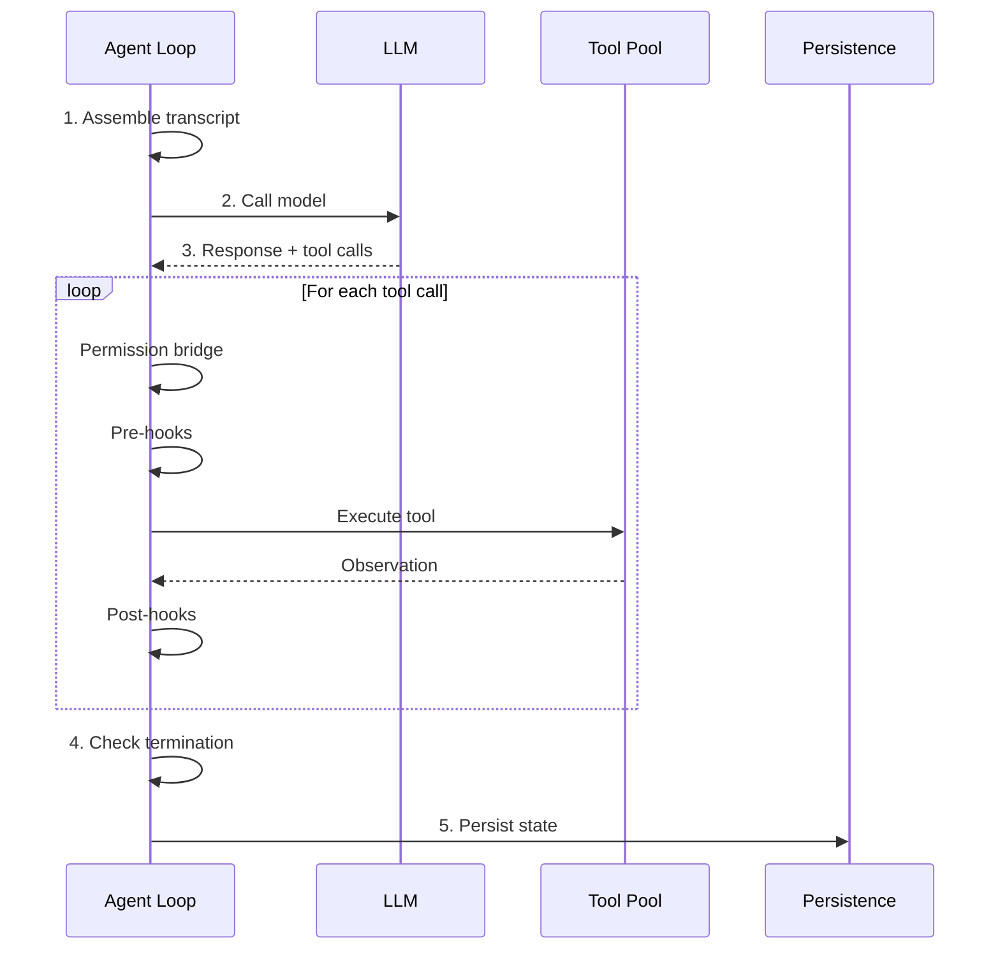

# 🔄 Agent Loop

> **The kernel of Lyra -- assemble, think, act, persist, repeat.** | **Phase:** 1

## 🧠 What It Is

The agent loop is Lyra's core engine: deliberately small (<200 lines in `lyra_core.loop`) so its semantics fit in one person's head. Every Lyra session, in every mode, runs through this loop. **If you understand this page, you understand 80% of Lyra.**

The loop has five stages:
1. **Assemble** the transcript from SOUL.md (the agent's persona), plan summary, tool descriptions, and recent context
2. **Call** the model with tools allowed by the current permission mode
3. **Execute** each tool call through permission checking, pre-hooks, execution, and post-hooks
4. **Detect** termination (five conditions)
5. **Persist** session state on every step

Everything else -- planning, verification, memory writes, skill extraction -- runs outside the loop at turn or session boundaries. **This is the load-bearing design choice:** keep the kernel small, push everything else to hooks and boundaries.

## ⚙️ How It Works

The loop is a single function that runs one step at a time. Each step first checks **preflight conditions** -- checks run before the model call:

- **Compaction** -- If the transcript exceeds 85% of the max token budget, the context engine compresses older turns into a dense narrative while preserving SOUL.md, the active plan, and a keep-window of recent turns
- **Cost check** -- If `session.cost_usd >= max_cost_usd`, the loop terminates
- **Interrupt** -- If the user pressed Ctrl-C, `session.interrupted` is set

Then the loop calls the model. For each tool call returned, four stages run:

1. **Permission bridge** -- decides allow / ask / deny / park. The model never holds authorization keys, and every decision has a traceable reason. See [Permission Bridge](./04-permission-bridge.md).
2. **Pre-hooks** -- deterministic Python that blocks dangerous actions: secret scanner blocks credential patterns; TDD gate blocks edits without prior tests; destructive-pattern checker blocks `rm -rf /`.
3. **Tool pool** -- executes the call. Built-in tools (read, write, bash) and MCP-provided tools are indistinguishable to the loop. See [MCP Adapter](./14-mcp-adapter.md).
4. **Post-hooks** -- annotate and reduce observations before they enter the transcript. A 500-line file read becomes first 50 + last 20 lines plus an artifact reference. A 10 KB log becomes last 80 lines + exit code + duration.

### 🛑 Termination Conditions
1. **Model signals done** -- `is_end_of_turn=True` (STOP hooks can veto; TDD gate blocks if tests are red)
2. **Cost budget hit** -- `session.cost_usd >= max_cost_usd`
3. **Step limit reached** -- `step >= max_steps` (default 50)
4. **User interrupt** -- Ctrl-C sets `session.interrupted`
5. **Stalemate** -- same tool call signature (hashed `tool_name + normalized_args`) appears >=3 times in a 16-call window. LLMs sometimes enter "read the same file forever" loops, and this cuts them off.

## 🧩 Loop Architecture



## 📦 Configuration Model

```python
@dataclass
class AgentLoopConfig:
    max_steps: int = 50            # Max tool calls per turn (safety limit)
    max_cost_usd: float = 0.50     # Cost budget per session
    max_tokens: int = 128_000      # Context window (Sonnet 4.6 default)
    compaction_threshold: float = 0.85  # Trigger compaction at 85% of max_tokens
    keep_window: int = 5           # Recent turns preserved during compaction
    permission_mode: str = "ask"   # "allow" | "ask" | "deny" | "park"
    tdd_gate_enabled: bool = False # Require tests before code changes
```

## 📊 Real Numbers

| Metric | Estimate | Notes |
|--------|----------|-------|
| Turn latency | ~3-8s | Model-dependent; target <15s |
| Cost per turn | ~$0.02-0.08 | Sonnet 4.6, varies with context length |
| Compaction trigger | >=85% | Configurable via config field |
| Stalemate detection | >=3 identical calls | Over 16-call sliding window |

## 💡 Why This Design

A loop-free agent cannot be made predictable, observable, or safe. By centralizing assembly, tool execution, permission checking, and persistence into one small kernel, Lyra guarantees every model interaction follows the same safety path and every decision is recorded in the same trace format. Ad-hoc per-task loops or prompt-only workflows lack determinism and auditability. Keeping the kernel small means custom safety policies can be added via hooks without touching the core path. See [Hooks and TDD Gate](./05-hooks-and-tdd-gate.md).

## ❓ When to Use

Every Lyra session runs through the agent loop. Use it as-is for standard sessions. Extend via hooks for custom policies. For multi-turn tasks requiring planning, use [Plan Mode](./02-plan-mode.md) which feeds its output into the loop.

## 🚫 When NOT to Use

Do not modify the loop's internal assembly or termination logic directly -- customize via hooks, not rewrites. Never run without the permission bridge enabled -- it is Lyra's load-bearing safety primitive. The loop is not designed for real-time responses; each turn requires at least one model round-trip (~3-8s).

## 🔗 Where Next

- **Block:** [Agent Loop implementation](../blocks/01-agent-loop.md)
- **Concepts:** [Plan Mode](./02-plan-mode.md) · [Permission Bridge](./04-permission-bridge.md) · [Hooks](./05-hooks-and-tdd-gate.md) · [Context Engine](./06-context-engine.md) · [MCP Adapter](./14-mcp-adapter.md)
- **Plans:** [Autonomy](../lyra-upgrade/plans/14-autonomy.md) · **Paper:** [Chain-of-Thought (Wei et al., 2022)](https://arxiv.org/abs/2201.11903)
