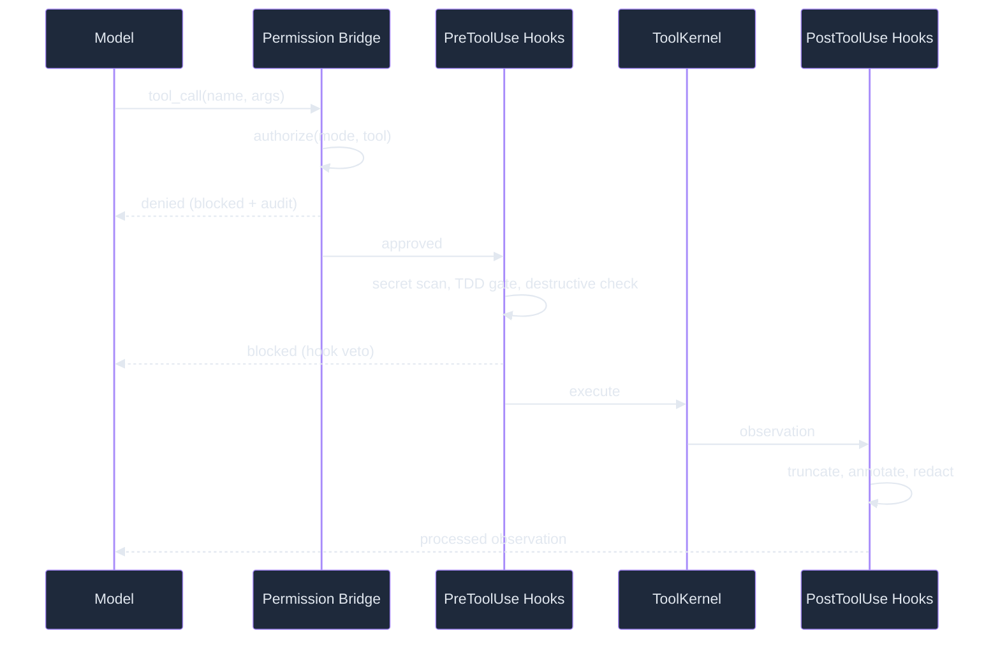

# Tools & Hooks — What & Why

> Concept: The tool catalog provides typed, permission-gated actions the model can invoke; the hook lifecycle (PreToolUse/PostToolUse/Stop) provides deterministic gates that enforce policy without touching the kernel.

## What It Is

Tools are the model's interface to the outside world. Each tool is a typed function registered in the ToolKernel with a name, JSON Schema, and implementation. The model proposes tool calls; the permission bridge authorizes them; hooks enforce cross-cutting policy; the tool pool executes; post-hooks annotate and reduce observations.

Hooks are deterministic Python functions that fire at lifecycle points. They operate on the event stream — tool calls before and after execution, session start and end, subagent lifecycle. Hooks can block, annotate, or redirect events, but they cannot change the loop logic itself. This is the key design constraint: policy lives in hooks, not in the kernel.

The tool system supports progressive discovery: tool schemas are loaded on demand rather than in bulk. An initial request lists available tool categories; clicking into a category reveals individual tool schemas. This achieves 85% context savings compared to loading all schemas upfront.

## Key Mechanisms

- **Tool Catalog** — Every tool is registered with name, JSON Schema, and implementation. Built-in tools are organized by domain: **Filesystem** (read, write, edit, glob, grep) for file operations, **Code** (LSP, analyze, format, typecheck) for code intelligence, **Web** (fetch, search, browser) for network access, **Database** (query, schema, migrate) for database operations. MCP-provided tools are indistinguishable to the loop after registration. The ToolKernel manages registration, discovery, and execution through a unified pool. Each tool has a versioned schema; schema changes are backward-compatible within a major version.
- **Hook Lifecycle** — Three hook types with distinct purposes: **PreToolUse** fires after permission check but before execution — secret scanner blocks credential patterns (API keys, tokens, passwords) from being written to files; TDD gate blocks code edits unless corresponding tests exist; destructive-pattern checker blocks dangerous commands like `rm -rf /`, `chmod 777`, and `dd if=/dev/zero`. **PostToolUse** fires after execution to annotate and reduce observations: truncate large output to first 50 + last 20 lines with artifact references, strip secret patterns using the same scanner as PreToolUse, collapse identical consecutive tool outputs. **Stop** fires at session end for cleanup (close file handles, flush event buffers, release worktrees).
- **27+ Hook Events** — The HookEngine supports events across four lifecycle categories: **Session lifecycle** (session.start, session.end, session.checkpoint) for session-scoped policies, **Tool lifecycle** (tool.pre, tool.post, tool.error) for tool-scoped policies, **Agent lifecycle** (subagent.spawn, subagent.complete, subagent.error) for subagent-scoped policies, and **System lifecycle** (config.change, error, shutdown) for system-scoped policies. Each event can have multiple handlers; handlers run in registration order. Handlers can veto (block the event with a reason message), annotate (add metadata as key-value pairs), or transform (modify the payload — used primarily by post-hooks for reduction).
- **Tool Narrowing via Skills** — When a skill is active, the permission bridge narrows the tool allowlist to the skill's `allowed-tools` set. The model can only call tools in that set. On scope exit, the original list restores. This is enforced by a PreToolUse hook that checks the current skill context and returns a "tool not available" response for disallowed tools. The model cannot override this narrowing — it is structural, not advisory.
- **Progressive Discovery** — Tool schemas are loaded in two stages to minimize context usage: first category-level metadata (~50 bytes per tool) listing available tool names and one-line descriptions, then full JSON Schemas on first invocation (~200 bytes per tool including parameter types, descriptions, and examples). The context engine tracks which schemas have been loaded and avoids re-injection. Unused schemas never enter the context. The schema cache is per-session and clears on session end.

## Why It Matters

Without typed tools, the model would generate shell commands that bypass all safety checks. Without hooks, every safety policy would need kernel modifications. The tool catalog + hook lifecycle pattern keeps the kernel small (one path for all tools) while enabling arbitrarily complex policy — secret scanning, TDD gates, output redaction, cost budgets — to be added as hooks without touching core code. Progressive discovery means the model does not pay the context cost for tools it never uses. Tool narrowing via skills ensures that skill invocations cannot escape their declared scope.

## Real Numbers

| Metric | Value | Notes |
|--------|-------|-------|
| Tool schema per category | ~50 bytes | Name + description only |
| Full schema per tool | ~200 bytes | With types, descriptions, examples |
| Context savings via progressive | ~85% | vs loading all schemas at once |
| Hook execution latency | <50 microseconds | Per hook, deterministic checks |
| PreToolUse veto rate | ~0.5% | Of all tool calls |

## When to Use

Tools are used automatically on every model call. Hooks are configured in `lyra.yaml` under the hooks section. Add custom hooks for project-specific policies: "block writes to /etc", "require commit messages to match conventions", "validate all modified files against the project style guide", or "flag any network requests to unknown hosts".

## When NOT to Use

Do not use hooks for logic that should live in the kernel (assembly, termination, persistence). Hooks are for policy, not mechanics. Do not create hooks with LLM calls — they add latency and cost to every tool execution; prefer regex or deterministic checks. Do not register hooks with side effects outside their declared lifecycle (a tool.pre hook should not write to memory tiers).

## Related Documentation

- **Block:** [Hooks and TDD Gate](../blocks/06-hooks-tdd.md)
- **Architecture:** [Tool Kernel](../architecture/11-architecture-overview.md#system-topology-target-architecture)
- **Plans:** [Tools](../lyra-upgrade/plans/06-tools.md), [Hooks](../lyra-upgrade/plans/10-hooks.md)
- **Papers:** Tool-Call Verification — Knowing-Doing Gap (2026, arXiv:2605.14038); Progressive Tool Discovery for LLM Agents
