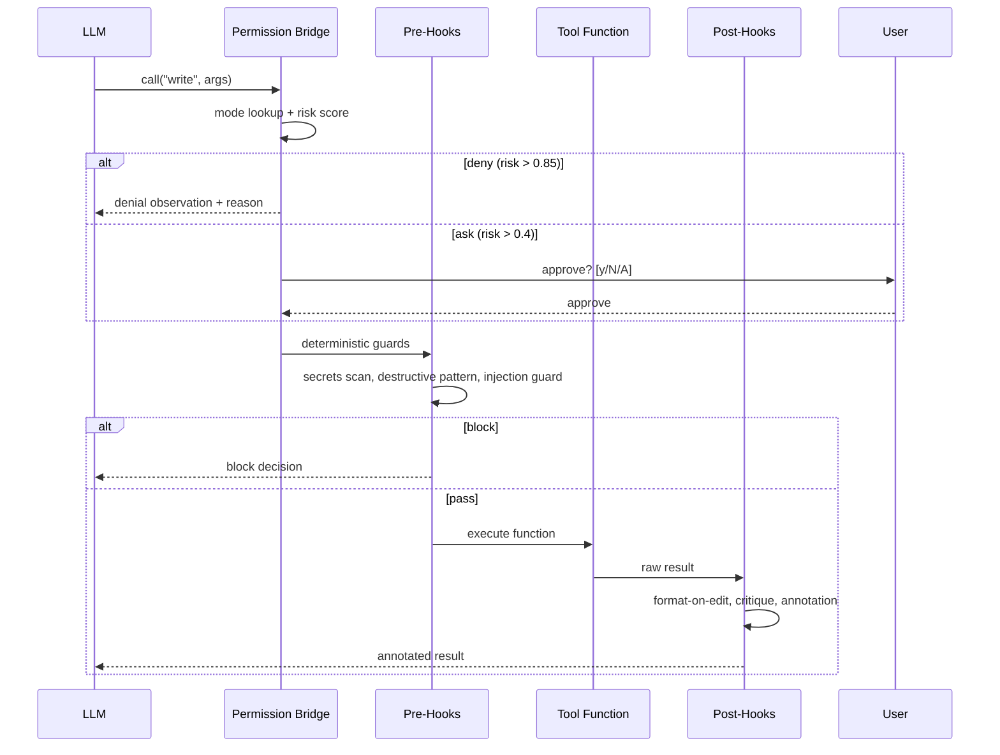

# Tools and Hooks

> **Tools are typed actions the model can call. Hooks are deterministic Python on lifecycle events. They are the two extension points of Lyra.** | **Phase:** 1 | See also: [Permission Bridge](09-permission-bridge.md), [Skills](03-skills.md)

## ⚙ What It Is

These are the two extension points of Lyra. Almost every customization lands as a **tool** (a typed function the LLM can call -- reading files, running shell commands, searching the web), a **hook** (deterministic Python or a shell script that runs on lifecycle events to enforce rules that prompts cannot reliably enforce), or a **skill** (a named bundle of tools + instructions -- see [Skills](03-skills.md)).

A tool is an ordinary Python callable decorated with `@tool`. The decorator declares the tool's name, description, a `writes` flag (used by the [Permission Bridge](09-permission-bridge.md) for mode-based decisions), a risk level (`low`, `medium`, or `high` -- weighed against `risk_ask_threshold` and `risk_deny_threshold`), and an args schema for typed parameters.

## ⚙️ How It Works

Every tool call flows through a deterministic pipeline:



The kernel ships a default toolset: `read` (file with line range slicing), `write` (create or overwrite), `edit` (string-replace inside a file), `bash` (shell command), `grep` (ripgrep across the workspace), `glob` (file patterns), `read_lints` (IDE diagnostics), `web_search`, `web_fetch`, `spawn` (subagent creation), and `skill` (skill invocation). **MCP servers** (Model Context Protocol -- an open standard for external tools) register additional tools at session start; from the loop's perspective they are indistinguishable from built-ins.

The hook lifecycle covers 25+ events. Shipped hooks include:

- **tdd-gate** -- enforces RED phase before edits to `src/`, blocks session completion if tests fail
- **destructive-pattern** -- blocks `rm -rf /`, `chmod -R 777`, and similar dangerous shell commands
- **secrets-scan** -- refuses content matching credential patterns (e.g., `sk-...` API keys)
- **loop-detector** -- bails on stalemate in a 16-call window (detects infinite agent loops)
- **injection-guard** -- strips **prompt injection** (adversarial input that tries to override the model's instructions) from observed content
- **format-on-edit** -- opt-in, runs a formatter after every write or edit

Shell hooks can be defined in YAML without writing Python. The exit code protocol: `0` = allow, `1` = deny, `2` = soft-block with a machine-parseable suggestion.

```toml
# ~/.lyra/config.toml -- tool & hook configuration
risk_ask_threshold = 0.4      # calls above this score prompt the user
risk_deny_threshold = 0.85    # calls above this score are auto-denied

[hooks.tdd_gate]
enabled = true
src_patterns = ["src/**"]
test_patterns = ["tests/**"]

[hooks.secrets_scan]
enabled = true
patterns = ["AKIA[0-9A-Z]{16}", "sk-[a-zA-Z0-9]{32,}"]
```

## 📊 Real Numbers

| Metric | Value | Notes |
|--------|-------|-------|
| Tool call latency (p50) | ~15ms target | Python dispatch + permission bridge + hooks (zero LLM inference time) |
| Hook deny rate | ~0.3% target | Destructive-pattern + secrets-scan in production deployments |
| Token overhead per turn | 0 tokens | Hooks run entirely on the host -- no context window cost |

## 🛡️ Why This Design

Discipline that lives in prompt language can be argued out of by a sufficiently clever model. Discipline that lives in Python cannot. **Hooks are how a kernel that lets the model drive stays trustable.** The "don't rm -rf /" instruction in a system prompt is unreliable; the `destructive-pattern` hook is not. This is the single most important architectural choice in Lyra -- it is the difference between a copilot you trust and a copilot you watch.

The permission bridge follows the same principle: authorization is monotonic (each stage can only deny more, never allow more), so the system is auditable by construction.

## ✅ When to Use

- **Add a tool** when the model needs a new way to interact with the environment (e.g., a custom API client, a database query function).
- **Add a hook** when you need a deterministic guard that a prompt cannot enforce reliably (e.g., blocking destructive commands, scanning for secrets).
- **Use shell hooks** (YAML-defined, no Python) for simple formatting or linting.

## ❌ When NOT to Use

- Do not use hooks for business logic that belongs in a [skill](03-skills.md). Hooks are for safety and discipline, not procedural capability.
- Avoid adding a tool for every possible action -- the tool schema should stay lean (aim for 10-15 built-ins max).
- Do not block tool calls in pre-hooks based on content the model needs to complete its task. Hooks should enforce safety, not gatekeep functionality.

## 🧭 Where Next

- **Concept:** [Permission Bridge](09-permission-bridge.md) -- the authorization layer every tool call flows through
- **Concept:** [Skills](03-skills.md) -- named bundles of tools plus instructions
- **Implemented block:** [Hooks and TDD Gate](../blocks/06-hooks-tdd.md)
- **Design plan:** [Tools Plan](../lyra-upgrade/plans/06-tools.md)
- **Research paper:** [Toolformer](https://arxiv.org/abs/2302.04761) -- LLMs that learn to use tools (theoretical foundation)
- **Research paper:** [Gorilla](https://arxiv.org/abs/2305.15334) -- API call generation with large language models
