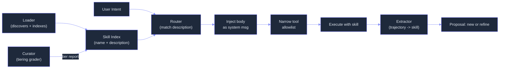

# Skills — What & Why

> Concept: Skills are reusable, versioned procedures (SKILL.md files) that convert successful trajectories into searchable capabilities. Loaded by description with progressive disclosure; auto-curated; evolved via GEPA.

## What It Is

Skills are the procedural tier of Lyra's memory hierarchy. A SKILL.md file lives in a directory with YAML frontmatter and a markdown body of instructions. The SkillRegistry discovers skills from three scopes with priority: project-local overrides user-global overrides built-in. This means you can override a built-in skill by placing a file with the same name in your project's `.lyra/skills/` directory.

The SkillRouter matches the `description` frontmatter field to user intent at session assembly time. Only names and descriptions appear in the working context (L2). The full body loads only on invocation — keeping L2 small and stable so prompt caching works. On invocation, the permission bridge narrows the tool allowlist to the skill's `allowed-tools` set, and the body is injected as a system-message addendum. On scope exit, the original tool list restores.

## Key Mechanisms

- **SKILL.md Format** — Required YAML frontmatter fields: `name` (unique slug, alphanumeric with hyphens), `description` (matched by router, 1-2 sentences), `allowed-tools` (tool names permitted during invocation). Optional fields: `version` (semver), `languages` (array of ISO language codes), `introspection` (auto-maintained by Curator: example count, success rate, last refined date, activation count). The markdown body carries the procedure: step-by-step instructions, example invocations, edge case handling.
- **Trigger Matching** — The Router matches the `description` frontmatter field to user intent using a two-stage matcher: keyword overlap (fast path, sub-millisecond) then semantic similarity via BGE-small embedding (slow path, ~50ms). Narrowest scope wins on name collision. Loading is entirely passive: skills are discovered on filesystem scan, not manually loaded. If no skill matches, the model works without skill augmentation.
- **SkillNet Graph** — Skills form a directed acyclic graph via the `depends-on` field. Skill A declares dependency on skill B; when skill B is updated (new version), the Curator flags skill A for re-evaluation. The graph is stored as an adjacency list in `~/.lyra/skills/SkillNet.json`. Cycles are rejected at registration time. The graph enables: impact analysis before skill updates, version compatibility checking, and efficient bulk updates.
- **GEPA Evolution** — The GEPA v2 optimizer evolves skill prompts from execution traces using multi-agent prompt evolution with 17x Pareto speedup via Combee. The evolution loop: collect HIR traces where the skill was active, identify improvement opportunities via performance metrics (success rate, latency, token efficiency), generate candidate variants using a mutation prompt, test variants on a holdout set of similar tasks, rank candidates by Pareto dominance (success rate vs. token cost), and propose the winner for human review. Failed variants are discarded.
- **Extractor + Curator** — After each task, the Extractor evaluates the trajectory against a deterministic rubric (zero LLM calls): minimum 3 tool calls, 2+ distinct tools used, unique slug not taken, required headers present in body, no leaked secrets detected via regex, body length between 50 and 5000 lines. If the trajectory passes the rubric, a proposal is posted to `~/.lyra/skills/_proposals/`. The Curator runs on a cron schedule, reading the skill ledger and assigning each skill a tier: Promote (10+ activations, <=1 failure), Keep (healthy usage), Watch (marginal utility, re-run in N days), Rewrite (activations but low success rate, open for hand-rewrite), Retire (stale, archive).

## Anti-Patterns

- **Too narrow** — Single-line command skills waste index space. Merge with related skills.
- **Too broad** — "Do everything" skills dilute Router matching accuracy. Split by domain.
- **Hand-editing introspection** — Those fields are auto-maintained by the Curator.
- **Skipping proposals** — Always review proposals to prevent skill drift and quality degradation.
- **One-shot tasks** — Noisy trajectories may produce false-positive extraction proposals.

## Real Numbers

| Metric | Value | Notes |
|--------|-------|-------|
| L2 context cost | ~5ms / 100 skills | Names + descriptions only |
| Full skill invoke overhead | ~50ms | Body load + permission bridge |
| Extractor evaluation | <10ms | Deterministic rubric, no LLM |
| Curator full run | ~200ms | Reads ledger, writes tiering report |
| Target success rate | >90% | Skills below this enter rewrite tier |

## Why It Matters

Without skills, every session starts from scratch — the model has no memory of what worked before. Skills convert successful trajectories into curated, versioned, searchable procedures that the model invokes by name. The progressive disclosure pattern keeps context small. The deterministic extractor rubric ensures quality without expensive LLM overhead. The SkillNet graph enables dependency-aware evolution: improving one skill automatically considers downstream impacts. GEPA evolution closes the loop: skills improve over time from real usage data.

## When to Use

Skills load automatically based on the current task. Review the skill catalog with `/skills list`. Check curator reports with `/skills curator-report`. Manually invoke a skill with `/skill invoke <name>` (only for `disable-model-invocation: true` skills).

## When NOT to Use

Do not hand-edit introspection fields. Do not register skills with identical names in different scopes (project wins; the others are shadowed). Do not set `disable-model-invocation: true` unless the skill requires explicit human invocation.

## Related Documentation

- **Block:** [MCP Adapter / Skill Infrastructure](../blocks/09-mcp-adapter.md)
- **Architecture:** [Skills Ecosystem](../architecture/11-architecture-overview.md#system-topology-target-architecture)
- **Plans:** [Skills System](../lyra-upgrade/plans/04-skills.md)
- **Papers:** Voyager Skill Library (TMLR 2024, arXiv:2305.16291); GEPA Optimizer (ICLR 2026 Oral, arXiv:2310.03714); Skill-RAG (UMich 2026, arXiv:2604.15771)
