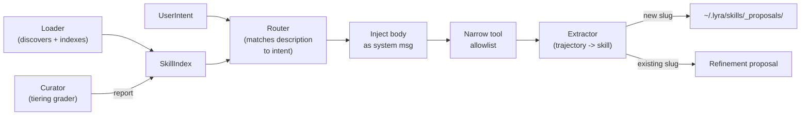

# Skills

> **SKILL.md files are the procedural tier of Lyra's memory hierarchy -- they convert successful trajectories into reusable, versioned capabilities.** | **Phase:** 1

## :gear: Flow



**Glossary** (jargon defined inline): **SKILL.md** = a folder whose markdown file carries YAML frontmatter (metadata header). **Loader** = discovers skills from repo, user-global, and plugin scopes; narrowest scope wins on name collision. **Router** = matches the `description` frontmatter field to user intent. **Extractor** = mints new skills from successful trajectories after each task. **Curator** = deterministic background grader (zero LLM calls) that tiers the catalogue. **Permission bridge** = mechanism that narrows the tool allowlist to the skill's declared `allowed-tools` during invocation. **Progressive disclosure** = only skill names + descriptions live in L2 context; the full body loads on demand. **Trajectory** = the step-by-step record of actions a model took to complete a task. **L2 context** = the working portion of the LLM's context window.

## :page_facing_up: Config Example

```yaml
name: fix-python-imports
description: Reorder and clean up Python imports following PEP8.
allowed-tools: ["bash", "read", "write", "grep"]
version: 1
languages: ["python"]
introspection:         # auto-maintained by Curator -- do not hand-edit
  examples: 24
  success_rate: 0.92
  last_refined: 2025-04-01
disable-model-invocation: false   # true forces manual-only `/skill invoke <name>`
```

## :wrench: How It Works

Only `name` + `description` of each skill appear in L2 context. The full SKILL.md body loads only on invocation -- keeping L2 small and stable so prompt caching works. On invocation, the permission bridge narrows the tool allowlist to `allowed-tools`, and the body is injected as a system-message addendum. On scope exit, the original tool list restores.

After every completed task, the **Extractor** evaluates the trajectory against a deterministic rubric: minimum tool calls, distinct tools used, unique slug, required headers present, no leaked secrets, reasonable body length. Zero LLM calls. If the slug is new, it posts a proposal to `~/.lyra/skills/_proposals/`; if the slug exists, it posts a refinement proposal (active-update bias -- refine rather than duplicate). Humans review with `/skill review`; the extractor never auto-publishes.

The **Curator** runs on a cron, reading the skill ledger (activation counts, failure rates, timestamps) and assigning each skill a tier:

| Tier | Criteria | Action |
|------|----------|--------|
| **Promote** | 10+ activations, <=1 failure | Suggest scope promotion |
| **Keep** | Healthy recent usage | Leave as-is |
| **Watch** | Marginal utility | Re-run in N days |
| **Rewrite** | Activations but low success rate | Open for hand-rewrite |
| **Retire** | Stale, unused | Move to archive |

The Curator produces a markdown report under `~/.lyra/skill-curator/` for `/skill curator-report`. It never modifies skills on its own.

## :bar_chart: Real Numbers

| Metric | Value | Notes |
|--------|-------|-------|
| L2 context cost | ~5ms / 100 skills | Names + descriptions only |
| Full skill invoke overhead | ~50ms | Body load + permission bridge |
| Extractor evaluation | <10ms | Deterministic rubric, no LLM |
| Curator full run | ~200ms | Reads ledger, writes tiering report |
| Target success rate | >90% | Skills below this enter `rewrite` tier |

## :warning: Anti-Patterns

- **Too narrow** -- single-line command skills waste index space.
- **Too broad** -- "do everything" skills dilute Router matching accuracy.
- **Hand-editing `introspection`** -- those fields are auto-maintained by the Curator.
- **One-shot tasks** -- noisy trajectories may produce false-positive extraction proposals.
- **Skipping proposals** -- always review `~/.lyra/skills/_proposals/` to prevent skill drift.

## :thought_balloon: Why This Design

Without skills, every session starts from scratch -- the model has no memory of what worked before. Skills convert successful trajectories into curated, versioned, searchable procedures that the model invokes by name. The progressive disclosure pattern (names only in L2, bodies on demand) keeps context small. The deterministic extractor rubric ensures quality without expensive LLM overhead. This design is inspired by the trajectory-to-procedure pipeline explored in SWE-bench (see paper link below).

## :compass: Where Next

- **Block:** [09-skill-engine-and-extractor.md](../blocks/09-skill-engine-and-extractor.md)
- **Plan:** [04-skills-system.md](../lyra-upgrade/plans/04-skills-system.md)
- **Related concept:** [memory-tiers.md](memory-tiers.md)
- **Paper:** [SWE-bench: Can Language Models Resolve Real-World GitHub Issues? (arXiv:2310.06770)](https://arxiv.org/abs/2310.06770)
