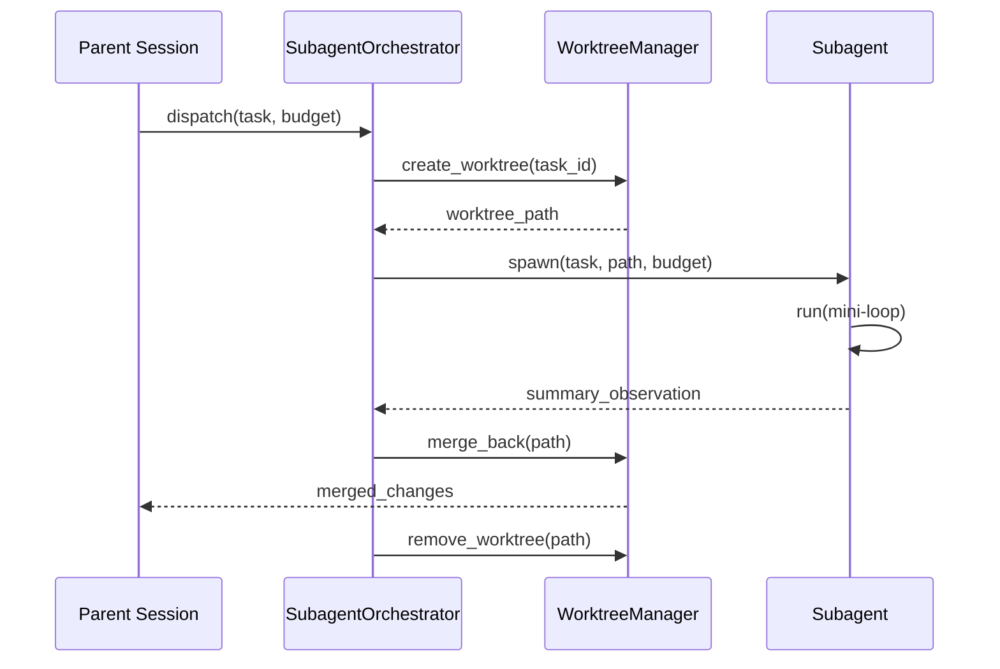

# Subagents — What & Why

> Concept: Scoped, short-lived agent instances that run in isolated git worktrees for parallel execution, context reduction, and safe experimentation without file conflicts.

## What It Is

Subagents are lightweight, disposable agent processes spawned by the primary session. Each subagent gets its own isolated environment: a git worktree (true filesystem isolation via `git worktree add` on a detached branch), scoped tool access (FSSandbox restricts filesystem visibility to the worktree directory), a constrained token and cost budget, and a focused task description limited to what the subagent needs to accomplish.

When the subagent completes, it returns a compact summary observation (JSON: what was changed, test results, any issues encountered). Its changes are merged back into the parent worktree via selective file copy (only files matching the task scope are copied, not the full worktree diff). If it fails, the worktree is discarded with `git worktree remove` and zero side effects on the parent or sibling subagents.

This is the execution engine behind DAG Teams: each TaskNode in a wave gets its own subagent worktree. The subagent system comprises 13 files covering orchestration (SubagentOrchestrator), worktree management (WorktreeManager), filesystem sandboxing (FSSandbox), result merging (MergeEngine), and cache prewarming (CachePrewarmer).



## Key Mechanisms

- **Worktree Isolation** — Each subagent runs on a detached branch in `git worktree add`. The worktree provides true filesystem isolation: the subagent can read, write, create, and delete files within its designated directory without affecting the parent or sibling subagents. The WorktreeManager maintains a registry of active worktrees (hash map keyed by task ID), lifetime (created, active, merging, removing), and associated session PID for cleanup on crash. Hard limits on concurrent worktrees per session (default 8) prevent resource exhaustion.
- **Parallel Dispatch** — The SubagentOrchestrator fans out independent tasks to multiple subagents simultaneously via async dispatch using Python's asyncio. Results are aggregated and merged only after all subagents in a wave complete. Failed subagents are retried up to a configurable max retries (default 2) before the wave is marked partially failed. The orchestrator tracks per-wave state: pending, running, completed, failed, merged.
- **Channels** — Parent and subagent communicate via structured channels implemented as filesystem FIFO pipes: task description in (JSON with task string, tools whitelist, budget caps), summary observation out (JSON with changed files list, test results, duration, any errors). The parent can stream additional context mid-flight via an update channel (e.g., "we discovered module X is also affected"). The subagent can signal progress or request clarification via a status channel. Using FIFO pipes instead of network sockets avoids port conflicts and keeps the system network-independent.
- **Budgeted Execution** — Each subagent has hard caps: max step count (default 15), max cost (default $0.20), max token budget (default 32K). The SubagentOrchestrator tracks aggregate fleet spend and enforces a per-wave budget cap. If a subagent exceeds any budget, the Agent Loop terminates it and the wave continues with remaining subagents. Budget is allocated at dispatch time from the session budget; unused budget is returned on completion.
- **Cache Prewarming** — Before dispatching, the CachePrewarmer pre-populates the subagent worktree with the session's prompt cache prefix (SOUL.md + project context files). This is done by copying the cache-optimized prefix files into the worktree. Every subagent's first model call starts with a warm cache, reducing first-turn latency by ~60%. The prewarmer also copies frequently-read source files (based on recent access patterns) to avoid redundant reads across subagents.

## Configuration

```yaml
subagents:
  max_concurrent: 8       # max worktrees per session
  max_steps: 15           # per subagent
  max_cost_usd: 0.20      # per subagent
  max_retries: 2          # per subagent before wave failure
  stagger_ms: 100         # dispatch stagger for cache coordination
```

## Why It Matters

Without subagents, all work runs sequentially in a single context window. Complex tasks that decompose into parallel subtrees (e.g., "add Redis caching to user service" — implement, test, document) are forced into serial execution, which multiplies wall-clock time and context fragmentation. Worktree isolation ensures that even if a subagent catastrophically fails (deletes files, corrupts state), the parent and all sibling worktrees remain untouched. This makes subagents safe for experimentation: try approach A and approach B in parallel, keep the winner.

## When to Use

Use subagents when the task can be decomposed into independent parallel subtrees: implement module A and B simultaneously, run tests in parallel, generate docs alongside implementation. Use subagents for experimental changes where the cost of failure is zero.

## When NOT to Use

Do not use subagents for tasks with shared mutable state (both modify the same function). Do not use for tasks faster than worktree creation overhead (~500ms). Do not use for tasks requiring tight coordination between parallel workstreams.

## Related Documentation

- **Block:** [Subagent Worktree](../blocks/08-subagent-worktree.md)
- **Architecture:** [Fleet Topology](../architecture/11-architecture-overview.md#fleet-topology)
- **Plans:** [Swarm Fleet](../lyra-upgrade/plans/13-swarm-fleet.md), [AgentsMesh](../lyra-upgrade/plans/52-agentsmesh.md)
- **Papers:** MetaGPT SOP Role Topology (ICLR 2024, arXiv:2308.00352); DAG Teams SemaClaw (Midea 2026, arXiv:2604.11548); RecursiveLink Latent Comms (2026, arXiv:2604.25917)
