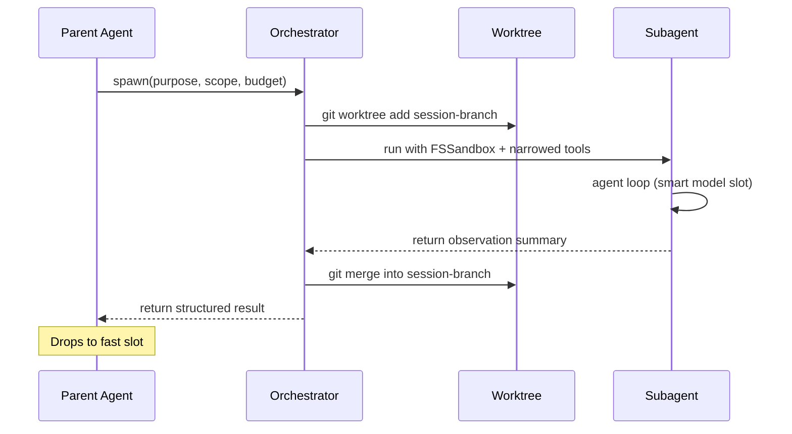

# Subagents

> **Scoped agent instances in isolated git worktrees with structured returns and explicit merge points.** | **Phase:** 1

## 🤖 What It Is

A **subagent** is a scoped agent instance running in its own git **worktree** -- a checked-out copy that shares the parent's `.git/` directory. Subagents let Lyra parallelize work across modules without losing the parent's coherence: no stomped edits, no surprise merges, and explicit **observation reduction** (the parent sees a summary, not the full transcript). They are the key building block for scaling Lyra beyond single-turn interactions, enabling decomposition of large tasks into independent strands that execute concurrently with their own budget, tool set, and filesystem sandbox.

> **Jargon worktree** = a git worktree is an additional working directory linked to the same repository. Two agents can edit the same repo simultaneously with zero conflict. **FSSandbox** = a filesystem sandbox that permits reads everywhere but rejects writes outside declared globs.

## ⚙️ How It Works

A `spawn()` call creates a subagent with a **purpose**, **scope** (filesystem globs limiting writes, e.g. `["tests/**", "src/auth/**"]`), **budgets** (max steps, max cost), **allowed tools**, and **return shape**. The orchestrator allocates a full worktree at `.lyra/worktrees/<session-id>/<n>`, configures an FSSandbox that rejects out-of-scope writes, then runs the subagent's own agent loop on the **smart model slot** (expensive reasoning). The parent drops back to the **fast slot** the moment the subagent returns.

On completion, the orchestrator merges the sub-branch back into the session branch using three strategies: **fast-forward** (trivial when the sub-branch is a strict descendant), **three-way merge** (divergent but non-conflicting, auto-merge), or **conflict** (surfaced as a structured `MergeConflict` observation for human resolution). ContextVars for trace IDs, session IDs, and permission mode propagate from parent to subagent worker thread via `submit_with_context` -- without this, OpenTelemetry spans for subagent work would float orphaned.

**Return shapes**: `observation` (default) = short structured summary from the subagent; `artifact` = a file the subagent produced, body in the artifact store; `raw_trace` = full transcript, rarely needed.

## 🧠 Why This Design

Without subagents, every task runs sequentially in the parent's context window -- costing tokens, risking interference between concurrent edits. Worktree isolation means two agents edit the same repository simultaneously without conflict. In-process multi-agent systems cannot provide this isolation.

## ✅ When to Use vs. NOT to Use

**Use** when work decomposes into independent strands: multi-perspective research, A/B experiments, long-running sub-tasks, or any task whose context would overflow the parent window (too many files read). **Skip** when overhead exceeds savings (tasks under 3-5 steps) or the result is needed inline -- worktree allocation, context assembly, and merge resolution cost ~200 ms that is wasted on trivial work.

## 📋 Spawn Config (Example)

```json
{
  "purpose": "Add JWT auth middleware to src/auth/",
  "scope": ["src/auth/**", "tests/auth/**"],
  "budgets": { "max_steps": 25, "max_cost_usd": 0.50 },
  "allowed_tools": ["read", "grep", "glob", "edit", "write", "bash"],
  "return_shape": "observation"
}
```

## 🔄 Architecture (Sequence)



## 📊 Real Numbers

| Metric | Value | Notes |
|--------|-------|-------|
| Worktree allocation overhead | ~200 ms | `git worktree add` + branch creation (target) |
| Token cost vs. in-process | ~60% fewer | Parent sees summary, not full transcript (target) |
| Merge conflict rate | <5% | Scope isolation keeps conflicts rare (target) |

## 🔗 Where Next

- **Block detail:** [docs/blocks/10-subagent-worktree.md](../blocks/10-subagent-worktree.md)
- **Fleet plan:** [docs/lyra-upgrade/plans/13-swarm-fleet.md](../lyra-upgrade/plans/13-swarm-fleet.md)
- **Related concepts:** [Context Engine](./05-context-engine.md) | [Plan Mode](./02-plan-mode.md) | [Agent Loop](./01-agent-loop.md)
- **Research:** ["Scaling Multi-Agent Systems"](https://arxiv.org/abs/2403.09722) -- parallels in agent isolation patterns
