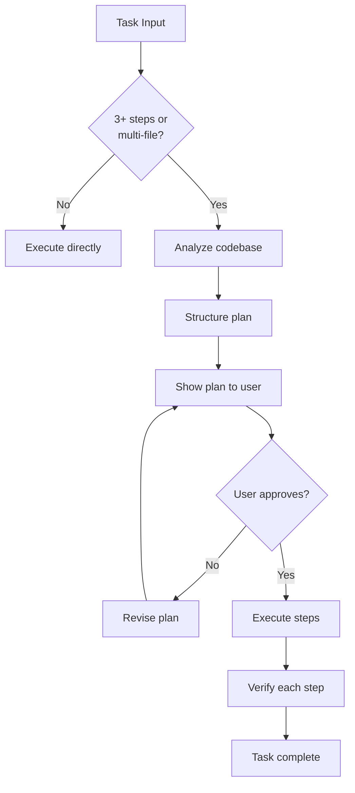

# Plan Mode — What & Why

> Concept: A structured pre-execution phase that converts non-trivial tasks into approvable plan artifacts before any tool execution begins. The human approval gate is the primary safety boundary.

## What It Is

Plan Mode is Lyra's structured planning phase that runs before the Agent Loop enters execution. When a task is classified as non-trivial (the planner estimates 3+ steps or multi-file impact), the system enters Plan Mode:

1. **Analyze** — The model reads the task, explores the codebase (read, grep, LSP), and identifies the scope of changes needed.
2. **Structure** — A plan is produced: ordered steps, files to modify, functions to change, estimated effort per step, risk assessment, and verification criteria.
3. **Present** — The plan is rendered as a diff-able markdown artifact (`.plan.md`) written to the session directory. The user sees the full plan with checkboxes per step.
4. **Approve** — The user approves, requests changes, or rejects. Planning-phase tools (read, search, grep, LSP) are allowed; execution tools (write, bash, edit) are blocked until approval.
5. **Execute** — On approval, the plan feeds into the Agent Loop as a constraint. Each step is verified independently before the next begins. Every checkmark is linked to a Verifier pass.

The plan artifact survives session resume. A resumed session with an incomplete plan picks up at the last unverified step.

## Key Mechanisms

- **Opusplan Pattern** — For maximum planning quality, the plan step is routed to Opus regardless of the session's active model. Opus produces deeper decomposition, more accurate effort estimation, and better risk identification. The cost premium for planning with Opus (~$0.10 per plan) is recovered many times over in reduced execution waste.
- **Human Approval Gate** — No execution starts without explicit user approval. The gate is enforced by the Permission Bridge: planning tools are allowed; execution tools are denied until the user sends the approval signal. This is Lyra's primary safety boundary — the human decides what to do, the agent figures out how.
- **Plan Artifact** — Written as `plan.md` with YAML frontmatter (session id, model used, estimated cost, risk level) and markdown body with numbered steps and `[ ]` checkboxes. Each step references specific files, functions, and verification criteria. The artifact persists in `.lyra/sessions/<id>/plan.md`.
- **Step-Level Verification** — After the plan is approved, each completed step is verified independently by the Verifier before the next step begins. If step 3 fails verification, steps 4+ do not execute. This prevents compounding errors across steps and limits the blast radius of a bad step.
- **Skip Classification** — The planner evaluates whether Plan Mode is needed. Simple tasks (typo fix, single file read, one-line change) skip Plan Mode and execute directly. The threshold is configurable via `plan_mode_threshold` (default: 3+ steps or multi-file changes).

## Real Numbers

| Metric | Estimate | Notes |
|--------|----------|-------|
| Planning time | ~5-10s | Opus model, includes codebase exploration |
| Plan artifact size | ~1-3 KB | Steps, files, risk assessment |
| Cost per plan | ~$0.08-0.12 | Opus model call |
| Skip rate | ~40-60% | Simple tasks bypass Plan Mode |

## Why It Matters

Without Plan Mode, the model begins executing immediately on every task. For simple requests this is fine. For multi-step tasks, unplanned execution leads to wasted tool calls, context thrashing, and user surprise. Plan Mode converts execution from a free-form dialog into a structured contract: the user sees what will happen before it happens, and can redirect before cost is incurred. The human approval gate is the single most effective safety measure because it involves the human in every non-trivial decision.

## When to Use

Use Plan Mode for any task that requires 3+ steps or changes multiple files: implementing features, refactoring, debugging complex issues, multi-file edits. Plan Mode is also useful for unfamiliar codebases where the model needs to explore before committing to a plan.

## When NOT to Use

Skip Plan Mode for trivial tasks (typo fixes, single-command operations, file reads). Skip Plan Mode when the task is urgent and the user is actively guiding the agent step by step (the user is already doing the planning).

## Related Documentation

- **Block:** [Plan Mode](../blocks/04-plan-mode.md)
- **Architecture:** [Data Flow](../architecture/11-architecture-overview.md#data-flow)
- **Plans:** [Planning](../lyra-upgrade/plans/20-planning.md)
- **Papers:** Chain-of-Thought (Wei et al., 2022, arXiv:2201.11903); SR2AM Planning (2026, arXiv:2605.22138)
