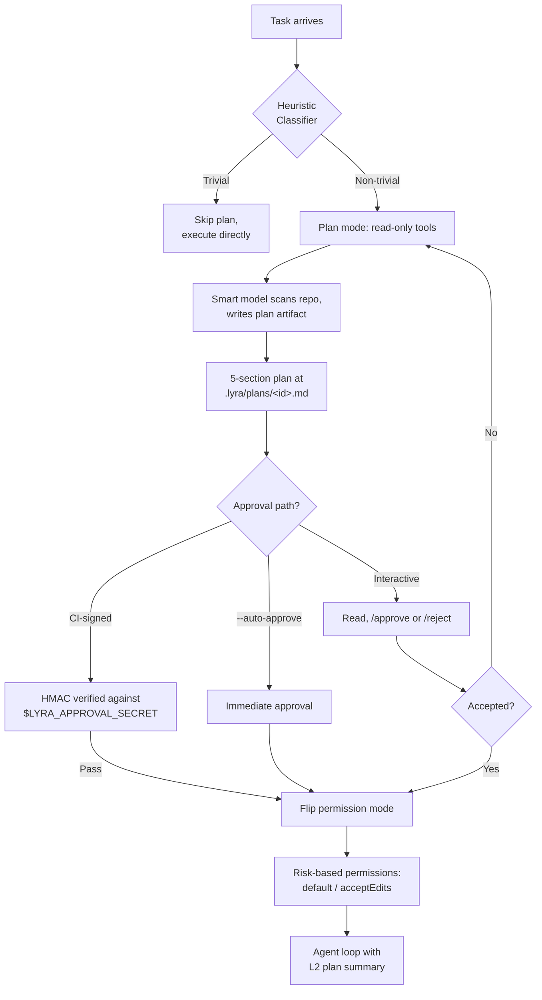

# :clipboard: Plan Mode

> **Non-trivial tasks become a human-readable plan artifact before a single file is touched. | Phase: 1**

## :bulb: What It Is

Plan mode is Lyra's default entry point for non-trivial tasks. Rather than editing immediately, Lyra produces a plan artifact at `.lyra/plans/<session-id>.md` and waits for approval. This catches misunderstandings early and creates the contract used by the **verifier** (cross-checks final diff against the plan), the **skill extractor** (generates reusable procedures from completed steps), and cross-session continuity via the **goal hash** (SHA-256 of the task description).

## :repeat: Flow



## :gear: How It Works

A **heuristic classifier** (`lyra_core/plan/heuristics.py`) scores each task on five weighted signals: multi-file mentions (0.7), complexity keywords like "refactor" (0.8), length > 200 chars (0.4), repo > 1,000 files (0.2), and prior task needing > 5 tool calls (0.3). Crossing 0.6 activates plan mode; skip with `--no-plan`.

The **smart model** (expensive reasoning slot) reads the repo with write tools denied and writes a five-section plan: (1) **Acceptance tests** -- verifier entry points, (2) **Expected files** -- to create or modify, (3) **Forbidden files** -- must stay untouched, (4) **Steps** -- work sequence absorbed by the skill extractor, (5) **Goal hash** -- SHA-256 proving plan continuity across sessions.

**Approval** has three paths, each unlocking write permissions on approval: **Interactive** -- read at the terminal, type `/approve` or `/reject` (revision loop); **`--auto-approve`** -- immediate, for trusted CI; **CI-signed** -- HMAC of (plan path, goal hash, session ID) verified against the `LYRA_APPROVAL_SECRET` env variable.

On approval, permissions flip based on **plan risk**: low-risk plans go to `default`, medium-risk to `acceptEdits`, high-risk (10+ files or bash steps) stay in `default` with more confirmation prompts. The agent loop receives a compressed L2 summary (acceptance tests, expected files, step list) while the full artifact stays in the artifact store.

## :card_file_box: Configuration

```python
# lyra_core/config/plan.py
PLAN_HEURISTICS = {
    "multi_file_weight": 0.7,
    "complexity_keywords_weight": 0.8,
    "length_threshold_chars": 200,
    "repo_size_threshold": 1000,
    "prev_task_tool_call_threshold": 5,
    "activation_threshold": 0.6,
}
```

## :bar_chart: Real Numbers

| Metric | Value | Source |
|--------|-------|--------|
| Plan generation latency | 8-15 s | target |
| Token cost per plan (Opus output) | ~3,000 tokens | target |
| Misunderstandings caught before coding | ~40% of non-trivial tasks | target |

## :white_check_mark: When to Use

Plan mode is the **default** for any non-trivial task -- the heuristic catches it automatically. Use `--no-plan` for trivial tasks like single-line renames. Ideal for collaborative workflows where a human must approve the approach before execution.

## :no_entry_sign: When NOT to Use

Skip for quick questions or read-only exploration -- the trivial-task heuristic handles those. Not needed for repetitive background tasks. Avoid relying on plan mode as a substitute for thorough requirements gathering.

## :link: Where Next

- **Block deep-dive:** [docs/blocks/02-plan-mode.md](../blocks/02-plan-mode.md)
- **Planning system design:** [docs/lyra-upgrade/plans/20-planning.md](../lyra-upgrade/plans/20-planning.md)
- **Related concepts:** [Verifier](./09-verifier.md), [Skill Engine](./10-skill-engine.md), [Agent Loop](./01-agent-loop.md)
- **Research:** [Chain-of-Thought Prompting Elicits Reasoning](https://arxiv.org/abs/2201.11903) (Wei et al., 2022)
