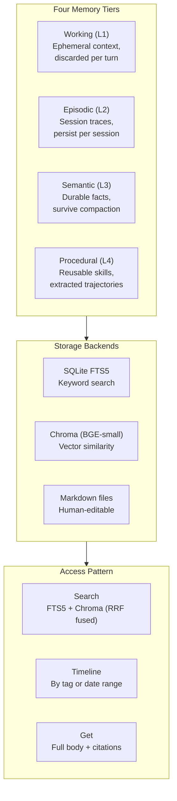

# Memory Tiers -- Working, Episodic, Semantic, Procedural

> **Each with a different retention, latency, and cost profile. Together they form Lyra's long-term memory fabric.** | **Phase:** 2

## 🔄 Architecture

Memory is organized as a four-tier pyramid plus a separate persona partition (SOUL.md). Data flows through a **progressive disclosure** retrieval pattern: search first, peek the snippet, fetch the full body only when promising. This keeps the working context small and bills low.



## 🗃 Data Model & Config

Entries are stored centrally in SQLite with FTS5 (full-text search extension). Chroma holds 384-dim vector embeddings (BGE-small-en-v1.5, 33M params, CPU) for semantic similarity. Plain markdown files (`SOUL.md`, `MEMORY.md`) hold human-editable content. Writes go to SQLite first (atomic, durable), then Chroma (best-effort with retry). A daily reconciler fixes any drift between the two indexes.

```sql
CREATE TABLE memory_entries (
    id          TEXT PRIMARY KEY,
    tier        TEXT NOT NULL CHECK(tier IN ('working','episodic','semantic','procedural')),
    kind        TEXT NOT NULL,          -- 'observation' | 'fact' | 'skill' | 'summary'
    title       TEXT NOT NULL,
    body        TEXT,
    created_at  INTEGER NOT NULL,       -- Unix timestamp
    accessed_at INTEGER,
    importance  REAL DEFAULT 0.0,       -- 0.0-1.0, used by the pruner
    is_private  INTEGER DEFAULT 0,      -- 1 = excluded from model prompt
    tags        TEXT DEFAULT ''          -- space-separated, FTS5-indexed
);
CREATE VIRTUAL TABLE memory_fts USING fts5(title, body, tags, content=memory_entries);
```

Configuration in Lyra's `settings.toml`:

```toml
[memory]
vector_model = "BGE-small-en-v1.5"          # 384-dim, 33M params, CPU
prune_interval = 15                          # sessions between pruner runs
retrieval_cascade = ["dict", "fts5", "chroma", "archive", "llm"]  # cheapest-first

[memory.pruner]
keep_ttl_days = 0                            # indefinite
watch_ttl_days = 30
dry_run_first = true                         # always inspect before --apply
```

## 🎯 How It Works

The pruner runs every 15 completed sessions, classifying entries as **keep** (high utility, indefinite), **watch** (lower utility, stale after 30 days), **archive** (move to `~/.lyra/memory/archive/`), or **delete** (hard delete after dry-run report). The first run on each machine is always a dry-run: inspect with `/memory prune --dry-run` and approve with `--apply`. Privacy is handled seamlessly -- entries with `is_private=1` (or wrapped in `<private>` in markdown) are excluded from non-allowlisted providers, redacted in trace exports, and never loaded into the model prompt unless explicitly approved.

Memory is accessed through three tools following **progressive disclosure**: `Search` runs hybrid FTS5 plus Chroma vector search in parallel, fused by **RRF** (Reciprocal Rank Fusion, k=60), returning up to 5 hits with title, snippet, relevance score, and ID. `Timeline` returns event history by tag or date range. `Get` loads the full body and citations for a single ID. The model never pre-loads memory -- it searches when it suspects an answer exists, reads the snippet, and only fetches the full body if the snippet looks promising. This keeps L3 (working context) small and bills low.

## 📊 Real Numbers

| Metric | Value | Notes |
|--------|-------|-------|
| Working memory access latency | <1ms | In-process dict, zero I/O |
| FTS5 keyword search latency | ~5-15ms | SQLite FTS5 on local SSD |
| Chroma vector search (top-5, 384-d) | ~30-80ms | BGE-small on CPU, single-threaded |
| LLM recall fallback latency | ~1-5s / ~1K+ tokens | Expensive last resort; target <5% of queries |
| Semantic recall accuracy | ~82-88% (target) | BGE-small-en-v1.5 on domain text |
| Pruner dry-run (10K entries) | ~200ms | Configurable interval |

## 🔍 Jargon Decoder

- **Tier** -- A partition of memory with a distinct retention policy. Working state clears per turn; semantic facts survive for months.
- **FTS5** -- SQLite's full-text search extension. Enables fast keyword queries over memory titles, bodies, and tags (think: grep, but indexed).
- **Chroma** -- Open-source embedding database. Stores vector representations (384-dim floats from BGE-small) for "find me something like this" searches.
- **RRF (Reciprocal Rank Fusion)** -- A merging algorithm that combines keyword and vector results by summing reciprocal ranks (1/rank). k=60 dampens score outliers.
- **Progressive disclosure** -- The agent searches first, reads a snippet, and fetches the full body only when promising. Avoids loading everything into context.
- **Pruner** -- Periodic garbage collector. Uses importance scores (0.0-1.0) and access recency to classify entries as keep/watch/archive/delete.
- **Compaction** -- Context-window management. When token usage exceeds 85% of the limit, older working entries are collapsed into summaries.

## ✅ When to Use

Memory is consulted automatically on context assembly and compaction. Use `search`/`timeline`/`get` tools directly when the model does not recall a fact you know exists. Use `MEMORY.md` for durable notes that survive any pruner run. Run `/memory prune --dry-run` periodically.

## ❌ When NOT to Use

Do not use episodic memory for data that must survive unconditionally -- that belongs in the semantic tier or `MEMORY.md`. Never store secrets without the `is_private=1` flag; prefer a secret manager for credentials. Avoid triggering the LLM recall tier (the most expensive backstop) -- configure your retrieval cascade so cheaper tiers fire first.

## 🔗 Where Next

- **Block:** [Memory Block (distributed fabric)](../blocks/03-memory.md) -- full graph system, dream consolidation, causal reasoning
- **Concept:** [Context Engine](07-context-engine.md) -- the five-layer assembly pipeline that reads from these tiers
- **Plan:** [Memory Architecture (breakthrough design)](../lyra-upgrade/memory-architecture.md) -- synthesis of 28+ memory papers
- **Research:** [Memory in LLM Agents (Park et al., 2023)](https://arxiv.org/abs/2310.08560) -- the academic taxonomy this design follows
- **Tool:** [Chroma](https://www.trychroma.com/) -- open-source vector store used for semantic similarity
