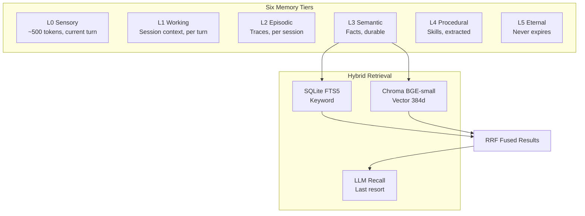

# Memory Tiers — What & Why

> Concept: A six-level memory hierarchy (L0-L5) spanning working context to eternal fleet knowledge, with A-MAC admission control, Dream consolidation for offline pattern extraction, and hybrid retrieval combining keyword, vector, and LLM-based search.

## What It Is

Memory in Lyra is organized as a six-tier hierarchy (L0 through L5) with distinct retention, latency, and cost profiles. Data flows through a progressive disclosure retrieval pattern: search first, peek the snippet, fetch the full body only when promising. This keeps the working context small and bills low.

The hierarchy extends the canonical four-tier model (working, episodic, semantic, procedural) with two additional tiers:

- **L0 Sensory** — Current turn, ~500 tokens, discarded after context assembly. Raw observations before any processing.
- **L1 Working** — Active session context, discarded per turn. Recent tool observations, conversation history. Held in-memory, zero I/O latency.
- **L2 Episodic** — Session traces that persist per session. Written to SQLite at session boundaries. Retained for 30 days.
- **L3 Semantic** — Durable facts that survive compaction. Hybrid storage: SQLite FTS5 for keyword search, Chroma (BGE-small embeddings, 384-dim) for vector similarity.
- **L4 Procedural** — Reusable skills extracted from trajectories. SKILL.md files on disk. The full body loads on invocation; only names and descriptions live in L2 context.
- **L5 Eternal** — Cross-session knowledge that never expires. SOUL.md, project conventions, critical architectural decisions. Reviewed manually for admission.

The SOUL.md persona partition exists outside the hierarchy — it is never compacted, pruned, or consolidated. It occupies the first position in every context assembly.

## Key Mechanisms

- **L0-L5 Hierarchy** — Each tier has a different retention policy (turn, session, 30 days, indefinite, eternal), storage backend (in-memory dict, SQLite, Chroma, filesystem, filesystem), and access latency (<1ms working to ~1-5s LLM recall).
- **A-MAC Admission Control** — Before a new memory is written to L3+, a 5-factor scoring function evaluates: **Attention** (how salient is this event?), **Memory** (how close to existing memories — dedup check?), **Alignment** (how relevant to current goals?), **Coherence** (how consistent with existing knowledge — conflict detection?). Only memories above threshold (default 0.6) are admitted. This prevents memory pollution from noisy or irrelevant turns.
- **Dream Consolidation** — A 4-phase offline pipeline that runs on session boundaries: **Orient** identifies new knowledge from session traces. **Gather** collects related memories across all tiers. **Consolidate** extracts patterns in ADD-only mode (never overwrites existing memories). **Prune** applies Ebbinghaus forgetting curves: memories below a recency-importance threshold are archived. See [Architecture: Dream Consolidation](../architecture/memory-consolidation.md).
- **Hybrid Retrieval** — Parallel query to SQLite FTS5 (keyword search) and Chroma BGE-small (vector similarity), fused by Reciprocal Rank Fusion (RRF, k=60). Top 5 results return title + snippet + relevance score. Full body fetched on demand via `Get` tool. LLM recall fallback (<5% of queries) is the most expensive path and the last resort.
- **Progressive Disclosure** — The model never pre-loads memory. It searches when it suspects an answer exists, reads the snippet, and only fetches the full body if promising. This keeps working context small and avoids paying for irrelevant memory loads.

## Real Numbers

| Metric | Value | Notes |
|--------|-------|-------|
| L0/L1 access latency | <1ms | In-process dict, zero I/O |
| FTS5 keyword search | ~5-15ms | SQLite on local SSD |
| Chroma vector search (top-5) | ~30-80ms | BGE-small on CPU, single-threaded |
| LLM recall latency | ~1-5s | Last resort, <5% of queries |
| Semantic recall accuracy | ~82-88% | BGE-small-en-v1.5 on domain text |

## Why It Matters

Without tiered memory, every session is amnesiac. All context fits in a single window with no persistence across sessions. Lyra's hierarchy provides the right retention at the right cost: ephemeral working context for immediate tasks, durable semantic facts that survive compaction, and eternal knowledge that persists across the agent's lifetime. The A-MAC admission gate prevents memory pollution from noisy turns. Dream consolidation turns raw session traces into abstracted, linked knowledge without human intervention.

## When to Use

Memory is consulted automatically on context assembly and compaction. Use `search`/`timeline`/`get` tools directly when the model does not recall a fact you know exists. Use MEMORY.md for durable notes that survive any pruner run.

## When NOT to Use

Do not use episodic memory for data that must survive unconditionally — that belongs in L3 semantic or L5 eternal. Never store secrets without the private flag; prefer a secret manager for credentials. Avoid triggering the LLM recall tier—configure retrieval cascade so cheaper tiers fire first.

## Related Documentation

- **Block:** [Memory Fabric](../blocks/03-memory.md)
- **Architecture:** [Memory Hierarchy with Dream Consolidation](../architecture/11-architecture-overview.md#memory-hierarchy-with-dream-consolidation), [Dream Consolidation](../architecture/memory-consolidation.md)
- **Plans:** [Memory](../lyra-upgrade/plans/02-memory.md), [Dreaming](../lyra-upgrade/plans/24-dreaming.md)
- **Papers:** Field-Theoretic Memory (arXiv 2602.21220); Memory in LLM Agents (Park et al., 2023, arXiv:2310.08560); Mem0 Consolidation
