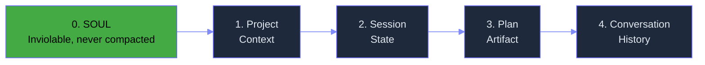

# Context Engine — What & Why

> Concept: The five-layer assembly pipeline that builds the model's context window from personality, memory, plans, tools, and conversation history. Designed for prompt caching, compression, and SOUL inviolability.

## What It Is

The Context Engine is the assembly pipeline that constructs every model request. It is prompt-cache-aware from the ground up: the static prefix (SOUL.md + system prompt) is designed to never change between turns, maximizing cache hit rate on the provider side.

The five layers are assembled in fixed order, each separated by a structured delimiter (`<LAYER_N>`):

1. **SOUL (Layer 0)** — The agent's persona and operating principles. Never compacted, never truncated, never modified. Occupies the first position in every context assembly. Guaranteed to fit within the context window regardless of other layers. Typically ~2-5 KB.
2. **Project Context (Layer 1)** — Architecture docs, plans, and conventions relevant to the current repository. Sourced from project memory, wiki pages, and recently modified files. Changes only when the project is switched. Typically ~5-15 KB.
3. **Session State (Layer 2)** — Active plan artifact, pending verifications, checkpoint data, cost tracker, and mode settings. Changes at turn boundaries as state updates. Typically ~1-3 KB.
4. **Plan Artifact (Layer 3)** — The current plan steps and completion status with checkboxes. Empty if no active plan. Written as a markdown artifact. Typically ~1-3 KB when present.
5. **Conversation (Layer 4)** — Recent turns, tool observations, and an elastic history window. This is the only layer that grows unboundedly and requires compression. The keep-window preserves the last N turns (default 5), and older turns are compressed via Lean-Ctx or Mermaid compression.

The assembly is deterministic: given the same state, the same context string is produced. This is critical for prompt caching — the cache key is computed from the first three layers (SOUL + project + state), and any change invalidates the cache.

## Key Mechanisms

- **5-Layer Assembly** — Layers are assembled in fixed order with the longest-lived (SOUL) first. Each layer is separated by a structured delimiter. The assembly is deterministic: given the same state, the same context string is produced. Prompt caching works because layers 0-2 rarely change between turns, giving 70-90% cache hit rates sustained after turn 2. The context engine tracks layer hashes to detect which layers changed between previous and current assembly.
- **Filesystem-as-Context** — The filesystem is the primary context store. SOUL.md, plans, session state, and skill bodies all live as markdown files. The context engine reads from these files rather than maintaining a separate in-memory store. This makes context debuggable with standard tools (grep, less, diff) and means context survives crashes without a database. File reads are cached in an LRU cache (TTL 5 seconds) to avoid redundant I/O on repeated assemblies.
- **Mermaid Compression** — When context approaches the compaction threshold (85% of max tokens, configurable), the engine compresses older conversation turns into dense Mermaid diagrams. The diagram summarizes key decisions, tool calls, and outcomes as a flowchart. Lossy but meaningful: the model can read the flow but loses exact command outputs and error messages. Compression runs as a PostToolUse hook when the token count exceeds the threshold. Savings: ~60-80% vs raw conversation for the compressed range.
- **Lean-Ctx** — A lightweight compaction strategy that runs at every turn, not just at the compaction threshold: discard redundant tool observations (identical consecutive bash calls), truncate file reads to first 50 + last 20 lines with artifact references, collapse identical consecutive tool calls into a summary line, strip diagnostic output that matches known patterns (backtrace noise, verbose compiler output). Savings: ~30-50% per turn vs unprocessed conversation.
- **SOUL Inviolability** — SOUL.md occupies the first position in every context assembly and is never compacted, truncated, or modified. If the remaining layers exceed the context window, only the conversation layer (Layer 4) is compressed. This guarantees the agent's persona and operating principles are always fully visible. The SOUL layer has a hard reservation: it always gets its full token allocation before other layers are considered.

## Real Numbers

| Metric | Estimate | Notes |
|--------|----------|-------|
| Prompt cache hit rate | 70-90% | Sustained after turn 2 |
| Lean-ctx savings per turn | ~30-50% | vs raw unprocessed conversation |
| Mermaid compression savings | ~60-80% | vs raw conversation for compressed range |
| Assembly time | <5ms | Deterministic, hot files cache-hit |
| SOUL layer size | ~2-5 KB | Never compacted, always included |

## Why It Matters

Without a context engine, every model call begins with a raw dump of everything the system knows. This wastes tokens, destroys prompt caching, and makes the model's behavior non-deterministic. The 5-layer pipeline ensures every model call sees the same consistent structure: personality first, then relevant context, then current state, then conversation. Prompt caching works because layers 0-2 rarely change between turns, giving 70-90% cache hit rates. Lean-ctx and Mermaid compression keep the window from filling even in long sessions. SOUL inviolability guarantees the agent's identity and operating principles are always fully visible.

## When to Use

The Context Engine runs automatically on every model call. Tune the compaction threshold and keep_window through config if your sessions are consistently longer or shorter than default. Monitor the prompt cache hit rate via `/observatory cache` to verify effective prefix stability.

## When NOT to Use

Do not disable layers (SOUL in particular). Do not customize the assembly order — it is designed so that the most stable content comes first for cache optimization. Do not inject content between layers; use the appropriate layer slot.

## Related Documentation

- **Block:** [Context Engine](../blocks/02-context-engine.md)
- **Architecture:** [Context Assembly / Data Flow](../architecture/11-architecture-overview.md#data-flow)
- **Plans:** [Context Compaction](../lyra-upgrade/plans/03-context-compaction.md)
- **Papers:** NGC: Neural Graph Compression for Agent Context (Stanford 2026, arXiv:2604.18002); Prompt Cache: Modular Attention Reuse (2024, arXiv:2311.04934)
