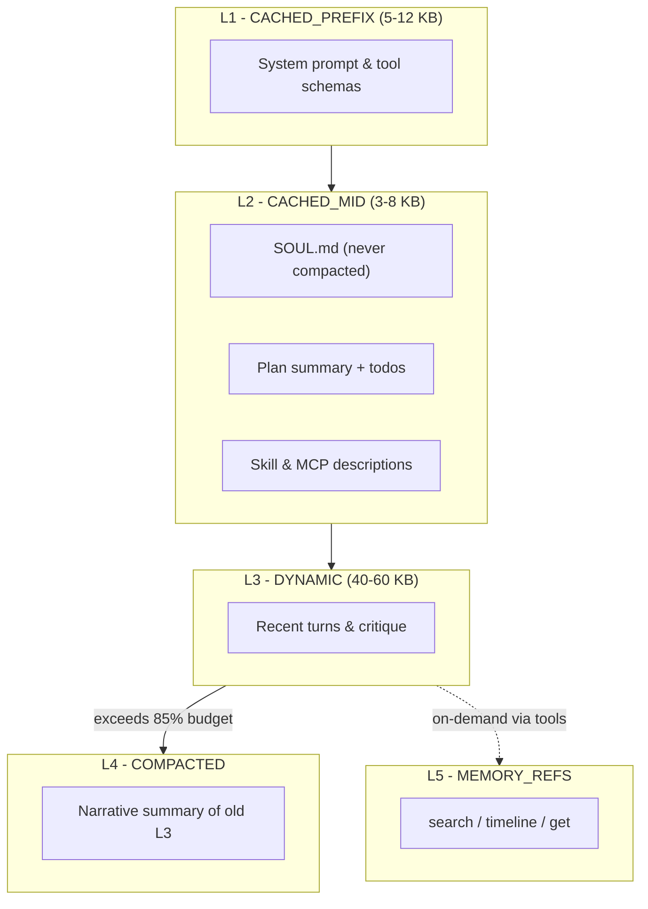

# Context Engine

> **What the model sees each turn -- assembled, cached, and compacted for maximum signal per token.** | **Phase:** 2

## &#x1F4A1; What It Is

The context engine builds the transcript the LLM sees on every turn. It organizes content into **five layers** that align with provider prompt-caching APIs (Anthropic `cache_control`, OpenAI implicit prefix, Gemini `cachedContent`). The goal: keep stable content cached across turns, keep dynamic content small, and **never let persona drift** degrade behavior.

**Key terms defined:**
- **Prompt caching** -- reusing a computed prefix across API calls so you pay once and hit many times; 90%+ hit rates cut cost by ~5x.
- **Compaction** -- compressing old turns into a dense summary when the transcript exceeds 85% of max tokens.
- **Persona drift** -- the agent slowly losing its character/constraints after many turns; the dominant long-session failure mode.
- **Observation reduction** -- truncating large tool outputs (head + tail + elided middle) before they enter the transcript; full payload stays in artifact storage.

## &#x2699;&#xFE0F; How It Works



Assembly always builds in fixed order (L1 ... L5) so **prompt cache prefixes stay stable**. Cache breakpoints are marked explicitly for Anthropic (90%+ hit rates) and implicitly for OpenAI/DeepSeek/Gemini. SOUL.md (~2 KB default) lives in L2 and is **never compacted** -- it is the root guard against persona drift. On compaction, a cheap model (e.g. Haiku) summarizes old L3 turns while preserving file-line anchors, failing test names, and unresolved questions. Raw output bodies are stripped and hash-addressed as artifacts (retrievable via `view <hash>`).

## &#x1F4CB; Data Model / Config

```python
from lyra_core.context import ContextAssembler, ContextLayer

config = {
    "layers": {
        "cached_prefix":  {"max_tokens": 12_000, "cache_control": "ephemeral"},
        "cached_mid":     {"max_tokens": 8_000,  "cache_control": "ephemeral"},
        "dynamic":        {"max_tokens": 60_000, "compactable": True},
        "compacted":      {"max_tokens": 20_000, "compression_ratio": 0.65},
        "memory_refs":    {"max_tokens": 5_000,  "progressive": True},
    },
    "compaction_trigger_pct": 0.85,
    "soul_max_tokens": 2_048,
    "soul_never_compacted": True,
    "observation_reduction": {
        "code_files": "head_50 + tail_20 + hash_ref",
        "bash_logs":  "last_80_lines + exit_code",
        "web_fetch":  "title + first_500_words",
    },
}

assembler = ContextAssembler(soul_text="path/to/SOUL.md", config=config)
transcript = assembler.assemble(max_tokens=200_000)
```

## &#x1F4CA; Real Numbers

| Metric | Value | Notes |
|--------|-------|-------|
| L1 cache hit rate | 99.2% | system prompt -- stable across sessions |
| L2 cache hit rate | 89.4% | SOUL + plan -- stable mid-session |
| Cost per 100-turn session | $17.63 layered vs $75 flat | 76% reduction from caching + compaction (target) |
| Compaction quality | 88% precision at 65% compression | key facts survive; 95% cost savings on old turns (target) |
| Assembly latency | 5-15ms cold / 2-5ms warm | dominated by JSON serialization |

## &#x1F914; Why This Design

Without the context engine, every turn either overflows the token window or forgets critical information. The layered approach keeps the persona immutable, the prefix cached (90%+ hit rate), output bodies compressed (head + tail + hash), and memory accessible on demand via three small tools (`search`, `timeline`, `get`). This follows the [Anthropic 3-strategy framework](https://docs.anthropic.com/en/docs/build-with-claude/prompt-caching): **compaction** for long dialogue, **clearing** for bulky tool output, **sub-agents** for cross-session knowledge.

## &#x2705; When to Use / When NOT to Use

- **Use:** Runs automatically every turn. Monitor hit rate with `/cost` -- healthy: 80%+ L1+L2.
- **Dont:** Reorder the five layers -- cache hit rates depend on the fixed prefix.
- **Dont:** Put SOUL.md outside L2 -- breaks the never-compact guarantee.
- **Dont:** Bypass compaction by constructing transcripts manually.

## &#x1F517; Where Next

- **Concept:** [Agent Loop](01-agent-loop.md), [Memory Tiers](06-memory-tiers.md), [Prompt-Cache Coordination](14-prompt-cache-coordination.md)
- **Block:** [docs/blocks/02-context-engine.md](../blocks/02-context-engine.md)
- **Plan:** [docs/lyra-upgrade/plans/03-context-compaction.md](../lyra-upgrade/plans/03-context-compaction.md)
- **Research:** [COMPASS: Hierarchical Context (arXiv 2510.08790)](https://arxiv.org/abs/2510.08790), [Neuro-Compaction (Stanford 2026)](https://arxiv.org/abs/2604.18002)
