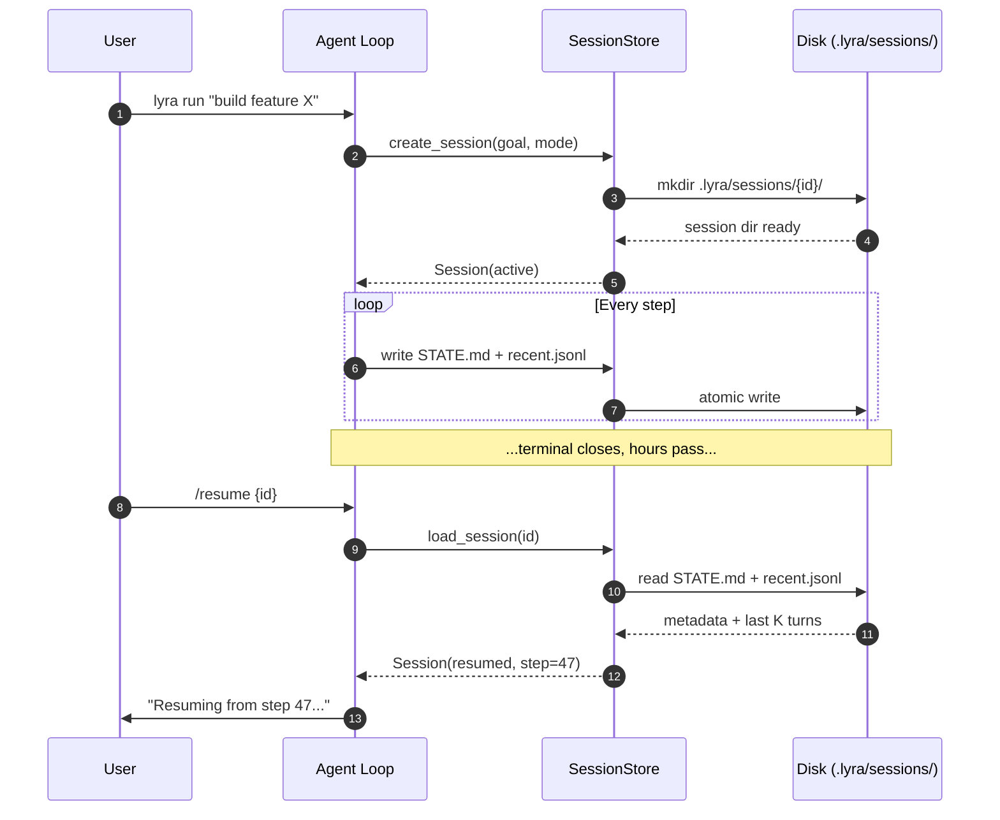

# Sessions and State

> **Every session is a directory you can `ls` and `cat`. STATE.md is human-readable and load-bearing.** | **Phase:** 1

## :brain: What It Is

A Lyra **session** is the unit of work: one continuous interaction with the agent from start to finish. Everything about it (transcript, plan, tool calls, hook decisions, costs) persists to a directory you can explore with standard Unix tools. There is no binary format. `/resume` reads the same files anyone else would read. This is a core design commitment: ungreppable state is a non-starter.

## :gear: How It Works



### Session Layout

```
.lyra/sessions/{id}/
STATE.md          YAML frontmatter + Markdown body (updated every step)
recent.jsonl      Last N transcript turns (default 10, FIFO ring buffer)
trace.jsonl       Full HIR span stream (append-only, immutable)
metrics.jsonl     Cost + latency timeseries (append-only)
artifacts/        Hash-addressed blobs (plans, diffs, large tool outputs)
hooks/            Per-hook last-result state for review
```

**Jargon defined inline:**
- **STATE.md** -- The load-bearing file. Contains YAML frontmatter (id, timestamps, status `active|paused|complete|aborted`, mode, model names, cost, step count) and a Markdown body (goal, plan progress, TDD phase, open questions, next steps). What `/resume` reads first.
- **recent.jsonl** -- JSON Lines file of the last K transcript turns, functioning as a sliding window so context stays manageable.
- **trace.jsonl** -- Append-only stream of every **HIR** (Hierarchical Instrumentation Record) span. The complete, immutable audit trail.
- **HIR** -- Hierarchical Instrumentation Record. A structured log entry that captures one span of execution (LLM call, tool execution, hook evaluation) with timing, input, output, and parent-child relationships.
- **ephemeral** -- Data that lives only in memory during a single turn (tool buffers, intermediate results). Not persisted.
- **immutable** -- Once written, never modified. `trace.jsonl` and `artifacts/` are append-only; editing them would corrupt the audit chain.

### Resume Mechanics

The resume sequence loads STATE.md (metadata), `recent.jsonl` (last K turns), `todo.json` (task list), and the plan artifact reference. The **context engine** assembles a transcript from the persona, plan, todos, and recent turns, then the agent loop picks up at the next step.

**Survives resume:** goal, mode, model config, plan with status, todos, recent turns, permission overrides, cost remaining, budget remaining. **Does not survive:** transient tool buffers, tool-call arguments older than the keep-window, per-tool counter state.

### Two Layers of Persistence

| Layer | Files | Updated | Size | Semantics |
|-------|-------|---------|------|-----------|
| State (small + live) | STATE.md, todo.json, recent.jsonl | Every step | KB | Fast read on resume, frequently rewritten |
| Trace (large + immutable) | trace.jsonl, metrics.jsonl, artifacts | Append-only | MB+ | Full audit trail, never modified |

### Programmatic Access

Inspect sessions through `lyra_core.sessions.SessionStore`. The store splits into **repo-scoped** (`.lyra/sessions/`) and **user-scoped** (`~/.lyra/sessions/`) -- both visible via `lyra sessions`. Plans are git-trackable (`git add .lyra/plans/`); many teams commit plan artifacts for big features so PR reviewers can see the brief before the diff. Use `lyra sessions migrate <path>` to import older pre-v3.0 session formats.

## :balance_scale: Why This Design

An agent that forgets its own progress is unreliable. By persisting every step to human-readable files, Lyra makes session continuity a first-class capability. The design choice against binary formats means no special tooling is ever needed -- no pickle, no protobuf, just files you can open in any editor or pipe through grep. The two-layer persistence (small+live STATE.md vs. large+immutable trace.jsonl) makes resume fast (read a few KB) while keeping the audit trail complete (append-only mega-stream).

## :bar_chart: Real Numbers

| Metric | Target | Note |
|--------|--------|------|
| Session resume latency | < 50 ms | Reading STATE.md + recent.jsonl from SSD |
| Disk per 100 steps | ~500 KB | Combined STATE.md + recent.jsonl + trace.jsonl |
| Write overhead per step | < 5 ms | Async fsync, non-blocking to the agent loop |

## :white_check_mark: When to Use

Sessions are created automatically every time you run Lyra. Use `lyra sessions` to list active sessions. Use `/resume <session-id>` to pick up where you left off after a break or crash. Use `lyra trace show <session-id>` to inspect a session's HIR trace step by step.

## :no_entry: When NOT to Use

Do not hand-edit STATE.md while a session is active -- the loop writes to it every step and edits may be overwritten. Do not rely on sessions for data that must outlast the session lifecycle; move important facts to MEMORY.md or wiki entries. Prune old sessions periodically with `lyra sessions prune --keep 30`.

## :link: Where Next

- **Block:** [01-agent-loop.md](../blocks/01-agent-loop.md) -- the loop that creates and updates every session
- **Concept:** [07-context-engine.md](./07-context-engine.md) -- how the transcript is assembled on resume
- **Concept:** [06-memory-tiers.md](./06-memory-tiers.md) -- where durable facts go after the session ends
- **Plan:** [13-swarm-fleet.md](../lyra-upgrade/plans/13-swarm-fleet.md)
