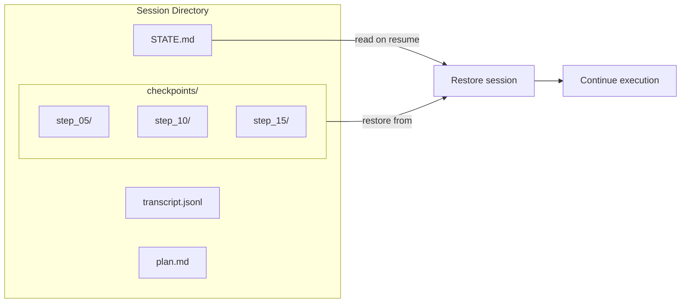

# Sessions & State — What & Why

> Concept: Human-readable STATE.md files as the source of truth for session persistence, with checkpointing, resume, fork, and backgrounding built on the filesystem rather than a database.

## What It Is

Sessions in Lyra are file-backed, human-readable, and resumable. Every session writes its state to a directory under `.lyra/sessions/<session_id>/` containing:

- **STATE.md** — A human-readable summary of current state: session ID, active plan, step position, cost incurred (total and per-model), tokens used, permission mode, and completion status. Updated on every step.
- **transcript.jsonl** — The full event stream as HIR events. Every tool call, LLM request, permission decision, and hook execution is recorded with timestamps, durations, and costs. Replayable.
- **plan.md** — The active plan artifact with `[x]` checkbox progress. Written at plan creation and updated on each step completion.
- **checkpoints/** — Snapshot directories taken at configurable intervals (default: every 5 steps or every session turn). Each checkpoint contains STATE.md, transcript.jsonl up to that point, and the context assembly as it was at checkpoint time.

There is no database. The filesystem is the source of truth. This makes sessions debuggable with standard Unix tools (`grep`, `less`, `wc`, `diff`).



## Key Mechanisms

- **Checkpointing** — At configurable intervals (default: every 5 steps or every session turn), a checkpoint is written: STATE.md snapshot, transcript.jsonl segment, and the full context assembly. Checkpoints are retained for 30 days. Old checkpoints are pruned oldest-first if the checkpoint count exceeds the retention limit.
- **Resume** — On session start, the system checks for an existing session ID. If found, it reads STATE.md and restores the plan artifact, cost tracker, and transcript up to the last checkpoint. The model sees the restored context exactly as it was at checkpoint time. Sessions can be resumed after a crash, a terminal close, or a deliberate pause.
- **Fork** — A session can be forked by copying its session directory to a new ID. The fork inherits the parent's state up to the fork point. Parent and child evolve independently. Fork is useful for experimentation: "try approach A in a fork and approach B in another fork, then compare results."
- **Backgrounding** — Long-running tasks can be backgrounded with `/bg`. The session is checkpointed and the process detaches. A scheduler process monitors the background session, collects its HIR events, and reports completion. Background sessions have a separate cost budget from the foreground.
- **Unwatched Session Guard** — If a session is resumed but the user is absent (no input for N minutes, default 5), the Permission Bridge escalates to its most restrictive mode (Plan). All tool execution tools are blocked until the user sends an explicit approval signal. This prevents unattended sessions from continuing unsupervised.

## Configuration

```yaml
sessions:
  checkpoint_interval: 5  # steps between checkpoints
  retention_days: 30      # max age of checkpoint data
  unwatched_timeout: 5    # minutes before permission escalation
```

## Why It Matters

Without session persistence, a closed terminal or connection drop loses all progress. The model starts from scratch, having forgotten every decision and discovery. Checkpoint-based sessions mean that a backgrounded task completes regardless of connectivity, and a crashed session resumes at the last checkpoint with full context restored. Fork enables safe experimentation: try two approaches from the same starting point and compare results. The unwatched session guard prevents a catastrophic failure mode — a long-running task that continues unsupervised after the user has walked away.

## When to Use

Sessions run automatically. Use `/bg` for long-running tasks (tests, batch processing, codebase-wide refactors). Use fork for exploration (compare approaches, test risky changes in isolation). Use resume when reconnecting to a session.

## When NOT to Use

Do not manually edit STATE.md or transcript.jsonl — you may break resume. Do not fork a session with pending background tasks. Do not rely on session persistence for secrets or sensitive data (transcripts are JSONL files on disk).

## Related Documentation

- **Block:** [Agent Loop](../blocks/01-agent-loop.md) (persistence is part of the loop)
- **Architecture:** [Data Flow](../architecture/11-architecture-overview.md#data-flow)
- **Plans:** [Sessions](../lyra-upgrade/plans/11-sessions.md)
- **Paper:** Reflexion Loop (NeurIPS 2023, arXiv:2303.11366)
