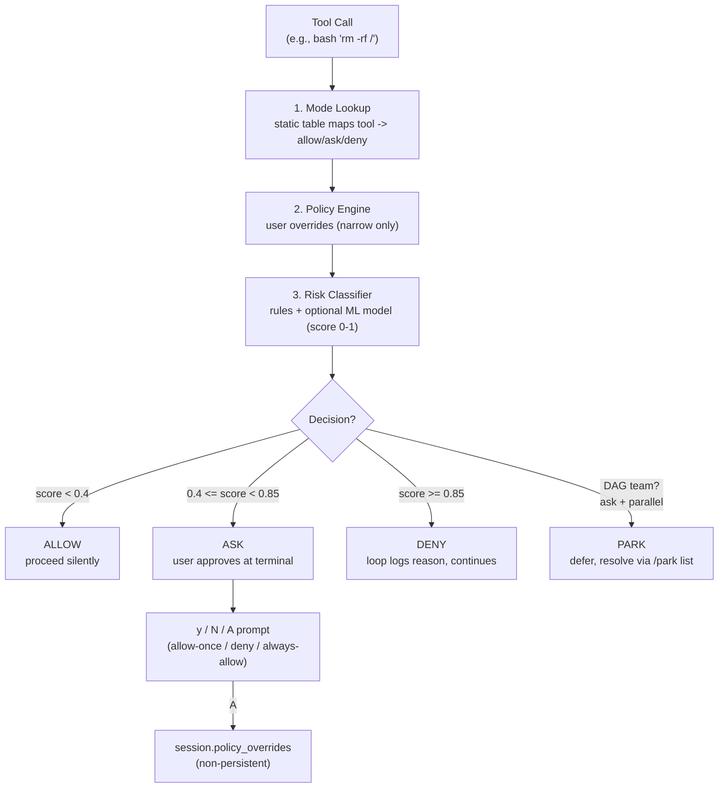

# Permission Bridge

> **Every tool call flows through one function. The model never holds the keys.** | Phase 1

##  What It Is

Every tool call in Lyra -- every single one, no matter the mode -- flows through `PermissionBridge.decide(call, session) -> Decision`. The model can never silently escalate its own privileges. This is the load-bearing safety primitive that makes Lyra robust against **prompt injection** (an attacker tricking the model into running malicious commands), **runaway agents** (agents that autonomously chain destructive actions), and the model arguing itself into a destructive shell command.

##  Decision Pipeline



Each stage can only **deny more**, never allow more. This **monotonic property** (the permission set shrinks monotonically as it passes through stages) makes the bridge auditable by construction.

##  Permission Modes

| Mode | Writes | Bash | Network | Use Case |
|------|--------|------|---------|----------|
| Plan | deny | deny | deny | Exploration, read-only analysis |
| Triage | ask | ask | deny | Initial investigation |
| Default | ask | ask | ask | Normal interactive use |
| AcceptEdits | allow | risk-classified | ask | Steady execution |
| Red | allow | deny | deny | TDD: write failing test |
| Refactor | allow | risk-classified | deny | TDD: improve code |
| Green | allow | deny | deny | TDD: make test pass |
| Bypass | allow | risk-classified | ask | Power user (hooks still run) |

Transitions: CLI flags (`lyra --mode plan`), in-session commands (`/mode plan_mode`), or automatic on plan approval / TDD phase progression. The model **cannot** change modes unilaterally. Every transition emits a trace event with `{before, after, reason}`.

##  Config & Data Model

```toml
# ~/.lyra/config.toml
[permissions]
risk_ask_threshold = 0.4    # calls scored >= this require user approval
risk_deny_threshold = 0.85  # calls scored >= this are denied outright

[permissions.mode_overrides]
"bash" = { mode = "Default", action = "ask" }   # narrow a mode

[permissions.always_allow]
paths = ["/home/user/projects/*"]
tools  = ["Read", "Bash_ls"]
```

**Jargon defined:** A **policy override** is a user-specified rule that narrows what a mode allows. An **always-allow** entry bypasses the ask prompt for specific tool+path combos for one session only (stored in `session.policy_overrides`, never persisted to disk).

##  Real Numbers (Targets)

| Metric | Target | Notes |
|--------|--------|-------|
| Latency added per call | < 5 ms | Static table + rules engine (no ML by default) |
| Risk classifier inference | < 50 ms | Optional ML model; disabled if not configured |
| False-positive denies | < 1% | On routine tool calls (Read, Edit, Bash_ls) |
| Token overhead | 0 | No prompt tokens consumed -- bridge runs outside the LLM |

##  Why This Design

Authorization must be **deterministic** and **auditable**. An LLM can be argued into making bad choices (see [prompt injection research](https://arxiv.org/abs/2302.12173)); a static permission mode table cannot. By routing every tool call through the bridge, Lyra guarantees that every decision is logged with a traceable reason. Alternatives like in-prompt instructions ("be careful with rm") are unreliable against a determined or compromised model.

##  When to Use

The bridge is active on every tool call by default. Switch modes with `/mode <name>` to change the posture. Use per-session always-allow decisions for frequently approved tool+path combinations to reduce friction.

##  When NOT to Use

Do not use `bypass` mode in untrusted environments. Never disable the permission bridge entirely. **Parking** (deferring an ask decision for parallel execution) is designed for DAG teams only -- in single-agent sessions, blocking on ask is the expected behavior.

##  Where Next

- **Block deep-dive:** [05-permission-bridge.md](../blocks/05-permission-bridge.md)
- **Plan & design decisions:** [12-permissions.md](../lyra-upgrade/plans/12-permissions.md)
- **Related concepts:** [11-safety-monitor.md](./11-safety-monitor.md), [10-two-tier-routing.md](./10-two-tier-routing.md)
- **Research:** [LLM Prompt Injection Survey (arXiv 2302.12173)](https://arxiv.org/abs/2302.12173)
