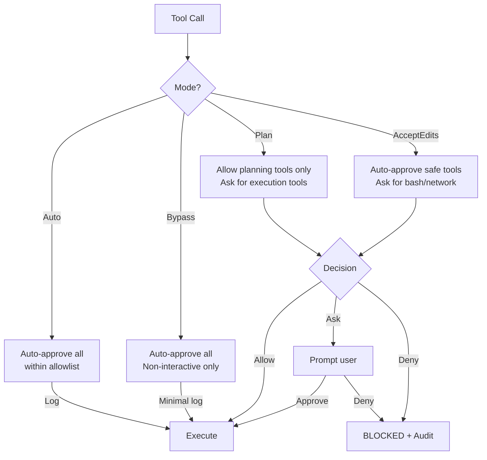

# Permission Bridge — What & Why

> Concept: A single runtime authorization function that gates every tool call through one of four modes (Plan/AcceptEdits/Auto/Bypass), with per-tool granularity, audit logging, and an unwatched-session escalation guard.

## What It Is

The Permission Bridge is Lyra's load-bearing safety primitive. Every tool call from every agent passes through a single authorization function before execution. The bridge does not make safety decisions itself (that is the Safety Monitor's role) — it enforces the current permission mode consistently across all tools.

There are four modes:

1. **Plan** — Only plan-related tools allowed (read, search, grep, LSP, glob). Execution tools (write, bash, edit, run, test) require explicit user approval per call. Default for Plan Mode sessions. Every denied call is recorded with the tool name, arguments hash, and reason. This mode prevents any unintended modification during the planning phase.
2. **AcceptEdits** — Safe tools auto-approved (read, write, edit, grep, glob, LSP). Bash and network tools require explicit approval. Permissions are logged but do not block for the safe set. This is the default for standard interactive sessions — the user accepts that file edits are safe but wants to approve network calls and arbitrary commands.
3. **Auto** — All tools auto-approved within the configured allowlist. Permission decisions are logged but do not block. Used for trusted, well-defined tasks: running test suites, batch processing, CI/CD pipelines. The allowlist is configured in `lyra.yaml` and should be reviewed regularly.
4. **Bypass** — All tools auto-approved with minimal logging (only tool name and timestamp, no arguments). Only available in non-interactive mode (pipelines, automated scripts). Never available for interactive sessions. Requires explicit configuration flag. No session with bypass mode can be resumed interactively.



## Key Mechanisms

- **Single Auth Function** — One function decides allow/ask/deny/park for every tool call. The model never holds authorization keys. Every decision has a traceable reason recorded in the HIR event stream with tool name, arguments hash (SHA-256), decision mode, and timestamp. The function is deterministic: given the same (mode, tool, args, session), it returns the same decision. This determinism is critical for audit and replay.
- **Per-Tool Granularity** — Each tool has a configured permission level within each mode. Level 0 (always deny — dangerous tools like raw `exec`), Level 1 (plan-only — read, grep, LSP), Level 2 (requires approval — write, bash, run), Level 3 (auto-approved — read, search, glob), Level 4 (bypass, no logging). Levels are configured in `lyra.yaml` under `permissions.tools`. Tools not explicitly configured inherit their category's default level.
- **Unwatched-Session Escalation** — If a session is resumed and the user is absent for the configured timeout (default 5 minutes), the bridge escalates to Plan mode regardless of the configured mode. This prevents a backgrounded session from continuing unsupervised. The escalation is logged as an HIR event with escalation reason, previous mode, and new mode. The session must be manually returned to the previous mode by the user after re-engagement.
- **Skill Narrowing** — When a skill is active, the bridge narrows the tool allowlist to the skill's `allowed-tools` set. The model can only call tools in that set. On scope exit, the original list restores. This is enforced before the mode check — if a tool is not in the skill's allowlist, the bridge returns "tool not available" without checking the mode.
- **Audit Log** — Every permission decision is recorded in `.lyra/sessions/<id>/permissions.jsonl` with: tool name, arguments hash (SHA-256, full arguments are not logged for privacy), mode, decision (allow/ask/deny), reason string, timestamp (RFC 3339), and session ID. The audit log is included in checkpoint data and survives session resume. A daily audit summary is available via `/audit today`.

## Configuration

```yaml
permissions:
  default_mode: accept_edits
  unwatched_timeout_minutes: 5
  tools:
    write: 2         # level 2 = requires approval
    bash: 2
    read: 3          # level 3 = auto-approved
    grep: 3
    edit: 2
    run: 2
    exec: 0          # level 0 = always deny
```

## Why It Matters

Without a centralized permission bridge, each tool would implement its own authorization logic, leading to inconsistent enforcement and audit gaps. A single function guarantees that every tool call follows the same rules, every decision is logged, and changing the policy (e.g., "escalate to plan mode") affects all tools uniformly. The unwatched-session guard prevents a catastrophic failure mode: a long-running task that continues unsupervised after the user has walked away. The skill narrowing ensures that skill invocations cannot escape their declared tool scope.

## When to Use

Use Plan mode for sessions that touch sensitive files (config, secrets, infrastructure as code). Use AcceptEdits for standard development. Use Auto for CI/CD pipelines and automated tasks. Never use Bypass in interactive sessions.

## When NOT to Use

Do not disable the Permission Bridge entirely. Do not set bypass mode for interactive sessions. Do not configure per-tool level 0 capriciously; verify the tool is actually dangerous before denying it unconditionally.

## Related Documentation

- **Block:** [Permission Bridge](../blocks/05-permission-bridge.md)
- **Architecture:** [Safety Architecture Layer 2: Permission Gating](../architecture/11-architecture-overview.md#safety-architecture-6-layer-parallax-style)
- **Plans:** [Permissions](../lyra-upgrade/plans/12-permissions.md)
- **Paper:** Parallax Cognitive-Executive Separation (2026, arXiv:2604.12986)
