# ⚡ Two-Tier Routing

> **Every session has a fast slot and a smart slot. The fast slot handles loop turns; the smart slot handles planning, verification, and escalation.** | **Phase:** 1

## 🎯 What It Is

Every Lyra session has two model **slots**: fast and smart. The fast slot handles the bulk of in-loop turns (chat, coding, tool use). The smart slot is reserved for moments where extra reasoning pays for itself (planning, hard verification, **cascade** escalation). This is the most load-bearing cost-shaping pattern in the harness. The naive "always use the smart model" is 5-20x more expensive for daily coding. The opposite naive alternative -- "always use the fast model" -- produces low-quality plans and weak verification.

### 📖 Jargon Buster

- **Slot**: A logical assignment of a model (provider + model name + parameters) to a role.
- **Cascade / Escalation**: When the fast model detects it cannot handle a turn and re-runs the same input on the smart model.
- **Nats**: Natural-log units for log-probability. More negative = lower model confidence.
- **Circuit-breaker**: A safety limit (default 8 escalations per session) that aborts the session when exceeded, preventing runaway cost.
- **Verifier conflict check**: The rule that a response generator and its evaluator must be different model families, avoiding self-approval bias.

## ⚙️ How It Works

The role-to-slot mapping is explicit and configurable in `~/.lyra/config.toml`. Default mapping:

| Role | Slot | Rationale |
|------|------|-----------|
| chat (loop step) | fast | High frequency, cheap per-turn |
| plan | smart | Deep reasoning required |
| verify-subjective | dedicated evaluator | Must differ from generator family |
| summarize | fast | Lightweight aggregation |
| extract-skill | smart | Precision needed |
| safety-monitor | dedicated nano model | Cheap, frequent, isolated |

Each role can be overridden per-session via `[models.roles]`.

### 🔄 Cascade Flow

```mermaid
sequenceDiagram
    actor User
    participant Kernel
    participant Fast as Fast Slot<br/>(e.g. Llama 3.3 70B)
    participant Smart as Smart Slot<br/>(e.g. Claude Sonnet 4)

    User->>Kernel: Send prompt
    Kernel->>Fast: Route to fast role
    Fast-->>Kernel: Normal response
    Kernel->>User: Return

    User->>Kernel: Send complex prompt
    Kernel->>Fast: Route to fast role
    Fast-->>Kernel: &#x26A0;&#xFE0F; Escalate (low confidence)
    Kernel->>Smart: Re-run same turn
    Smart-->>Kernel: Deep response
    Kernel->>User: Return escalated
```

The **cascade** is a controlled escalation path. If the fast model explicitly signals it cannot handle the turn -- via a special token (`<lyra:escalate reason="..."/>`) or low log-probability on action tokens (below **-2.5 nats**, indicating low confidence) -- the kernel re-runs the same turn on the smart model. The same context is replayed; the trace shows both calls and cost attribution accounts for both. Escalation is always detected by signal, never by silent retry.



## 📋 Configuration

A canonical production `~/.lyra/config.toml`:

```toml
[models.fast]
provider = "groq"
model   = "llama-3.3-70b-versatile"
temperature = 0.2
max_tokens  = 4096

[models.smart]
provider = "anthropic"
model   = "claude-sonnet-4-20250514"
temperature = 0.1
max_tokens  = 8192

[models.roles]
plan = "smart"
"verify-subjective" = { provider = "openai", model = "gpt-4o" }

[routing]
cascade_enabled = true
cascade_circuit_breaker = 8        # abort session after 8 escalations
cascade_allowed_roles = ["chat", "code", "tool-use"]
```

A common pattern is **fast on a cheap open-weights model** (e.g. Llama 3.3 70B via Groq) and **smart on a frontier model** (e.g. Claude Sonnet 4 via Anthropic). Many valid combinations exist -- mix providers freely.

## 📊 Real Numbers

| Metric | Fast Slot | Smart Slot | Cascade |
|--------|-----------|------------|---------|
| **Latency (TTFT)** | ~300 ms (target) | ~1,500 ms (target) | Fast + Smart combined |
| **Cost / 1M tokens** | ~$0.59 (Groq, Llama 3.3 70B) | ~$15.00 (Anthropic, Sonnet 4) | paid once per escalation |
| **Escalation rate** | — | — | < 5% of turns (healthy) |
| **Quality uplift on cascade** | — | +12-30% pass@1 (target) | — |

**Cascade rate** is the key health metric. Much higher than 5% means the fast model is too weak; near 0% means smart capacity is underutilized. The circuit-breaker (default 8/session) prevents runaway cost.

## 🧠 Why This Design

Explicit slots beat implicit per-turn heuristic model selection because they provide:

- **Predictable cost**: Budget per role, not per turn.
- **Predictable quality**: Test against a fixed smart slot.
- **Trace clarity**: `model.fast` vs `model.smart` is human-readable.
- **Family discipline**: Clean separation for verifier conflict checks.

The cascade signal lets the fast model escalate when it hits its limits, keeping the system honest without always paying the smart model's price.

## ✅ When to Use

On by default. Configure `[models.fast]` and `[models.smart]` in `~/.lyra/config.toml`. Use different provider families per slot. Monitor cascade rate -- below 5% is healthy.

## ❌ When NOT to Use

Do not disable cascade entirely in interactive sessions -- the fast model will never escalate and quality may suffer. In deterministic CI runs, set `cascade_enabled = false`. Never use the same model family for generator and verifier (creates self-approval bias).

## 🔗 Where Next

- **Block:** [03-dag-teams.md](../blocks/03-dag-teams.md)
- **Plan:** [05-model-router.md](../lyra-upgrade/plans/05-model-router.md)
- **Guide:** [configure-providers.md](../howto/configure-providers.md)
- **Paper:** Chen et al., *"FrugalGPT: How to Use Large Language Models While Reducing Cost and Improving Performance"* (arXiv:2305.05176) -- foundational cascade/routing paper.
- **Paper:** Lu et al., *"Routing to the Right Model: A Survey of LLM Routing Methods"* (arXiv:2504.01853) -- survey of confidence-based routing strategies.
