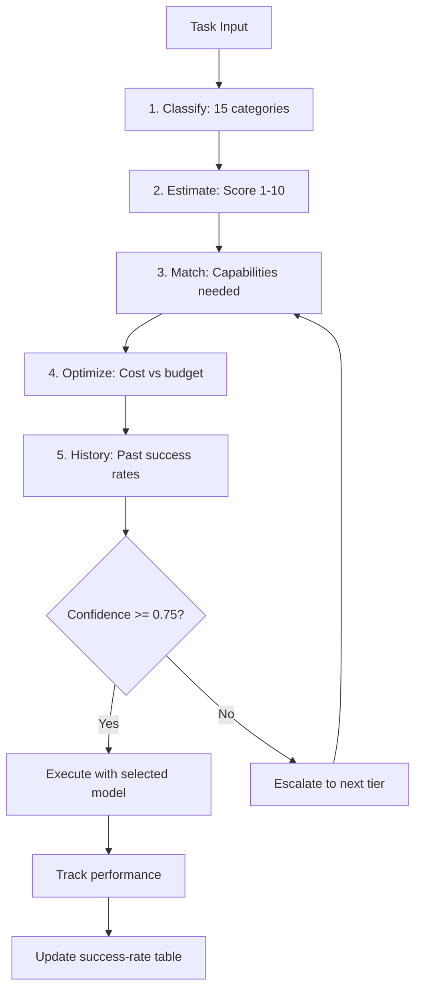

# Model Routing — What & Why

> Concept: A three-tier model router (Haiku/Sonnet/Opus) that classifies tasks by complexity, matches capabilities, optimizes cost, and learns from performance history. The BEST-Route framework estimates difficulty; memory-augmented routing uses past success rates per task category.

## What It Is

The Model Router sits between the Agent Loop and the LLM provider, deciding which model serves each request. It is a three-tier system:

1. **Haiku (fast slot)** — Haiku 4.5 for simple tasks: typo fixes, file reads, grep queries, single-command bash, status checks, and trivial lookups. Target latency ~1.2s. Cost ~$0.003 per turn. Best for tasks where speed matters more than reasoning depth.
2. **Sonnet (smart slot)** — Sonnet 4.6 for standard development: coding, debugging, testing, multi-step workflows, code review, documentation generation. Target latency ~4.5s. Cost ~$0.03 per turn. The default slot for most sessions.
3. **Opus (deep slot)** — Opus 4.5/4.7 for architectural decisions, plan generation (Opusplan pattern), safety-critical reasoning, adversarial verification, complex debugging, and research tasks. Target latency ~8-15s. Cost ~$0.15 per turn. Used sparingly for the tasks that need deep reasoning.

The router uses a five-layer decision pipeline: Task Classification (15 categories), Complexity Estimation (score 1-10), Capability Matching (required reasoning depth, tool types, context size), Cost Optimization (budget constraint, per-turn cost), and Performance History Lookup (past success rates per category-model pair). If confidence < 0.75 at any layer, the request escalates to the next tier.

## Key Mechanisms

- **BEST-Route Difficulty Estimation** — Before routing, the task is classified into 15 categories (coding, debugging, research, planning, testing, review, documentation, configuration, deployment, monitoring, security, performance, architecture, learning, general) and scored 1-10 on complexity. The score considers: number of files likely affected (estimated from task description), tool types needed (read-only tools score lower, bash/edit tools score higher), reasoning depth required (0 = trivial lookup, 10 = novel algorithm design), ambiguities in the task description, and domain unfamiliarity (how common are the terms used?).
- **Memory-Augmented Routing** — The router maintains a success-rate table per (task_category, model) pair, updated from Verifier outcomes (see [Verifier](12-verifier.md)). If a category historically succeeds at 95% on Sonnet but only 60% on Haiku, the router biases toward Sonnet even if the complexity score is low. The table is stored in L3 semantic memory and survives sessions. Categories with fewer than 10 samples use a prior (default 80% for Sonnet, 60% for Haiku, 85% for Opus).
- **Cost Optimization** — Given the model selection, the router estimates cost per turn (based on typical token count for the task category) and compares against the session budget. If the budget is tight, it may route to a cheaper tier even for moderately complex tasks. If a task has high cost variance (e.g., "research" could cost $0.05 or $0.50 depending on depth), the router prefers a cheaper tier for the first turn and escalates if more turns are needed.
- **Controlled Cascade** — If confidence < 0.75 at any layer, the request escalates to the next tier. Cascade is not a fallback: the request is re-evaluated at the higher tier from scratch with the full pipeline, not retried with the same analysis. The cascade threshold is configurable per session. A task that cascades to Opus does so within a single routing decision — the user does not see multiple model switches.
- **Prompt Cache Awareness** — The router prefers keeping the same model for consecutive turns in the same session because switching models invalidates the prompt cache (different model, different cache key). If a model switch is necessary (e.g., a simple question requires unanticipated depth), the router factors the cache invalidation cost (~$0.03-0.15 for one full recomputation) into its decision. The router may choose to complete a task on the current model even if a better model exists, because the cache savings outweigh the capability difference.

## Real Numbers

| Metric | Estimate | Notes |
|--------|----------|-------|
| Routing latency | ~50ms | All five layers, no LLM calls |
| Haiku accuracy on simple tasks | ~95% | Verified against Sonnet baseline |
| Cost savings vs always-Sonnet | ~40-60% | Depends on task mix |
| Cache hit rate with model stability | 70-90% | Sustained after turn 2 |
| Cascade rate to Opus | ~5-10% | Of all routing decisions |

## Why It Matters

Without routing, every request uses the most expensive model. This is wasteful: >50% of requests are simple enough for Haiku. A fixed model selection ignores task complexity, cost budgets, and historical performance. The BEST-Route framework with memory-augmented routing learns which models work best for which tasks, adapting over time. The controlled cascade ensures that difficult tasks never get stuck on an insufficient model, while cost optimization prevents budget overruns. The cache awareness prevents unnecessary model switches that would invalidate the prompt cache.

## When to Use

Routing runs automatically on every model call. Tune the confidence threshold per tier if your task mix is unusually simple or complex. Review the success-rate table periodically via `/route stats` for categories with persistent low accuracy.

## When NOT to Use

Do not disable the router entirely — the cost differential between Haiku and Opus is 50x. Do not manually set model per task unless you have specific evidence the router is wrong for that task category.

## Related Documentation

- **Block:** [Plan Mode](../blocks/04-plan-mode.md) (Opusplan routing within Plan Mode)
- **Architecture:** [Intelligent Router Flow](../architecture/11-architecture-overview.md#intelligent-router-flow)
- **Plans:** [Model Router](../lyra-upgrade/plans/05-model-router.md)
- **Papers:** FrugalGPT Cascade Router (Stanford 2023, arXiv:2305.05176); RouteLLM Confidence Escalation (Berkeley 2024, arXiv:2406.18665)
