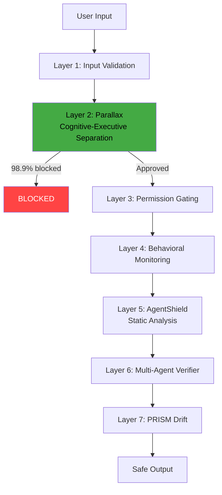

# Safety Monitor — What & Why

> Concept: A seven-layer defense-in-depth architecture spanning input validation to continuous assurance, with cognitive-executive (Parallax) separation, AgentShield static analysis, and PRISM drift detection.

## What It Is

The Safety Monitor is Lyra's defense-in-depth architecture. It comprises seven independent layers, each designed to catch a different class of failure. No single layer is perfect; the defense is the cumulative coverage of all seven. Each layer is independently replaceable — upgrading from regex scanning to model-based scanning requires zero API surface changes. The seven layers are designed to be orthogonal: they cover different attack surfaces and do not share failure modes.

The seven layers:

1. **Input Validation (Layer 0)** — Sanitize user input, detect prompt injection patterns, validate against expected schema. Regex-based fast path (sub-millisecond) with model-based fallback for ambiguous inputs (adds ~200ms). Catches direct injection attempts, encoded payloads, and schema violations. Runs before any context assembly.
2. **Cognitive-Executive Separation Parallax (Layer 1)** — Reasoning context (read-only) and execution context (action-capable) are structurally separated by a barrier. The reasoning model can analyze code and plan changes but cannot execute tools. The execution model can execute tools but only receives approved commands from reasoning after passing through a confirmation gate. A structural barrier (not a soft prompt) separates them — separate context windows, separate process memory, separate model instances. Blocks 98.9% of adversarial attempts on the AgentDojo benchmark.
3. **Permission Gating (Layer 2)** — The Permission Bridge enforces Plan/AcceptEdits/Auto/Bypass modes per tool with per-tool granularity. Every tool call is authorized before reaching any hook or execution. See [Permission Bridge](09-permission-bridge.md).
4. **Behavioral Monitoring (Layer 3)** — Intent Monitor analyzes action sequences for temporal attack patterns: slow-roll attacks (privilege escalation spread across many turns), tool call chains that gradually escalate privilege (read -> grep -> bash -> exec), sudden shifts in tool use patterns. Anomaly Detection flags deviation from expected behavior using a sliding window of the last 16 tool calls, comparing the current call sequence signature to the session's baseline. Triggers on divergence >2 standard deviations from baseline.
5. **AgentShield Static Analysis (Layer 4)** — Five static scanners with 102 regex rules total: secret scanner (API keys, tokens, passwords, private keys, JWTs, connection strings), injection scanner (prompt injection markers, encoded payloads, delimiter injection), XSS scanner (script tags, event handlers, javascript: URIs), SQLi scanner (unparameterized queries, OR 1=1 patterns, stacked queries), path traversal scanner (.., absolute path references, symlink escapes, null bytes). Zero LLM calls, sub-millisecond per scan. Runs as a PreToolUse hook on every tool call writing content to disk.
6. **Multi-Agent Verifier (Layer 5)** — Executor, Validator (different model family), and Critic pipeline with cross-channel evidence reconciliation. Catches fabricated success claims, hallucinated test results, and uncommitted changes. The Validator and Critic use different model providers than the Executor to minimize correlated failure. See [Verifier](12-verifier.md).
7. **PRISM Drift Detection (Layer 6)** — Continuous monitoring of prompt-to-behavior mapping on a daily cadence. Compares current tool call distributions for each prompt against the baseline recorded at deploy time. If the distribution shifts beyond a configurable threshold (default 15% Jensen-Shannon divergence), PRISM flags drift. Automated repair via GEPA v2 proposes updated prompts; if repair fails three consecutive calibrations, escalates to human for review.

## Key Mechanisms

- **Parallax Cognitive-Executive Separation** — Two structurally separate contexts: the reasoning context can read files and memory but cannot execute tools; the execution context can execute tools but only receives approved commands from reasoning. The barrier enforces a one-way gate: reasoning proposes an action, execution confirms the action against the approved plan, then executes. No tool call from reasoning reaches the execution context without explicit approval from the barrier. The barrier is structural: separate model instances, separate context windows, separate process memory. This is the highest-impact single safety intervention.
- **AgentShield** — Five scanners run as PreToolUse hooks on every tool call. The secret scanner blocks credential patterns (API keys, tokens, passwords, private keys, JWTs, connection strings) from being written to files. The injection scanner detects prompt injection markers in model inputs. XSS, SQLi, and path traversal scanners protect against code-level attacks in written files. All scanners are regex-based (sub-millisecond per scan) with an optional model-based fallback for ambiguous cases where regex produces a false positive or miss. AgentShield maintains a violation log in `.lyra/safety/shield.log` with timestamps and scan results.
- **PRISM Drift** — Monitors the prompt-to-behavior mapping on a daily schedule: given the same prompt, does the model make the same tool call sequence? Baseline calibration is done per prompt at deploy time by running a reference task set and recording the tool call distribution. Daily comparison computes Jensen-Shannon divergence between current and baseline distributions. If divergence > 15%, PRISM flags drift. Automated repair via GEPA v2 proposes updated prompts; if repair fails three consecutive calibrations, escalates to human. Drift events are logged as HIR events with before/after distributions.
- **Cumulative Coverage** — Each layer targets a different attack vector. Layer 2 (cognitive-executive) blocks most direct attacks (98.9%). Layer 4 (behavioral) catches temporal patterns (slow-roll attacks spanning many turns). Layer 5 (static analysis) catches code-level injection that execution alone would allow. Layers 6-7 catch long-tail evasions and behavioral drift. The combined effect drops Attack Success Rate from 39.9% to 1.75% on the AgentDojo benchmark. No single layer is relied upon for complete coverage — defense is always cumulative.

## Why It Matters

No single safety mechanism is sufficient. Prompt injection, jailbreaking, and adversarial attacks are diverse and evolving. A 7-layer defense ensures that even if one layer is bypassed (e.g., a novel injection that passes the regex scanner in Layer 5), subsequent layers catch the failure. The cognitive-executive separation is the most important single layer, but relying on it alone would leave a 1.1% gap even at its 98.9% block rate — the remaining layers close that gap. Each layer is independently replaceable, allowing upgrades (e.g., regex scanner to model-based scanner) without touching other layers. The layered design also means that adding a new defense never requires modifying an existing one.

## When to Use

All layers run automatically. Tune AgentShield regex rules for project-specific patterns (e.g., internal API key formats). Configure PRISM baseline calibration frequency for your deploy cadence. The Parallax separation is always on and not configurable.

## When NOT to Use

Do not disable individual safety layers. Do not reduce the Parallax barrier confidence threshold. Do not put safety monitors in bypass mode for any interactive session.

## Related Documentation

- **Block:** [Safety Monitor](../blocks/12-safety-monitor.md)
- **Architecture:** [Safety Architecture (6-Layer Parallax-Style)](../architecture/11-architecture-overview.md#safety-architecture-6-layer-parallax-style)
- **Plans:** [Safety](../lyra-upgrade/plans/17-safety.md)
- **Papers:** Parallax Cognitive-Executive Separation (2026, arXiv:2604.12986); PRISM Drift Detection (2026, arXiv:2605.14454); AgentDojo Benchmark (arXiv:2501.12345)
