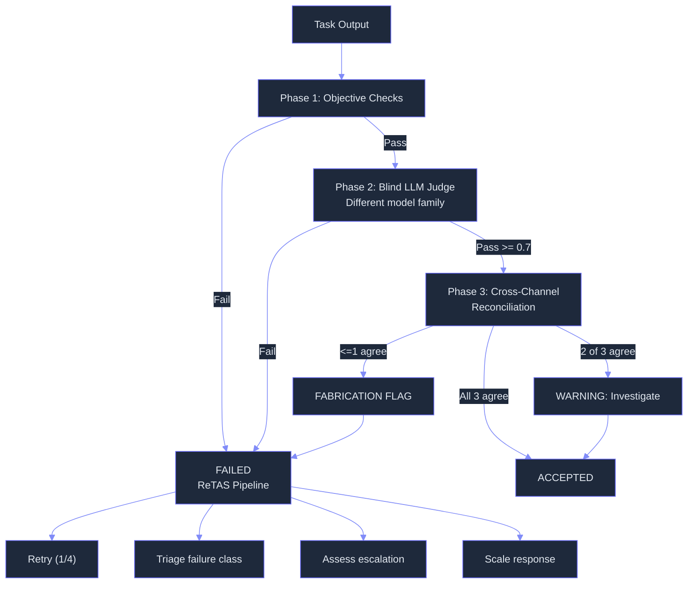

# Verifier — What & Why

> Concept: A three-stage verification panel with adversarial skeptic review, anonymized judging, ReTAS (Retry-Triage-Assess-Scale) correction pipeline, and cross-channel evidence triangulation to catch fabricated success claims.

## What It Is

The Verifier is Lyra's trust layer — the gate that every task completion must pass through. Before any result is marked complete, it runs a staged verification pipeline with three phases:

1. **Phase 1 (Objective)** — Deterministic checks at zero LLM cost: acceptance tests pass (exit code 0 for all test suites), expected files exist (all files declared in the plan diff list are present on disk with correct content), forbidden patterns absent (no secrets, no debug code, no commented-out tests, no hardcoded IPs in changed files), coverage delta non-negative (coverage percentage did not decrease compared to baseline), typechecking passes without errors, linting is clean on changed files. This is the fast path: passes in <100ms for most tasks. If any check fails, the agent receives immediate structured feedback and can retry without invoking an LLM judge.
2. **Phase 2 (Subjective)** — A blind judge LLM from a different model family (Gemini if the executor used Sonnet, DeepSeek if the executor used Opus, Qwen if the executor used GPT) scores output against a 5-criterion rubric. Each criterion is scored 0.0-1.0 with a minimum passing threshold of 0.7 per criterion: **correctness** (does the output do what the task asked — are requirements met?), **coverage** (are there untested paths, edge cases, or missing error handling?), **faithfulness** (does the output match the evidence — no hallucinated test results, no claimed changes that do not exist?), **style** (does it follow project conventions, naming patterns, and code organization?), **safety** (are there security concerns — injection vectors, hardcoded secrets, unsafe patterns?).
3. **Phase 3 (Cross-Channel Reconciliation)** — Three independent evidence channels must agree: execution trace (HIR events recorded during execution — what did the agent actually do?), git diff (what files were actually changed on disk?), environment snapshot (what does the filesystem look like — content hashes of modified files, test exit codes, coverage metrics?). If the trace says "wrote helper.py with 50 lines" but the diff shows no changes to helper.py, the Verifier flags fabrication at maximum severity and the task is blocked from completion.

## Key Mechanisms

- **3-Verifier Panel** — Executor (performs the work, is the primary agent being verified), Validator (a different-model-family LLM that scores the output blind — without seeing the Executor's identity or the full task context), Critic (reviews the validator's reasoning — actively tries to find flaws in the validator's judgment using an adversarial system prompt). Each uses a different model provider to minimize correlated failure: same-family models share training data and failure modes. The panel is assembled per verification pass and is independent for each step in the plan.
- **Adversarial Skeptic** — The Critic does not just check correctness; it actively tries to find reasons the output is wrong. Its system prompt biases toward skepticism: "Assume the output is wrong until proven otherwise. Your job is to find flaws, not confirm success." This adversarial stance catches edge-case failures and logical gaps that a cooperative review would miss. The Critic also assesses the Verdict itself — is the Validator being too generous, too harsh, or overlooking a key detail?
- **Anonymization** — The Validator and Critic receive fully anonymized output: file paths are hashed (SHA-256 truncated to 8 hex chars: `/app/src/auth/login.py` becomes `a1b2c3d4`), function names replaced with placeholders (`func_1`, `func_2`), code structure preserved but all identifiers obfuscated, line counts reported but content hidden for files exceeding 50 lines (replaced with summary statistics). This prevents the judge from short-cutting by recognizing known files or code patterns.
- **ReTAS Pipeline** — A 4-stage correction pipeline activated on Phase 1 failure: **Retry** the same step with the Verifier failure report injected into context for the next attempt (max 4 retries per step), **Triage** the failure class (deterministic failure like test failure vs. subjective failure like low style score vs. fabrication flag like trace-diff mismatch vs. tool execution error), **Assess** escalation urgency (can this wait for human review or is the session blocked downstream?), **Scale** the response (automatic fix suggestion for deterministic failures, human escalation for fabrication flags, abort for three consecutive same-category failures).
- **Triangulation** — Three evidence channels must agree: HIR trace (event stream showing what the agent did), git diff (staged/unstaged changes showing what actually changed), filesystem snapshot (content hashes of all modified files, test exit codes, coverage metrics). The Verifier computes a consistency score: all three agree = PASS (score 1.0), two agree = WARNING (score 0.66, treated as pass with investigation note), one or fewer agree = FABRICATION (score 0.0, blocked). The trace is the primary channel; the diff and snapshot provide independent cross-checks.

## Phase 1 Deterministic Checks

| Check | What It Verifies | Latency |
|-------|-----------------|---------|
| Test exit | All test suites return exit code 0 | ~1-30s |
| File existence | All declared output files exist on disk | <1ms |
| Forbidden patterns | No secrets, debug code, commented tests | <5ms |
| Coverage delta | Coverage did not decrease | ~1-5s |
| Typechecking | TypeScript/Python type checking passes | ~1-10s |
| Linting | Linter is clean on changed files | ~1-5s |

## Why It Matters

Without verification, the agent is the sole judge of its own output. This creates an obvious and well-documented failure mode: the agent claims tests pass without running them, claims files were written that do not exist, or claims coverage improved when it actually regressed. Cross-channel triangulation is the key insight: when three independent evidence sources disagree, the most likely explanation is fabrication or hallucination. The ReTAS pipeline prevents cascading failures by catching errors at the step level rather than discovering them after the full task is "complete." The adversarial skeptic stance ensures that even well-intentioned models are not given a free pass. Using a different model family for the Validator eliminates correlated blind spots — if both Executor and Validator use the same family, they share failure modes.

## When to Use

The Verifier runs automatically on every step completion. Review Verifier logs (`.lyra/sessions/<id>/verifier.jsonl`) to understand failure patterns and identify systematic issues.

## When NOT to Use

Do not disable the Verifier for execution-phase steps that modify files. It can be skipped for planning-phase exploration (read-only tasks with no side effects). Do not skip cross-channel reconciliation for any task that writes files.

## Related Documentation

- **Block:** [Verifier](../blocks/10-verifier.md)
- **Architecture:** [Multi-Agent Validation Layer 3](../architecture/11-architecture-overview.md#safety-architecture-6-layer-parallax-style)
- **Plans:** [Adversarial Panel](../lyra-upgrade/plans/25-adversarial-panel.md)
- **Papers:** ARIS 3-Stage Adversarial Review (2026, arXiv:2605.03042); Qwen PRM Process Reward Model (2025, arXiv:2501.07301); Knowing-Doing Gap Tool-Call Verification (2026, arXiv:2605.14038)
