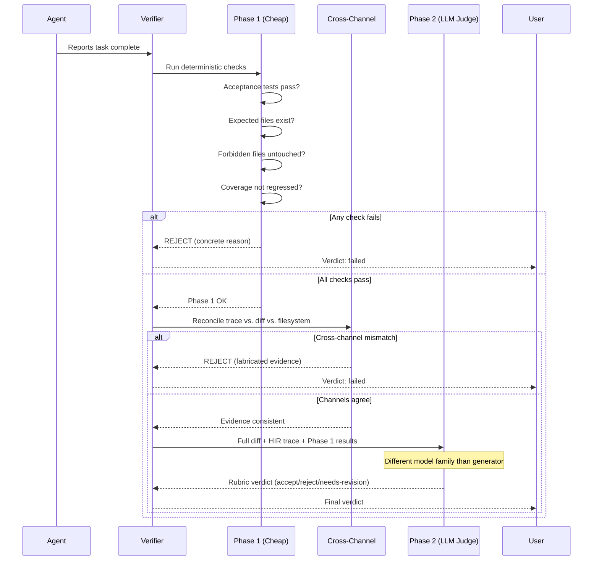

# Verifier

> **Two-phase verification with cross-channel evidence that catches fabricated success.** | **Phase:** 1

## &#x1F914; What It Is

The verifier catches **fabricated success** -- the failure mode where an agent confidently reports the task is done but the tests do not actually pass, the file was never written, or the diff does not match the plan. Lyra's verifier is **two-phase with cross-channel evidence** because each phase alone can be fooled. A model will say "task complete" when the file was never written or the tests are a different version.

**Jargon defined:**
- **Fabricated success** -- When a model outputs "task complete" but the work was not actually done (e.g., it hallucinated writing a file or running tests)
- **Cross-channel evidence** -- Comparing three independent records of what happened: the tool-call trace, the git diff, and the filesystem state
- **HIR trace** -- Human-Interpretable Rank trace; a structured log of every tool call (action stream, not just text output)
- **PRM** -- Process Reward Model; a per-step advisory signal estimating progress toward the plan goal

## &#x1F9EA; How It Works



**Phase 1** (objective, cheap) runs fast deterministic checks: acceptance tests pass (runs the test suite from the plan's acceptance test list and reports failures), expected files exist (checks files in the plan's expected list exist with correct content roles), forbidden files are untouched (compares git diff against the plan's forbidden list), coverage does not regress (checks coverage delta since baseline). No model calls -- just real subprocesses. If any check fails, Phase 2 does not run. This **cost-shaping** choice lets the expensive subjective phase exist at all.

**Phase 2** (subjective, expensive) only runs if Phase 1 passes. A **different-model-family LLM judge** receives the plan, the diff, the HIR trace, and Phase 1 results. The `EvaluatorFamily.must_differ` guard enforces the judge is a different provider family than the generator -- preventing **narrative collusion** (the same model grading its own output). The judge produces a rubric-scored verdict: accept, reject, or needs-revision, with per-criterion scores for correctness, style, simplicity, testability, and plan-diff match.

**Cross-channel evidence** is the third check (nearly zero cost). Three independent records must agree: the **trace** (what tool calls were made with what args), the **diff** (what actually changed in git), and the **environment snapshot** (filesystem hashes and test results). If the trace says "wrote 50 lines to src/foo.py" but the diff shows no change, the verifier rejects -- the model fabricated its report.

The **PRM** is a per-step advisory signal estimating "is this step moving toward the plan?" It runs every step at negligible cost and surfaces in the trace and HUD. It does not gate the loop alone -- a hook can abort if PRM stays negative for N steps. When the **TDD gate** is active, the verifier checks for a proper RED-to-GREEN-to-REFACTOR cycle; tasks that pass verification but never had a failing test are downgraded to needs-revision.

## &#x2699;&#xFE0F; Configuration Model

```toml
[verifier]
enabled = true
phase1_timeout_ms = 5000
cross_channel_strict = true

[verifier.rubric]
correctness_weight = 0.35
style_weight = 0.15
simplicity_weight = 0.20
testability_weight = 0.15
plan_match_weight = 0.15

[verifier.evaluator]
model = "claude-sonnet-4-20250514"
must_differ = true  # Enforce different provider family than generator

[verifier.tdd_gate]
enabled = false
min_red_phases = 1  # Task must have had at least one RED (failing test) phase
```

## &#x1F4CA; Real Numbers (Targets)

| Metric | Phase 1 (Deterministic) | Phase 2 (LLM Judge) | Cross-Channel |
|---|---|---|---|
| Latency per run | ~50-200ms | ~2-5s | ~5-10ms |
| Token cost | 0 (no model calls) | ~2K input + ~500 output | 0 |
| Detection accuracy | 100% (deterministic) | ~85-90% target | ~99% target |

## &#x2705; When to Use

The verifier runs automatically after task completion, especially when plan mode was used. Enable the TDD gate integration to downgrade results that never went through a RED phase. Use the PRM signal in the HUD to detect divergent trajectories early.

## &#x274C; When NOT to Use

Do not use the same model family for generation and verification. Phase 2 is expensive and only fires when Phase 1 passes; do not skip Phase 1. For read-only explorations where no state change occurred, verification may not add value.

## &#x1F517; Where Next

- **Block:** [Verifier Cross-Channel](../blocks/10-verifier.md) -- deep dive on evidence reconciliation
- **Guide:** [Research and Verification](../guides/07-research-and-verification.md) -- practical verification workflows
- **Concept:** [Safety Monitor](11-safety-monitor.md) -- the parallel observer that catches trajectory drift before verification
- **Research:** [DeepSeek Math (PRM paper)](https://arxiv.org/abs/2402.03300) -- process reward model foundations; [Constitutional AI](https://arxiv.org/abs/2212.08073) -- rubric-based LLM judge design
